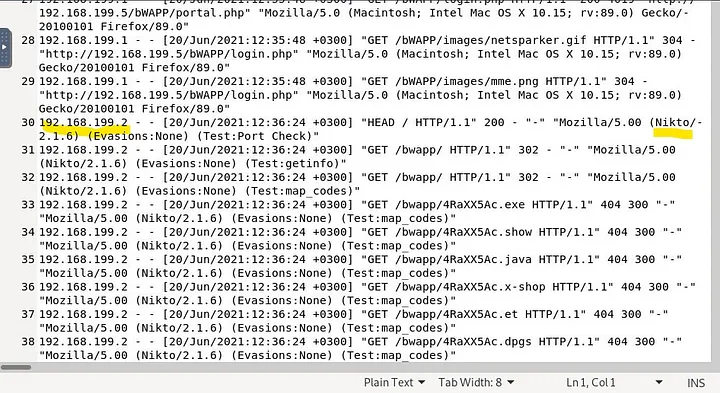
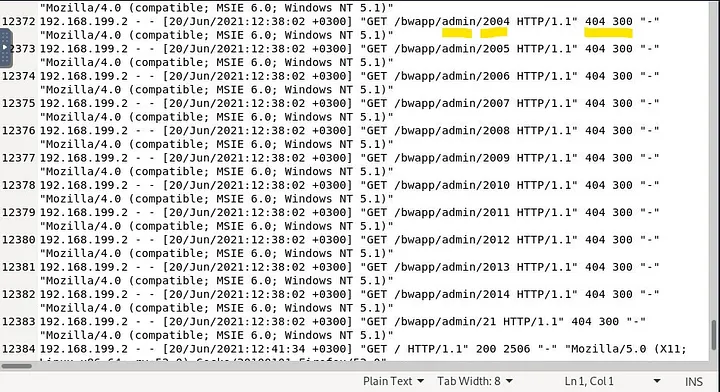
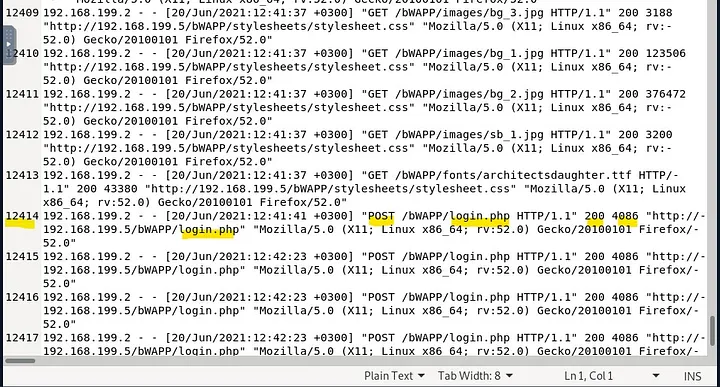
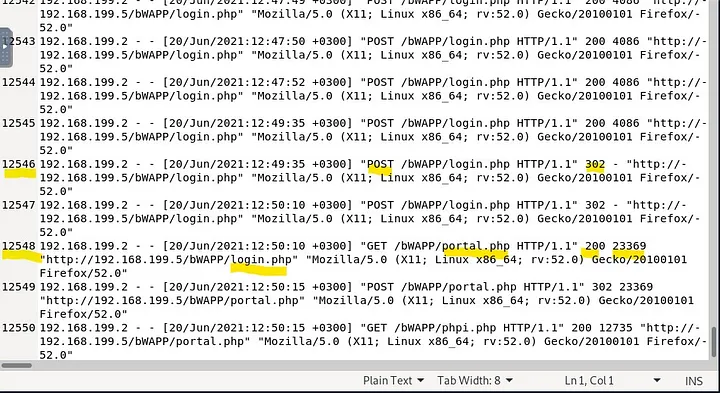
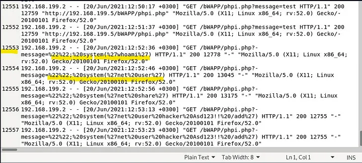
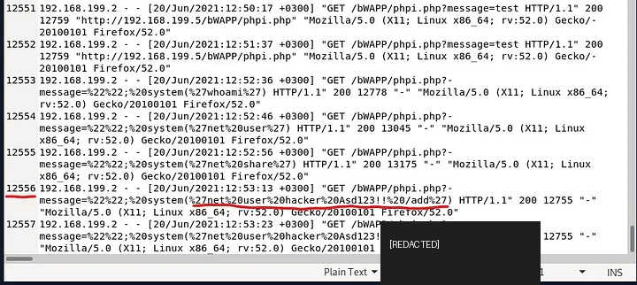

# DFIR-001 — Multi-Stage Web Attack: Reconnaissance to Code Injection and Persistence

## Executive Summary

A web-server access log was analyzed to reconstruct a multi-stage attack sequence against a vulnerable web application.

The evidence shows a clear progression:

`text
Automated reconnaissance
        ↓
Directory brute force
        ↓
Authentication brute force
        ↓
Successful login
        ↓
Code injection
        ↓
System command execution
        ↓
Persistence attempt via local-user creation
`

The attacker first used **Nikto** for automated reconnaissance, then performed **directory brute forcing** against application paths. This was followed by repeated POST requests to the login endpoint, indicating a **credential brute-force attack**.

The login brute force was successful: the log sequence changed from repeated login attempts to a `302` redirect followed by authenticated access to `portal.php`.

The attacker then progressed to **code injection**, beginning with a URL-encoded `whoami` payload and later submitting a command intended to create a new local user for persistence.

The persistence payload contained a hard-coded password in the training log. That password is intentionally **redacted** in this public portfolio report.

# **Final Assessment: True Positive — Successful Multi-Stage Web Compromise with Persistence Attempt**

---

## Case Information

| Field | Value |
|---|---|
| Portfolio ID | DFIR-001 |
| Analysis Type | Web Log / DFIR Investigation |
| Evidence Source | `access.log` |
| Primary Technique Sequence | Recon → Directory Brute Force → Login Brute Force → Code Injection → Persistence |
| Reconnaissance Tool | **Nikto** |
| Directory Discovery | **Directory brute force** |
| Authentication Attack | **Brute force** |
| Authentication Result | **Successful** |
| Post-Authentication Attack | **Code injection** |
| First Code-Injection Payload | **`whoami`** |
| Persistence Indicator | Local user creation command |
| Final Assessment | **Successful compromise with persistence attempt** |

---

## 1. Investigation Objective

The objective was to determine:

1. what reconnaissance activity occurred,
2. which discovery technique followed reconnaissance,
3. whether authentication brute force occurred,
4. whether that brute force succeeded,
5. what attack followed authentication,
6. the first code-injection payload,
7. whether the attacker attempted persistence.

The LetsDefend challenge confirms all seven findings. fileciteturn8file0

---

## 2. Phase 1 — Automated Reconnaissance

The access log showed requests using the User-Agent:

```text
Mozilla/5.00 (Nikto/2.1.6)
```



The requests included multiple probes for unusual file extensions and paths, consistent with automated web vulnerability scanning.

### Finding

```text
Reconnaissance Tool: Nikto
```

### Analyst Interpretation

Nikto is a web-server scanner that checks for:

- known files and directories,
- outdated server components,
- default content,
- potentially dangerous files,
- web-server misconfigurations.

The presence of the Nikto User-Agent gives high confidence that this stage was automated reconnaissance rather than normal browsing.

---

## 3. Phase 2 — Directory Brute Force

After reconnaissance, the log showed rapid requests to sequential administrative paths such as:

```text
/bWAPP/admin/2004
/bWAPP/admin/2005
/bWAPP/admin/2006
...
/bWAPP/admin/2014
/bWAPP/admin/21
```



### Finding

```text
Technique: Directory brute force
```

### Analyst Interpretation

The sequential path enumeration is consistent with an automated discovery process attempting to identify valid files/directories or hidden administrative resources.

This activity is distinguishable from normal browsing because:

- requests occur rapidly,
- path values increment systematically,
- many requests return `404`,
- the pattern is machine-like rather than human navigation.

---

## 4. Phase 3 — Login Brute Force

The next attack stage consisted of repeated POST requests to:

```text
/bWAPP/login.php
```



The log shows many POST requests returning:

```text
HTTP 200
```

with similar response sizes.

### Finding

```text
Third Attack Type: Authentication brute force
```

### Why This Pattern Is Suspicious

Repeated POST requests to the same login endpoint in a short period strongly suggest automated password guessing, especially when accompanied by little normal application navigation.

---

## 5. Authentication Brute Force Success

The brute-force sequence later changed.

One login request returned:

```text
302
```

and was followed by:

```text
GET /bWAPP/portal.php HTTP/1.1 200
```



### Finding

```text
Brute Force Successful: Yes
```

### Analyst Interpretation

The transition:

```text
repeated POST /login.php
        ↓
302 redirect
        ↓
GET /portal.php 200
```

is strong evidence that authentication succeeded.

This is more reliable than simply counting login attempts because it uses the **post-authentication navigation behavior** to validate impact.

---

## 6. Phase 4 — Code Injection

After successful access, the attacker began submitting encoded command strings to:

```text
/bWAPP/phpi.php
```

One request contained:

```text
%22%22;%20system(%27whoami%27)
```

Decoded conceptually:

```text
""; system('whoami')
```



### Finding

```text
Fourth Attack: Code Injection
First Payload: whoami
```

### Analyst Interpretation

`whoami` is commonly used after initial code execution to determine which account context the application is running under.

This represents a shift from web-layer access into operating-system command execution.

---

## 7. Post-Exploitation Progression

The code-injection sequence continued beyond `whoami`.

Observed payloads included operating-system commands submitted through the vulnerable application.

The progression is consistent with:

```text
Confirm code execution
        ↓
Enumerate execution context
        ↓
Attempt operating-system modification
```

This behavior should be treated as a host-compromise indicator rather than merely a web-application error.

---

## 8. Persistence Attempt

The log contained a later encoded payload that decoded to a Windows local-user creation command.

The structure was:

```text
net user hacker [REDACTED] /add
```



### Finding

```text
Persistence Clue: Yes
```

### Security Interpretation

Creating a new local account can provide an attacker with continued access after the initial exploit path is closed.

The training challenge supplied the full password in the log, but it is intentionally **redacted from this public repository**.

### Evidence Qualification

The log proves that the persistence command was submitted.

The access log alone does **not** prove the operating system successfully created the account unless corroborated by endpoint, Windows Security, SAM, or command-execution evidence.

Therefore the defensible statement is:

> A local-user creation command was submitted as a persistence attempt; successful account creation is not independently confirmed by the supplied access-log evidence.

---

## 9. Attack Timeline

| Stage | Activity | Evidence |
|---|---|---|
| 1 | Automated reconnaissance | Nikto User-Agent |
| 2 | Directory discovery | Sequential `/admin/...` requests |
| 3 | Authentication brute force | Repeated POST `/login.php` requests |
| 4 | Authentication success | `302` followed by `/portal.php` `200` |
| 5 | Code injection | `system('whoami')` payload |
| 6 | Post-exploitation | Additional OS command payloads |
| 7 | Persistence attempt | `net user hacker [REDACTED] /add` |

---

## 10. Analyst Decision Points

**Was automated reconnaissance used?**  
Yes — Nikto.

**What followed reconnaissance?**  
Directory brute force.

**Was authentication attacked?**  
Yes — repeated POST requests against `login.php`.

**Was the brute-force attack successful?**  
Yes — the log shows a redirect followed by authenticated portal access.

**What attack followed successful authentication?**  
Code injection.

**What was the first observed command payload?**  
`whoami`.

**Was persistence attempted?**  
Yes — a local user creation command was submitted.

**Was persistence definitely established?**  
Not proven by the access log alone.

---

## 11. Evidence vs Inference

### Direct Evidence

- Nikto User-Agent appeared in the logs
- sequential directory requests occurred
- repeated POST requests targeted the login page
- a login request returned `302`
- authenticated portal access followed
- code-injection payloads were present
- `whoami` was submitted
- a local-user creation command was submitted

### Strongly Supported Inference

- reconnaissance was automated
- directory brute forcing occurred
- login brute forcing occurred
- authentication succeeded
- attacker progressed to command/code injection
- persistence was attempted

### Not Established

The supplied access log does not prove:

- whether every code-injection command executed successfully,
- whether the new account was actually created,
- privilege level of the injected command,
- whether malware was installed,
- whether lateral movement occurred,
- whether data was exfiltrated.

---

## 12. MITRE ATT&CK Mapping

| Tactic | Technique | ID | Evidence |
|---|---|---|---|
| Reconnaissance | Active Scanning: Vulnerability Scanning | **T1595.002** | Nikto web vulnerability scan |
| Discovery | Network Service Discovery / Web resource discovery context | **T1046** | Automated discovery of reachable web paths |
| Credential Access | Brute Force: Password Guessing | **T1110.001** | Repeated login POST requests |
| Initial Access | Valid Accounts | **T1078** | Successful login followed by portal access |
| Execution | Command and Scripting Interpreter | **T1059** | Code injection invoking OS commands |
| Discovery | System Owner/User Discovery | **T1033** | `whoami` |
| Persistence | Create Account: Local Account | **T1136.001** | `net user ... /add` payload |

### Mapping Restraint

The persistence mapping reflects an **attempted local-account creation command**. Successful account creation is not directly confirmed by the access log.

---

## 13. Incident Severity

### Assessment

This is a high-severity investigation because the attacker moved through several stages:

```text
Reconnaissance
→ Discovery
→ Credential Attack
→ Successful Authentication
→ Code Injection
→ Persistence Attempt
```

The presence of both successful authentication and code-injection activity indicates substantially greater risk than isolated scanning activity.

---

## 14. Recommended Production Response

If this occurred in production, I would recommend:

- isolate the affected web server,
- reset/rotate credentials associated with the compromised account,
- invalidate active sessions,
- inspect authentication logs,
- review endpoint process trees,
- identify the process handling the vulnerable application request,
- verify whether the injected commands executed,
- check Windows user-management logs for account creation,
- inspect local users and privileged groups,
- review scheduled tasks/services/registry run keys,
- search for web shells,
- inspect outbound network connections,
- identify any additional attacker IPs,
- patch the vulnerable web application,
- review WAF/IDS coverage,
- preserve full forensic evidence before remediation.

---

## 15. Detection Engineering Opportunities

### Nikto Detection

Detect:

```text
User-Agent contains "Nikto"
```

This is a useful high-confidence reconnaissance signal, though scanners can spoof User-Agent strings.

### Directory Brute Force

Detect:

```text
same source IP
+
large number of unique paths
+
high 404 ratio
+
short time window
```

### Login Brute Force

Detect:

```text
same source
+
repeated POST /login.php
+
failed-login response pattern
```

and correlate with:

```text
302 redirect
+
subsequent authenticated page access
```

### Code Injection

Detect encoded or decoded patterns such as:

```text
system(
exec(
shell_exec(
whoami
cmd.exe
powershell
```

### Persistence Attempt

High-severity detection for web requests containing:

```text
net user
/add
```

especially when seen after prior exploit activity.

---

## 16. Lessons Learned

1. Attack reconstruction requires looking at the **sequence**, not isolated log entries.
2. User-Agent strings can reveal automated reconnaissance tooling.
3. Directory brute forcing often follows broad vulnerability scanning.
4. Login brute-force success can be inferred from response transitions and authenticated navigation.
5. Code injection marks a major escalation from web-layer activity to host-level execution.
6. `whoami` is a common first command used to validate execution context.
7. Persistence commands should be reported conservatively unless endpoint evidence confirms success.
8. Public portfolio reports should sanitize credentials embedded in training artifacts.
9. MITRE ATT&CK mapping should reflect only behavior supported by the evidence.

---

## Skills Demonstrated

- web access-log analysis
- attack-chain reconstruction
- reconnaissance-tool identification
- directory brute-force analysis
- authentication brute-force analysis
- login-success validation
- code-injection analysis
- URL decoding
- persistence identification
- MITRE ATT&CK mapping
- evidence-vs-inference discipline
- DFIR reasoning
- detection-engineering thinking
- professional incident documentation

---

## Training Context

This investigation was completed in the authorized **LetsDefend Investigate Web Attack** challenge using the provided `access.log`.

The challenge confirms the following findings: Nikto reconnaissance, directory brute force, successful login brute force, code injection, `whoami` as the first payload, and a local-user creation persistence clue. The password embedded in the persistence command has been redacted for public portfolio use. fileciteturn8file0
