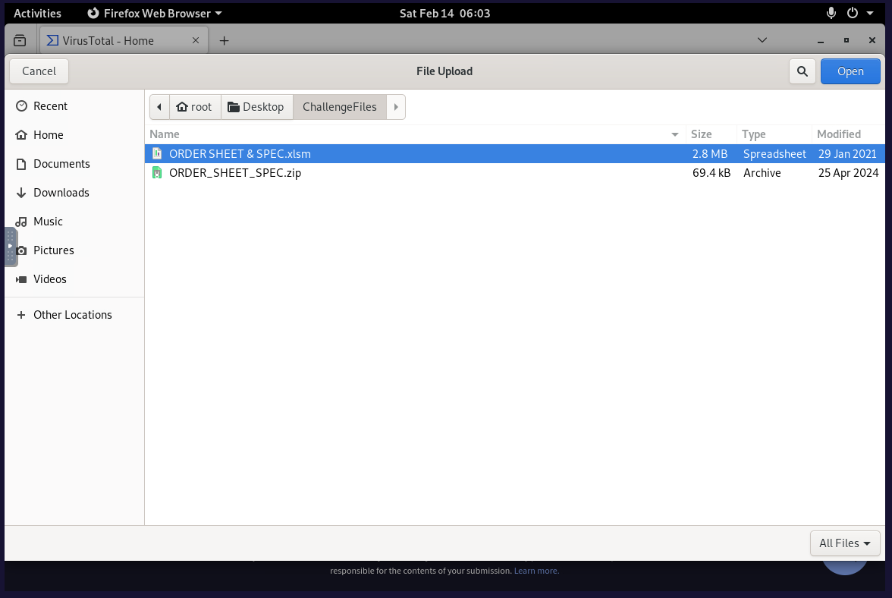
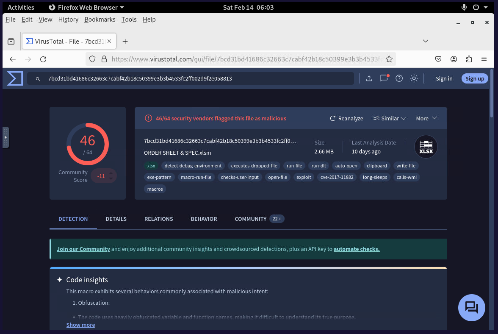
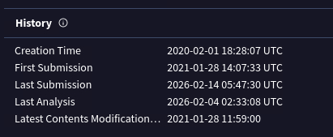
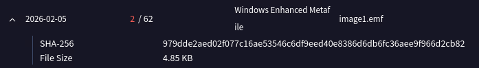
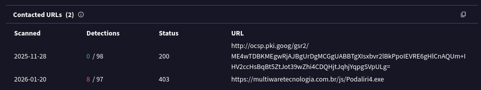

# MAL-001 — Remote Working XLSM Malware Analysis

## Executive Summary

This case documents a focused malware-analysis exercise involving a suspicious macro-enabled Excel workbook named `ORDER SHEET & SPEC.xlsm`.

The sample was analyzed using file metadata, multi-engine antivirus results, and VirusTotal relationship data. The workbook was strongly classified as malicious and exhibited characteristics consistent with a malicious Office document used to deliver or retrieve additional payloads.

Key findings included:

- The workbook was detected as malicious by a large number of antivirus engines.
- VirusTotal identified malicious macro behavior and exploit-related characteristics.
- The sample was associated with **29 dropped files**.
- A dropped Enhanced Metafile (`image1.emf`) was identified and hashed.
- The sample contacted a URL hosting a secondary executable payload:
  `https://multiwaretecnologia.com.br/js/Podaliri4.exe`
- The evidence supports classification of the workbook as a **malicious macro-enabled document / downloader**.

This report is written as a malware-analysis case rather than a training-platform walkthrough.

---

## Case Information

| Field | Value |
|---|---|
| Case ID | `MAL-001` |
| Analysis Type | File-centric malware analysis |
| Sample | `ORDER SHEET & SPEC.xlsm` |
| File Type | Macro-enabled Microsoft Excel workbook |
| File Size | 2.66 MB |
| MD5 | `7ccf88c0bbe3b29bf19d877c4596a8d4` |
| Creation Time | `2020-02-01 18:28:07 UTC` |
| Primary Analysis Source | VirusTotal |
| Classification | Malicious Office document / downloader |
| Confidence | High |
| Environment | Authorized training lab |

---

## Analysis Objective

The objective was to determine:

1. whether the workbook was malicious;
2. what observable behaviors were associated with it;
3. whether it created or dropped additional files;
4. whether it communicated with external infrastructure;
5. whether a secondary payload could be identified;
6. what indicators should be retained for detection and threat-hunting use.

---

# 1. Sample Acquisition and Handling

The sample was supplied inside the authorized training environment as a password-protected archive.

The extracted file was:

```text
ORDER SHEET & SPEC.xlsm
```

The workbook was handled only inside the lab environment and submitted to VirusTotal for analysis.



### Analyst Note

Macro-enabled Office documents deserve additional scrutiny because they can contain executable VBA logic and may be used to launch processes, retrieve payloads, or modify the local system.

The file extension alone is not evidence of maliciousness; the verdict must be based on observed and corroborated behavior.

---

# 2. Multi-Engine Reputation Analysis

VirusTotal showed widespread malicious classification of the workbook.

At the time of the captured analysis, **46 of 64 security engines** classified the file as malicious.



The sample was associated with behavioral tags including:

```text
macros
exploit
executes-dropped-file
run-file
write-file
auto-open
obfuscation / anti-analysis related behavior
```

These findings substantially increase confidence that the workbook is not a benign business spreadsheet.

### Important Analyst Consideration

VirusTotal detection ratios can change over time as vendors update signatures and rescans occur. The detection ratio should therefore be treated as **time-dependent enrichment**, not as the sole basis for the verdict.

---

# 3. File Metadata

VirusTotal metadata recorded the sample creation time as:

```text
2020-02-01 18:28:07 UTC
```



This metadata is useful for timeline and provenance analysis but should not automatically be interpreted as the true date of attacker activity because file timestamps can be altered or inherited during document creation.

---

# 4. Antivirus Classification

One observed Bitdefender detection name was:

```text
Trojan.GenericKD.36266294
```


This naming supports a generic trojan classification but does not, by itself, establish a precise malware family.

### Assessment

The stronger conclusion is:

> The sample is a malicious Office document exhibiting trojan/downloader behavior.

I would not attribute a specific malware family unless additional static or dynamic evidence supports that attribution.

---

# 5. Dropped-File Analysis

VirusTotal relationship data showed that the workbook was associated with:

```text
29 dropped files
```


The creation of multiple secondary files is significant because it indicates that the workbook is not merely a suspicious document: it participates in a broader execution or payload-delivery chain.

---

# 6. Dropped EMF Artifact

One of the dropped files was:

```text
image1.emf
```

The observed SHA-256 value was:

```text
979dde2aed02f077c16ae53546c6df9eed40e8386d6db6fc36aee9f966d2cb82
```



## Why This Matters

Enhanced Metafile (`.emf`) artifacts may appear in legitimate Office documents, so an EMF file alone is not malicious evidence.

In this case, however, the artifact exists inside a broader malicious-document context involving:

- a highly detected XLSM sample;
- malicious macro indicators;
- dropped-file behavior;
- external network activity; and
- a secondary executable download.

The EMF hash is therefore useful as an additional pivot for threat hunting and relationship analysis.

---

# 7. Network and Secondary Payload Analysis

VirusTotal relationships showed the workbook contacting two URLs.

One was a Google OCSP endpoint consistent with certificate-validation activity.

The second was substantially more suspicious:

```text
https://multiwaretecnologia.com.br/js/Podaliri4.exe
```



The URL was associated with a downloadable executable and had multiple malicious detections.

## Analyst Assessment

The most important network finding is the apparent retrieval of a secondary executable from:

```text
multiwaretecnologia.com.br
```

This behavior is consistent with a downloader or first-stage malicious document retrieving another payload after execution.

The OCSP request should **not** be treated as malicious merely because the malicious sample contacted it. Legitimate operating-system and application components frequently perform certificate-status checks.

---

# 8. Indicators of Compromise

## File Indicators

| Type | Value | Context |
|---|---|---|
| MD5 | `7ccf88c0bbe3b29bf19d877c4596a8d4` | Primary XLSM sample |
| SHA-256 | `979dde2aed02f077c16ae53546c6df9eed40e8386d6db6fc36aee9f966d2cb82` | Dropped `image1.emf` |

## Network Indicators

| Type | Value | Context |
|---|---|---|
| Domain | `multiwaretecnologia.com.br` | Secondary payload infrastructure |
| URL | `https://multiwaretecnologia.com.br/js/Podaliri4.exe` | Secondary executable retrieval |

### IOC Handling Note

IOC presence should be correlated with telemetry and context. Infrastructure can be repurposed or remediated, and hashes are brittle when malware is repacked or modified.

Behavioral detections should therefore complement IOC-based blocking.

---

# 9. Attack Chain Reconstruction

Based on the available evidence, the likely sequence is:

```text
Malicious XLSM opened
        ↓
Macro / embedded malicious logic executes
        ↓
Document creates or drops additional artifacts
        ↓
External network communication occurs
        ↓
Secondary executable is retrieved
        ↓
Potential follow-on execution / compromise
```

This reconstruction is intentionally limited to behavior supported by the available analysis. The current evidence does not independently prove every subsequent action taken by the downloaded executable.

---

# 10. MITRE ATT&CK Mapping

The following ATT&CK mappings are reasonable based on the evidence available in this malware-analysis case.

| Technique | Name | Evidence |
|---|---|---|
| `T1204.002` | User Execution: Malicious File | Malicious Office document requires the document to be opened to initiate the observed chain |
| `T1204` | User Execution | Broader user-execution behavior associated with malicious document delivery |
| `T1105` | Ingress Tool Transfer | Secondary executable retrieved from external infrastructure |
| `T1027` | Obfuscated Files or Information | VirusTotal indicated obfuscated macro/code characteristics |

### Mapping Discipline

Only techniques supported by the sample evidence are included. A malware family or additional post-exploitation techniques should not be inferred solely from vendor labels or relationships.

---

# 11. Detection Opportunities

## Malicious Office Document Detection

Potential telemetry and detection pivots include:

- macro-enabled Office files arriving from untrusted sources;
- Office applications spawning scripting engines or unusual child processes;
- Office processes initiating unexpected external network connections;
- Office applications writing executable content;
- creation of executable files shortly after opening a document;
- outbound requests to rare or newly observed domains following Office execution.

### Example Detection Hypothesis

> Alert when an Office application creates or launches an executable and the same endpoint initiates outbound communication to a low-prevalence external domain within a short time window.

This is stronger than relying only on file extensions or hashes because it detects the **behavioral chain**.

---

# 12. Recommended SOC Response

If this artifact were observed in a production environment, recommended actions would include:

1. isolate the affected endpoint if execution is confirmed;
2. quarantine or remove the malicious workbook;
3. search enterprise telemetry for the primary MD5;
4. hunt for the dropped EMF SHA-256;
5. search DNS, proxy, firewall, and EDR telemetry for `multiwaretecnologia.com.br`;
6. determine whether `Podaliri4.exe` was downloaded or executed;
7. inspect process trees originating from Excel;
8. search for newly created executable files and persistence mechanisms;
9. review user and credential exposure if post-exploitation is identified;
10. block confirmed malicious indicators where operationally appropriate.

---

# 13. Analyst Decision Points

### Was the workbook malicious?

**Yes. High confidence.**

The verdict is supported by widespread multi-engine detection, macro-related malicious behavior, dropped files, and suspicious network relationships.

### Does the Bitdefender label prove a specific malware family?

**No.**

`Trojan.GenericKD.36266294` is a vendor classification and should be treated as supporting enrichment rather than definitive attribution.

### Are all contacted URLs malicious?

**No.**

The Google OCSP request appears consistent with legitimate certificate-validation activity. The secondary executable URL is the significant malicious infrastructure finding.

### Does the presence of 29 dropped files mean all 29 are malicious?

**Not necessarily.**

Each artifact would require contextual or independent analysis. The count demonstrates extensive file-generation behavior but should not be overinterpreted.

---

# 14. Final Assessment

**Verdict:** Malicious  
**Confidence:** High

`ORDER SHEET & SPEC.xlsm` is a malicious macro-enabled Excel workbook associated with trojan/downloader behavior.

The strongest evidence is the convergence of multiple independent signals:

- widespread antivirus detection;
- malicious macro and exploit-related indicators;
- 29 associated dropped files;
- a dropped EMF artifact suitable for IOC pivoting; and
- communication with infrastructure hosting a secondary executable payload.

The analysis illustrates why malware triage should combine **reputation, metadata, behavioral relationships, file artifacts, and network indicators** rather than rely on a single antivirus verdict.

---

# Skills Demonstrated

- Malware triage
- Malicious Office document analysis
- VirusTotal relationship analysis
- File metadata review
- Hash extraction and IOC handling
- Dropped-file analysis
- Network-indicator analysis
- Secondary-payload identification
- ATT&CK mapping
- Analyst confidence assessment
- Evidence-based reporting

---

# Evidence Index

| Evidence | Description |
|---|---|
| `01-sample-upload.png` | Sample selected for analysis |
| `02-virustotal-detection.png` | Multi-engine malicious detection |
| `03-file-history.png` | File creation and submission metadata |
| `04-bitdefender-label.png` | Antivirus classification |
| `05-dropped-files-count.png` | VirusTotal relationship count showing 29 dropped files |
| `06-dropped-emf-hash.png` | SHA-256 of `image1.emf` |
| `07-contacted-urls.png` | Network relationships including secondary executable URL |

---

# Training Context

This investigation was completed in an authorized cybersecurity training environment.

The report intentionally focuses on **analysis methodology and evidence interpretation** rather than reproducing challenge questions, flags, or platform walkthrough answers.
