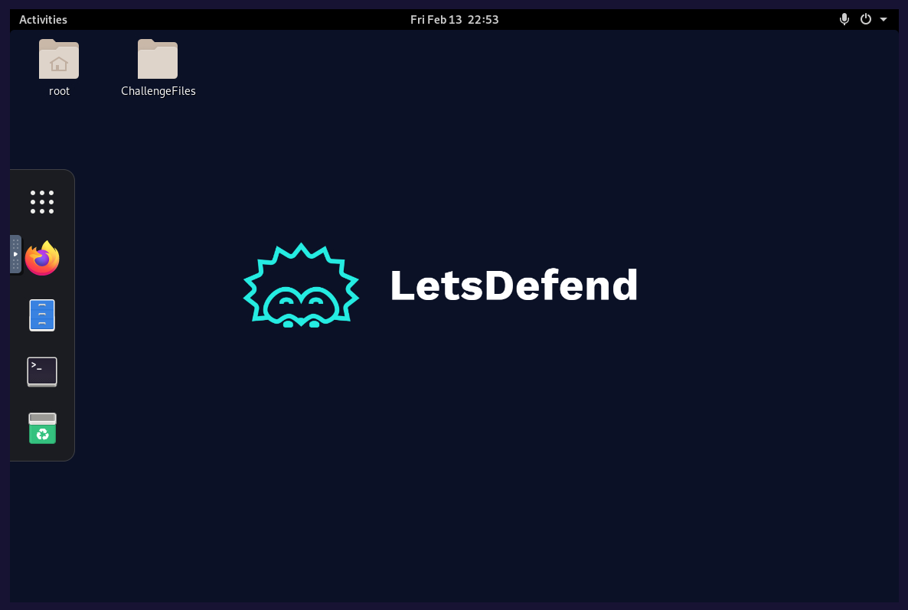
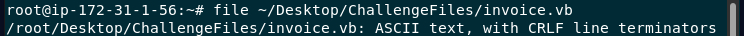
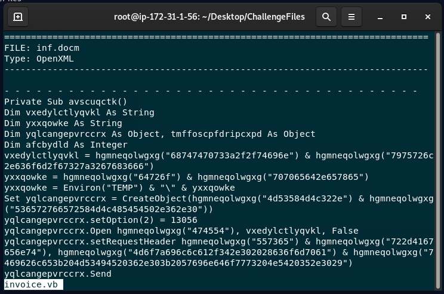
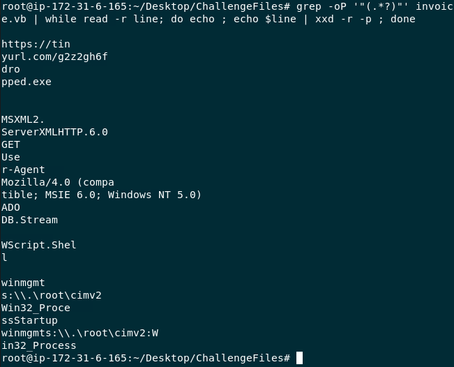
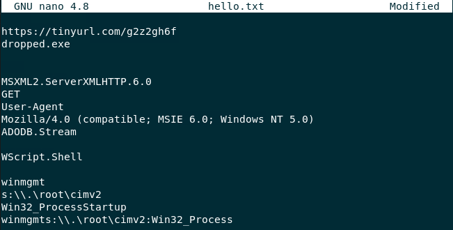

# MAL-002 — Malicious VBA Macro Analysis

## Executive Summary

This case documents static analysis of an obfuscated VBA macro extracted from a suspicious invoice-themed document.

The macro was supplied as:

```text
/root/Desktop/ChallengeFiles/invoice.vb
```

Initial inspection showed that the VBA source contained multiple hex-encoded strings. These strings were extracted and decoded to recover the macro's operational behavior.

The recovered indicators showed that the macro:

- downloads a secondary payload from `https://tinyurl.com/g2z2gh6f`;
- saves the payload as `dropped.exe`;
- uses `MSXML2.ServerXMLHTTP.6.0` to establish the HTTP request;
- sets a legacy Internet Explorer-style user-agent string;
- uses `ADODB.Stream` to handle binary data;
- uses `WScript.Shell`;
- invokes WMI through `winmgmts:\\.\root\cimv2:Win32_Process`.

The evidence is consistent with a malicious Office macro acting as a downloader and execution stager.

---

## Case Information

| Field | Value |
|---|---|
| Case ID | `MAL-002` |
| Analysis Type | Static VBA / string deobfuscation |
| Artifact | `invoice.vb` |
| File Type | ASCII VBA source |
| Theme | Invoice document |
| Primary Technique | Hex-encoded string obfuscation |
| Payload URL | `https://tinyurl.com/g2z2gh6f` |
| Payload Filename | `dropped.exe` |
| Verdict | Malicious |
| Confidence | High |
| Environment | Authorized training lab |

---

# 1. Analysis Objective

The objective was to determine what the macro was designed to do without executing it.

The analysis focused on identifying:

1. the external payload location;
2. the downloaded filename;
3. the HTTP client object;
4. the user-agent string;
5. the object used to write binary content;
6. the WMI object used for execution; and
7. the likely execution chain.

---

# 2. Safe Analysis Environment

The challenge was performed in an isolated LetsDefend lab environment.



The macro source was analyzed statically rather than executed.

This is an important handling decision because malicious VBA can perform network requests, write files, and execute payloads when run.

---

# 3. File Type Validation

The first step was to confirm the artifact type using the Linux `file` command.

```bash
file ~/Desktop/ChallengeFiles/invoice.vb
```

The result identified the file as:

```text
ASCII text, with CRLF line terminators
```



This confirms that the challenge artifact is plain-text VBA source and can be inspected with command-line text tools without executing the macro.

---

# 4. Initial VBA Inspection

Reviewing the macro showed heavily encoded string literals.



A representative pattern was:

```vb
hgmneqolwgxg("68747470733a2f2f74696e")
```

The values are hexadecimal ASCII representations.

This indicated that readable values such as URLs, COM object names, HTTP headers, and execution components were being hidden from straightforward inspection.

---

# 5. String Extraction and Decoding

The encoded strings were extracted and converted from hexadecimal to ASCII.

```bash
grep -oP '"(.*?)"' invoice.vb | while read -r line; do
    echo
    echo "$line" | xxd -r -p
done
```

The decoded output revealed the macro's operational components.



The decoded values were then cleaned for readability.



---

# 6. Recovered Indicators

## Payload Hosting URL

The decoded macro contained:

```text
https://tinyurl.com/g2z2gh6f
```

This is the URL used by the macro to retrieve the next-stage payload.

Because this is a URL-shortening service, it should be treated as an infrastructure indicator. The final redirect destination was not established by the supplied static evidence.

---

## Payload Filename

The recovered filename was:

```text
dropped.exe
```

The executable extension supports the conclusion that the macro is intended to retrieve a secondary binary payload.

---

## HTTP Communication Object

The macro referenced:

```text
MSXML2.ServerXMLHTTP.6.0
```

This COM object can be used from VBA to create HTTP requests.

The recovered `GET` string shows that the macro was configured to request the payload over HTTP/S.

---

## User-Agent

The hard-coded user-agent was:

```text
Mozilla/4.0 (compatible; MSIE 6.0; Windows NT 5.0)
```

A hard-coded browser-like user-agent in a downloader can be used to make programmatic network traffic resemble ordinary browser traffic.

---

## Binary Stream Object

The macro contained:

```text
ADODB.Stream
```

This object supports binary data handling and is consistent with receiving an HTTP response and writing the resulting payload to disk.

---

## Shell Object

The decoded strings also contained:

```text
WScript.Shell
```

This gives script code access to operating-system execution functionality.

---

## WMI Execution Object

The macro referenced:

```text
winmgmts:\\.\root\cimv2:Win32_Process
```

This exposes the `Win32_Process` WMI class and is consistent with process creation through Windows Management Instrumentation.

---

# 7. Reconstructed Execution Chain

Based on the decoded strings and visible VBA logic, the likely workflow is:

```text
User opens malicious Office document
        ↓
VBA macro executes
        ↓
Hex-obfuscated strings are decoded
        ↓
MSXML2.ServerXMLHTTP.6.0 is instantiated
        ↓
HTTP GET request issued to:
https://tinyurl.com/g2z2gh6f
        ↓
Response data received
        ↓
ADODB.Stream handles/writes binary content
        ↓
Payload saved as:
dropped.exe
        ↓
WScript.Shell / WMI execution functionality available
        ↓
Win32_Process can be used for follow-on execution
```

The final process execution is inferred from the recovered execution-capable objects. Runtime telemetry would be required to prove that `dropped.exe` actually executed.

---

# 8. Indicators of Compromise / Investigation Pivots

| Indicator Type | Value | Context |
|---|---|---|
| URL | `https://tinyurl.com/g2z2gh6f` | Payload retrieval |
| Filename | `dropped.exe` | Secondary executable |
| COM Object | `MSXML2.ServerXMLHTTP.6.0` | Programmatic HTTP request |
| User-Agent | `Mozilla/4.0 (compatible; MSIE 6.0; Windows NT 5.0)` | Hard-coded network header |
| COM Object | `ADODB.Stream` | Binary payload handling |
| Execution Object | `WScript.Shell` | OS execution capability |
| WMI Object | `winmgmts:\\.\root\cimv2:Win32_Process` | WMI process creation |

---

# 9. MITRE ATT&CK Mapping

| Technique | Name | Evidence |
|---|---|---|
| `T1204.002` | User Execution: Malicious File | Invoice-themed malicious document requires opening |
| `T1027` | Obfuscated Files or Information | Hex-encoded VBA strings |
| `T1105` | Ingress Tool Transfer | Macro retrieves `dropped.exe` from an external URL |
| `T1047` | Windows Management Instrumentation | `Win32_Process` WMI object recovered from macro |

### Mapping Discipline

The report maps only behavior directly supported by the recovered code.

No malware-family attribution is made because the supplied evidence establishes functionality, not identity.

---

# 10. Detection Opportunities

Useful static indicators include:

- long hex-encoded VBA string sequences;
- `MSXML2.ServerXMLHTTP`;
- `ADODB.Stream`;
- `WScript.Shell`;
- `winmgmts`;
- `Win32_Process`;
- hard-coded URLs;
- macro logic that creates `.exe` files.

A stronger behavioral analytic would correlate:

```text
Office process
   ↓
HTTP-capable COM object
   ↓
external network request
   ↓
binary file creation
   ↓
WMI / shell-based process execution
```

Potential telemetry sources include:

- EDR process telemetry;
- Sysmon;
- Office child-process monitoring;
- proxy logs;
- DNS logs;
- file-creation telemetry;
- WMI activity.

---

# 11. Detection Engineering Ideas

### Office Downloader Behavior

Alert when an Office process causes an executable to be written shortly after initiating external network communication.

### Suspicious COM Object Combination

Detect VBA/Office behavior involving both:

```text
MSXML2.ServerXMLHTTP
ADODB.Stream
```

especially when followed by executable creation.

### Office + WMI Process Creation

Detect Office-associated activity that results in `Win32_Process` creation through WMI.

### Obfuscated Macro Content

Flag macros containing a high concentration of hex strings combined with downloader-related COM objects.

---

# 12. Analyst Decision Points

### Is the macro malicious?

**Yes — high confidence.**

The decoded content reveals a complete downloader pattern: remote URL, HTTP object, binary-stream object, executable filename, and process-execution capability.

### Is TinyURL itself malicious?

**No.**

The service is legitimate. It becomes suspicious here because the shortened URL is embedded inside a macro specifically designed to retrieve an executable.

### Does `ADODB.Stream` prove maliciousness?

**No.**

It is a legitimate Windows component. Its significance comes from its use together with HTTP retrieval and executable creation.

### Does static analysis prove `dropped.exe` executed?

**No.**

The code exposes the capability to retrieve and execute a payload, but execution would require endpoint or sandbox evidence for confirmation.

---

# 13. Recommended SOC Response

If this behavior were found in a production environment:

1. quarantine the document;
2. isolate the affected endpoint if the macro was executed;
3. search proxy/DNS telemetry for `tinyurl.com/g2z2gh6f`;
4. resolve and investigate the redirect chain;
5. search endpoints for `dropped.exe`;
6. inspect Office child-process activity;
7. hunt for WMI `Win32_Process` creation;
8. review newly created executables around the incident time;
9. submit discovered payload hashes to threat-intelligence tooling;
10. block confirmed malicious destinations and artifacts where appropriate.

---

# 14. Final Assessment

**Verdict:** Malicious  
**Confidence:** High

The recovered VBA is consistent with a malicious downloader and execution stager.

Static deobfuscation exposed:

- hex-encoded configuration strings;
- an external payload URL;
- an executable payload filename;
- programmatic HTTP functionality;
- binary-stream handling;
- shell functionality; and
- WMI-based process creation capability.

This case demonstrates that useful malware behavior can often be reconstructed from VBA source without executing the sample.

---

# Skills Demonstrated

- Static malware analysis
- VBA macro analysis
- Hex-string deobfuscation
- Linux command-line analysis
- IOC extraction
- COM object analysis
- Downloader behavior reconstruction
- WMI execution analysis
- MITRE ATT&CK mapping
- Detection engineering
- Evidence-based reporting

---

# Evidence Index

| Image | Description |
|---|---|
| `01-lab-environment.png` | LetsDefend analysis environment |
| `02-file-type-check.png` | File-type validation |
| `03-obfuscated-vba-code.png` | Obfuscated macro source |
| `04-decoded-vba-strings.png` | Hex strings decoded to ASCII |
| `05-cleaned-decoded-output.png` | Cleaned recovered strings |

---

# Training Context

This investigation was completed in an authorized cybersecurity training environment.

The report focuses on malware-analysis methodology, behavior reconstruction, and defensive interpretation rather than presenting the challenge as a question-and-answer walkthrough.
