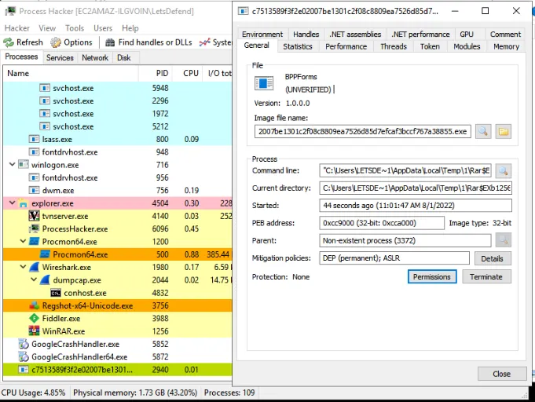
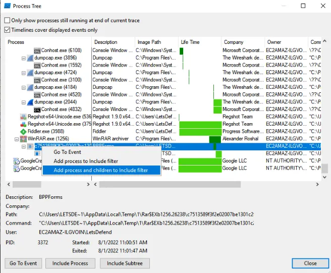
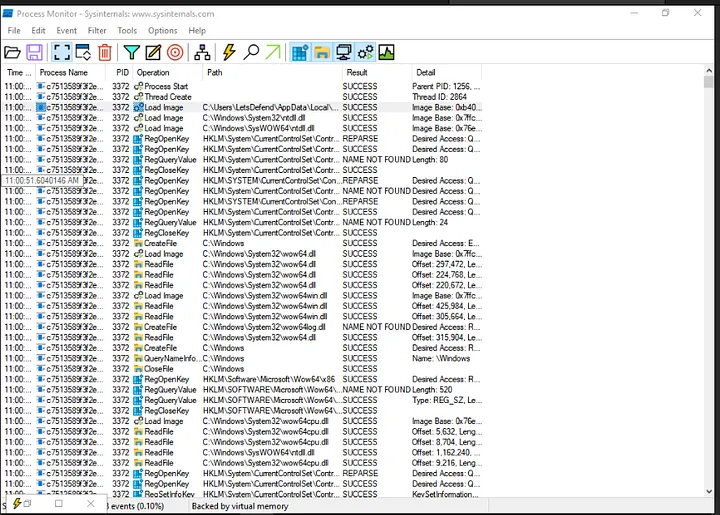
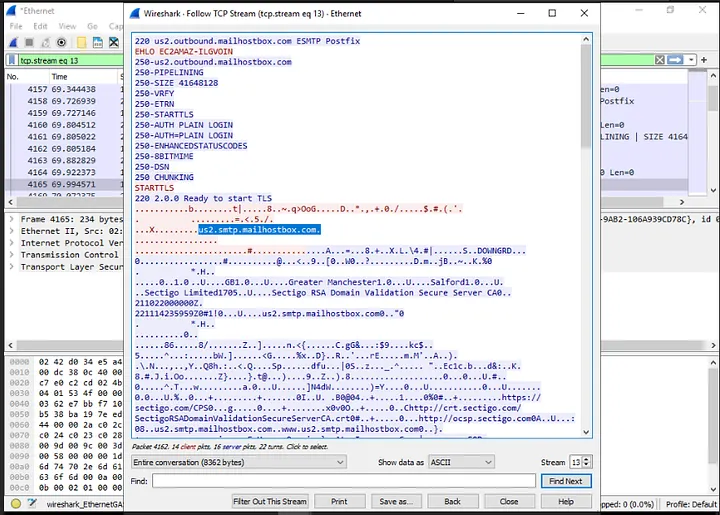
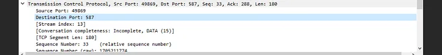
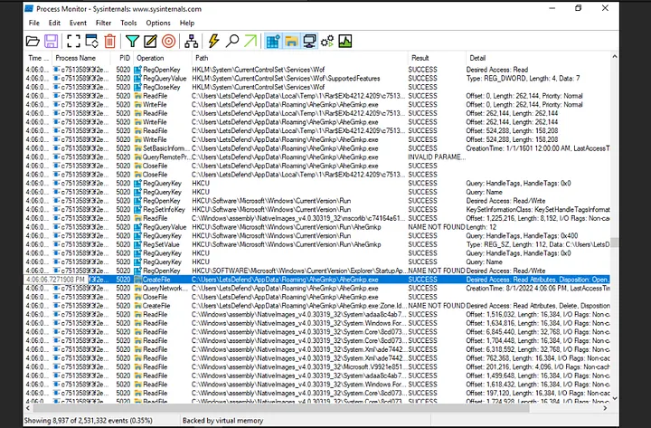
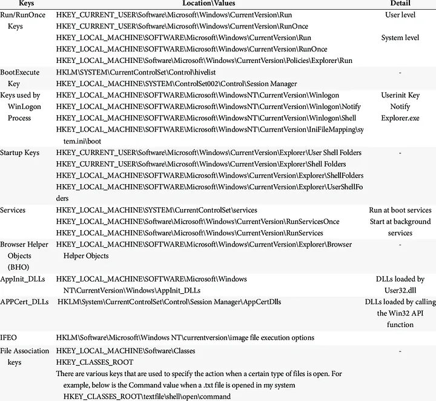
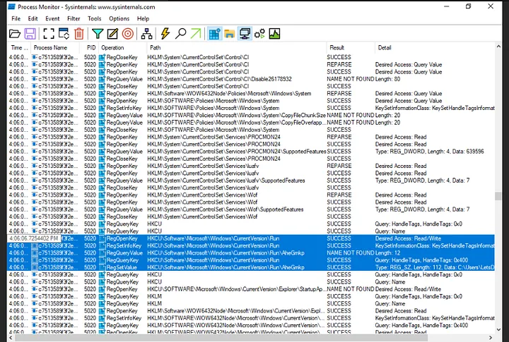

# MAL-003 — Dynamic Malware Analysis of `law.exe`

## Executive Summary

This case documents dynamic analysis of a Windows malware sample distributed as `law.exe.zip` in an isolated training environment.

The sample was executed while monitoring the host with **Process Hacker**, **Process Monitor (Procmon)**, **Wireshark**, and **Fiddler**. The analysis identified suspicious process activity, file-system changes, network communication, and persistence behavior.

Key findings:

- A secondary executable, `AheGmkp.exe`, was created under the user's AppData Roaming directory.
- SMTP traffic was observed to `us2.smtp.mailhostbox.com` over TCP port `587`.
- Persistence was established through `HKEY_CURRENT_USER\SOFTWARE\Microsoft\Windows\CurrentVersion\Run`.
- The Run-key value referenced the dropped AppData executable.

**Verdict: Malicious — High Confidence**

---

## Case Information

| Field | Value |
|---|---|
| Case ID | `MAL-003` |
| Analysis Type | Dynamic malware analysis |
| Original Sample | `law.exe` |
| Tools | Process Hacker, Procmon, Wireshark, Fiddler |
| Dropped Executable | `AheGmkp.exe` |
| External SMTP Host | `us2.smtp.mailhostbox.com` |
| SMTP Port | `587/TCP` |
| Persistence Key | `HKCU\SOFTWARE\Microsoft\Windows\CurrentVersion\Run` |
| Verdict | Malicious |
| Confidence | High |

---

## 1. Analysis Objective

The objective was to execute the sample in an isolated environment and observe process creation, file-system activity, registry changes, network communication, dropped files, and persistence.

---

## 2. Process Analysis

Process Hacker was used immediately after execution to identify the suspicious process.



The executable ran from a temporary extraction path rather than a normal installed-program directory. In context, this justified deeper analysis.

---

## 3. Process Tree Correlation

Procmon's **Process Tree** view was used to isolate the suspicious process and its related activity.



The process and children were added to an include filter to reduce unrelated Windows noise.

---

## 4. File and Registry Activity

Filtered Procmon telemetry showed DLL loads, file reads/writes, registry queries, and registry modifications.



Routine reads are not malicious by themselves. The security-relevant events were executable creation and persistence-related registry modification.

---

## 5. HTTP Traffic Review

Fiddler showed outbound HTTP traffic during the execution period.


The strongest network finding, however, came from the Wireshark capture.

---

## 6. SMTP Network Activity

Wireshark was filtered for SMTP traffic and the relevant TCP stream was reconstructed.



The stream showed communication with:

```text
us2.smtp.mailhostbox.com
```

Observed SMTP capabilities and commands included `EHLO`, `PIPELINING`, `SIZE`, `STARTTLS`, and authentication methods.

This confirms external SMTP communication. It does **not** by itself prove what data, if any, was exfiltrated.

---

## 7. SMTP Port

Packet details showed destination port:

```text
587/TCP
```



Port 587 is commonly used for authenticated SMTP submission. In this context, direct SMTP from a suspicious process is a strong investigative lead.

---

## 8. Dropped Executable

Procmon showed a secondary executable written under the user's AppData roaming directory.



The executable was:

```text
AheGmkp.exe
```

The path was consistent with:

```text
C:\Users\<user>\AppData\Roaming\AheGmkp\AheGmkp.exe
```

A randomly named executable in a user-writable AppData path is strongly suspicious when correlated with the parent malware sample.

---

## 9. Persistence Analysis

A reference list of common Windows autorun locations was used to guide persistence hunting.



Procmon then showed activity at:

```text
HKEY_CURRENT_USER\SOFTWARE\Microsoft\Windows\CurrentVersion\Run
```



The Run-key value referenced the dropped `AheGmkp.exe` executable, providing direct evidence of user-level persistence.

---

## 10. Reconstructed Runtime Chain

```text
law.exe executed
        ↓
Temporary-path process activity
        ↓
AheGmkp.exe written to AppData\Roaming
        ↓
HKCU\...\CurrentVersion\Run modified
        ↓
Persistence established
        ↓
External SMTP connection
        ↓
us2.smtp.mailhostbox.com:587
```

---

## 11. Indicators and Investigation Pivots

| Type | Value | Context |
|---|---|---|
| Filename | `law.exe` | Original malware sample |
| Filename | `AheGmkp.exe` | Dropped/persisted executable |
| Path | `C:\Users\<user>\AppData\Roaming\AheGmkp\AheGmkp.exe` | Persistence location |
| Domain | `us2.smtp.mailhostbox.com` | External SMTP infrastructure |
| Port | `587/TCP` | SMTP submission |
| Registry Key | `HKCU\SOFTWARE\Microsoft\Windows\CurrentVersion\Run` | User-level persistence |

---

## 12. MITRE ATT&CK Mapping

| Technique | Name | Evidence |
|---|---|---|
| `T1547.001` | Registry Run Keys / Startup Folder | Run-key persistence referencing dropped executable |
| `T1071.003` | Application Layer Protocol: Mail Protocols | SMTP communication observed |

`T1041 — Exfiltration Over C2 Channel` is **not confirmed** because the supplied evidence does not show the transmitted data contents.

---

## 13. Analyst Decision Points

### Is the sample malicious?

**Yes — high confidence.**

The sample creates a secondary executable, establishes persistence, and initiates suspicious SMTP communication.

### Does SMTP traffic prove data theft?

**No.** It proves an external mail-protocol session, not the exact content transferred.

### Is port 587 itself malicious?

**No.** It is legitimate SMTP infrastructure. The risk comes from the suspicious process using it.

### Does reading registry keys prove persistence?

**No.** The decisive evidence is modification of the Run key to reference `AheGmkp.exe`.

---

## 14. Detection Opportunities

High-value detections include:

- executable creation under `%APPDATA%` or `%LOCALAPPDATA%`;
- Run-key writes pointing to user-writable directories;
- direct SMTP traffic from non-mail applications;
- correlation of low-prevalence executable creation + persistence + outbound SMTP.

Example behavioral chain:

```text
unknown executable
      +
AppData executable creation
      +
Run-key persistence
      +
outbound SMTP
```

---

## 15. Recommended Response

If observed in production:

1. isolate the endpoint;
2. terminate suspicious processes;
3. collect hashes for `law.exe` and `AheGmkp.exe`;
4. quarantine the dropped executable;
5. remove the malicious Run-key value;
6. hunt enterprise-wide for the dropped filename/hash;
7. search network telemetry for `us2.smtp.mailhostbox.com`;
8. review SMTP activity from non-mail processes;
9. determine whether credentials or other data were transmitted;
10. reimage if remediation confidence is insufficient.

---

## 16. Final Assessment

**Verdict:** Malicious  
**Confidence:** High

Dynamic analysis showed user-level persistence and external SMTP communication. The evidence supports classifying the sample as malicious while keeping the exfiltration claim appropriately bounded: the channel is suspicious, but specific data theft is not proven by the supplied screenshots.

---

## Skills Demonstrated

- Dynamic malware analysis
- Process Hacker analysis
- Procmon filtering and process-tree correlation
- File-system analysis
- Registry persistence analysis
- Wireshark TCP-stream reconstruction
- SMTP protocol analysis
- Fiddler traffic review
- IOC extraction
- MITRE ATT&CK mapping
- Detection engineering
- Evidence-based reporting

---

## Evidence Index

| Image | Description |
|---|---|
| `01-process-hacker-malware-process.png` | Suspicious runtime process |
| `02-procmon-process-tree.png` | Process-tree correlation |
| `03-procmon-process-activity.png` | File and registry telemetry |
| `04-fiddler-http-traffic.png` | HTTP traffic |
| `05-wireshark-smtp-stream.png` | SMTP TCP stream |
| `06-wireshark-smtp-port-587.png` | Destination port 587 |
| `07-procmon-appdata-payload.png` | Dropped `AheGmkp.exe` |
| `08-common-registry-persistence-keys.png` | Persistence-hunting reference |
| `09-procmon-run-key-persistence.png` | Run-key persistence evidence |

---

## Training Context

This malware was executed only in an authorized isolated training environment. The report focuses on behavioral analysis and defensive reasoning rather than reproducing challenge answers.
