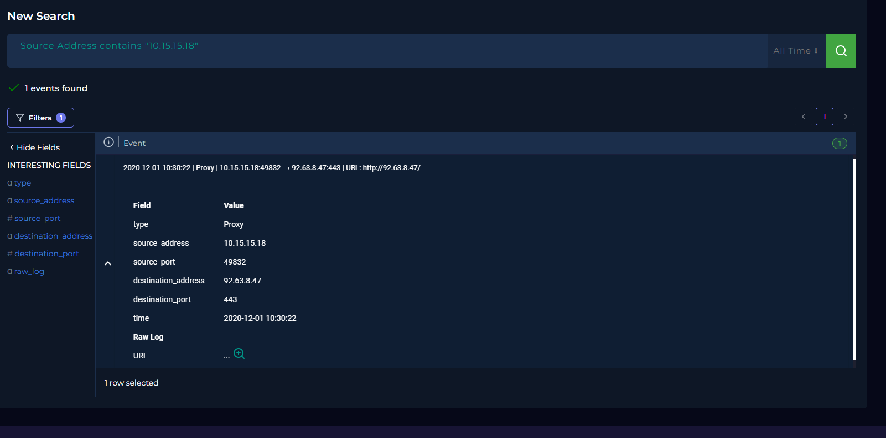
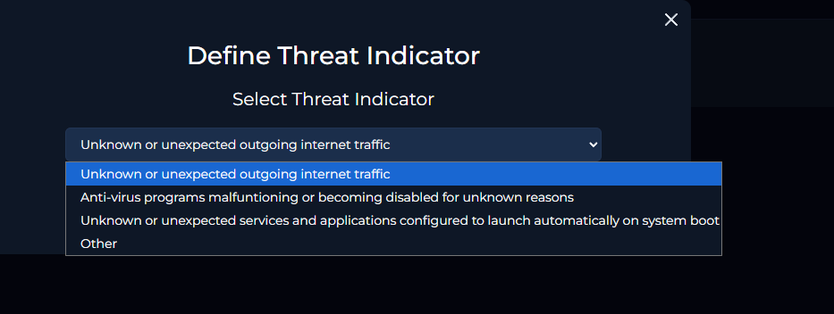
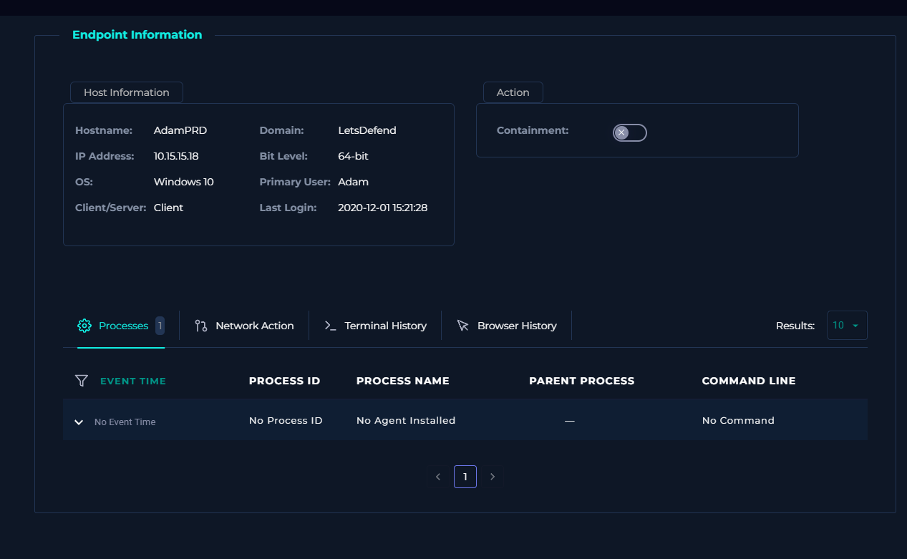
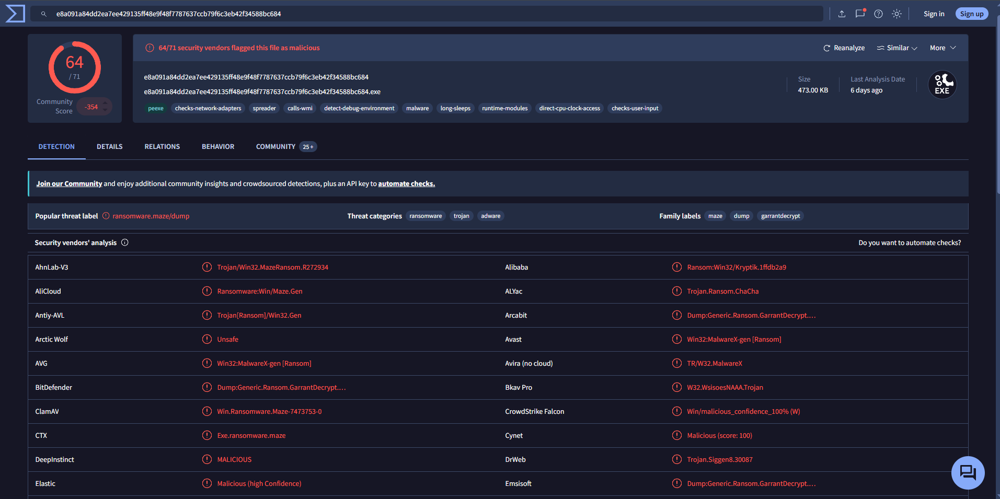
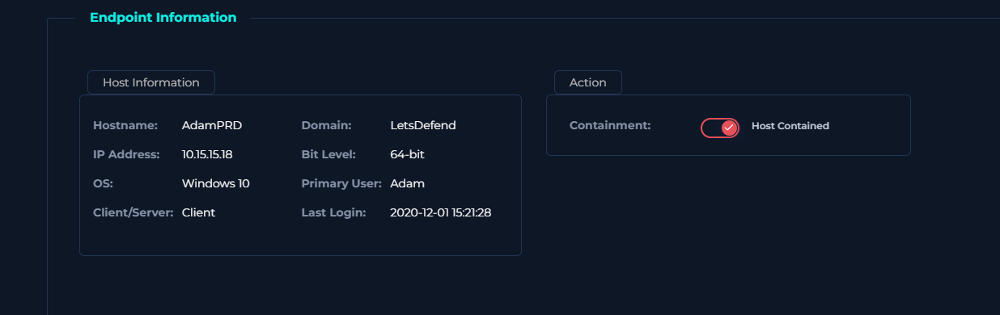

# SOC-012 — Malware Detected with Confirmed Outbound Network Activity

## Executive Summary

A malware alert was generated for `Invoice.exe` on workstation `AdamPRD` (`10.15.15.18`). The file was permitted rather than quarantined by the endpoint control.

Threat-intelligence analysis identified the analyzed executable as highly malicious, with **64 of 71 security vendors** detecting the sample. Vendor classifications included ransomware/trojan-related detections, including references to the Maze ransomware family.

Network telemetry subsequently confirmed that the affected workstation established an outbound connection to `92.63.8.47` after the malware alert.

No endpoint process, terminal, or browser telemetry was available because the endpoint view reported no installed agent telemetry. Therefore, the exact execution chain, persistence behavior, encryption activity, and user interaction could not be independently reconstructed from the local endpoint.

Because the malware was not quarantined and outbound communication from the affected host was confirmed, the workstation was contained.

**Final Verdict:** True Positive — Malware infection with confirmed suspicious outbound communication  
**Confidence:** High

---

## Case Information

| Field | Value |
|---|---|
| Case ID | SOC-012 |
| Event ID | 36 |
| Event Time | 2020-12-01 10:23:12 +03:00 |
| Rule | SOC104 - Malware Detected |
| Alert Type | Malware |
| Difficulty | Easy |
| Source Host | `AdamPRD` |
| Source IP | `10.15.15.18` |
| Operating System | Windows 10 64-bit |
| Primary User | Adam |
| File | `Invoice.exe` |
| File Size | 473 KB |
| Alert File Hash | `f83fb9ce6a83da58b20685c1d7e1e546` |
| Hash Type | MD5 |
| Device Action | Allowed |
| Observed Destination | `92.63.8.47` |
| Network Control | Proxy |
| Response Action | Endpoint contained |
| Verdict | True Positive |

---

## Investigation Objective

Determine whether `Invoice.exe` was malicious, whether it was blocked or quarantined, whether the host communicated with suspicious infrastructure, whether execution could be confirmed, and whether containment was warranted.

---

## Initial Triage

The alert presented several high-risk characteristics:

- executable named `Invoice.exe`
- malware detection
- security action recorded as **Allowed**
- user workstation affected
- outbound traffic requiring correlation

### Initial Hypothesis

> A malicious executable may have been allowed to execute on `AdamPRD` and subsequently initiated external network communication.

---

## Evidence Review

### 1. Proxy Log Correlation

A search for traffic from `10.15.15.18` identified an outbound proxy event to `92.63.8.47`.



| Field | Value |
|---|---|
| Time | 2020-12-01 10:30:22 |
| Type | Proxy |
| Source IP | `10.15.15.18` |
| Source Port | `49832` |
| Destination IP | `92.63.8.47` |
| Destination Port | `443` |
| Logged URL | `http://92.63.8.47/` |

The event occurred approximately seven minutes after the malware alert.

### 2. Threat Indicator

The relevant indicator was **unknown or unexpected outgoing internet traffic**.



### 3. Endpoint Visibility

Endpoint Security identified the affected asset but did not provide usable process telemetry.



Observed endpoint context:

```text
Hostname: AdamPRD
IP Address: 10.15.15.18
OS: Windows 10
Architecture: 64-bit
Primary User: Adam
```

The interface reported no agent telemetry. No process, terminal, or browser history was available.

> **No telemetry does not mean no activity.**

The absence of endpoint events cannot be used to conclude that the malware did not execute.

### 4. Malware Reputation Analysis

Threat-intelligence analysis showed a strong malicious consensus.



VirusTotal reported:

```text
64 / 71 security vendors detected the analyzed sample as malicious
```

Observed classifications included ransomware, trojan, Maze-related, and generic ransomware detections.

The malware-family classification is external threat-intelligence context. Local telemetry does **not** independently establish that ransomware encryption occurred on `AdamPRD`.

---

## Analyst Decision Points

### Decision 1 — Was the file malicious?

**Yes.** The strong multi-vendor consensus supports classification of the analyzed executable as malware.

### Decision 2 — Was the malware quarantined or cleaned?

**No evidence of successful quarantine was identified.**

The alert recorded:

```text
Device Action: Allowed
```

Endpoint Security did not provide evidence of successful prevention.

### Decision 3 — Was the external destination contacted?

**Yes.**

Proxy telemetry directly records:

```text
10.15.15.18 → 92.63.8.47
```

at `2020-12-01 10:30:22`.

### Decision 4 — Is this confirmed C2?

The supplied evidence establishes **confirmed outbound communication to infrastructure associated with the malware investigation**.

The current evidence does not independently prove an interactive command-and-control session. For that reason, this report uses:

> **Suspicious malware-associated outbound communication**

rather than overstating the evidence.

---

## Protocol / Port Discrepancy

The telemetry contains an unusual combination:

```text
Destination Port: 443
Logged URL: http://92.63.8.47/
```

Port `443` is conventionally associated with HTTPS, while the recorded URL uses HTTP.

Both observations are preserved rather than silently reconciled. Possible causes include proxy normalization, logging behavior, malformed application traffic, or incomplete URL reconstruction.

The evidence remains sufficient to establish outbound communication.

---

## Endpoint Assessment

The investigation could not reconstruct:

- parent process
- process tree
- command line
- persistence
- registry modifications
- dropped files
- encryption activity
- credential access
- lateral movement

These remain **not established** because endpoint visibility was insufficient.

---

## Containment

Given the malicious executable, allowed security action, lack of quarantine evidence, subsequent outbound communication, and incomplete endpoint visibility, containment was justified.



```text
AdamPRD → Host Contained
```

---

## IOC / Artifact Record

| Type | Value | Context |
|---|---|---|
| MD5 | `f83fb9ce6a83da58b20685c1d7e1e546` | Alert-associated malicious file hash |
| Filename | `Invoice.exe` | Malicious executable |
| Internal IP | `10.15.15.18` | Affected workstation |
| Host | `AdamPRD` | Affected endpoint |
| External IP | `92.63.8.47` | Observed external destination |
| URL | `http://92.63.8.47/` | URL recorded in proxy telemetry |

`10.15.15.18` is an **affected internal asset**, not a malicious IOC.

---

## Timeline

| Time | Event |
|---|---|
| 10:23:12 | SOC104 malware alert triggered for `Invoice.exe` on `AdamPRD` |
| 10:23:12 | Device action recorded as `Allowed` |
| 10:30:22 | Proxy telemetry records outbound connection from `10.15.15.18` to `92.63.8.47` |
| Investigation | VirusTotal analysis confirms strong malicious consensus |
| Investigation | Endpoint process telemetry unavailable |
| Response | `AdamPRD` contained |

---

## Evidence vs Inference

### Directly Observed

- `Invoice.exe` triggered the malware alert.
- Alert-associated MD5 was `f83fb9ce6a83da58b20685c1d7e1e546`.
- Device action was `Allowed`.
- VirusTotal showed strong malicious consensus for the analyzed sample.
- `AdamPRD` communicated with `92.63.8.47`.
- Endpoint telemetry was unavailable.
- `AdamPRD` was contained.

### Strongly Supported

- The malware was not successfully prevented at the initial security-control layer.
- The outbound activity warranted treating the host as potentially compromised.
- Isolation was appropriate.

### Not Established

The current evidence does **not** establish:

- ransomware encryption
- data exfiltration
- persistence
- credential theft
- lateral movement
- exact process responsible for the connection
- deliberate user execution
- a full command-and-control exchange

---

## MITRE ATT&CK Mapping

The platform associates the alert with:

### T1204 — User Execution

This is retained as a **platform-provided mapping**, but the supplied evidence does not independently show the user launching `Invoice.exe`.

| Technique | Status | Evidence |
|---|---|---|
| T1204 — User Execution | Platform-provided / not independently confirmed | Malware alert is associated with a user workstation, but process telemetry is unavailable |

No additional ransomware-impact, credential-access, persistence, or exfiltration techniques are added without supporting host evidence.

---

## Scope Assessment

### Confirmed affected asset

```text
AdamPRD
10.15.15.18
```

### Confirmed external communication

```text
92.63.8.47
```

### Additional affected systems

**Not established from available telemetry.**

---

## Production SOC Follow-Up

In a production environment, I would:

1. Hunt enterprise-wide for the MD5 and associated SHA-256 values.
2. Search proxy, firewall, and DNS telemetry for `92.63.8.47`.
3. Identify other hosts communicating with related infrastructure.
4. Acquire endpoint or forensic evidence from `AdamPRD`.
5. Inspect persistence locations.
6. Search for dropped files and secondary payloads.
7. Review Windows event logs around 10:23–10:31.
8. Determine the delivery mechanism for `Invoice.exe`.
9. Investigate whether credentials or sensitive data were accessed.
10. If ransomware execution is confirmed, activate the ransomware incident-response procedure.

---

## Detection Opportunities

### Detection 1 — Known Malicious File Hash

```text
file.hash.md5 = "f83fb9ce6a83da58b20685c1d7e1e546"
```

Useful for retrospective hunting, but insufficient as a long-term behavioral detection by itself.

### Detection 2 — Malware Alert Followed by Outbound Communication

```text
Malware alert on host
        +
Device action = Allowed
        +
Outbound connection from same host within 15 minutes
```

### Detection 3 — Malware Alert with Failed Prevention

```text
malware_detected = true
AND
device_action IN ("Allowed", "Permitted")
```

Priority should increase when:

```text
subsequent_external_connection = true
```

### Recommended Correlation Logic

```text
IF endpoint malware detection
AND prevention action = allowed
AND outbound network connection occurs from same host shortly afterward
THEN
raise high-confidence possible malware execution alert
```

---

## Lessons Learned

1. **Detection does not mean prevention.** An alert with `Device Action: Allowed` requires continued investigation.
2. **Absence of EDR telemetry is an investigation limitation.** No process history does not mean no process executed.
3. **Network telemetry can compensate for endpoint visibility gaps.** Proxy logs supplied key evidence.
4. **Reputation alone should not determine the verdict.** The strongest conclusion came from combining malicious-file evidence, the allowed action, and observed outbound communication.
5. **Malware-family labels are not equivalent to observed host behavior.** Maze-related classifications do not prove encryption on the endpoint.

---

## Final Verdict

**True Positive — High Confidence**

A malicious executable identified as `Invoice.exe` was detected on `AdamPRD` and was not blocked or quarantined by the initial security control. External threat intelligence strongly classified the analyzed sample as malicious, while subsequent proxy telemetry confirmed outbound communication from the affected workstation to `92.63.8.47`.

Endpoint visibility was insufficient to reconstruct the complete execution chain or verify persistence, ransomware encryption, credential theft, or other post-exploitation behavior. Given the confirmed malware detection, allowed device action, external communication, and lack of reliable endpoint telemetry, containment of `AdamPRD` was warranted.

---

## Production-Style Analyst Closure Note

> **True Positive — Malware execution/compromise suspected with high confidence.** `Invoice.exe` was detected on `AdamPRD (10.15.15.18)` with the security action recorded as Allowed. Threat-intelligence analysis strongly classified the sample as malicious. Proxy telemetry subsequently confirmed outbound communication from the affected host to `92.63.8.47`. Endpoint process telemetry was unavailable, preventing reconstruction of the execution chain or confirmation of additional malware behavior. The affected workstation was contained to prevent further activity. Recommend enterprise-wide IOC hunting and forensic review of the host.

---

## Skills Demonstrated

- Malware alert triage
- File-hash investigation
- Threat-intelligence enrichment
- Proxy log analysis
- Endpoint-scoping analysis
- Evidence-quality assessment
- IOC handling
- ATT&CK mapping discipline
- Containment decision-making
- Detection-engineering reasoning
- Production-style SOC documentation

---

## Evidence

The `images/` directory contains curated screenshots supporting the analytical findings in this report.

Only evidence that materially contributes to the investigation narrative is included.

---

## Training Context

This investigation was performed in an authorized simulated SOC environment.

The report is written as a defensive security portfolio case study and emphasizes analyst reasoning, evidence interpretation, and response methodology rather than training-platform walkthrough answers.
