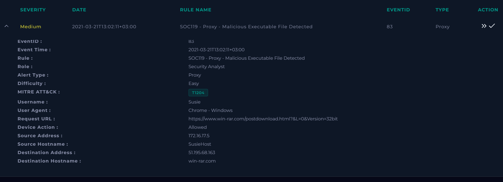
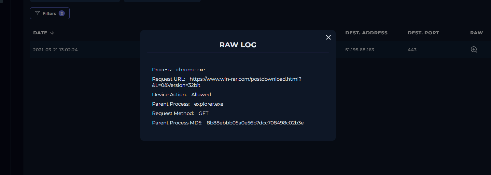
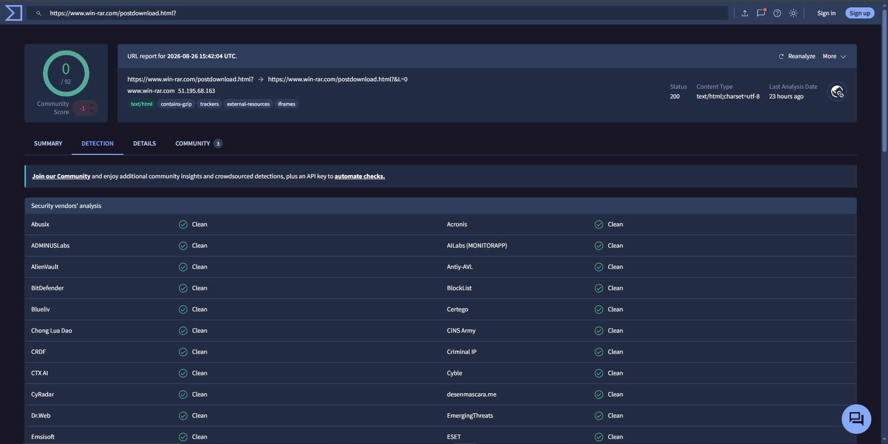

# SOC-014 — Proxy Malicious Executable File Detected — False Positive

## Executive Summary

A medium-severity proxy alert was generated after workstation `SusieHost` accessed the official WinRAR post-download page over HTTPS. The proxy permitted the request and the detection rule classified the activity as a possible malicious executable download.

Investigation of the proxy event showed that `chrome.exe`, launched by `explorer.exe`, requested the legitimate WinRAR domain `win-rar.com`. Independent URL reputation analysis did not identify the destination as malicious. No suspicious redirect, malicious infrastructure, abnormal process execution, or additional evidence of compromise was identified in the available telemetry.

The alert was therefore classified as a **False Positive**.

> **Analyst conclusion:** The rule appears to have triggered on legitimate software-download activity without sufficient malicious context. Detection logic should distinguish trusted software distribution domains and executable-download behavior from genuinely malicious payload delivery.

---

## Case Information

| Field | Value |
|---|---|
| Case ID | `SOC-014` |
| Event ID | `83` |
| Event Time | `2021-03-21 13:02:11 +03:00` |
| Rule | `SOC119 - Proxy - Malicious Executable File Detected` |
| Alert Type | Proxy |
| Severity | Medium |
| Difficulty | Easy |
| Alert-provided MITRE ATT&CK | `T1204` |
| Username | `Susie` |
| Source Host | `SusieHost` |
| Source IP | `172.16.17.5` |
| Destination IP | `51.195.68.163` |
| Destination Host | `win-rar.com` |
| Request URL | `https://www.win-rar.com/postdownload.html?&L=0&Version=32bit` |
| User Agent | Chrome - Windows |
| Device Action | Allowed |
| Final Verdict | **False Positive** |
| Confidence | **High** |

---

## Alert Evidence

The alert identified outbound web activity from `SusieHost` to the WinRAR download site.



### Initial Hypothesis

Because the rule was designed to detect malicious executable downloads, the first hypothesis was:

> A user may have downloaded or attempted to download an executable from malicious or compromised infrastructure.

That hypothesis required validation against the proxy telemetry and destination reputation before classifying the event.

---

## Investigation Objective

The investigation sought to determine:

1. What host and user generated the traffic?
2. What destination was contacted?
3. Was the request allowed or blocked?
4. Was the URL or destination malicious?
5. Was there evidence of malicious execution or follow-on activity?
6. Should the alert remain a true positive or be closed as a false positive?

---

## Step 1 — Collection and Triage

### Source

- Source IP: `172.16.17.5`
- Hostname: `SusieHost`
- Username: `Susie`
- User Agent: Chrome on Windows

### Destination

- Destination IP: `51.195.68.163`
- Destination hostname: `win-rar.com`
- Destination port: `443`
- URL:

```text
https://www.win-rar.com/postdownload.html?&L=0&Version=32bit
```

The destination hostname is consistent with the official WinRAR website.

---

## Step 2 — Proxy Log Analysis

Log Management showed the following event at `2021-03-21 13:02:24`:

| Field | Value |
|---|---|
| Type | Proxy |
| Source Address | `172.16.17.5` |
| Source Port | `43213` |
| Destination Address | `51.195.68.163` |
| Destination Port | `443` |
| Process | `chrome.exe` |
| Parent Process | `explorer.exe` |
| Request Method | `GET` |
| Device Action | `Allowed` |
| Parent Process MD5 | `8b88ebbb05a0e56b7dcc708498c02b3e` |



### Analyst Assessment

The process relationship is consistent with ordinary interactive browser activity:

```text
explorer.exe
    └── chrome.exe
          └── HTTPS GET → win-rar.com
```

The request itself does not demonstrate malicious execution. An allowed web request to a software download page is only an investigative lead and must be evaluated in context.

---

## Step 3 — URL Reputation Analysis

The requested URL was analyzed using VirusTotal.

VirusTotal did not show security vendors classifying the WinRAR URL as malicious.



### Reputation Assessment

| Indicator | Assessment |
|---|---|
| Domain | `win-rar.com` |
| URL purpose | WinRAR post-download page |
| Vendor detections | No malicious detections observed in supplied evidence |
| Community score | Slightly negative community score, but not sufficient to classify as malicious |
| Overall assessment | **Benign / legitimate software-download destination** |

A community score or isolated reputation signal is not sufficient to override the stronger contextual evidence that the destination is a legitimate software vendor.

---

## Analyst Decision Points

### Decision 1 — Was the destination suspicious?

**No.** The request was made to the legitimate WinRAR domain.

### Decision 2 — Did the proxy allow the traffic?

**Yes.** The proxy recorded the request as `Allowed`.

An allowed connection does not itself imply compromise.

### Decision 3 — Was the URL malicious?

**No evidence supports that conclusion.** URL reputation analysis did not classify the destination as malicious.

### Decision 4 — Was there evidence of malicious execution?

**No.** The supplied telemetry only shows `chrome.exe` requesting the WinRAR post-download page. No malicious child process, payload execution, persistence, or command-and-control activity was identified.

### Decision 5 — Should this remain a security incident?

**No.** The alert is best classified as a false positive.

---

## Scope Assessment

The available evidence identifies:

```text
User: Susie
Host: SusieHost
Source IP: 172.16.17.5
Destination: win-rar.com
Destination IP: 51.195.68.163
```

No additional affected hosts, users, malicious artifacts, or follow-on activity were identified from the supplied evidence.

---

## MITRE ATT&CK Assessment

The alert metadata included:

- `T1204 — User Execution`

However, **this investigation does not retain T1204 as an analyst-confirmed ATT&CK mapping**.

T1204 represents adversary-driven user execution. The evidence in this case supports normal browser activity involving a legitimate software-download page and does not establish adversary-controlled execution.

### Final Analyst Mapping

**None — benign activity / false positive**

This distinction is important: ATT&CK tags attached to a detection rule should not automatically be treated as confirmed adversary behavior.

---

## Indicators / Artifacts

No malicious IOC was confirmed.

| Indicator | Type | Assessment |
|---|---|---|
| `172.16.17.5` | Internal IP | Source workstation |
| `51.195.68.163` | Destination IP | Associated with observed WinRAR traffic |
| `win-rar.com` | Domain | Legitimate software vendor |
| `https://www.win-rar.com/postdownload.html?&L=0&Version=32bit` | URL | Benign software-download page |

Because the case was determined to be benign, these values should **not** be treated as malicious indicators or blocklisted solely because they appeared in the alert.

---

## Timeline

| Time | Event |
|---|---|
| `2021-03-21 13:02:11 +03:00` | SOC119 alert generated |
| `2021-03-21 13:02:24` | Proxy recorded HTTPS GET from `172.16.17.5` to `51.195.68.163:443` |
| Investigation | Destination and URL analyzed |
| Investigation | URL reputation did not support malicious classification |
| Closure | Alert classified as **False Positive** |

---

## Final Verdict

### Classification

**False Positive**

### Confidence

**High**

### Reasoning

The alert triggered on legitimate browser traffic to the official WinRAR software-download page. Proxy telemetry showed a normal `explorer.exe → chrome.exe` browsing chain, and third-party URL reputation analysis did not identify the destination as malicious. No malicious executable, suspicious process execution, persistence, C2 communication, or other evidence of compromise was found in the supplied telemetry.

---

## Detection Engineering Opportunity

This case highlights a useful detection-tuning problem.

### Current Detection Weakness

A rule that alerts on any executable-download pattern without sufficient destination and behavioral context can generate unnecessary analyst workload.

### Improved Detection Logic

Detection confidence could be increased by combining several signals:

- executable or archive download
- low-prevalence or newly observed destination
- malicious or suspicious reputation
- uncommon domain age or infrastructure
- browser download followed by executable launch
- child process creation from browser/download directory
- suspicious command line
- unsigned or low-reputation binary
- subsequent outbound connections to unrelated infrastructure

### Example Detection Principle

```text
Do not classify a software download as malicious solely because an executable may be involved.

Prioritize:
download + suspicious destination + execution + post-execution behavior
```

### Potential Tuning

Known legitimate software distribution domains could be incorporated into contextual allowlisting or risk reduction, while still preserving detection if post-download execution becomes suspicious.

---

## Lessons Learned

1. **A detection rule is a hypothesis, not a verdict.**
2. Legitimate software downloads can resemble malicious executable delivery at a superficial level.
3. Reputation should be used as supporting context rather than as the sole decision point.
4. Parent-child process context can help distinguish normal browser use from suspicious execution.
5. MITRE ATT&CK tags from alert metadata should be independently validated before inclusion in the final report.
6. False positives are valuable because they reveal opportunities to improve detection precision.

---

## Skills Demonstrated

- Proxy log analysis
- Source/destination validation
- URL reputation analysis
- Process-context interpretation
- False-positive determination
- Evidence-based MITRE ATT&CK validation
- Detection-tuning analysis
- SOC case documentation

---

## Evidence Files

```text
images/
├── 01-alert-details.png
├── 02-virustotal-url-analysis.png
└── 03-proxy-raw-log.png
```

All three screenshots are referenced directly in this report.

---

## Training Context

This investigation was completed in an authorized simulated SOC environment.

The purpose of this report is to document investigative methodology and analyst reasoning rather than reproduce training-platform answers.

