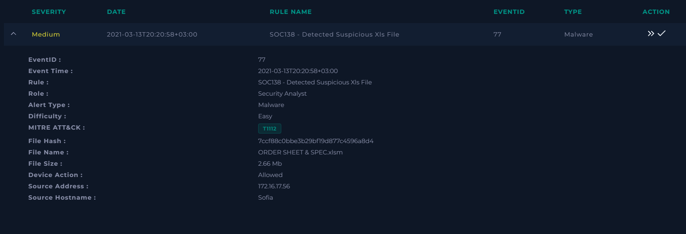
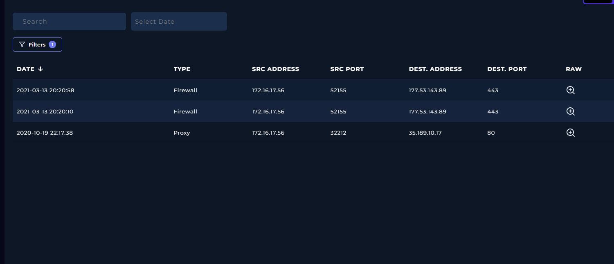
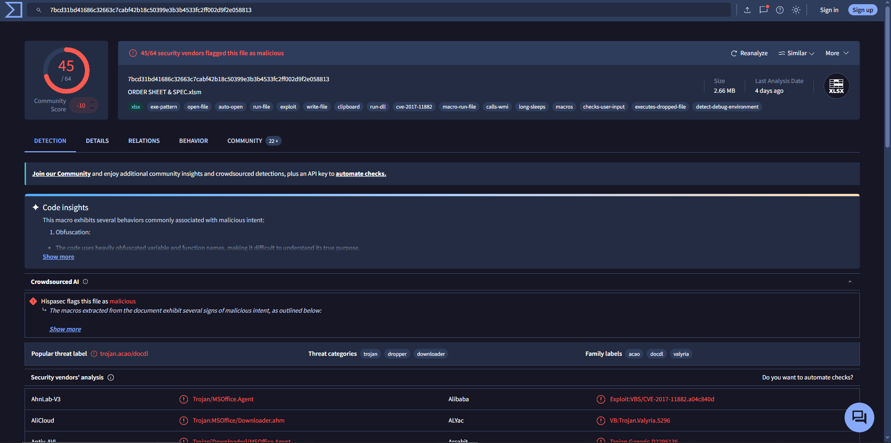
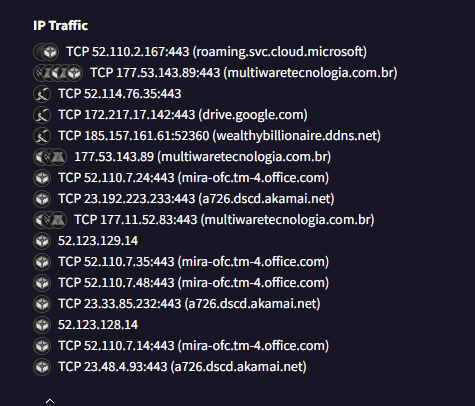
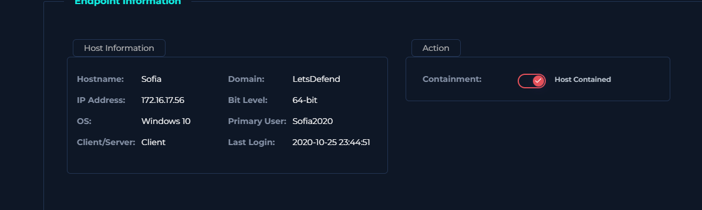

# SOC-015 — Suspicious XLSM Malware with Outbound Infrastructure Contact

## Executive Summary

A medium-severity malware alert was generated for `ORDER SHEET & SPEC.xlsm` on workstation `Sofia` (`172.16.17.56`). The alert identified a suspicious macro-enabled Excel workbook and recorded the file action as **Allowed**.

Threat-intelligence analysis showed that the workbook was strongly malicious, with **45/64 security vendors** detecting it at the time of analysis. The file was associated with downloader/dropper behavior and infrastructure including `multiwaretecnologia.com.br`. Network telemetry from the affected endpoint showed outbound HTTPS connections to `177.53.143.89`, which also appeared in the malware-analysis network indicators.

The observed network correlation provides evidence that the suspicious workbook or related activity reached infrastructure associated with the malicious sample. The host was therefore contained through EDR.

**Final Verdict: True Positive — Malicious macro-enabled Office document with confirmed outbound contact to associated infrastructure.**

> **Evidence note:** The available evidence supports calling `177.53.143.89` malicious/contacted infrastructure associated with the sample. It should not be described more specifically as command-and-control unless the malware analysis or network telemetry independently establishes a C2 role.

---

## Case Information

| Field | Value |
|---|---|
| Case ID | `SOC-015` |
| Event ID | `77` |
| Event Time | `2021-03-13 20:20:58 +03:00` |
| Rule | `SOC138 - Detected Suspicious Xls File` |
| Alert Type | Malware |
| Severity | Medium |
| Difficulty | Easy |
| Alert-provided MITRE ATT&CK | `T1112` |
| File Name | `ORDER SHEET & SPEC.xlsm` |
| File Hash | `7ccf88c0bbe3b29bf19d877c4596a8d4` |
| Hash Type | MD5 |
| File Size | `2.66 MB` |
| Device Action | Allowed |
| Source Host | `Sofia` |
| Source IP | `172.16.17.56` |
| Final Verdict | **True Positive** |
| Confidence | **High** |

---

## Alert Evidence

The alert identified a suspicious macro-enabled Excel workbook on `Sofia`.



### Initial Hypothesis

The workbook may contain malicious macro or exploit functionality capable of downloading or executing a secondary payload and communicating with external infrastructure.

The alert alone was not sufficient to confirm compromise. Validation required:

- file reputation analysis,
- network correlation,
- endpoint context,
- and response validation.

---

## Investigation Objective

The investigation sought to determine:

1. Whether the workbook was actually malicious.
2. Whether the host was protected, blocked, or allowed to interact with the file.
3. Whether the endpoint contacted infrastructure associated with the sample.
4. Whether host containment was required.
5. Which indicators should be retained as confirmed artifacts.
6. Whether the alert represented a true or false positive.

---

## Step 1 — Threat Indicator Classification

The threat indicator was classified as:

```text
Other
```

The alert did not begin with a simple single-network IOC. Instead, the primary suspicious artifact was a macro-enabled Excel workbook.

---

## Step 2 — Alert Action and Network Review

The alert recorded:

```text
Device Action: Allowed
```

This establishes that the detection control did **not block the file at alert time**.

It does **not**, by itself, prove the exact quarantine state of the endpoint later in the incident. No supplied evidence shows a quarantine or cleanup action before containment.

### Relevant Network Events

Log Management showed outbound firewall traffic from `172.16.17.56` to `177.53.143.89:443`:

| Time | Source | Destination | Port | Type |
|---|---|---|---:|---|
| `2021-03-13 20:20:10` | `172.16.17.56` | `177.53.143.89` | 443 | Firewall |
| `2021-03-13 20:20:58` | `172.16.17.56` | `177.53.143.89` | 443 | Firewall |



### Analyst Assessment

The connection at `20:20:58` aligns directly with the malware alert timestamp. This temporal correlation increases confidence that the outbound communication was related to the malicious-document event.

---

## Step 3 — Malware Analysis

The MD5 hash was analyzed through VirusTotal:

```text
7ccf88c0bbe3b29bf19d877c4596a8d4
```

VirusTotal showed:

- **45/64** vendors detecting the file as malicious.
- Macro-related and exploit-related behavioral tags.
- Downloader/dropper classifications.
- References to `CVE-2017-11882` in vendor/behavioral metadata.
- A malicious URL associated with `multiwaretecnologia.com.br`.



### File Assessment

The high detection ratio and observed malicious-document behaviors strongly support classification of the workbook as malicious.

Reputation was used as supporting evidence, not as the sole basis for the verdict.

---

## Step 4 — Infrastructure Correlation

Malware-analysis telemetry showed network activity including:

```text
177.53.143.89
multiwaretecnologia.com.br
```



The same IP address, `177.53.143.89`, was observed in the enterprise firewall logs from `Sofia`.

### Correlation

```text
Malicious workbook
      ↓
Malware-analysis infrastructure
      ↓
177.53.143.89
      ↑
Observed enterprise firewall connection
      ↑
Sofia (172.16.17.56)
```

This is substantially stronger evidence than simply finding an IP in a sandbox report: the infrastructure indicator was independently observed in the organization's own telemetry.

### C2 Assessment

The training playbook frames this step as a C2 check. From the supplied evidence, the defensible conclusion is:

> `Sofia` contacted infrastructure associated with the malicious workbook.

The evidence does **not** independently establish the exact operational role of `177.53.143.89` as a C2 server. Therefore, this report uses the more precise term **malicious/contacted infrastructure**.

---

## Step 5 — Endpoint Response

Because malicious-file activity and correlated outbound infrastructure contact were confirmed, endpoint containment was justified.

The affected host was isolated through EDR.



### Containment Result

```text
Hostname: Sofia
IP: 172.16.17.56
OS: Windows 10
Primary User: Sofia2020
Containment: Host Contained
```

---

## Analyst Decision Points

### Decision 1 — Was the XLSM actually malicious?

**Yes.**

The sample had a high multi-engine detection ratio and malicious macro/downloader characteristics.

### Decision 2 — Was the file blocked?

**No at the point of detection.**

The alert recorded `Device Action: Allowed`.

### Decision 3 — Was associated infrastructure contacted?

**Yes.**

`177.53.143.89` appeared in malware-analysis indicators and was independently observed in firewall logs from the affected host.

### Decision 4 — Can `177.53.143.89` definitively be called a C2 server?

**Not from the supplied evidence alone.**

It is confirmed as infrastructure contacted by the endpoint and associated with the malicious sample. A stronger C2 designation would require protocol or behavioral confirmation.

### Decision 5 — Was containment appropriate?

**Yes.**

A malicious Office document plus correlated outbound communication creates sufficient compromise risk to justify isolation.

---

## Indicators of Compromise / Artifacts

| Indicator | Type | Assessment |
|---|---|---|
| `7ccf88c0bbe3b29bf19d877c4596a8d4` | MD5 | Malicious workbook |
| `177.53.143.89` | IP | Malicious/contacted infrastructure |
| `multiwaretecnologia.com.br` | Domain | Infrastructure associated with malicious sample |
| `ORDER SHEET & SPEC.xlsm` | File | Malicious macro-enabled Office document |
| `172.16.17.56` | Internal IP | Affected endpoint |

---

## Timeline

| Time | Event |
|---|---|
| `2021-03-13 20:20:10` | `Sofia` connects to `177.53.143.89:443` |
| `2021-03-13 20:20:58` | Malware alert fires for `ORDER SHEET & SPEC.xlsm` |
| `2021-03-13 20:20:58` | Additional outbound connection to `177.53.143.89:443` observed |
| Investigation | File hash analyzed and confirmed malicious |
| Investigation | Infrastructure from malware analysis correlated with enterprise logs |
| Response | Host `Sofia` contained through EDR |
| Closure | Case classified **True Positive** |

---

## MITRE ATT&CK Assessment

### Alert-Provided Mapping

The alert supplied:

```text
T1112 — Modify Registry
```

### Analyst Validation

The supplied screenshots and logs do **not** independently show registry modification.

Therefore:

> **T1112 is preserved as alert metadata but is not treated as analyst-confirmed behavior in this report.**

The evidence does support malicious Office document activity and outbound communication, but the exact execution chain is not directly shown in the supplied telemetry.

### Final Analyst-Confirmed Mapping

**No additional ATT&CK technique is asserted beyond the evidence.**

This avoids turning sandbox labels or alert metadata into unsupported behavioral claims.

---

## Scope Assessment

### Confirmed Affected Asset

```text
Hostname: Sofia
IP Address: 172.16.17.56
Primary User: Sofia2020
OS: Windows 10
```

### Confirmed Malicious Artifact

```text
ORDER SHEET & SPEC.xlsm
MD5: 7ccf88c0bbe3b29bf19d877c4596a8d4
```

### Confirmed Network Indicator

```text
177.53.143.89:443
```

No evidence supplied for this case establishes lateral movement, additional infected hosts, persistence, or credential compromise.

---

## Final Verdict

### Classification

**True Positive**

### Confidence

**High**

### Rationale

The suspicious XLSM file was strongly detected as malicious, the security control allowed the event, and enterprise network telemetry showed outbound communication from the affected host to infrastructure independently associated with the malicious sample. This correlation provides sufficient evidence to classify the incident as a true positive and justify endpoint containment.

---

## Recommended Follow-Up Actions

In a production SOC, the next actions would include:

1. Acquire endpoint process telemetry surrounding `20:20`.
2. Identify the Excel process and any child processes.
3. Search for dropped executables, scripts, DLLs, or scheduled tasks.
4. Search enterprise telemetry for `177.53.143.89`.
5. Search DNS/proxy logs for `multiwaretecnologia.com.br`.
6. Identify any other users who received or opened the same workbook.
7. Block confirmed malicious indicators where appropriate.
8. Preserve the workbook and relevant endpoint telemetry for DFIR.
9. Review persistence locations and credential-access telemetry.
10. Reimage or remediate the host according to organizational incident-response policy if compromise is confirmed at the endpoint level.

---

## Detection Engineering Opportunities

### Office Application Followed by Rare External Connection

Detect:

```text
Office process
    +
new/rare destination
    +
outbound HTTPS connection shortly after document execution
```

### Macro-Enabled Office Document Risk

Increase risk when:

- `.xlsm` file is newly downloaded or received by email,
- macro execution occurs,
- Office spawns an unusual child process,
- outbound network communication follows.

### IOC Correlation

Alert when endpoint traffic matches infrastructure extracted from confirmed malicious-file analysis.

### Behavioral Detection Over Hash-Only Detection

Hash indicators are useful but brittle.

Stronger detections should prioritize:

```text
Office document
→ macro/exploit behavior
→ child process
→ payload execution
→ outbound network activity
```

---

## Lessons Learned

1. `Device Action: Allowed` shows prevention did not block the event, but it should not be overinterpreted as complete evidence of later quarantine state.
2. A sandbox/contacted-IP list becomes much stronger evidence when the same indicator appears in internal telemetry.
3. Malware reputation should support — not replace — behavioral investigation.
4. C2 terminology should be reserved for infrastructure whose command-and-control role is actually established.
5. Alert-provided ATT&CK mappings must be validated against observable evidence.
6. Macro-enabled Office documents should be investigated as potential execution and payload-delivery vectors.
7. Strong SOC investigations correlate **file → host → network → response** rather than treating each evidence source independently.

---

## Skills Demonstrated

- Malware alert triage
- Malicious Office document analysis
- VirusTotal enrichment
- Firewall log correlation
- Infrastructure pivoting
- IOC validation
- Endpoint containment
- Evidence-based ATT&CK validation
- Scope assessment
- Incident-response reasoning
- Detection-engineering analysis

---

## Evidence

```text
images/
├── 01-alert-details.png
├── 02-log-management-connections.png
├── 03-virustotal-file-analysis.png
├── 04-malware-ip-traffic.png
└── 05-endpoint-contained.png
```

All evidence screenshots are referenced directly in this report.

---

## Training Context

This investigation was performed in an authorized SOC training environment.

The report is written to demonstrate investigation methodology, evidence correlation, and analyst decision-making rather than reproduce challenge answers.
