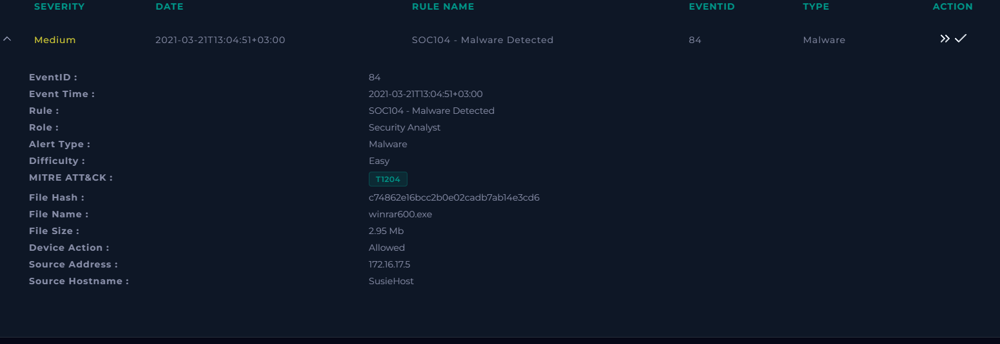
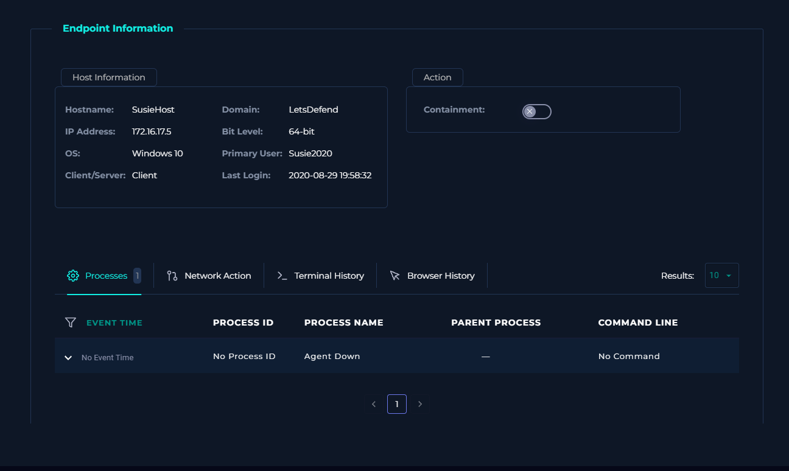
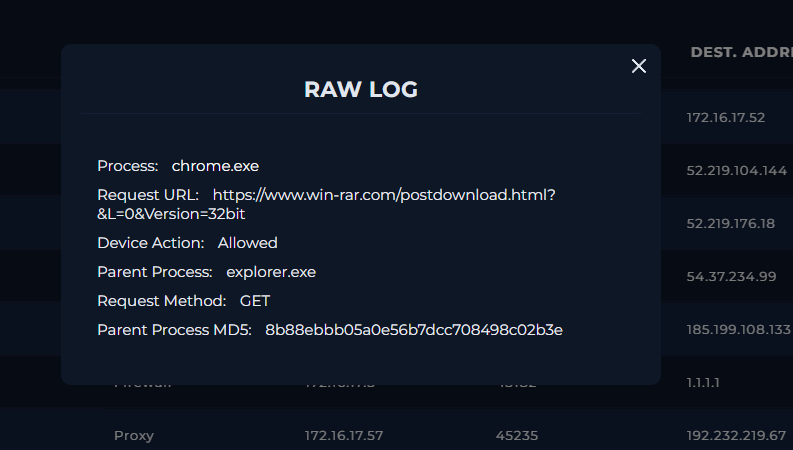
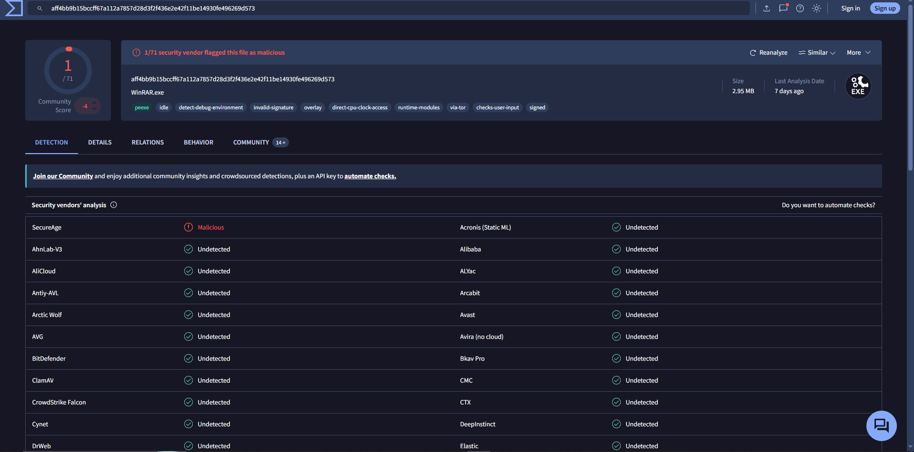
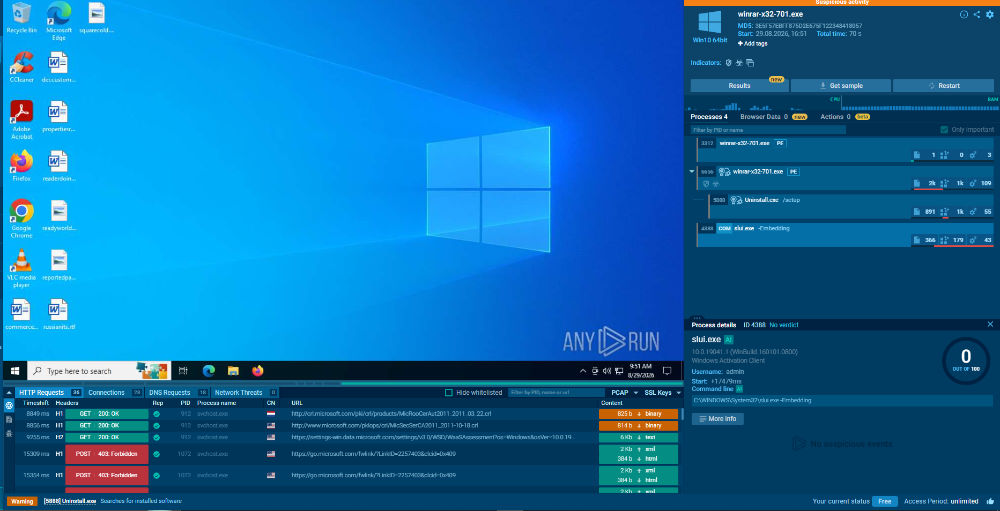

# SOC-016 — WinRAR Installer Malware Alert — False Positive

## Executive Summary

A medium-severity malware alert was generated for `winrar600.exe` on workstation `SusieHost` (`172.16.17.5`).

The alert rule was:

```text
SOC104 - Malware Detected
```

The file was allowed, and initial enrichment created ambiguity:

- VirusTotal showed **1/71** vendor detection.
- ANY.RUN labeled the activity as suspicious at a high level.
- The observed web activity pointed to the legitimate WinRAR website.

Further analysis showed that the executable performed behavior consistent with a legitimate WinRAR installer or upgrade workflow:

- normal installer process activity;
- uninstall/reinstall behavior;
- no unexpected persistence;
- no suspicious registry modification;
- no malicious child-process chain;
- no confirmed malicious outbound infrastructure;
- no confirmed command-and-control activity.

The alert was therefore classified as a **False Positive**.

**Final Verdict: False Positive — High Confidence**

---

## Case Information

| Field | Value |
|---|---|
| Case ID | `SOC-016` |
| Event ID | `84` |
| Event Time | `2021-03-21 13:04:51 +03:00` |
| Rule | `SOC104 - Malware Detected` |
| Alert Type | Malware |
| Severity | Medium |
| Difficulty | Easy |
| Alert-provided MITRE ATT&CK | `T1204` |
| File Name | `winrar600.exe` |
| MD5 | `c74862e16bcc2b0e02cadb7ab14e3cd6` |
| File Size | `2.95 MB` |
| Device Action | Allowed |
| Source IP | `172.16.17.5` |
| Source Host | `SusieHost` |
| Final Verdict | **False Positive** |
| Confidence | **High** |

---

## Alert Evidence

The alert identified `winrar600.exe` as malware on `SusieHost`.



### Initial Hypothesis

The alert could represent:

1. a genuinely malicious executable disguised as WinRAR;
2. a tampered installer;
3. a legitimate WinRAR installer incorrectly flagged by a weak detection source.

The alert alone was not sufficient to determine which explanation was correct.

---

## Step 1 — Threat Indicator

The investigation categorized the suspicious condition as:

```text
Unknown or unexpected outgoing internet traffic
```

This was a reasonable starting point because the alert involved an allowed executable and external network activity.

---

## Step 2 — Endpoint and Quarantine Review

The alert recorded:

```text
Device Action: Allowed
```

The endpoint view also showed no active agent telemetry for process investigation.



### Analyst Assessment

The available telemetry did not show the file being quarantined or cleaned.

However, the absence of EDR process telemetry limited host-side validation. This increased the importance of:

- network evidence;
- file reputation;
- sandbox behavior.

---

## Step 3 — Network Context

Log Management showed browser activity from `SusieHost`:

```text
Process: chrome.exe
Request URL:
https://www.win-rar.com/postdownload.html?&L=0&Version=32bit
Device Action: Allowed
Parent Process: explorer.exe
Request Method: GET
```



### Analyst Assessment

The URL belongs to the legitimate WinRAR website and is consistent with a normal software download flow.

This is important because it directly weakens the hypothesis that the user obtained the executable from an obviously malicious source.

A legitimate download source alone does not prove the file is safe, but it materially changes the risk context.

---

## Step 4 — VirusTotal Analysis

VirusTotal showed:

```text
1 / 71
```

security engines flagging the executable.



The remaining engines did not detect the file as malicious.

### Analyst Decision

A **single-engine detection** is weak evidence by itself.

Possible explanations include:

- false positive;
- overly aggressive heuristic;
- generic ML classification;
- uncommon or newly built legitimate installer.

The file should therefore not be classified as malicious based on the 1/71 result alone.

---

## Step 5 — Dynamic Sandbox Analysis

ANY.RUN was used to inspect runtime behavior.



The observable process chain was consistent with installer behavior, including:

```text
winrar-x32-701.exe
        ↓
winrar-x32-701.exe
        ↓
Uninstall.exe /setup
        ↓
slui.exe -Embedding
```

The sandbox also showed expected Windows and Microsoft network activity.

### Analyst Findings

The executable exhibited:

- normal installer execution;
- uninstall/reinstall activity consistent with an upgrade path;
- no clearly malicious persistence;
- no suspicious credential-access behavior;
- no malicious outbound infrastructure;
- no abnormal LOLBin chain tied to exploitation;
- no confirmed command-and-control traffic.

### Important Precision

ANY.RUN's high-level **"Suspicious activity"** label was not treated as definitive.

The analyst reviewed the actual process tree and observed behaviors rather than accepting the automated label at face value.

---

## Analyst Decision Points

### Was the file malicious?

**No evidence supports a malicious classification.**

The broader evidence is more consistent with a legitimate WinRAR installer.

### Does 1/71 on VirusTotal justify a malware verdict?

**No.**

A single detection is insufficient without supporting behavior.

### Was the download source suspicious?

**No.**

The observed URL was the legitimate WinRAR website.

### Did sandbox execution show malicious persistence?

**No.**

No unexpected persistence mechanism was observed in the supplied evidence.

### Did the executable contact malicious infrastructure?

**No confirmed malicious infrastructure was observed.**

### Should `T1204` be retained as analyst-confirmed ATT&CK?

**No.**

`T1204` was alert metadata. The available evidence does not support adversary-driven malicious user execution.

---

## MITRE ATT&CK Assessment

### Alert-Provided Mapping

```text
T1204 — User Execution
```

### Analyst Validation

This mapping is not retained as an analyst-confirmed technique.

The evidence supports normal user execution of a legitimate software installer, not execution of a malicious file.

### Final Analyst-Confirmed ATT&CK

**None**

---

## Final Verdict

### Classification

**False Positive**

### Confidence

**High**

### Rationale

The investigation found multiple independent signals supporting legitimate software behavior:

- the file was associated with the official WinRAR download site;
- VirusTotal showed only a single vendor detection;
- dynamic analysis showed normal installer/uninstaller behavior;
- no malicious persistence was observed;
- no malicious network destination was confirmed;
- no adversary behavior was established.

The alert therefore represents a benign executable that triggered a malware rule.

---

## Detection Engineering Opportunities

### Avoid Single-Signal Malware Decisions

A stronger rule should combine:

```text
file reputation
+
download source
+
digital signature
+
runtime behavior
+
network behavior
```

### Reputation Thresholding

Consider lowering severity or suppressing escalation when:

- the file comes from a known legitimate vendor;
- the file is signed;
- multi-engine detection is extremely low;
- sandbox behavior is consistent with installation.

### Installer Context

Legitimate installers often:

- create child processes;
- modify registry keys;
- write files to Program Files;
- invoke uninstallers;
- contact vendor infrastructure.

These behaviors should not be treated as malicious without context.

### False-Positive Tuning

A detection can reduce noise by distinguishing:

```text
known vendor installer
```

from:

```text
unknown unsigned executable
        +
rare domain
        +
persistence
        +
suspicious child process
```

---

## Lessons Learned

1. **One VirusTotal detection is not enough to classify a file as malicious.**
2. **Automated sandbox labels must be validated against actual behavior.**
3. **Legitimate installers can look noisy because they create processes, write files, and modify configuration.**
4. **Download source matters, but it should be correlated with runtime behavior and reputation.**
5. **ATT&CK mappings from alerts should be validated rather than copied into the final report.**
6. **A false-positive investigation can be as valuable as a true-positive case because it demonstrates judgment and tuning awareness.**

---

## Skills Demonstrated

- Malware alert triage
- False-positive analysis
- VirusTotal enrichment
- Sandbox behavior review
- Process-tree interpretation
- Proxy log analysis
- Reputation assessment
- ATT&CK validation
- Evidence-based verdicting
- Detection-tuning analysis

---

## Evidence Index

| Image | Description |
|---|---|
| `01-alert-details.png` | SOC104 alert details |
| `02-endpoint-no-agent.png` | Endpoint telemetry limitation |
| `03-virustotal-analysis.png` | 1/71 VirusTotal detection |
| `04-proxy-log-winrar-download.png` | Legitimate WinRAR download URL |
| `05-anyrun-installer-behavior.png` | Sandbox process behavior |

---

## Training Context

This investigation was performed in an authorized SOC training environment.

The report focuses on analyst reasoning, evidence correlation, and false-positive validation rather than simply reproducing the platform verdict.
