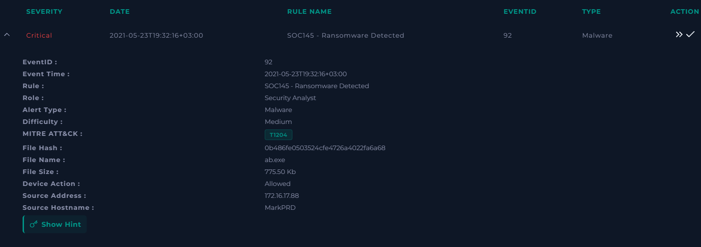
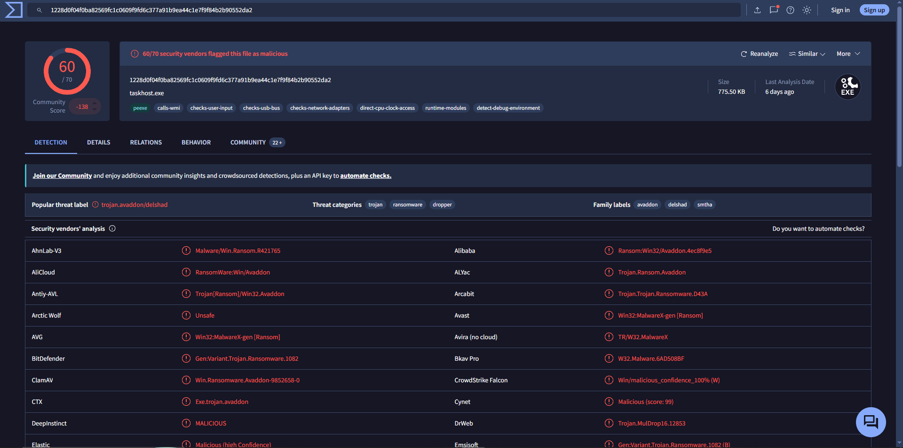
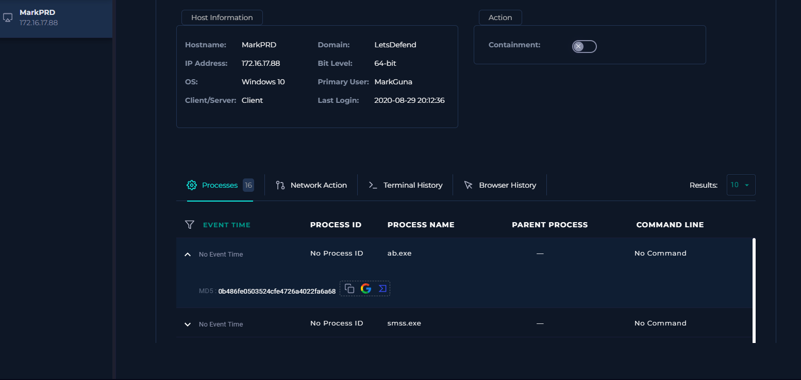
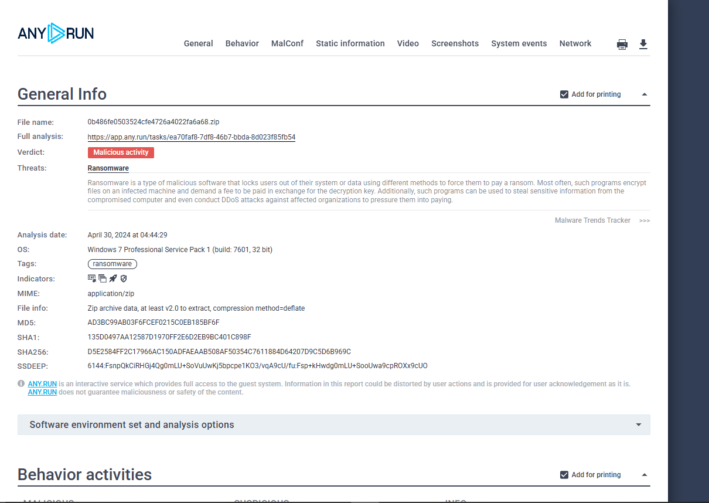
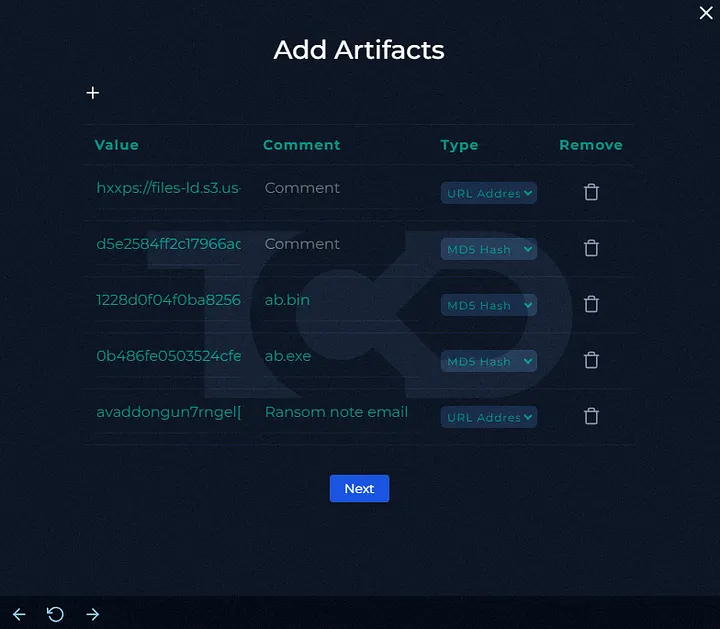
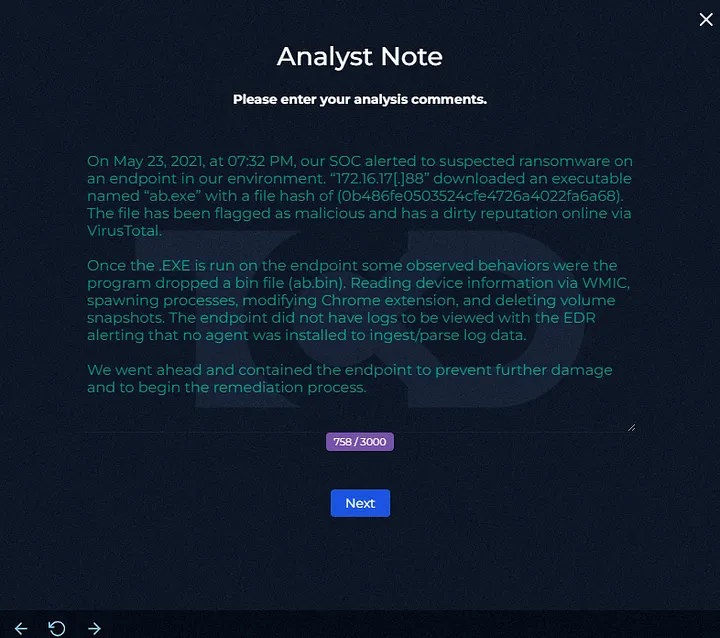

# SOC-017 — Ransomware Detected on MarkPRD — True Positive

## Executive Summary

A **critical-severity ransomware alert** was generated for `ab.exe` on workstation `MarkPRD` (`172.16.17.88`).

The file was **Allowed**, and available evidence showed that it was not quarantined before execution. Threat-intelligence and sandbox analysis strongly supported a ransomware classification:

- VirusTotal showed **60/70** security vendors detecting the sample as malicious/ransomware.
- Vendor labels included **Avaddon**, **DelShad**, and ransomware/trojan classifications.
- ANY.RUN returned a **Malicious activity — Ransomware** verdict.
- The endpoint process view showed `ab.exe` present on the affected host.
- The investigation notes identified ransomware-related behaviors including:
  - creation of `ab.bin`;
  - process spawning;
  - Chrome-extension modification;
  - deletion of volume snapshots.

No usable network telemetry was available to establish command-and-control or exfiltration activity. The lack of network logs does **not** reduce the ransomware verdict because the host-based evidence independently establishes malicious execution.

**Final Verdict: True Positive — Ransomware Execution Confirmed**  
**Confidence: High**

---

## Case Information

| Field | Value |
|---|---|
| Case ID | `SOC-017` |
| Event ID | `92` |
| Event Time | `2021-05-23 19:32:16 +03:00` |
| Rule | `SOC145 - Ransomware Detected` |
| Alert Type | Malware |
| Severity | **Critical** |
| Difficulty | Medium |
| Alert-provided MITRE ATT&CK | `T1204` |
| File Name | `ab.exe` |
| MD5 | `0b486fe0503524cfe4726a4022fa6a68` |
| File Size | `775.50 KB` |
| Device Action | Allowed |
| Source IP | `172.16.17.88` |
| Source Host | `MarkPRD` |
| Primary User | `MarkGuna` |
| Final Verdict | **True Positive** |
| Confidence | **High** |

---

## Alert Evidence

The alert identified a ransomware event involving `ab.exe` on `MarkPRD`.



### Initial Hypothesis

Because the alert was critical and the file action was `Allowed`, the immediate working hypothesis was:

> A ransomware payload may have successfully executed on the endpoint and could be affecting local recovery options, browser data, or other system resources.

The investigation therefore prioritized:

1. malware reputation;
2. host execution evidence;
3. ransomware behavior;
4. recovery-impacting actions;
5. endpoint containment;
6. artifact collection.

---

# 1. Malware Reputation Analysis

VirusTotal showed:

```text
60 / 70
```

security vendors flagging the file as malicious.



Observed classifications included:

- ransomware;
- trojan;
- dropper;
- Avaddon-associated labels;
- DelShad-associated labels.

### Analyst Assessment

The detection ratio is strong supporting evidence, but the ransomware verdict is not based on reputation alone.

The decisive question is whether runtime evidence is consistent with ransomware behavior.

---

# 2. Endpoint Execution Evidence

The endpoint view showed `ab.exe` present among processes on `MarkPRD`.



### Host Information

```text
Hostname: MarkPRD
IP: 172.16.17.88
OS: Windows 10
Architecture: 64-bit
Primary User: MarkGuna
```

The endpoint was not initially contained.

### Analyst Assessment

The presence of `ab.exe` on the affected endpoint, combined with the `Allowed` device action and ransomware telemetry, supports successful execution rather than a blocked detection.

---

# 3. Dynamic Sandbox Analysis

ANY.RUN classified the submitted sample as:

```text
Malicious activity
Threat: Ransomware
```



The sandbox verdict independently supports the ransomware classification.

### Important Precision

Automated sandbox labels are supporting evidence. They should be corroborated with actual behavioral artifacts where possible.

In this case, additional notes identified ransomware-relevant actions such as:

- creation of `ab.bin`;
- child/process spawning;
- modification of Chrome-extension state;
- deletion of volume snapshots.

---

# 4. Ransomware Behavior Analysis

## Volume Shadow Copy / Snapshot Deletion

The investigation notes state that the malware deleted volume snapshots.

This is a high-value ransomware behavior because deleting recovery snapshots can inhibit system recovery after file encryption.

### ATT&CK Mapping

```text
T1490 — Inhibit System Recovery
```

This is stronger than the generic alert-provided `T1204` mapping because it reflects ransomware-specific behavior.

---

## Dropped / Related Artifact

The investigation recorded:

```text
ab.bin
```

with an associated MD5 value added to the case artifact set.

The presence of a secondary artifact supports a multi-stage or supporting-file workflow.

---

## Browser Modification

The analyst note states that Chrome-extension state was modified.

This behavior may indicate an attempt to interfere with browser configuration or data, but the exact security impact cannot be determined from the supplied screenshots alone.

Therefore, it is documented as observed suspicious behavior without assigning an unsupported ATT&CK technique.

---

# 5. Network / C2 Assessment

The playbook required checking whether the malware's associated network infrastructure was accessed.

However:

> **No relevant network logs were available.**

The endpoint also lacked sufficient EDR telemetry for deeper network correlation.

### Analyst Decision

The correct conclusion is:

```text
C2 access: Not confirmed
```

not:

```text
C2 not accessed
```

and not:

```text
C2 accessed
```

There is insufficient evidence either way.

### Why This Matters

A ransomware true-positive verdict does not require proof of command-and-control if host behavior already confirms malicious execution.

---

# 6. Artifact Collection

The investigation added multiple artifacts, including:

- ransomware-associated hash values;
- `ab.exe`;
- `ab.bin`;
- a suspected URL/infrastructure indicator;
- ransom-note email/infrastructure.



### Artifact Handling Note

Indicators extracted from sandbox reports or malware relations should be distinguished from indicators directly observed in enterprise telemetry.

The report therefore treats them as:

- **confirmed file artifacts** when directly associated with the sample;
- **enrichment indicators** when they were not independently observed in logs.

---

# 7. Analyst Note

The investigation summary captured the core reasoning:

- ransomware alert fired;
- `ab.exe` was downloaded and executed;
- sample was strongly malicious by VirusTotal;
- additional behaviors included `ab.bin`, Chrome modification, process spawning, and volume-snapshot deletion;
- endpoint telemetry was limited;
- containment was initiated to prevent further damage.



---

# 8. Analyst Decision Points

## Was the file malicious?

**Yes — high confidence.**

60/70 detections plus a ransomware sandbox verdict provide strong corroboration.

## Did the ransomware execute?

**Yes.**

The file action was `Allowed`, the process appeared on the host, and runtime ransomware behaviors were recorded.

## Was C2 communication confirmed?

**No.**

The available logs were insufficient.

## Does missing network telemetry invalidate the ransomware verdict?

**No.**

The host-based behavioral evidence independently supports malicious execution.

## Was containment justified?

**Yes — immediately.**

Ransomware execution with recovery-inhibition behavior is sufficient to justify emergency endpoint isolation.

---

# 9. MITRE ATT&CK Assessment

## Alert-Provided Mapping

```text
T1204 — User Execution
```

This may describe the delivery/execution context, but it is not the strongest behavior visible in this case.

## Analyst-Confirmed Mapping

| Technique | Name | Evidence |
|---|---|---|
| `T1490` | Inhibit System Recovery | Volume snapshots reportedly deleted |
| `T1204` | User Execution | Preserved as alert context; exact malicious user-execution chain is not independently shown |

### Conservative Mapping

No C2 or exfiltration technique is mapped because network communication was not confirmed.

---

# 10. Scope Assessment

## Confirmed Affected Host

```text
MarkPRD
172.16.17.88
```

## Confirmed Malicious File

```text
ab.exe
MD5: 0b486fe0503524cfe4726a4022fa6a68
```

## Additional Artifact

```text
ab.bin
```

## Not Confirmed

The supplied evidence does not establish:

- additional infected endpoints;
- lateral movement;
- confirmed C2;
- confirmed exfiltration;
- full encryption scope;
- credential compromise.

---

# 11. Final Verdict

## Classification

**True Positive**

## Severity

**Critical**

## Confidence

**High**

## Rationale

The investigation confirmed a malicious ransomware execution through multiple independent evidence sources:

- critical ransomware alert;
- allowed execution;
- 60/70 VirusTotal detections;
- ANY.RUN ransomware verdict;
- endpoint presence of `ab.exe`;
- ransomware-specific behavior including volume-snapshot deletion.

The absence of network logs affects only the C2 assessment, not the ransomware classification.

---

# 12. Recommended Incident Response

In a production environment, the immediate response should include:

1. isolate `MarkPRD`;
2. prevent further network access;
3. preserve volatile evidence if feasible;
4. collect hashes and copies of `ab.exe` and `ab.bin`;
5. identify encrypted or modified files;
6. verify Volume Shadow Copy status;
7. review scheduled tasks, services, Run keys, and other persistence;
8. hunt enterprise-wide for the ransomware hashes;
9. search for the same filenames and execution paths;
10. review SMB and authentication telemetry for lateral movement;
11. investigate remote-management activity;
12. check backups and recovery integrity;
13. reset exposed credentials if credential access is suspected;
14. reimage the system if trusted remediation cannot be established.

---

# 13. Detection Engineering Opportunities

## Ransomware Recovery Inhibition

Detect:

```text
vssadmin
wmic shadowcopy
wbadmin
powershell shadow copy deletion
```

when launched from unusual processes or shortly after unknown executable execution.

## Suspicious Binary + Snapshot Deletion

High-confidence correlation:

```text
new/rare executable
        +
process execution
        +
volume shadow copy deletion
```

## Mass File Modification

Ransomware detections should also look for:

- high-rate file writes;
- file-extension changes;
- ransom-note creation;
- entropy increases;
- repeated rename operations.

## Behavioral Detection Over Hash Detection

Hash blocking is useful, but ransomware variants change frequently.

Behavior-based detection should prioritize:

```text
recovery inhibition
+
mass file modification
+
ransom note
+
process ancestry
+
network anomalies
```

---

# 14. Lessons Learned

1. A ransomware verdict can be established without C2 telemetry when host behavior is conclusive.
2. Missing logs should be documented as a telemetry limitation, not converted into a negative finding.
3. Volume-snapshot deletion is a high-value ransomware indicator.
4. VirusTotal and sandbox verdicts are strongest when corroborated with endpoint behavior.
5. Critical ransomware alerts should trigger immediate containment when execution is confirmed.
6. ATT&CK mapping should focus on observed ransomware behavior, not just alert metadata.

---

# 15. Skills Demonstrated

- Ransomware triage
- Malware reputation analysis
- Dynamic sandbox analysis
- Endpoint process review
- Artifact handling
- Ransomware behavior identification
- Recovery-inhibition analysis
- ATT&CK mapping
- Telemetry-gap reasoning
- Critical incident containment
- Evidence-based verdicting
- Detection engineering

---

# Evidence Index

| Image | Description |
|---|---|
| `01-alert-details.png` | Critical ransomware alert |
| `02-virustotal-ransomware-detection.png` | 60/70 ransomware detection |
| `03-endpoint-processes.png` | `ab.exe` on MarkPRD |
| `04-anyrun-ransomware-verdict.png` | ANY.RUN malicious/ransomware verdict |
| `05-artifacts-added.png` | Collected incident artifacts |
| `06-analyst-note.png` | Investigation reasoning and response |

---

# Training Context

This investigation was completed in an authorized SOC training environment.

The report is designed to demonstrate ransomware investigation, evidence correlation, containment reasoning, and detection opportunities rather than reproduce challenge answers.


---

## Expanded ANY.RUN Behavioral Analysis

A deeper review of the public ANY.RUN report materially strengthens this investigation.

The sandbox classified the submission as **Malicious activity — Ransomware** and recorded multiple ransomware-specific behaviors. The sample's runtime activity included:

- dropping an executable immediately after start;
- modifying UAC/LUA settings;
- deleting shadow copies;
- using `BCDEDIT.EXE` to modify recovery options;
- renaming files in a ransomware-like manner;
- using WMI;
- creating files resembling ransomware instructions;
- using Task Scheduler;
- writing files into the system-drive root;
- creating files/folders in the user directory;
- interacting with SMB-related functionality;
- dropping an object that may contain Tor URLs.

The behavior graph also showed the ransomware invoking Windows utilities including:

```text
wmic.exe
wbadmin.exe
vssadmin.exe
bcdedit.exe
vssvc.exe
```

### Recovery Inhibition Commands

ANY.RUN recorded commands including:

```text
wmic SHADOWCOPY DELETE /nointeractive
```

and:

```text
wbadmin DELETE SYSTEMSTATEBACKUP -keepVersions:0
```

These provide direct behavioral support for:

```text
T1490 — Inhibit System Recovery
```

rather than relying only on a generic sandbox tag.

### WMI Activity

Multiple `WMIC.exe` processes were observed during the sandbox run.

This supports:

```text
T1047 — Windows Management Instrumentation
```

because WMI was actively used as part of the ransomware execution chain.

### Ransomware File Behavior

ANY.RUN explicitly identified that `ab.exe`:

- renamed files in a ransomware-like manner; and
- created files resembling ransomware instructions.

This is consistent with impact behavior expected from ransomware and substantially strengthens the true-positive classification.

### Archive Artifact

The analyzed ZIP contained:

```text
ab.bin
```

The report identifies this as the file inside the archive submitted to the sandbox.

### Process Scale

ANY.RUN recorded:

```text
Total processes:      94
Monitored processes:  30
Malicious processes:   1
```

This demonstrates why process-tree reconstruction is important: ransomware may invoke numerous legitimate Windows binaries while the primary malicious process remains `ab.exe`.

### Network Findings

The sandbox recorded:

```text
HTTP(S) requests:      0
TCP/UDP connections:  16
DNS requests:          0
Network threats:       0
```

The visible connections were primarily local/private Windows networking activity such as NetBIOS/SMB.

Therefore, even after reviewing the full sandbox report:

> **No external C2 infrastructure is confirmed by this sandbox run.**

This supports the original SOC conclusion that C2 should remain **Not Confirmed**, rather than attempting to infer a C2 address from unrelated enrichment.

### Updated ATT&CK Assessment

| Technique | Name | Evidence |
|---|---|---|
| `T1490` | Inhibit System Recovery | `WMIC SHADOWCOPY DELETE`, backup deletion, BCDEdit recovery changes |
| `T1047` | Windows Management Instrumentation | Multiple `WMIC.exe` executions |
| `T1053.005` | Scheduled Task/Job: Scheduled Task | ANY.RUN reports execution via Task Scheduler |
| `T1204` | User Execution | Manual execution observed in sandbox; alert also supplied this mapping |

No C2 or exfiltration technique is asserted because the sandbox did not identify external malicious network communication.

### Why the Expanded Sandbox Review Matters

The case is now supported by **behavioral ransomware evidence**, not simply:

```text
alert + VirusTotal + sandbox verdict
```

The evidence chain is stronger:

```text
Critical SOC ransomware alert
        ↓
Allowed execution of ab.exe
        ↓
Endpoint process evidence
        ↓
60/70 VirusTotal detections
        ↓
ANY.RUN ransomware verdict
        ↓
Shadow-copy deletion
        ↓
System-state backup deletion
        ↓
BCDEdit recovery modification
        ↓
Ransomware-style file renaming
        ↓
Ransomware instruction-file creation
        ↓
Immediate containment justified
```

This converts SOC-017 from a basic ransomware triage case into a substantially stronger behavioral investigation.
