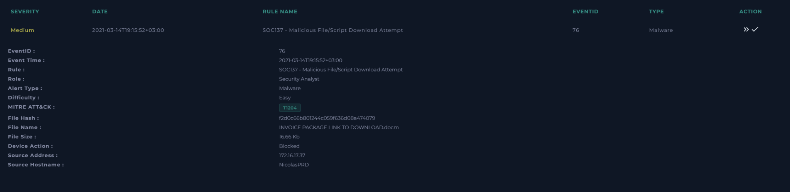
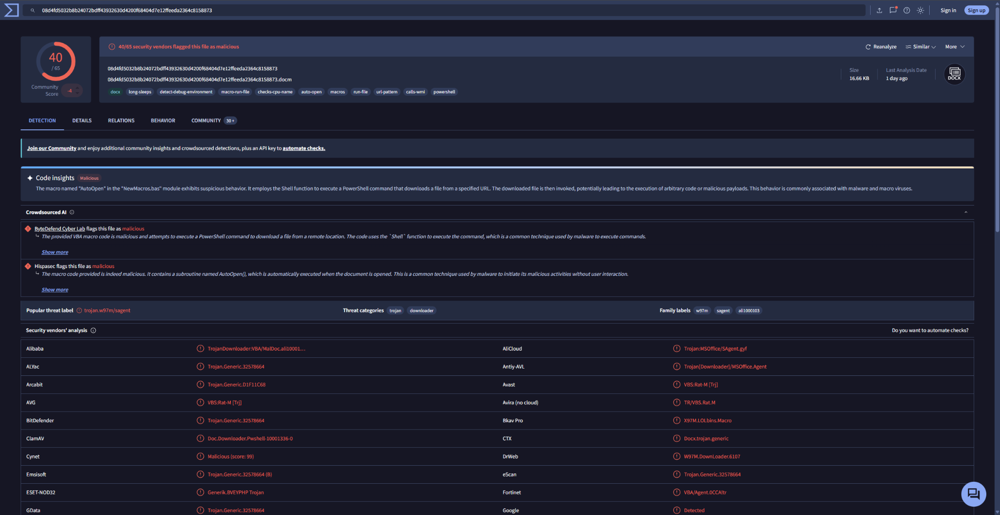
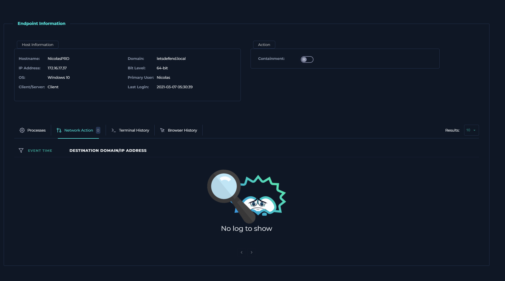
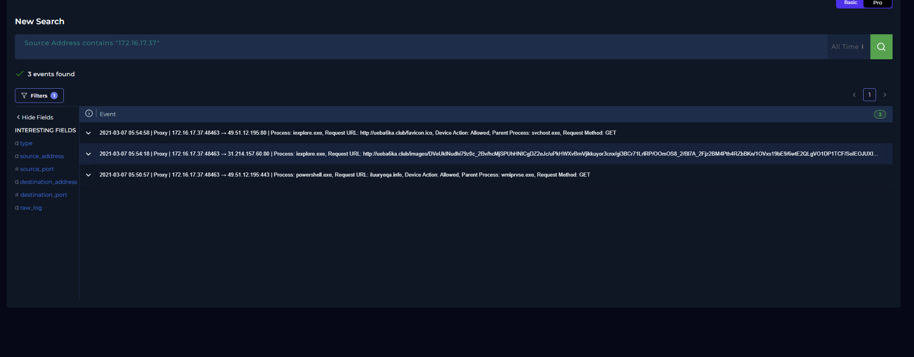

# SOC-019 — Malicious Macro Document Download Attempt Blocked

## Executive Summary

A medium-severity malware alert triggered on `NicolasPRD` (`172.16.17.37`) for the macro-enabled document:

```text
INVOICE PACKAGE LINK TO DOWNLOAD.docm
```

The alert reported:

```text
Device Action: Blocked
MD5: f2d0c66b801244c059f636d08a474079
```

VirusTotal enrichment identified the document as malicious, with approximately **40/65 security vendors** flagging the sample. VirusTotal behavioral/code-analysis context indicated that the document contained an auto-executing macro capable of invoking PowerShell to retrieve a remote payload.

However, the endpoint/network evidence supplied for this case did **not** show event-time C2 or payload-download activity associated with the alert. The EDR network view contained no entries, and the log-management records visible for the same host were from **2021-03-07**, one week before the **2021-03-14** alert. Those older connections are therefore treated as historical host context rather than direct evidence for this event.

**Final Verdict: True Positive — Malicious document blocked before confirmed execution**

**Confidence: High**

---

## Case Information

| Field | Value |
|---|---|
| Case ID | SOC-019 |
| Event ID | 76 |
| Event Time | 2021-03-14T19:15:52+03:00 |
| Rule | SOC137 - Malicious File/Script Download Attempt |
| Alert Type | Malware |
| Severity | Medium |
| Difficulty | Easy |
| Alert MITRE ATT&CK | T1204 |
| File Name | `INVOICE PACKAGE LINK TO DOWNLOAD.docm` |
| File Size | 16.66 KB |
| Alert File Hash | `f2d0c66b801244c059f636d08a474079` |
| Alert Hash Type | MD5 |
| Device Action | Blocked |
| Source IP | 172.16.17.37 |
| Source Hostname | NicolasPRD |
| Verdict | True Positive |
| Confidence | High |

---

## Alert Evidence



The alert identifies a suspicious macro-enabled Word document on `NicolasPRD`.

Key facts:

```text
File:        INVOICE PACKAGE LINK TO DOWNLOAD.docm
MD5:         f2d0c66b801244c059f636d08a474079
Device:      NicolasPRD
Source IP:   172.16.17.37
Action:      Blocked
```

### Analyst Decision Point

`Blocked` is direct alert telemetry.

The defensible conclusion is:

> The security control blocked the malicious file/script download attempt.

It does **not** automatically prove that the file had already executed or that the host established C2 communication.

---

## Malware Enrichment



VirusTotal showed the sample as malicious, with approximately:

```text
40 / 65 vendors
```

flagging the file.

The VirusTotal page also showed behavior/code-analysis indicators associated with:

- macros
- auto-open behavior
- PowerShell
- remote file download behavior
- downloader/trojan classifications

This strongly supports the alert being a genuine malicious-document detection.

---

## Hash Discrepancy and Artifact Handling

The alert reports:

```text
MD5
f2d0c66b801244c059f636d08a474079
```

The VirusTotal screenshot shows a different, much longer hash:

```text
08d4fd5032b8b24072bdff43932630d4200f68404d7e12ffeeda2364c8158873
```

That second value is **64 hexadecimal characters**, so it is consistent with a **SHA-256** hash, not an MD5 hash.

Therefore the case should document them separately:

| Hash Type | Value |
|---|---|
| MD5 | `f2d0c66b801244c059f636d08a474079` |
| SHA-256 | `08d4fd5032b8b24072bdff43932630d4200f68404d7e12ffeeda2364c8158873` |

### Portfolio Correction

Do **not** label the 64-character SHA-256 value as MD5.

---

## Endpoint Network Review



The EDR network-action view for `NicolasPRD` showed:

```text
0 network events
```

No event-time destination domain or IP was available in the supplied endpoint network telemetry.

### Analyst Conclusion

There is **no confirmed C2 communication from the endpoint for Event ID 76** based on the evidence provided.

---

## Log Management Review



Log Management contained three events associated with `172.16.17.37`, including activity involving:

- `iexplore.exe`
- `powershell.exe`
- external HTTP/HTTPS destinations

However, these events were dated:

```text
2021-03-07
```

while the malware alert occurred:

```text
2021-03-14
```

The events are separated by approximately one week.

### Evidence Classification

```text
Direct evidence for SOC-019:
→ 2021-03-14 malicious DOCM alert
→ Device Action: Blocked
→ VirusTotal malicious classification

Historical host context:
→ 2021-03-07 PowerShell / browser network activity
```

The older events should **not** be used to claim that this specific document contacted C2 infrastructure.

---

## Initial Hypothesis

The alert indicated a macro-enabled document associated with malicious file/script download behavior.

The investigation therefore tested:

1. Is the document malicious?
2. Was it blocked?
3. Did it execute?
4. Did the endpoint access any C2 or download infrastructure?
5. Is additional containment required?

---

## Findings

### 1. Is the document malicious?

**Yes.**

VirusTotal showed broad malicious consensus and downloader/macro behavior.

### 2. Was the file blocked?

**Yes.**

The alert explicitly reports:

```text
Device Action: Blocked
```

### 3. Was execution confirmed?

**No.**

The supplied evidence does not show:

- document process execution;
- Word spawning PowerShell;
- child-process creation;
- payload execution.

### 4. Was C2 accessed?

**Not confirmed.**

No relevant event-time endpoint network log was available.

### 5. What about the PowerShell activity in Log Management?

It occurred on **2021-03-07**, not on the **2021-03-14** alert date, so it is historical context only.

---

## MITRE ATT&CK Assessment

### Alert-Provided Technique

```text
T1204 — User Execution
```

### Analyst-Confirmed Techniques

**None confirmed from endpoint telemetry.**

The evidence proves that a malicious macro document was detected and blocked, but does not independently prove user execution.

### Malware Capability Context

VirusTotal behavior/code-analysis suggests capabilities consistent with:

```text
T1059.001 — PowerShell
T1105 — Ingress Tool Transfer
```

These should be described as **sample behavior/capability**, not as confirmed activity on `NicolasPRD`.

This distinction is important:

```text
Sandbox capability
≠ endpoint-confirmed technique
```

---

## Timeline

| Time | Event |
|---|---|
| 2021-03-07 05:50–05:54 | Historical PowerShell/browser network activity on `172.16.17.37` |
| 2021-03-14 19:15:52+03:00 | SOC137 alert triggered for malicious DOCM |
| Investigation | Alert action confirmed as Blocked |
| Investigation | VirusTotal identified document as malicious |
| Investigation | EDR network view showed no event-time network records |
| Final | True Positive — blocked malicious document |

---

## Scope

Evidence supports:

```text
Affected host: NicolasPRD
Affected IP:   172.16.17.37
Malicious file: INVOICE PACKAGE LINK TO DOWNLOAD.docm
```

No evidence supplied confirms:

- payload execution
- C2 communication
- persistence
- lateral movement
- credential theft
- data exfiltration

---

## Artifacts

| Type | Value | Context |
|---|---|---|
| MD5 | `f2d0c66b801244c059f636d08a474079` | Alert file hash |
| SHA-256 | `08d4fd5032b8b24072bdff43932630d4200f68404d7e12ffeeda2364c8158873` | VirusTotal sample hash |
| Host | `NicolasPRD` | Affected endpoint |
| IP | `172.16.17.37` | Source endpoint |

### Artifact Note

`NicolasPRD` is a hostname, not an IP address. It should be stored as a host/device artifact rather than an IP-type artifact.

---

## Verdict

# True Positive

The detection is a **True Positive** because:

- the file is a macro-enabled Word document;
- VirusTotal shows strong malicious consensus;
- observed sample behavior is consistent with downloader activity;
- the endpoint security control blocked the file.

The evidence does **not** support claiming successful execution or successful C2 access.

### Final Classification

```text
True Positive
Malicious document detected
Download attempt blocked
No confirmed endpoint execution
No confirmed event-time C2 communication
```

---

## Response Assessment

Because the malicious content was blocked and no execution/C2 evidence was confirmed, the response priority is validation rather than assuming compromise.

Recommended actions:

1. confirm the file is no longer present;
2. review Word/Office process telemetry around alert time;
3. search for `powershell.exe`, `cmd.exe`, `wscript.exe`, and suspicious child processes;
4. search proxy/firewall telemetry around 2021-03-14;
5. hunt the MD5 and SHA-256 across the environment;
6. verify whether any other users received the same document;
7. inspect email telemetry if the document arrived by email.

---

## Detection Engineering Opportunities

A stronger correlation rule could combine:

```text
macro-enabled Office document
+
malicious hash / reputation
+
Office child process
+
PowerShell or script execution
+
external download
```

Higher confidence escalation should occur if telemetry shows:

```text
WINWORD.EXE
    ↓
powershell.exe
    ↓
external URL
    ↓
downloaded executable
```

### Useful Detection Logic

Look for:

- Office spawning PowerShell;
- encoded PowerShell commands;
- Office spawning script engines;
- PowerShell downloading remote content;
- macro document followed by new executable creation.

---

## Analyst Decision Points

### Was the malware quarantined/cleaned?

The direct evidence says **Blocked**. That supports prevention of the attempt, but not necessarily a quarantine action.

### Is VirusTotal enough for True Positive?

Not by itself. Here, VirusTotal supports the malicious nature of the document while the alert provides direct evidence that the security control blocked it.

### Was C2 accessed?

**No confirmed event-time C2 access.**

### Can the March 7 logs be attributed to the March 14 alert?

**No.**

They are historical context and should remain separate.

### Is T1204 confirmed?

**No.**

User execution was not independently demonstrated.

---

## Skills Demonstrated

- Malware alert triage
- Macro-document analysis
- VirusTotal enrichment
- Hash-type validation
- Endpoint telemetry review
- Event-time correlation
- C2 validation methodology
- Evidence vs historical-context separation
- MITRE ATT&CK validation
- False-assumption avoidance
- Detection-engineering recommendations

---

## Lessons Learned

### `Blocked` does not equal `Executed`

A blocked malicious file can still be a True Positive without endpoint compromise.

### Sandbox behavior does not equal endpoint behavior

VirusTotal can show what the sample is capable of, but endpoint evidence is required to prove that behavior occurred on the affected host.

### Time correlation matters

A suspicious PowerShell event one week earlier cannot automatically be attributed to the current malware alert.

### Hash types must be validated

```text
32 hex characters → MD5
64 hex characters → SHA-256
```

### ATT&CK mappings should be evidence-driven

Alert metadata should not automatically become analyst-confirmed technique mapping.

---

## Training Context

This investigation was completed in an authorized LetsDefend SOC training environment. The report focuses on evidence-based analyst reasoning rather than reproducing challenge answers.
