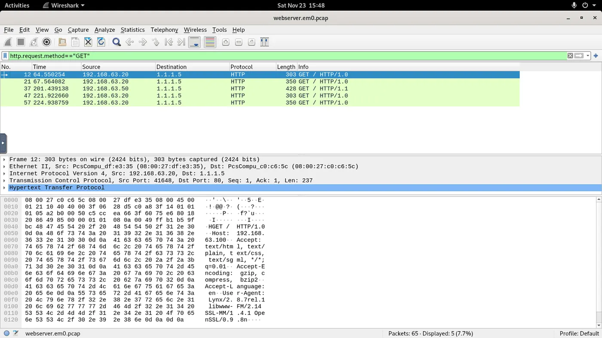
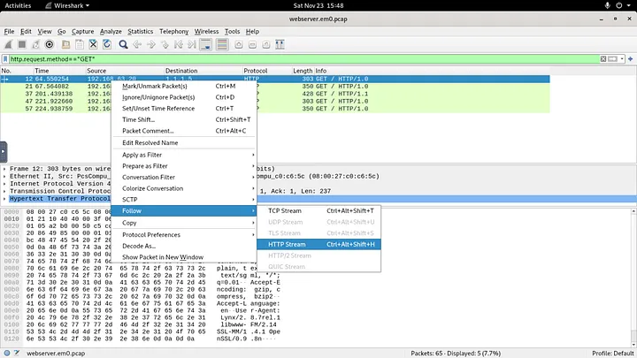
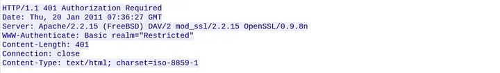
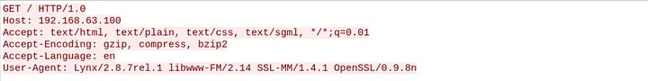
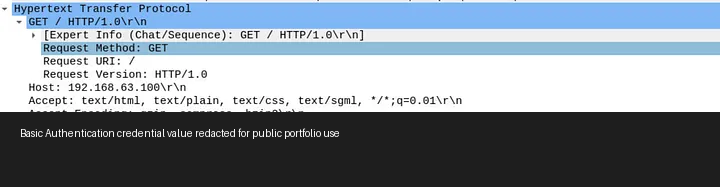

# PCAP-001 — HTTP Basic Authentication Exposure in Packet Capture

## Executive Summary

A packet-capture investigation was performed in Wireshark to identify HTTP activity and recover protocol, server, client, and authentication details from a provided `.pcap` file.

The capture contained **5 HTTP GET requests**. Analysis of an HTTP stream identified a **FreeBSD** web server running **Apache/2.2.15** with **OpenSSL/0.9.8n**. The client identified itself as **Lynx/2.8.7rel.1** with associated libraries.

The session used **HTTP Basic Authentication**. Because Basic Auth places a Base64-encoded `username:password` value in the `Authorization` header, the credential could be recovered directly from the packet capture when transported over unencrypted HTTP.

For public portfolio publication, the password is intentionally **redacted**.

> **Security finding:** Base64 is encoding, not encryption. HTTP Basic Authentication over plaintext HTTP can expose credentials to anyone with packet visibility.

---

## Case Information

| Field | Value |
|---|---|
| Portfolio ID | PCAP-001 |
| Analysis Type | Network / PCAP Analysis |
| Tool | Wireshark |
| Protocol | HTTP |
| HTTP GET Requests | **5** |
| Server OS | **FreeBSD** |
| Web Server | **Apache/2.2.15** |
| OpenSSL Version | **OpenSSL/0.9.8n** |
| Client User-Agent | **Lynx/2.8.7rel.1 libwww-FM/2.14 SSL-MM/1.4.1 OpenSSL/0.9.8n** |
| Authentication | HTTP Basic Authentication |
| Username Observed | `webadmin` |
| Password | **[REDACTED]** |
| Security Issue | Credentials recoverable from plaintext HTTP |

---

## 1. Investigation Objective

The objective was to determine:

1. how many HTTP GET requests were present,
2. the server operating system,
3. the web-server software and version,
4. the OpenSSL version,
5. the client User-Agent,
6. whether authentication information was exposed,
7. the associated security risk.

---

## 2. HTTP GET Request Enumeration

Wireshark display filter:

```text
http.request.method == "GET"
```

Result:

```text
5 HTTP GET requests
```



Using Wireshark's parsed HTTP request field provides a precise way to isolate actual GET requests rather than relying on broad string matching.

---

## 3. HTTP Stream Reconstruction

The HTTP conversation was reconstructed using:

```text
Follow → HTTP Stream
```



Following the HTTP stream allowed both request and response headers to be analyzed in context.

---

## 4. Server Fingerprinting

The server response contained:

```text
HTTP/1.1 401 Authorization Required
Server: Apache/2.2.15 (FreeBSD) DAV/2 mod_ssl/2.2.15 OpenSSL/0.9.8n
```



### Findings

| Property | Value |
|---|---|
| Operating System | `FreeBSD` |
| Web Server | `Apache/2.2.15` |
| OpenSSL | `OpenSSL/0.9.8n` |

The HTTP `Server` header disclosed detailed platform and software-version information that could assist technology fingerprinting.

---

## 5. Client Fingerprinting

The client request exposed the following User-Agent:

```text
Lynx/2.8.7rel.1 libwww-FM/2.14 SSL-MM/1.4.1 OpenSSL/0.9.8n
```



User-Agent strings are useful contextual evidence but should not be treated as absolute proof because they can be modified or spoofed.

---

## 6. HTTP Basic Authentication Analysis

The server challenged the client with:

```text
401 Authorization Required
WWW-Authenticate: Basic realm="Restricted"
```

The client then supplied an HTTP header of the form:

```text
Authorization: Basic <base64-value>
```

Decoding a Basic Authentication value produces:

```text
username:password
```

The username identified in the challenge was:

```text
webadmin
```

The password has been intentionally omitted from this public report.



---

## 7. Why Basic Authentication Is Risky Over HTTP

Basic Authentication does not encrypt the credential:

```text
username:password
        ↓
Base64 encoding
        ↓
Authorization: Basic <encoded-value>
```

### Key distinction

```text
Base64 ≠ encryption
```

If the request is sent using plaintext HTTP, an observer with packet visibility may decode the credential.

Potential exposure points include:

- packet sniffing,
- man-in-the-middle interception,
- compromised network devices,
- stored packet captures,
- unauthorized network monitoring.

Basic Authentication should therefore be protected by **HTTPS/TLS**.

---

## 8. Evidence vs Inference

### Direct Evidence

- 5 HTTP GET requests were present
- HTTP request/response data was visible
- server response disclosed FreeBSD
- server disclosed Apache/2.2.15
- server disclosed OpenSSL/0.9.8n
- client User-Agent disclosed Lynx and library versions
- HTTP Basic Authentication was used
- an Authorization header was visible in the capture
- the Basic Auth username could be recovered

### Security Inference

Because the authentication exchange occurred over visible HTTP traffic, an observer with access to the packet capture could recover the credential pair.

### Not Established

The capture does not prove:

- an attacker stole the credential,
- the account was compromised,
- the account was abused,
- malware was installed,
- persistence was established,
- lateral movement occurred.

---

## 9. Analyst Decision Points

- **HTTP GET requests?** 5
- **Server OS?** FreeBSD
- **Web server?** Apache/2.2.15
- **OpenSSL?** OpenSSL/0.9.8n
- **Client?** Lynx/2.8.7rel.1 with associated libraries
- **Authentication visible?** Yes
- **Credential encrypted?** No; Base64 encoded
- **Primary security concern?** Credential exposure over plaintext HTTP

---

## 10. Detection & Defensive Opportunities

### Detection Hypothesis

Alert when the following combination is observed:

```text
HTTP
+
Authorization header
+
Basic authentication
+
non-TLS transport
```

### Server Hardening

Recommended controls:

- enforce HTTPS
- redirect HTTP to HTTPS
- disable plaintext authentication
- minimize verbose server banners
- use modern TLS configuration
- rotate credentials if exposure is suspected
- monitor legacy protocol use

---

## 11. Lessons Learned

1. Wireshark display filters can isolate protocol-specific activity efficiently.
2. Following an HTTP stream helps reconstruct request/response context.
3. HTTP response headers can disclose server fingerprinting information.
4. User-Agent strings provide useful client context but can be spoofed.
5. HTTP Basic Authentication credentials are Base64 encoded, not encrypted.
6. Plaintext Basic Authentication can expose reusable credentials.
7. HTTPS protects authentication headers in transit.
8. Public portfolio reports should redact recovered passwords even when the source is a training lab.

---

## Skills Demonstrated

- Wireshark
- PCAP analysis
- HTTP filtering
- HTTP stream reconstruction
- server fingerprinting
- client fingerprinting
- HTTP Basic Authentication analysis
- Base64 credential analysis
- credential-exposure assessment
- network-security reasoning
- evidence sanitization
- professional technical documentation

---

## Training Context

This analysis was completed in an authorized **LetsDefend training environment** using a public-resource PCAP supplied by the challenge.

The challenge confirms the packet-count, server fingerprinting, client User-Agent, and Basic Authentication findings. The password recovered during the exercise has been deliberately omitted from this public portfolio report.
