# SOC-001 — Phishing URL Detected

## Executive Summary

A high-severity proxy alert, **SOC141 - Phishing URL Detected**, was investigated after host `EmilyComp` (`172.16.17.49`) accessed `mogagrocol.ru`.

Log analysis confirmed that user `ellie` accessed the URL on **2021-03-22 at 21:23:16** and that the request was **allowed**, not blocked. The observed request was:

```text
http://mogagrocol.ru/wp-content/plugins/akismet/fv/index.php?email=ellie@letsdefend.io
```

Third-party reputation analysis identified the domain as malicious/phishing. Because access was confirmed and the security control allowed the request, the affected endpoint was contained through EDR. The alert was closed as a **True Positive** with a **10/10 playbook score (100% success rate)**.

---

## Case Information

| Field | Value |
|---|---|
| Portfolio Case ID | SOC-001 |
| Platform Alert | SOC141 - Phishing URL Detected |
| Event ID | 86 |
| Alert Type | Proxy |
| Severity | High |
| Event Time | 2021-03-22T21:23:12+03:00 |
| Confirmed Access Time | 2021-03-22 21:23:16 |
| Source IP | 172.16.17.49 |
| Source Host | EmilyComp |
| User | ellie |
| Destination IP | 91.189.114.8 |
| Destination Host | mogagrocol.ru |
| Device Action | Allowed |
| Final Verdict | **True Positive** |
| Response | Endpoint contained |
| Playbook Score | 10/10 |

---

## Investigation Objective

Determine whether the alert represented a genuine malicious access, identify the affected user and endpoint, validate the destination, confirm whether the request was blocked, and take appropriate containment action.

---

## 1. Initial Alert Triage

The investigation began with a high-severity proxy alert for **SOC141 - Phishing URL Detected**.

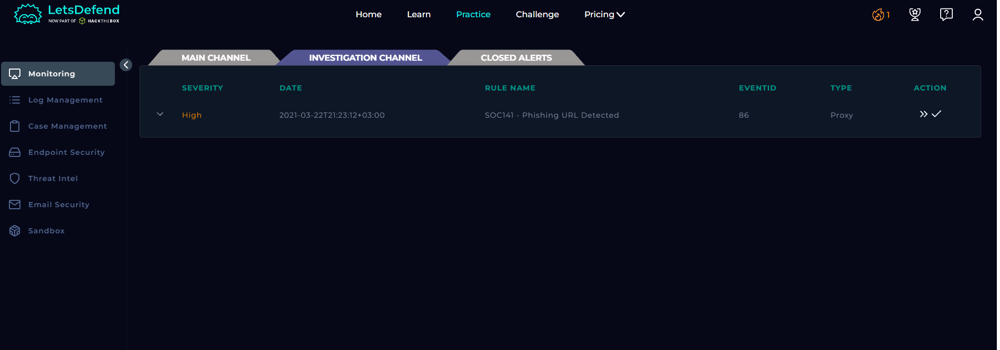

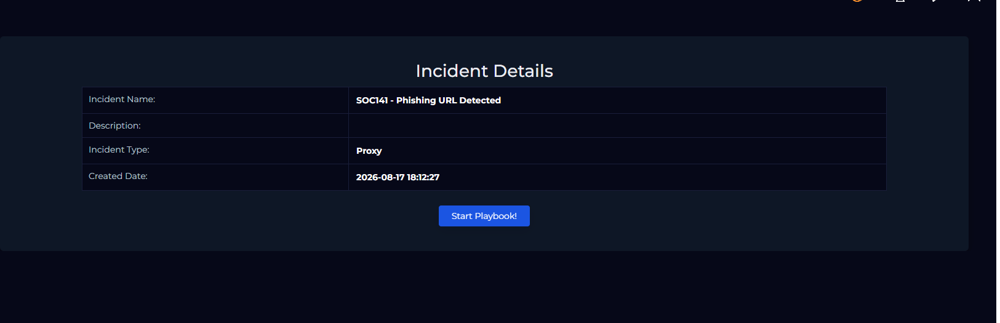

### Initial Hypothesis

An internal endpoint may have accessed a malicious phishing URL. The investigation needed to verify whether the traffic was real, whether the destination was malicious, and whether the endpoint required containment.

---

## 2. Collection Requirements

The playbook required the following evidence:

- source address
- destination address
- user-agent

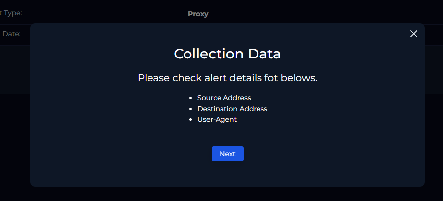

The next step was to pivot into Log Management.

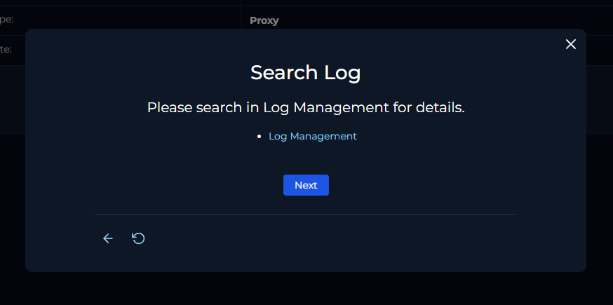

---

## 3. Proxy Log Investigation

The source address `172.16.17.49` was searched in Log Management.

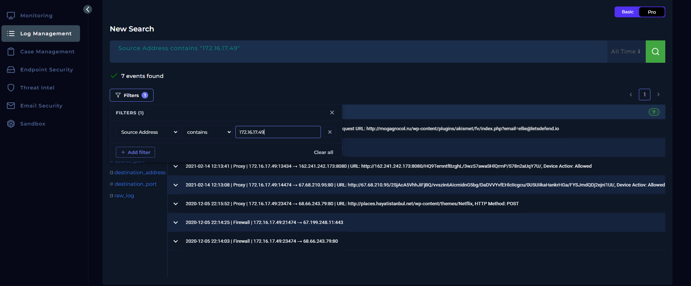

The alert correlated to:

| Field | Finding |
|---|---|
| Source IP | `172.16.17.49` |
| Hostname | `EmilyComp` |
| Username | `ellie` |
| Destination IP | `91.189.114.8` |
| Destination Host | `mogagrocol.ru` |
| Device Action | `Allowed` |

The expanded alert showed the exact request:

```text
http://mogagrocol.ru/wp-content/plugins/akismet/fv/index.php?email=ellie@letsdefend.io
```

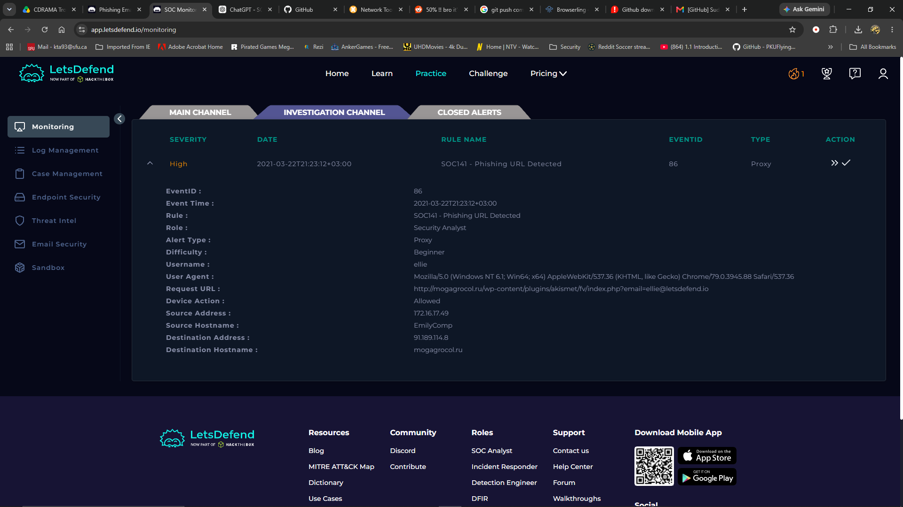

### Analyst Observation

The URL contains the user's email address as a query parameter:

```text
?email=ellie@letsdefend.io
```

A user-specific parameter can allow malicious infrastructure to associate a request with a valid target identity.

---

## 4. URL Reputation Analysis

The URL/domain was analyzed using a third-party reputation service.

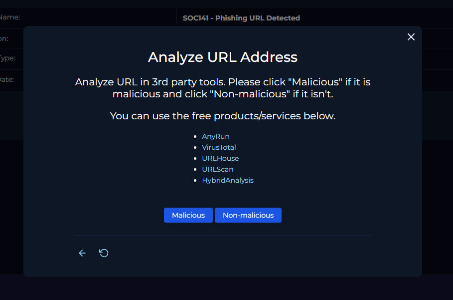

Multiple vendors classified `mogagrocol.ru` as **malicious** or **phishing**.

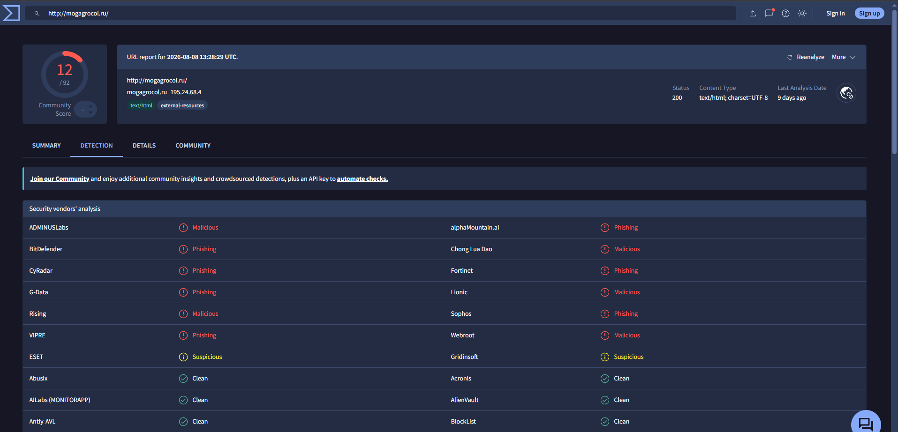

### Evidence Handling Note

The proxy event recorded destination IP `91.189.114.8`, while the later reputation screenshot displayed `195.24.68.4` for the domain.

These should not be treated as the same IOC. Domain resolution or infrastructure may change over time. For this case:

- `91.189.114.8` = destination IP supported by event telemetry.
- `195.24.68.4` = contextual IP shown by the reputation service during later analysis.

---

## 5. Access Validation

The playbook required confirmation that the malicious destination was actually accessed.

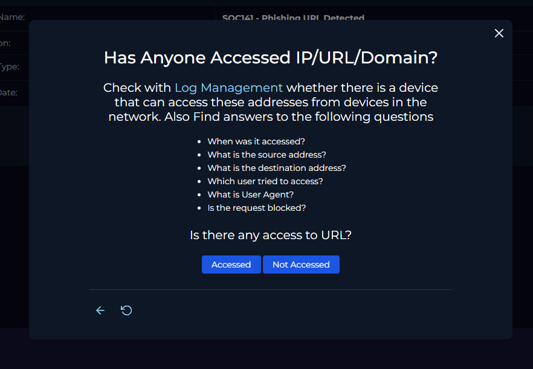

Confirmed findings:

```text
Access Time:      2021-03-22 21:23:16
Source Address:   172.16.17.49
Destination IP:   91.189.114.8
User:             ellie
Request Blocked:  No
Domain:           mogagrocol.ru
```

Observed user-agent:

```text
Mozilla/5.0 (Windows NT 6.1; Win64; x64)
AppleWebKit/537.36 (KHTML, like Gecko)
Chrome/79.0.3945.88 Safari/537.36
```

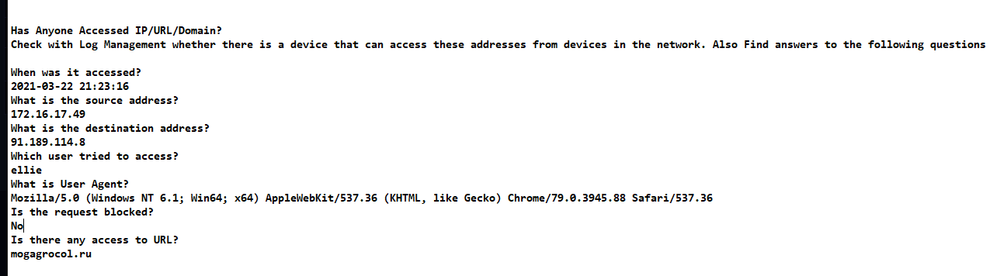

### Assessment

This was not only a reputation-triggered alert. Logs confirmed that an internal host generated traffic to the malicious destination and the request was **Allowed**.

---

## 6. Endpoint Context

| Field | Value |
|---|---|
| Hostname | EmilyComp |
| IP Address | 172.16.17.49 |
| Domain | LetsDefend |
| OS | Windows 10 |
| Architecture | 64-bit |
| Primary User | Emily |

The proxy user-agent reports `Windows NT 6.1`, while endpoint inventory reports Windows 10. This discrepancy should be preserved rather than silently reconciled; user-agent strings may be stale, altered, or generated by applications using compatibility behavior.

---

## 7. Containment

Because malicious access was confirmed and the request was not blocked, the playbook directed containment of the affected endpoint.

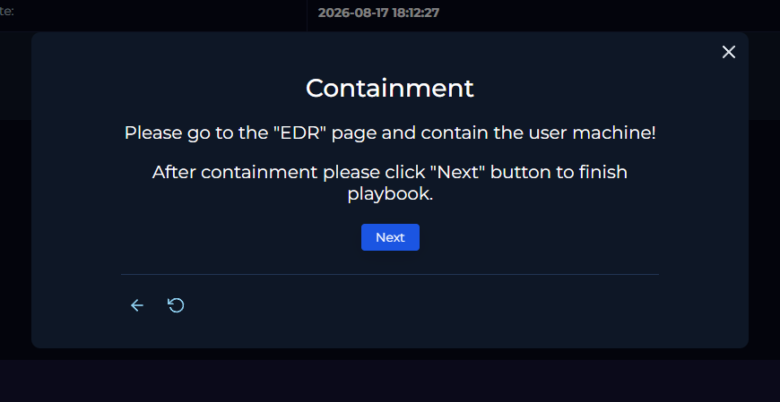

`EmilyComp` was successfully contained through EDR.

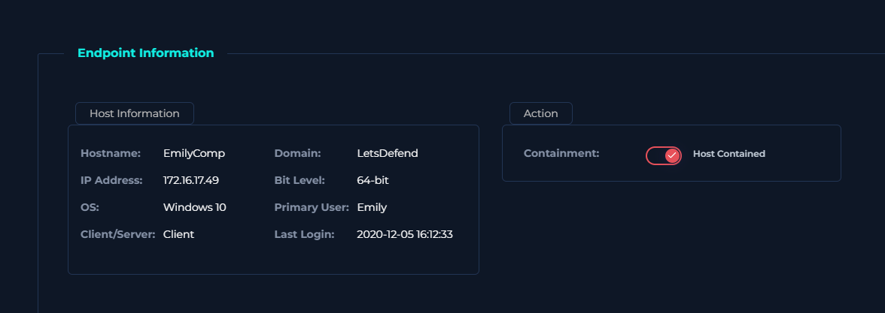

### Containment Rationale

Containment was justified because:

1. malicious infrastructure was confirmed,
2. user access was confirmed,
3. the request was allowed,
4. downstream endpoint compromise had not yet been ruled out.

---

## 8. IOC / Artifact Recording

The malicious domain was added as an investigation artifact.

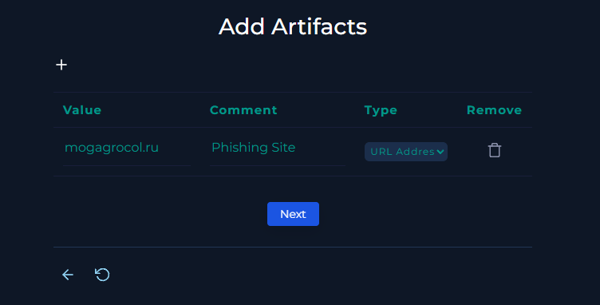

| Indicator | Type | Assessment |
|---|---|---|
| `mogagrocol.ru` | Domain | Malicious / Phishing |
| `91.189.114.8` | IP | Event destination |
| `172.16.17.49` | Internal IP | Affected source host |
| `EmilyComp` | Host | Affected endpoint |
| `ellie@letsdefend.io` | Email parameter | Target/user context |

> The internal host, internal IP, and user identity are case context, not malicious IOCs.

---

## 9. Analyst Note

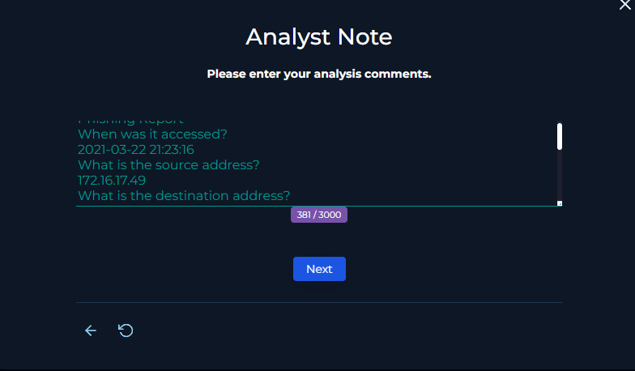

A concise production-style note:

> Proxy telemetry confirmed that user `ellie` on host `EmilyComp` (`172.16.17.49`) accessed `mogagrocol.ru` at 2021-03-22 21:23:16. The request to destination `91.189.114.8` was allowed by the proxy. Independent reputation analysis classified the domain as malicious/phishing. Because malicious access was confirmed and the request was not blocked, the endpoint was contained through EDR. The alert was classified as a true positive.

---

## 10. Timeline

| Time | Event |
|---|---|
| 2021-03-22 21:23:12 +03:00 | SOC141 proxy alert generated |
| 2021-03-22 21:23:16 | Access to `mogagrocol.ru` confirmed |
| 2026-08-17 | Investigation performed in the LetsDefend simulation |
| 2026-08-17 | Domain reputation validated |
| 2026-08-17 | `EmilyComp` contained through EDR |
| 2026-08-17 18:39:22 +03:00 | Alert closed as True Positive |

---

## 11. MITRE ATT&CK Mapping

Only directly supported behavior is mapped.

| Tactic | Technique | ID | Evidence |
|---|---|---|---|
| Execution | User Execution: Malicious Link | **T1204.001** | Proxy logs confirm the user accessed the malicious URL |

### Mapping Restraint

The alert name indicates phishing, but the supplied evidence begins at the proxy-access stage. I therefore did not automatically map **Spearphishing Link** because the original email/delivery mechanism is not shown in this case evidence.

I also did not map Command and Control because a browser request to a malicious website alone does not establish C2 behavior.

---

## 12. Verdict

### **TRUE POSITIVE — High Confidence**

The alert was classified as a true positive because:

1. the proxy recorded an outbound request to `mogagrocol.ru`,
2. the request originated from internal host `EmilyComp`,
3. user `ellie` was associated with the request,
4. the request was **Allowed** rather than blocked,
5. independent reputation analysis classified the domain as malicious/phishing,
6. the endpoint required containment.

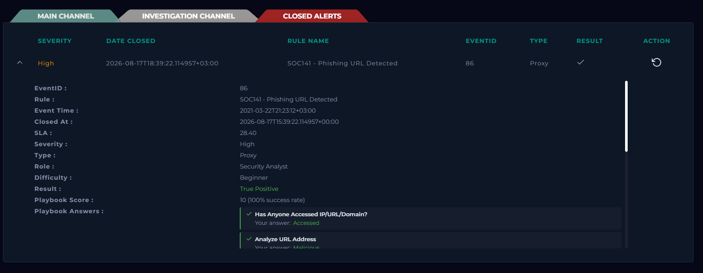

---

## 13. Recommended Follow-Up Actions

In a production SOC, I would also:

- search proxy/DNS logs for all access to `mogagrocol.ru`
- search for the full URL and domain across all users
- identify other recipients or potentially affected systems
- review browser and endpoint telemetry around the access time
- inspect for downloaded files, child processes, scripts, scheduled tasks, or persistence
- review authentication activity for user `ellie`
- block the domain/URL at appropriate security controls
- determine whether credentials were exposed
- reset credentials and revoke sessions if credential compromise is suspected

---

## 14. Detection Opportunities

### Detection Hypothesis

An endpoint accessing a domain classified as phishing should generate a high-priority alert when the web security control allows the request.

```text
IF
    proxy.request_action = "Allowed"
AND
    destination_domain IN threat_intel.phishing_domains
THEN
    alert "Allowed access to known phishing infrastructure"
```

URLs containing corporate email addresses as parameters may also be useful enrichment, but should not independently be treated as malicious.

---

## 15. Lessons Learned

1. **Confirm access, not just reputation.** The strongest evidence was the correlation of malicious domain + internal source + named user + timestamp + allowed request.
2. **Device action matters.** `Allowed` materially increased the need to assess endpoint impact.
3. **Preserve telemetry exactly.** The event IP and later reputation-service IP differed and should not be conflated.
4. **Do not over-map ATT&CK.** A malicious URL does not automatically prove phishing delivery, malware execution, or C2.
5. **Containment is a risk decision.** Confirmed malicious access justified containment while downstream compromise remained unresolved.

---

## Skills Demonstrated

- SIEM alert triage
- proxy log analysis
- source/destination correlation
- URL and domain reputation analysis
- IOC handling
- endpoint/user correlation
- EDR containment
- evidence-based verdicting
- MITRE ATT&CK mapping
- analyst documentation

---

## Training Context

This investigation was completed in the **LetsDefend simulated SOC environment** as part of hands-on SOC Analyst training.

The report is a professional case study of my investigation methodology rather than a reproduction of training-platform answers. All activity occurred in an authorized training environment.
