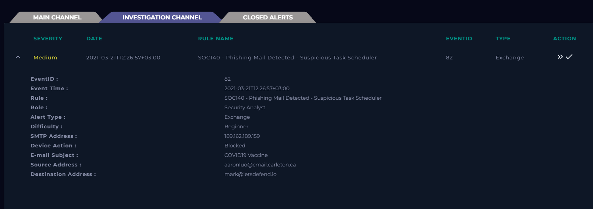
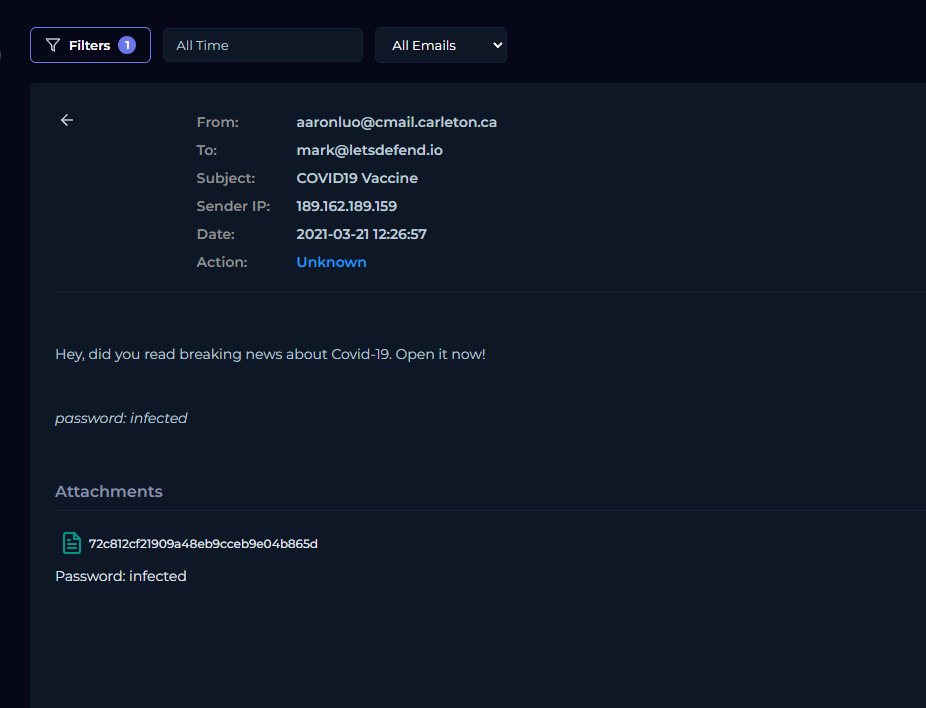
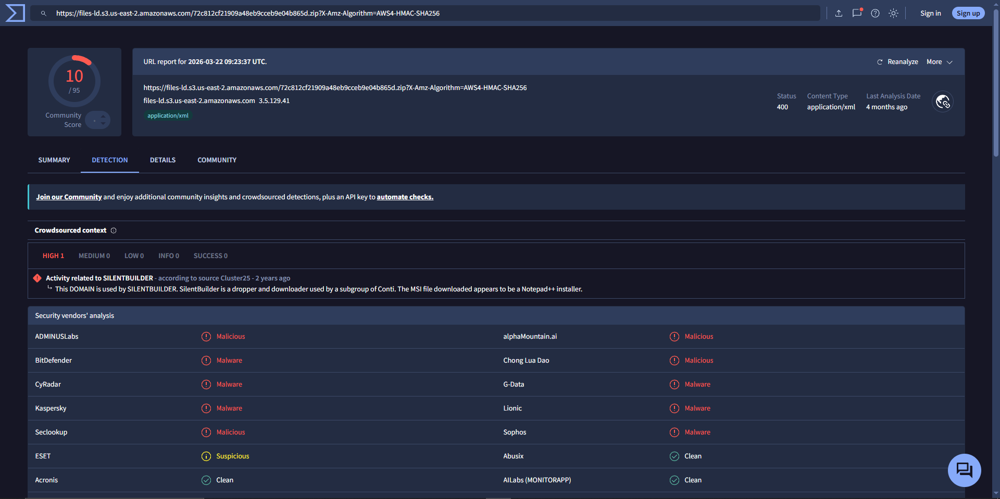
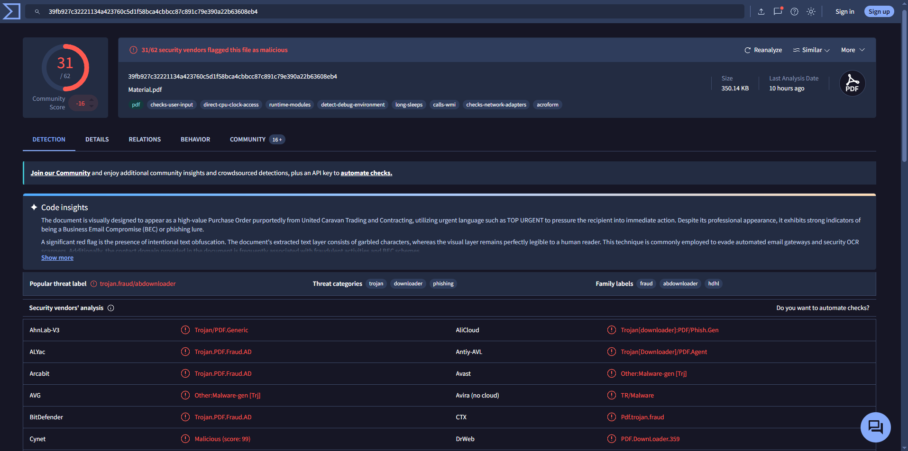
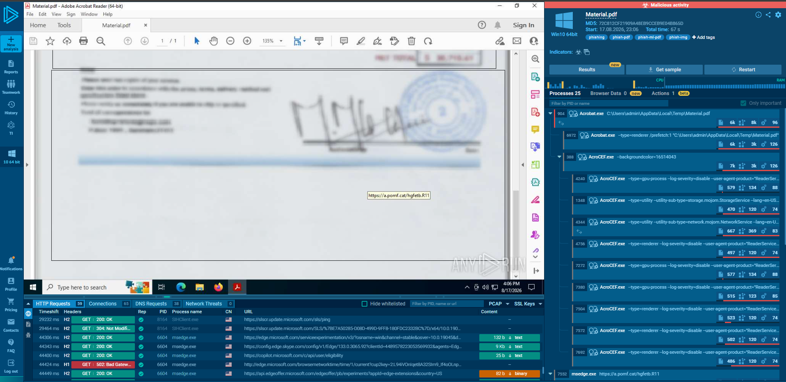
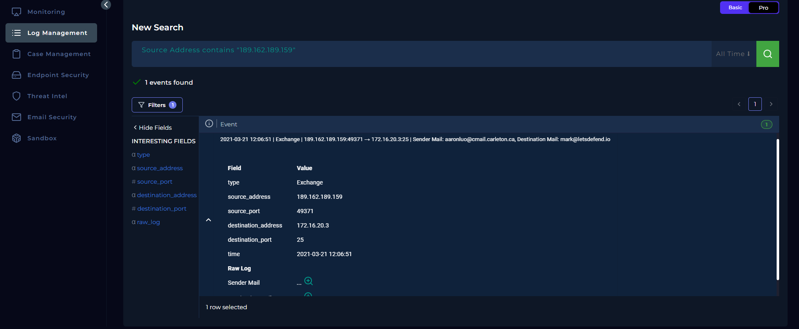
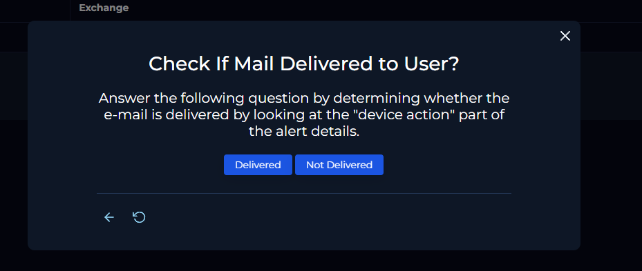
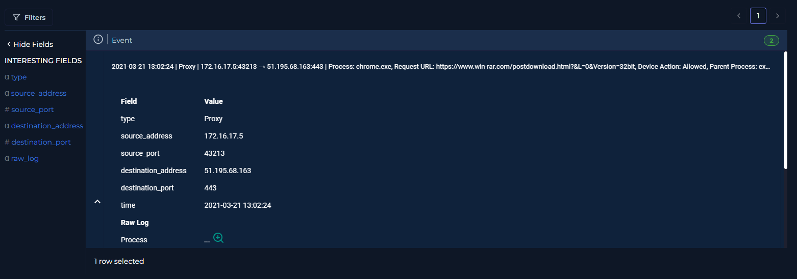
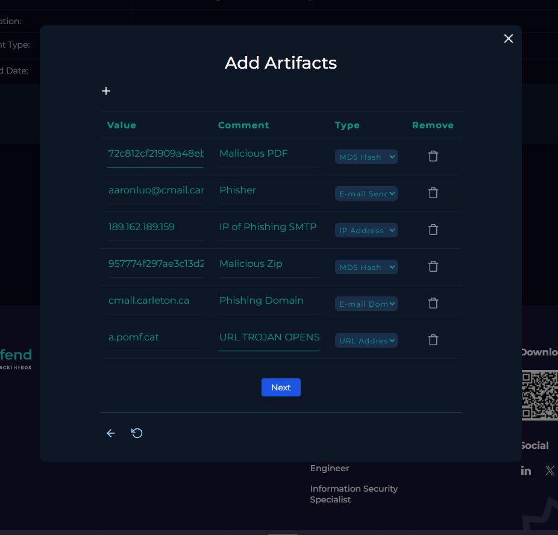

# SOC-002 — Malicious Phishing Attachment Blocked

## Executive Summary

A **medium-severity Exchange alert**, `SOC140 - Phishing Mail Detected - Suspicious Task Scheduler`, was investigated after an external sender attempted to deliver a COVID-19-themed email with a password-protected attachment to `mark@letsdefend.io`.

Email-security review confirmed a suspicious social-engineering message and an attachment. Threat-intelligence and sandbox analysis identified the attachment/PDF chain as malicious, including detections associated with phishing, trojan/downloader behavior, and a secondary URL observed during dynamic analysis.

The email-security control recorded the message as **Blocked**, and the playbook confirmed **Not Delivered**. Because the malicious content did not reach the user, no endpoint containment was required based on the supplied evidence.

**Final verdict: True Positive — High Confidence.**

---

## Case Information

| Field | Value |
|---|---|
| Portfolio Case ID | SOC-002 |
| Platform Alert | SOC140 - Phishing Mail Detected - Suspicious Task Scheduler |
| Event ID | 82 |
| Alert Type | Exchange |
| Severity | Medium |
| Alert Time | 2021-03-21T12:26:57+03:00 |
| SMTP IP | 189.162.189.159 |
| Sender | aaronluo@cmail.carleton.ca |
| Recipient | mark@letsdefend.io |
| Subject | COVID19 Vaccine |
| Device Action | Blocked |
| Final Verdict | **True Positive** |
| Confidence | **High** |
| User Delivery | **Not Delivered** |
| Response | No endpoint containment required from available evidence |

> **Field-quality note:** In the supplied notes, “Security Analyst” appeared under a “Severity Level” label. The alert screenshot shows **Medium** as severity and **Security Analyst** as the analyst role. This report preserves those as separate fields.

---

## Investigation Objective

Determine whether the message was malicious, whether the attachment contained malware, whether the email reached the intended user, and whether any further response was required.

---

# 1. Initial Alert Triage

The investigation started with Event ID `82`, an Exchange alert for:

```text
SOC140 - Phishing Mail Detected - Suspicious Task Scheduler
```

Key alert fields included:

```text
SMTP IP:       189.162.189.159
Sender:        aaronluo@cmail.carleton.ca
Recipient:     mark@letsdefend.io
Subject:       COVID19 Vaccine
Device Action: Blocked
```



### Initial Analyst Hypothesis

The message likely represented a phishing attempt with a malicious attachment. However, the `Blocked` action suggested the security control may have prevented user exposure.

The investigation therefore needed to answer two separate questions:

1. **Was the email actually malicious?**
2. **Did the malicious content reach the user?**

---

# 2. Email Content Review

Email Security showed the following message:

```text
From:    aaronluo@cmail.carleton.ca
To:      mark@letsdefend.io
Subject: COVID19 Vaccine

"Hey, did you read breaking news about Covid-19. Open it now!"

password: infected
```

An attachment was present.



### Observed Social-Engineering Indicators

- topical COVID-19 lure
- imperative language encouraging immediate opening
- password-protected content
- attachment delivered separately from its password

### Analyst Assessment

A password-protected attachment can be used legitimately, but in this context it increased suspicion because encrypted archives may reduce the effectiveness of automated mail scanning.

This was treated as an **indicator**, not proof by itself.

---

# 3. Artifact and Hash Analysis

The platform presented the attachment identifier:

```text
72c812cf21909a48eb9cceb9e04b865d
```

The case artifacts later recorded this value as an **MD5 hash** for the malicious PDF.

A separate VirusTotal screenshot for `Material.pdf` shows the following SHA-256:

```text
39fb927c32221134a423760c5d1f58bca4cbbcc87c891c79e390a22b63608eb4
```

This distinction matters:

| Artifact | Value | Role |
|---|---|---|
| PDF MD5 | `72c812cf21909a48eb9cceb9e04b865d` | Platform case artifact |
| PDF SHA-256 | `39fb927c32221134a423760c5d1f58bca4cbbcc87c891c79e390a22b63608eb4` | Reputation/sandbox lookup |
| ZIP MD5 | `957774f297ae3c13d233bb0ba2dfc352` | Platform case artifact |

Hash types should not be mixed or relabeled simply because they refer to related content.

---

# 4. Threat-Intelligence Validation

The attachment/associated download infrastructure was analyzed with third-party services.

One reputation result associated the hosted content with malicious activity and referenced **SILENTBUILDER**-related context.



The `Material.pdf` reputation screenshot showed broad malicious detection and classifications associated with phishing/trojan/downloader behavior.




### SMTP Reputation

The investigator also checked `189.162.189.159` across multiple reputation sources and observed mixed results, including neutral/low-risk signals from some sources and abuse reports from another.

### Analyst Decision

**Do not classify the email from SMTP reputation alone.**

Mixed infrastructure reputation reinforced the need to correlate:

```text
email content
+ attachment behavior
+ hash reputation
+ sandbox evidence
+ mail-delivery status
```

---

# 5. Dynamic Analysis

The suspicious PDF was opened in an isolated sandbox.

The sandbox displayed `Material.pdf` inside Adobe Acrobat and showed activity involving a link to:

```text
a.pomf.cat/hgfetb.R11
```

The sandbox also showed process and network activity around the document.



### Analyst Assessment

The dynamic evidence strengthened the malicious classification because the document was not merely a static lure; it exhibited behavior associated with external content retrieval / redirection.

The supplied evidence did **not** establish a reliable production-environment C2 channel, so this report does not classify the observed URL as confirmed Command and Control infrastructure.

---

# 6. Mail-Flow and Delivery Validation

The SMTP IP `189.162.189.159` was searched in Log Management.



The mail log showed Exchange traffic from:

```text
189.162.189.159:49371
```

to:

```text
172.16.20.3:25
```

with the sender and recipient matching the alert.

The playbook then required confirmation of whether the email had been delivered.



The alert `Device Action` was:

```text
Blocked
```

and the final playbook decision was:

```text
Not Delivered
```

### Important Distinction

**Mail receipt by the security infrastructure is not the same as user delivery.**

The logs demonstrate that the message reached the mail environment, while the security control prevented delivery to the intended user.

---

# 7. Related Log Review

A related proxy event was also present in the environment at `2021-03-21 13:02:24`, showing a Chrome request to:

```text
https://www.win-rar.com/postdownload.html?&L=0&version=32bit
```

from internal address:

```text
172.16.17.5
```



### Scope Decision

This event is retained as **context only**.

The supplied evidence does not establish that:

- `172.16.17.5` belonged to recipient `mark`,
- the event resulted from this phishing email,
- or the WinRAR request was malicious.

Therefore it was **not used as evidence of compromise** in the final verdict.

This separation prevents unrelated telemetry from inflating the incident scope.

---

# 8. Analyst Decision Points

## Decision 1 — Is the message suspicious?

**Yes.**

Evidence:

- COVID-themed social engineering
- urgent call to open content
- password-protected attachment
- external sender

## Decision 2 — Is the attachment malicious?

**Yes — High confidence.**

Evidence:

- multiple security vendors classified the PDF as malicious
- sandbox/reputation sources associated it with phishing/trojan/downloader behavior
- dynamic analysis showed external retrieval/redirection behavior

## Decision 3 — Did the message reach the user?

**No.**

Evidence:

```text
Device Action: Blocked
Playbook: Not Delivered
```

## Decision 4 — Is endpoint containment required?

**Not from the supplied evidence.**

The malicious message was blocked before user delivery, and no evidence supplied for this case confirms execution on the recipient's endpoint.

## Decision 5 — True positive or false positive?

**True Positive.**

The detection correctly identified a malicious phishing email, even though the control successfully prevented delivery.

---

# 9. Evidence vs Inference

## Directly Observed Evidence

- Exchange alert fired
- sender, recipient, SMTP IP, subject identified
- attachment present
- device action recorded as Blocked
- attachment reputation was malicious
- sandbox analysis showed suspicious/malicious behavior
- playbook concluded Not Delivered

## Analyst Inferences

- password protection may have been intended to reduce automated scanning
- the email was designed to socially engineer the recipient into opening malicious content

## Not Established by Available Evidence

- recipient opened the attachment
- malware executed on recipient workstation
- scheduled task persistence occurred in the production environment
- credential theft occurred
- lateral movement occurred
- C2 was established
- data was exfiltrated

---

# 10. MITRE ATT&CK Mapping

Only behavior supported by the evidence is mapped.

| Tactic | Technique | ID | Evidence |
|---|---|---|---|
| Initial Access | Spearphishing Attachment | **T1566.001** | Malicious attachment sent to a targeted corporate recipient |

### Mapping Restraint

The alert rule contains the phrase **Suspicious Task Scheduler**, but the supplied investigation evidence does not demonstrate a scheduled task on the recipient endpoint.

Therefore I did **not** map:

```text
T1053.005 — Scheduled Task/Job: Scheduled Task
```

Likewise, because the email was not delivered, I did not map user execution on the recipient endpoint.

---

# 11. Scope Assessment

| Scope Area | Assessment |
|---|---|
| Targeted Recipient | `mark@letsdefend.io` |
| Sender | `aaronluo@cmail.carleton.ca` |
| SMTP Source | `189.162.189.159` |
| User Delivery | **Not Delivered** |
| Endpoint Execution | Not observed |
| Credential Compromise | Not observed |
| Persistence | Not observed |
| Lateral Movement | Not observed |
| C2 | Not established |
| Data Exfiltration | Not observed |

### Scope Confidence

**High** for the mail-delivery conclusion.

**Limited** for downstream endpoint activity because no recipient-endpoint execution evidence was supplied; however, the blocked delivery materially reduces the likelihood that this specific message caused endpoint compromise.

---

# 12. IOC / Artifact Record



| Value | Type | Assessment |
|---|---|---|
| `189.162.189.159` | SMTP IP | Suspicious phishing-source context |
| `aaronluo@cmail.carleton.ca` | Email sender | Malicious sender in this case |
| `cmail.carleton.ca` | Email domain | Case-associated domain |
| `72c812cf21909a48eb9cceb9e04b865d` | MD5 | Malicious PDF artifact |
| `39fb927c32221134a423760c5d1f58bca4cbbcc87c891c79e390a22b63608eb4` | SHA-256 | `Material.pdf` |
| `957774f297ae3c13d233bb0ba2dfc352` | MD5 | Malicious ZIP artifact |
| `a.pomf.cat/hgfetb.R11` | URL | Malicious/suspicious URL observed during sandbox analysis |

> Domain-level blocking should be assessed carefully. A domain or hosting service may contain both malicious and legitimate content; the safest control may be the specific URL, hash, sender, or reputation-driven policy rather than indiscriminate blocking of shared infrastructure.

---

# 13. Final Verdict

## **TRUE POSITIVE — HIGH CONFIDENCE**

The alert correctly identified a phishing email containing malicious content.

The conclusion is supported by:

1. suspicious social-engineering content,
2. malicious attachment reputation,
3. sandbox evidence,
4. malicious artifact/hash findings,
5. successful mail-security blocking,
6. confirmation that the message was not delivered.

### Security-Control Outcome

This was a **successful prevention event**:

```text
Attack attempted
      ↓
Malicious email identified
      ↓
Message blocked
      ↓
User not exposed
      ↓
No endpoint containment required
```

---

# 14. Production SOC Analyst Note

> **True Positive — Phishing/Malicious Attachment.** Exchange alert SOC140 identified a COVID-19-themed email from `aaronluo@cmail.carleton.ca` to `mark@letsdefend.io` containing a password-protected attachment. Static reputation and sandbox analysis classified the attachment as malicious and associated it with phishing/trojan/downloader behavior. Mail-security telemetry recorded the action as `Blocked`, and the message was confirmed as not delivered to the recipient. No recipient-endpoint execution is evidenced in the available telemetry. Recommend retaining the sender, SMTP IP, file hashes, and malicious URL as investigation artifacts and searching the mail environment for related campaign activity.

---

# 15. Recommended Production Follow-Up

In a production SOC, I would:

- search the mail gateway for the same sender
- search for the same subject
- pivot on the SMTP IP
- search for both PDF/ZIP hashes
- search for the malicious URL
- identify whether other recipients received related messages
- quarantine matching messages if any bypassed controls
- block known-malicious file hashes
- block malicious URLs as appropriate
- review whether the sender/domain is part of a broader campaign
- retain samples for malware/detection engineering
- confirm no matching attachment executed on endpoints

---

# 16. Detection Engineering Opportunities

## Detection Hypothesis 1 — Password-Protected Attachment + Social Engineering

A message should receive additional risk weighting when it combines:

```text
external sender
+
password-protected attachment
+
password supplied in message body
+
urgent/social-engineering language
```

This should not automatically be classified as malicious, but the combination is useful for prioritization.

## Detection Hypothesis 2 — Known-Malicious Attachment Hash

```text
IF
    attachment_hash IN threat_intel.malicious_hashes
THEN
    block_message
    alert_SOC
```

## Detection Hypothesis 3 — Campaign Correlation

Correlate messages sharing any of:

```text
sender
SMTP IP
subject
attachment hash
embedded URL
```

to identify wider phishing campaigns.

### Potential False Positives

- legitimate encrypted business documents
- security-research malware samples
- authorized penetration tests
- shared mail infrastructure with poor reputation
- reused/common subject lines

---

# 17. Lessons Learned

1. **A true positive can still be a successful defense.**  
   The attack was real even though the user was protected.

2. **Blocked vs delivered is a critical decision point.**  
   It determines whether endpoint investigation becomes immediately necessary.

3. **Use multiple threat-intelligence sources.**  
   SMTP reputation was mixed, while attachment and sandbox evidence strongly supported maliciousness.

4. **Hash discipline matters.**  
   MD5 and SHA-256 values should be labeled explicitly and not conflated.

5. **Do not overstate downstream impact.**  
   The rule name referenced a suspicious task scheduler, but no production endpoint evidence in the supplied case proved persistence.

6. **Separate correlated telemetry from proven causality.**  
   The unrelated/uncertain WinRAR proxy request was not used to claim compromise.

---

# Skills Demonstrated

- phishing email triage
- email-security analysis
- SMTP/source investigation
- attachment and hash analysis
- threat-intelligence correlation
- sandbox/dynamic malware analysis
- mail-flow validation
- IOC handling
- scope assessment
- MITRE ATT&CK mapping
- false-positive consideration
- evidence-based case closure
- SOC analyst documentation

---

## Training Context

This investigation was completed in the **LetsDefend simulated SOC environment** as part of authorized SOC Analyst training.

The report is written as a professional portfolio case study and intentionally avoids reproducing the training workflow as a step-by-step answer guide.
