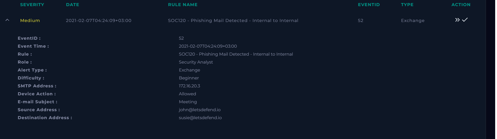
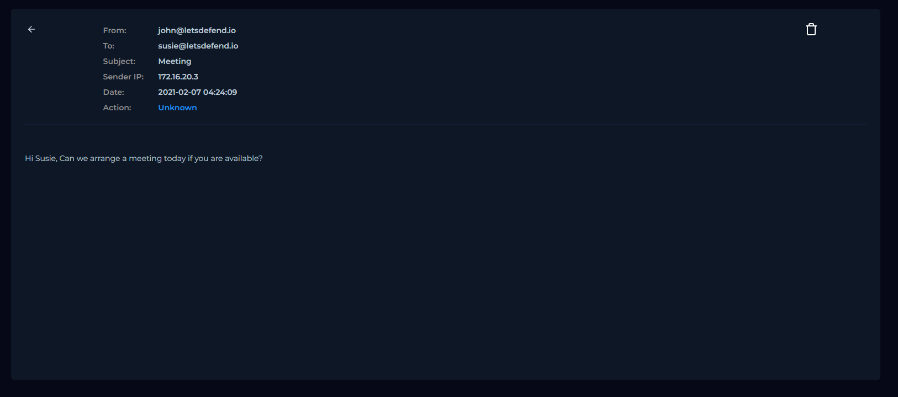
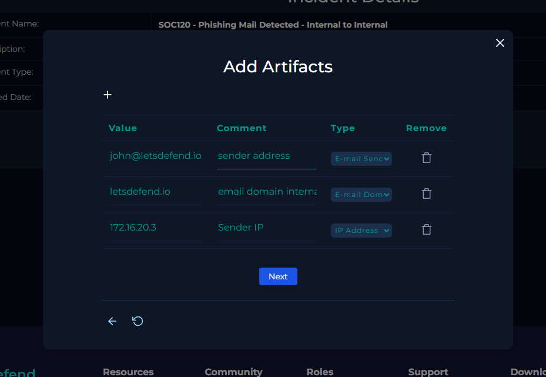

# SOC-003 — Internal Email False Positive

## Executive Summary

A **medium-severity Exchange alert**, `SOC120 - Phishing Mail Detected - Internal to Internal`, was investigated after an internal email from `john@letsdefend.io` to `susie@letsdefend.io` triggered a phishing rule.

Review of the message showed a simple request to arrange a meeting. The email contained **no suspicious language, no URLs, and no attachments**. The sender and recipient were both internal to the `letsdefend.io` domain, and the message originated from internal SMTP address `172.16.20.3`.

The alert was therefore classified as a **False Positive**. No containment or remediation was required.

---

## Case Information

| Field | Value |
|---|---|
| Portfolio Case ID | SOC-003 |
| Platform Alert | SOC120 - Phishing Mail Detected - Internal to Internal |
| Event ID | 52 |
| Alert Type | Exchange |
| Severity | Medium |
| Event Time | 2021-02-07T04:24:09+03:00 |
| SMTP Address | 172.16.20.3 |
| Sender | john@letsdefend.io |
| Recipient | susie@letsdefend.io |
| Subject | Meeting |
| Device Action | Allowed |
| Final Verdict | **False Positive** |
| Confidence | **High** |
| Response | No action required |

---

## Investigation Objective

Determine whether the internally generated email represented a phishing attempt or benign business communication.

The investigation focused on:

1. validating sender and recipient context,
2. reviewing message content,
3. checking for attachments or URLs,
4. determining whether any malicious indicators were present,
5. deciding whether further response was necessary.

---

# 1. Initial Alert Triage

The alert identified an internal-to-internal email:

```text
Rule:               SOC120 - Phishing Mail Detected - Internal to Internal
Event ID:           52
SMTP Address:       172.16.20.3
Sender:             john@letsdefend.io
Recipient:          susie@letsdefend.io
Subject:            Meeting
Device Action:      Allowed
```



### Initial Analyst Hypothesis

Because phishing alerts can sometimes be triggered by benign communication, the alert could not be treated as malicious based on the rule name alone.

The key question was:

> Does the message contain evidence of phishing or malicious activity?

---

# 2. Email Content Review

The email content was:

```text
Hi Susie,

Can we arrange a meeting today if you are available?
```



### Findings

- sender is internal
- recipient is internal
- subject is consistent with the body
- message content is routine business communication
- no urgency, threat, impersonation, or financial request
- no credential request
- no suspicious attachment
- no URL

### Analyst Assessment

The message body does not exhibit common phishing characteristics.

The email appears consistent with normal internal communication between colleagues.

---

# 3. Attachment and URL Review

The playbook asked whether the email contained any attachments or URLs.

### Result

```text
Contains Attachment or URL? No
```

This materially reduced the phishing likelihood because there was no payload, external link, or file requiring further static or dynamic analysis.

### Decision

No VirusTotal, URLScan, sandbox, or malware-analysis pivot was necessary because there was no suspicious artifact to analyze.

---

# 4. Sender and Infrastructure Context

The message originated from:

```text
SMTP Address: 172.16.20.3
Sender:       john@letsdefend.io
Recipient:    susie@letsdefend.io
```

The source and destination identities are both internal to the same organization/domain.

### Analyst Interpretation

Internal origin alone does **not** prove a message is benign. Compromised internal accounts can be used for phishing.

However, in this case, there were no additional suspicious indicators in:

- sender context
- recipient context
- subject
- message body
- attachments
- URLs

Therefore the total evidence supported benign internal communication.

---

# 5. Analyst Decision Points

## Decision 1 — Is the sender external or impersonating an internal user?

**No evidence of this.**

The message was sent from an internal `letsdefend.io` account and internal SMTP infrastructure.

## Decision 2 — Is the message content suspicious?

**No.**

The content was a normal request to schedule a meeting.

## Decision 3 — Are there attachments or URLs?

**No.**

There was no payload or external destination requiring further analysis.

## Decision 4 — Is there evidence of account compromise?

**No evidence in the supplied telemetry.**

The available data does not show anomalous authentication, suspicious forwarding, malicious attachments, URLs, or follow-on activity.

## Decision 5 — Is containment required?

**No.**

There is no evidence of malicious activity or compromise.

## Decision 6 — Final classification?

**False Positive — High Confidence.**

---

# 6. Evidence vs Inference

## Direct Evidence

- Exchange alert fired
- sender: `john@letsdefend.io`
- recipient: `susie@letsdefend.io`
- SMTP source: `172.16.20.3`
- subject: `Meeting`
- message body contained a normal meeting request
- no attachment present
- no URL present
- device action was `Allowed`

## Analyst Inference

The email is consistent with routine internal business communication.

## Not Established

The supplied evidence does not independently prove:

- whether the sender account had been compromised previously,
- whether unusual authentication occurred outside this event,
- whether similar messages existed elsewhere.

Those possibilities were not indicated by this alert and were not required to support the false-positive verdict.

---

# 7. IOC / Artifact Handling

The playbook recorded the following case artifacts:



| Value | Type | Assessment |
|---|---|---|
| `john@letsdefend.io` | Email sender | Benign internal sender in this event |
| `letsdefend.io` | Email domain | Internal organizational domain |
| `172.16.20.3` | IP address | Internal SMTP infrastructure |

### Important IOC Discipline

These values should **not** be treated as malicious IOCs.

They are case context only.

This is an important distinction because artifacts collected during an investigation are not automatically indicators of compromise.

---

# 8. MITRE ATT&CK Mapping

## No ATT&CK Technique Assigned

No ATT&CK mapping is appropriate for this case because the available evidence does not demonstrate malicious adversary behavior.

Assigning a phishing technique merely because the detection rule contained the word *phishing* would overstate the evidence.

### Analyst Principle

> ATT&CK mappings should describe observed adversary behavior, not the name of the alert that fired.

---

# 9. Scope Assessment

| Scope Area | Assessment |
|---|---|
| Sender | `john@letsdefend.io` |
| Recipient | `susie@letsdefend.io` |
| Internal SMTP | `172.16.20.3` |
| Malicious URL | None |
| Attachment | None |
| Credential Theft | Not observed |
| Malware Execution | Not observed |
| Persistence | Not observed |
| Lateral Movement | Not observed |
| C2 | Not observed |
| User Impact | None observed |

---

# 10. False-Positive Analysis

### Why the Alert May Have Fired

The exact detection logic is not provided, so the trigger cannot be determined with certainty.

Possible explanations include:

- broad internal-to-internal phishing logic,
- heuristic keyword or behavioral scoring,
- rule sensitivity intended to detect compromised internal mailboxes.

These are **hypotheses only** and are not presented as confirmed rule logic.

### Why the Alert Was Closed as Benign

The observable evidence contained no malicious indicators.

The benign conclusion was based on the combined context, not simply because the sender was internal.

---

# 11. Final Verdict

## **FALSE POSITIVE — HIGH CONFIDENCE**

The alert was closed as a false positive because:

1. the message contained normal business communication,
2. sender and recipient were internal,
3. there were no URLs,
4. there were no attachments,
5. there was no suspicious social-engineering content,
6. there was no evidence of follow-on malicious behavior.

No containment or remediation was required.

---

# 12. Production SOC Analyst Note

> **False Positive.** Exchange alert SOC120 triggered on an internal email from `john@letsdefend.io` to `susie@letsdefend.io` with subject `Meeting`. Review of the message showed a routine request to arrange a meeting. No URLs, attachments, credential requests, suspicious language, or other malicious indicators were present. The message originated from internal SMTP infrastructure (`172.16.20.3`). No evidence of malicious activity or account compromise was identified from the available telemetry. No further action required.

---

# 13. Detection Engineering Opportunity

This case demonstrates the importance of measuring false positives in phishing detection.

A useful tuning strategy would be to avoid suppressing all internal-to-internal mail and instead increase confidence only when additional indicators are present.

Example conceptual logic:

```text
internal_sender
+
(
    suspicious_url
    OR malicious_attachment
    OR credential_request
    OR impersonation_indicator
    OR anomalous_sender_behavior
)
→ raise phishing confidence
```

### Tuning Caution

Simply excluding all internal senders would be dangerous because compromised internal accounts can be used for phishing.

A better approach is **context-aware scoring**, not blanket allowlisting.

---

# 14. Lessons Learned

1. **Not every alert is malicious.**  
   SOC analysts must be comfortable closing false positives when the evidence supports it.

2. **Alert names are not evidence.**  
   A rule labeled “Phishing” does not prove phishing occurred.

3. **Internal email can still be malicious.**  
   Internal sender status should be treated as context, not automatic trust.

4. **Absence of artifacts can matter.**  
   No URL, attachment, credential request, or suspicious content significantly reduced risk in this case.

5. **Do not turn case artifacts into IOCs automatically.**  
   Internal IPs, domains, and users collected during a case may be completely benign.

6. **False positives are valuable detection-engineering feedback.**  
   They can help identify where rules may need tuning without sacrificing coverage.

---

# Skills Demonstrated

- SIEM / Exchange alert triage
- phishing false-positive analysis
- email-content review
- sender/recipient validation
- artifact classification
- evidence-based case closure
- ATT&CK mapping restraint
- detection-rule tuning awareness
- professional analyst documentation

---

## Training Context

This investigation was completed in the **LetsDefend simulated SOC environment** as part of authorized SOC Analyst training.

The report is written as a professional portfolio case study and focuses on analyst reasoning rather than reproducing the training-platform workflow.
