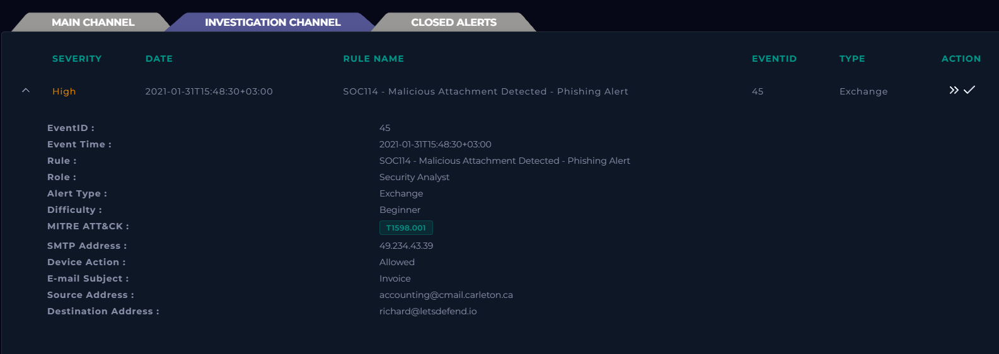
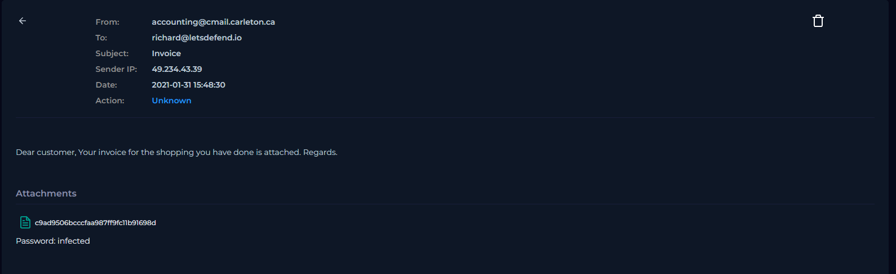
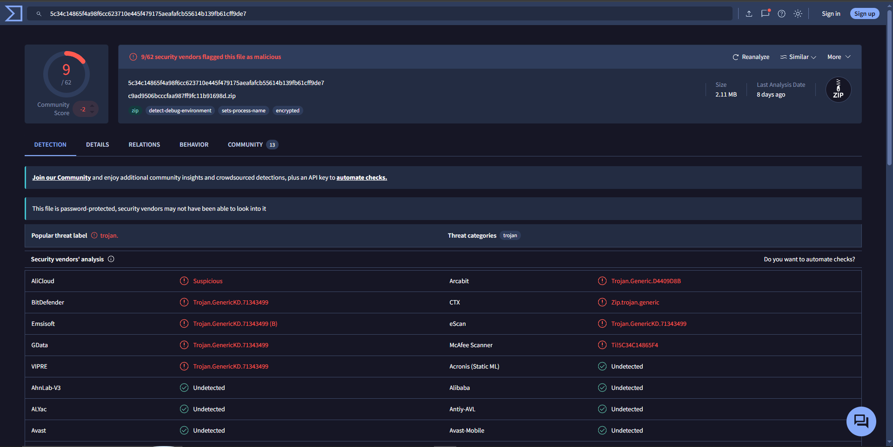
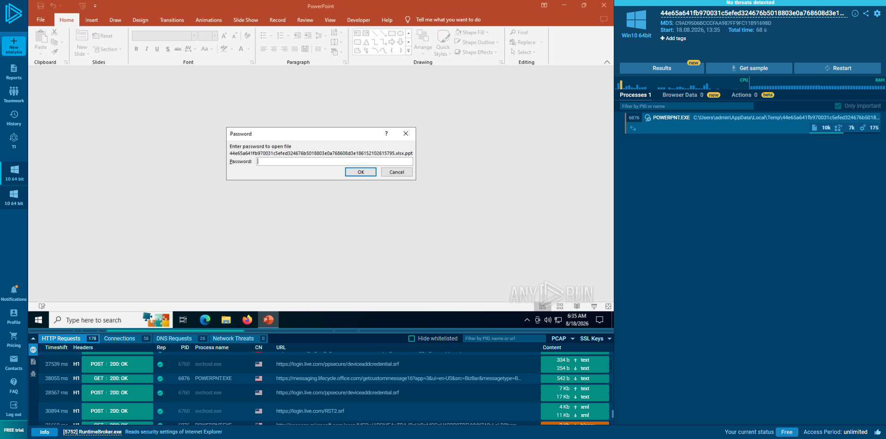
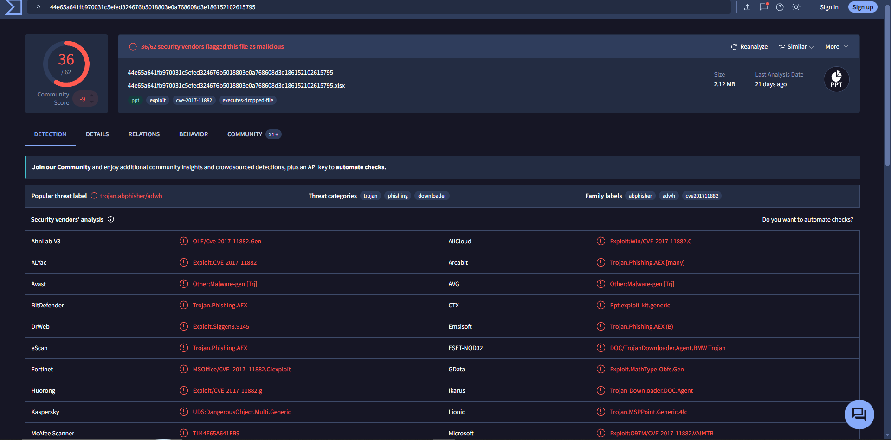
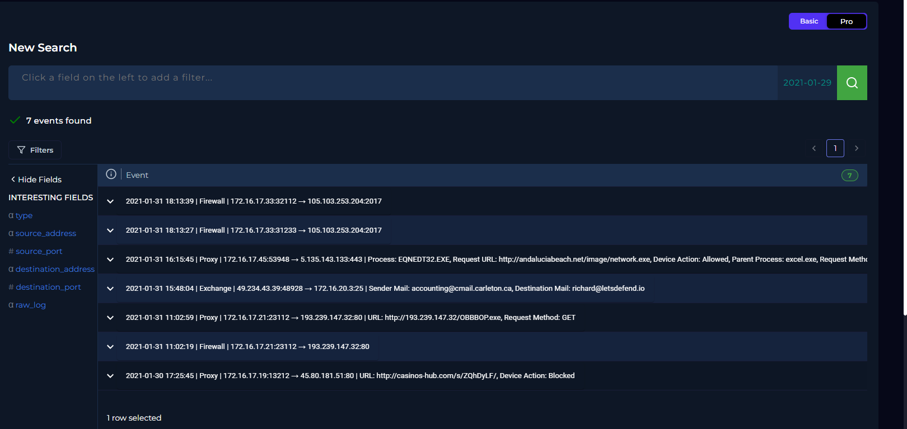
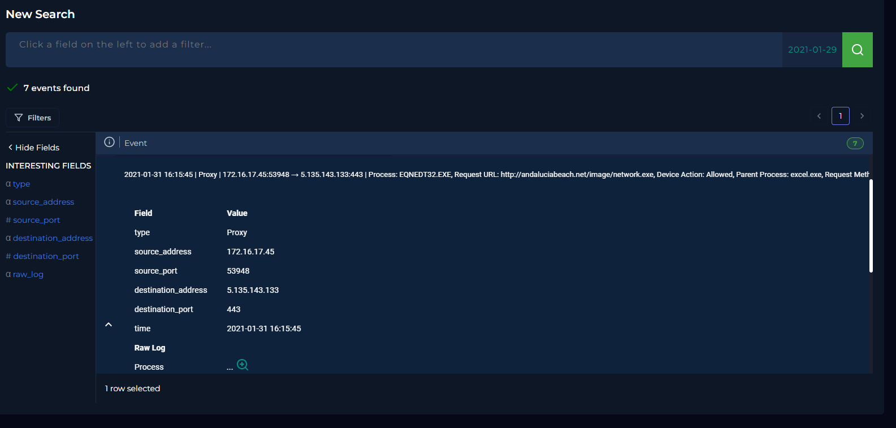
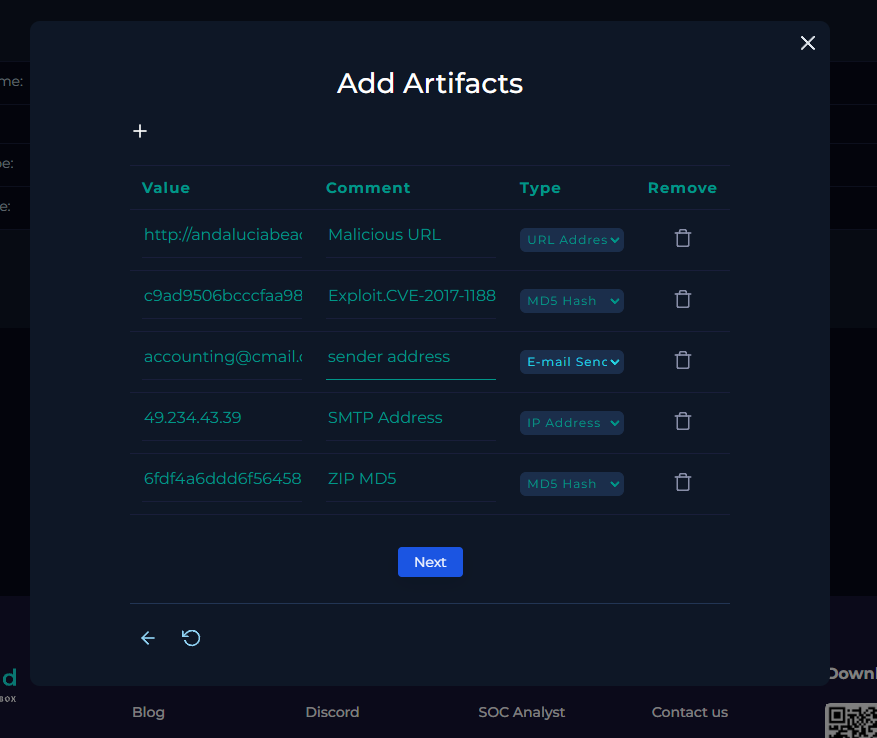

# SOC-004 — Malicious Office Attachment Exploiting CVE-2017-11882

## Executive Summary

A **high-severity Exchange alert**, `SOC114 - Malicious Attachment Detected - Phishing Alert`, was investigated after an invoice-themed email from `accounting@cmail.carleton.ca` was delivered to `richard@letsdefend.io`.

The email contained a password-protected archive. Static analysis of the archive and extracted Office document showed malicious detections, including **CVE-2017-11882** exploit labeling. Dynamic analysis and SIEM correlation later showed `EQNEDT32.EXE`, parented by `excel.exe`, making an allowed outbound request to:

`http://andaluciabeach.net/image/network.exe`

with destination IP `5.135.143.133`.

The malicious email was deleted from the recipient mailbox and the endpoint was contained.

**Final verdict: True Positive — High Confidence.**

---

## Case Information

| Field | Value |
|---|---|
| Portfolio Case ID | SOC-004 |
| Platform Alert | SOC114 - Malicious Attachment Detected - Phishing Alert |
| Event ID | 45 |
| Alert Type | Exchange |
| Severity | High |
| Event Time | 2021-01-31T15:48:30+03:00 |
| SMTP Address | 49.234.43.39 |
| Sender | accounting@cmail.carleton.ca |
| Recipient | richard@letsdefend.io |
| Subject | Invoice |
| Device Action | Allowed |
| Platform ATT&CK | T1598.001 |
| Final Verdict | **True Positive** |
| Confidence | **High** |
| Response | Email deleted + endpoint contained |

---

## 1. Initial Alert Triage



The alert indicated a malicious attachment in an invoice-themed email. Because the gateway action was `Allowed`, the investigation had to determine whether the attachment was malicious and whether execution occurred.

---

## 2. Email Content Review



The message used a generic invoice lure and included a password-protected attachment.

Suspicious indicators included:

- unexpected invoice theme
- generic salutation
- password-protected archive
- external sender
- attached content requiring extraction

Password protection alone is not malicious, but in this context it increased suspicion.

---

## 3. Archive Analysis

Archive hashes:

- **MD5:** `6fdf4a6ddd6f564589dd060bdc4da2c3`
- **SHA-1:** `68b34a47861c76b9544addcc2f8217ef249f4773`
- **SHA-256:** `5c34c14865f4a98f6cc623710e445f479175aeafafcb55614b139fb61cff9de7`

VirusTotal showed trojan/malicious detections.



Because encrypted archives can reduce vendor visibility, this result was treated as supporting evidence rather than the sole basis for the verdict.

---

## 4. Extracted Office Document Analysis

The extracted Office file was analyzed in ANY.RUN and VirusTotal.



Extracted file hashes:

- **MD5:** `c9ad9506bcccfaa987ff9fc11b91698d`
- **SHA-1:** `e788183a2a021f74a21f609e514bb63c4ef2fe49`
- **SHA-256:** `44e65a641fb970031c5efed324676b5018803e0a768608d3e186152102615795`

VirusTotal showed broad malicious detection and labels associated with:

- CVE-2017-11882
- exploit
- phishing
- trojan/downloader



---

## 5. Execution and Network Correlation

SIEM review showed multiple related events.



A key proxy event occurred at `2021-01-31 16:15:45`:

- Source IP: `172.16.17.45`
- Destination IP: `5.135.143.133`
- Destination port: `443`
- Process: `EQNEDT32.EXE`
- Parent process: `excel.exe`
- URL: `http://andaluciabeach.net/image/network.exe`
- Device Action: `Allowed`



This is the strongest evidence in the case because it shows a process linked to the malicious Office exploit chain making an outbound request after delivery.

---

## 6. Analyst Decision Points

**Was the email suspicious?** Yes.  
**Was the archive malicious?** Yes — high confidence.  
**Was the extracted Office document malicious?** Yes — high confidence.  
**Was the email delivered?** Yes (`Allowed`).  
**Was execution observed?** Yes — `EQNEDT32.EXE` with parent `excel.exe`.  
**Was malicious outbound activity observed?** Yes.  
**Was containment required?** Yes.  
**Final classification?** **True Positive — High Confidence.**

---

## 7. Evidence vs Inference

### Direct Evidence
- malicious attachment detected
- email delivered
- archive and extracted file had malicious detections
- CVE-2017-11882-associated labeling
- `EQNEDT32.EXE` observed
- parent process `excel.exe`
- outbound request to `andaluciabeach.net/image/network.exe`
- destination `5.135.143.133`
- request allowed
- email deleted
- endpoint contained

### Analyst Inference
The sequence is consistent with successful exploitation of the malicious Office document through Equation Editor.

### Not Established
The supplied evidence does not independently prove:
- credential theft
- persistence
- lateral movement
- data exfiltration
- the final behavior of the downloaded payload

---

## 8. MITRE ATT&CK Mapping

The platform alert displayed `T1598.001`, but this portfolio report maps the behavior actually observed:

| Tactic | Technique | ID | Evidence |
|---|---|---|---|
| Initial Access | Spearphishing Attachment | **T1566.001** | Malicious attachment delivered to recipient |
| Execution | Exploitation for Client Execution | **T1203** | CVE-2017-11882-associated Office exploit behavior |
| Command and Control / Transfer | Ingress Tool Transfer | **T1105** | Request for `network.exe` from external infrastructure |

The platform-provided `T1598.001` value is retained as case metadata, but it is not used as the primary portfolio mapping.

---

## 9. Scope Assessment

| Scope Area | Assessment |
|---|---|
| Recipient | `richard@letsdefend.io` |
| Mail Delivery | Delivered |
| Execution | Observed |
| Exploit Activity | Observed / consistent with CVE-2017-11882 |
| Outbound Payload Request | Observed |
| Credential Compromise | Not established |
| Persistence | Not established |
| Lateral Movement | Not established |
| Exfiltration | Not established |
| Containment | Completed |

---

## 10. IOC / Artifact Record



### Infrastructure
- `accounting@cmail.carleton.ca`
- `49.234.43.39`
- `andaluciabeach.net/image/network.exe`
- `5.135.143.133`

### ZIP
- MD5: `6fdf4a6ddd6f564589dd060bdc4da2c3`
- SHA-1: `68b34a47861c76b9544addcc2f8217ef249f4773`
- SHA-256: `5c34c14865f4a98f6cc623710e445f479175aeafafcb55614b139fb61cff9de7`

### Extracted Office File
- MD5: `c9ad9506bcccfaa987ff9fc11b91698d`
- SHA-1: `e788183a2a021f74a21f609e514bb63c4ef2fe49`
- SHA-256: `44e65a641fb970031c5efed324676b5018803e0a768608d3e186152102615795`

---

## 11. Response Actions

- malicious email deleted from recipient mailbox
- affected endpoint contained through EDR

Containment was justified by observed post-delivery execution and outbound activity.

---

## 12. Final Verdict

### **TRUE POSITIVE — HIGH CONFIDENCE**

The alert represented a successful phishing compromise attempt that progressed beyond delivery into endpoint execution and outbound malicious activity.

---

## 13. Production SOC Analyst Note

> **True Positive — Malicious Attachment / Exploit.** SOC114 identified an invoice-themed email from `accounting@cmail.carleton.ca` to `richard@letsdefend.io` containing a password-protected archive. Static analysis of the archive and extracted Office file returned malicious detections, including CVE-2017-11882-associated exploit labeling. The message was delivered. Correlated proxy telemetry at 2021-01-31 16:15:45 showed `EQNEDT32.EXE`, parented by `excel.exe`, making an allowed request to `http://andaluciabeach.net/image/network.exe` (`5.135.143.133:443`). This confirms post-delivery execution and malicious outbound activity. The malicious email was removed and the affected endpoint was contained.

---

## 14. Detection Engineering Opportunities

High-value detections from this case include:

```text
Office process
    ↓
EQNEDT32.EXE
    ↓
outbound network connection
```

and:

```text
process_name = EQNEDT32.EXE
AND network_connection = true
→ high-priority alert
```

Also consider:
- known-malicious Office hashes
- Office-spawned executable downloads
- unusual Equation Editor execution
- malicious attachment + delivered message correlation

---

## 15. Lessons Learned

1. Delivered phishing requires endpoint validation.
2. Static and dynamic analysis should be combined.
3. Process-level telemetry is stronger than reputation alone.
4. Alert-provided ATT&CK tags should be validated against evidence.
5. Execution evidence should not be expanded into unsupported claims of persistence or exfiltration.
6. Containment should be driven by observed behavior, not just file reputation.

---

## Skills Demonstrated

- phishing triage
- attachment/hash analysis
- malware sandboxing
- CVE recognition
- SIEM log correlation
- process-tree reasoning
- network analysis
- IOC handling
- mailbox remediation
- EDR containment
- ATT&CK mapping
- incident scoping
- professional SOC documentation

---

## Training Context

This investigation was completed in the **LetsDefend simulated SOC environment** as part of authorized SOC Analyst training.

The report focuses on evidence, reasoning, and response rather than reproducing the training-platform playbook.
