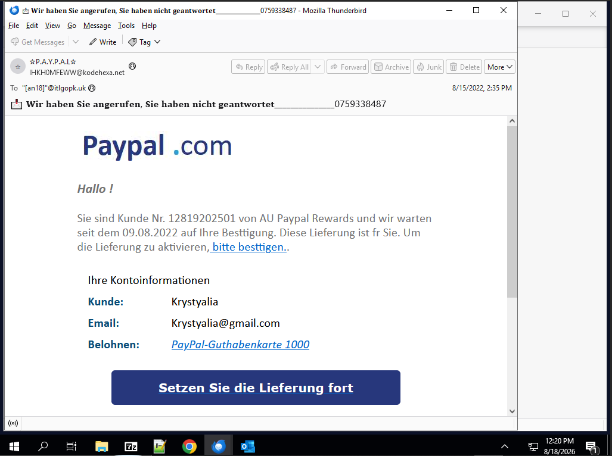
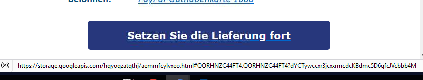
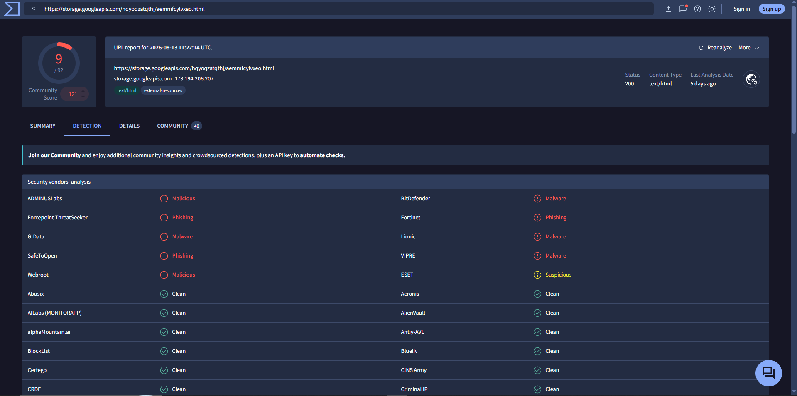

# SOC-005 — PayPal-Themed Credential Phishing Link

## Executive Summary

A phishing email impersonating **PayPal** was analyzed in an authorized phishing-analysis challenge.

The message used German-language PayPal branding, a reward/delivery lure, and recipient-specific information to encourage the user to continue a supposed delivery. The visible PayPal identity did not align with the sender address, Return-Path, transport infrastructure, or embedded destination.

The call-to-action redirected to:

`https://storage.googleapis.com/hqyoqzatqthj/aemmfcylvxeo.html`

VirusTotal classified the URL as malicious/phishing across multiple vendors.

**Final assessment: Malicious Phishing — High Confidence.**

No supplied evidence proves the recipient clicked the link or entered credentials.

---

## Case Information

| Field | Value |
|---|---|
| Portfolio Case ID | SOC-005 |
| Investigation Type | Phishing Email Challenge |
| Brand Impersonated | PayPal |
| Recipient | `krystyalia@gmail.com` |
| Displayed Sender | `?P.A.Y.P.A.L? <IHKH0MFEWW@kodehexa.net>` |
| Return-Path | `bounce@rjttznyzjjzydnillquh.designclub.uk.com` |
| Observed Sending IP | `134.195.196.43` |
| Additional Received Host | `efianalytics.com / 216.244.76.116` |
| Delivery Date | 2022-08-15 |
| Embedded Host | `storage.googleapis.com` |
| Final Assessment | **Malicious Phishing** |
| Confidence | **High** |
| User Interaction | Not established |

---

## 1. Email Content Review

The email attempted to establish legitimacy through:

- PayPal branding
- a customer/reward narrative
- recipient-specific information
- a prominent call-to-action
- a purported PayPal reward/gift-card offer

Suspicious indicators included:

- brand impersonation
- unexpected reward/delivery claim
- pressure to continue/confirm delivery
- sender infrastructure unrelated to PayPal
- hidden destination behind a legitimate-looking button

---

## 2. Header Analysis

Relevant observations:

`From: "?P.A.Y.P.A.L?" <IHKH0MFEWW@kodehexa.net>`

`Return-Path: bounce@rjttznyzjjzydnillquh.designclub.uk.com`

`Received-SPF: pass`

`Authenticated SPF domain: rjttznyzjjzydnillquh.designclub.uk.com`

`Observed sending IP: 134.195.196.43`

Additional Received-chain entries included `efianalytics.com` and IP `216.244.76.116`.

### Analyst Interpretation

The key issue is **identity misalignment**, not an SPF failure.

SPF passed for the envelope-sender domain `designclub.uk.com`, but that does not validate the visible PayPal identity or the displayed sender domain `kodehexa.net`.

This is why analysts should correlate:

- From
- Return-Path
- Received chain
- SPF-authenticated domain
- visible brand
- embedded destination

rather than treating `spf=pass` as proof of legitimacy.

Additional anomalies included:

- `To: <[an18]@itlgopk.uk>`
- `Envelope-To: <krystyalia@gmail.com>`
- `Message-Id: <-@vevida.net>`

These inconsistencies further reduced trust in the message.

---

## 3. Link Analysis

The embedded URL was:

`https://storage.googleapis.com/hqyoqzatqthj/aemmfcylvxeo.html#QORHNZC44FT4.QORHNZC44FT4?dYCTywccxr3jcxxrmcdcKBdmc5D6qfcJVcbbb4M`

The destination did not belong to PayPal.

The attacker abused a legitimate cloud-hosting service, demonstrating that a trusted parent domain does not automatically make hosted content trustworthy.

---

## 4. Threat-Intelligence Validation

VirusTotal showed multiple vendors classifying the destination as:

- malicious
- phishing
- malware
- suspicious

The user-recorded SHA-256 associated with the URL analysis was:

`13945ecc33afee74ac7f72e1d5bb73050894356c4bf63d02a1a53e76830567f5`

This should be treated as a **URL-analysis identifier/hash**, not automatically as a downloaded-file hash.

---

## 5. Analyst Decision Points

**Does the email genuinely originate from PayPal?** No.

**Does SPF passing make the message legitimate?** No. SPF passed only for an unrelated envelope-sender domain.

**Is the embedded destination consistent with PayPal?** No.

**Is the destination malicious?** Yes — High Confidence.

**Did the recipient click the link?** Not established.

**Final classification?** **Malicious Phishing — High Confidence.**

---

## 6. Evidence vs Inference

### Direct Evidence

- PayPal branding displayed
- visible sender used `kodehexa.net`
- Return-Path used `designclub.uk.com`
- SPF passed for the Return-Path domain
- sending infrastructure was unrelated to PayPal
- embedded link used `storage.googleapis.com`
- VirusTotal classified the URL as malicious/phishing
- message contained a call-to-action intended to drive user interaction

### Analyst Inference

The email was designed to impersonate PayPal and redirect the recipient to attacker-controlled content hosted on legitimate cloud infrastructure.

### Not Established

The evidence does not prove:

- user clicked the URL
- credentials were entered
- credentials were stolen
- malware was downloaded
- endpoint compromise occurred
- persistence occurred
- command-and-control occurred

---

## 7. MITRE ATT&CK Mapping

| Tactic | Technique | ID | Evidence |
|---|---|---|---|
| Initial Access | Spearphishing Link | **T1566.002** | Email contained a malicious link disguised as a PayPal call-to-action |

No User Execution, Credential Access, C2, or Exfiltration techniques are mapped because interaction was not demonstrated.

---

## 8. IOC / Artifact Record

| Value | Type | Assessment |
|---|---|---|
| `IHKH0MFEWW@kodehexa.net` | Sender | Suspicious/phishing sender identity |
| `bounce@rjttznyzjjzydnillquh.designclub.uk.com` | Return-Path | Case-associated envelope sender |
| `134.195.196.43` | IP | Observed sending infrastructure |
| `216.244.76.116` | IP | Additional Received-chain infrastructure |
| `storage.googleapis.com/hqyoqzatqthj/aemmfcylvxeo.html` | URL | Malicious phishing destination |
| `13945ecc33afee74ac7f72e1d5bb73050894356c4bf63d02a1a53e76830567f5` | URL analysis hash/identifier | Associated with URL analysis |

`storage.googleapis.com` itself is a legitimate Google service and should not be treated as globally malicious.

---

## 9. Final Assessment

### **MALICIOUS PHISHING — HIGH CONFIDENCE**

The verdict is supported by:

1. PayPal brand impersonation
2. sender/Return-Path identity mismatch
3. SPF validation of an unrelated domain
4. suspicious reward/delivery social engineering
5. non-PayPal call-to-action destination
6. malicious/phishing VirusTotal detections

---

## 10. Production SOC Analyst Note

> **Malicious Phishing — High Confidence.** A PayPal-themed email used unrelated sender and Return-Path infrastructure and directed the recipient to a Google Cloud Storage-hosted HTML page. SPF passed only for the unrelated envelope-sender domain and does not validate the displayed PayPal identity. VirusTotal classified the embedded destination as malicious/phishing. No evidence supplied confirms that the recipient clicked the link or entered credentials. Recommend blocking the specific malicious URL/object, searching for matching campaign indicators, and reviewing web/authentication telemetry for recipient interaction.

---

## 11. Recommended Production Follow-Up

- search email logs for the same sender
- search for the Return-Path domain
- search for matching subject/content templates
- search mailboxes for the embedded URL
- inspect proxy/DNS logs for the exact malicious object
- identify users who accessed the URL
- review authentication activity for affected users
- reset credentials only where interaction or compromise is supported
- block the specific malicious URL/object
- avoid blanket blocking `storage.googleapis.com`

---

## 12. Detection Engineering Opportunities

### Brand / Sender Misalignment

`visible_brand = PayPal AND sender_domain NOT IN approved_paypal_domains`

### SPF Pass + Identity Misalignment

`spf = pass AND header_from_domain != envelope_sender_domain AND displayed_brand does not align`

### Trusted Cloud Hosting Abuse

Raise risk when links to legitimate cloud-hosting providers contain suspicious or known-malicious hosted objects.

---

## 13. Lessons Learned

1. SPF pass is not the same as sender legitimacy.
2. From, Return-Path, Received chain, and authenticated domains must be correlated.
3. Hovering links can immediately expose brand/destination mismatch.
4. Legitimate cloud infrastructure can host phishing content.
5. Reputation supports a verdict but should not replace header/content analysis.
6. Credential compromise should not be claimed without interaction evidence.

---

## Skills Demonstrated

- phishing email analysis
- raw-header analysis
- SPF interpretation
- sender-domain alignment analysis
- social-engineering identification
- URL extraction
- threat-intelligence enrichment
- cloud-hosting abuse recognition
- IOC classification
- MITRE ATT&CK mapping
- evidence-vs-inference discipline
- professional SOC documentation

---

## Training Context

This investigation was completed in an **authorized phishing-analysis challenge environment**.

The report focuses on analyst reasoning, evidence, and defensible conclusions rather than reproducing challenge answers.
