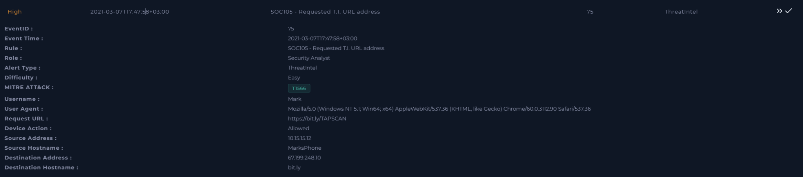
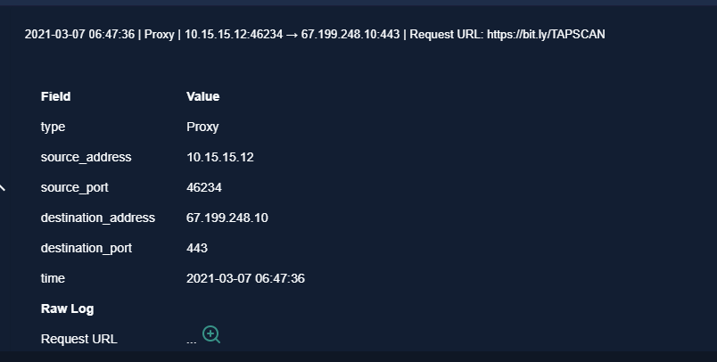
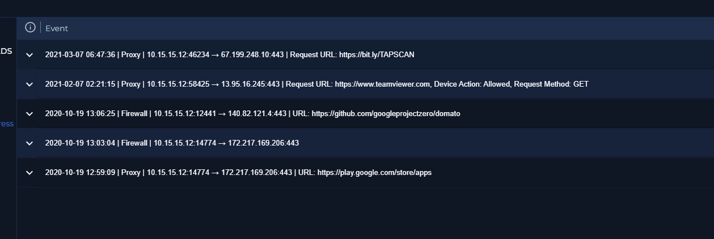
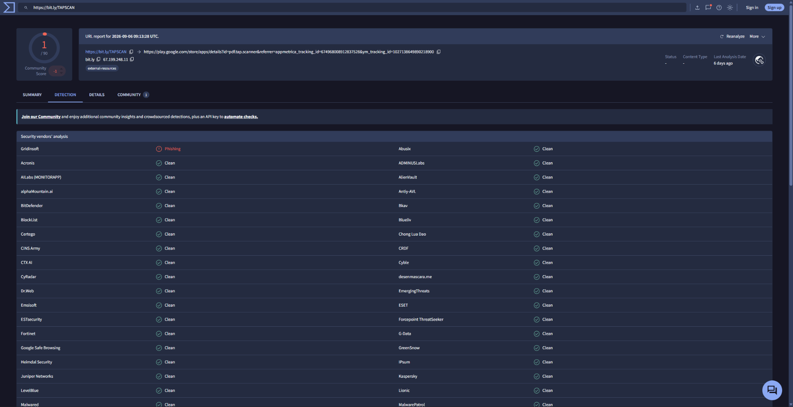
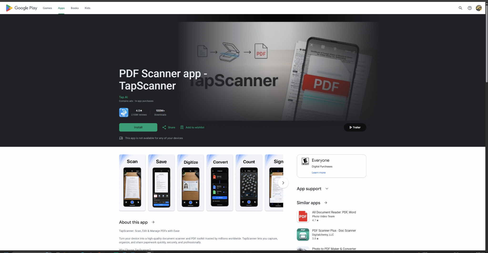

# SOC-018 — Threat Intelligence URL Alert — TapScanner Redirect

## Executive Summary

A high-severity threat-intelligence alert triggered after host `MarksPhone` (`10.15.15.12`) requested the shortened URL:

```text
https://bit.ly/TAPSCAN
```

The proxy allowed the request. The URL was enriched using third-party threat-intelligence data and was found to redirect to the legitimate Google Play listing for **PDF Scanner app — TapScanner**.

VirusTotal showed only **1 vendor flagging the shortened URL as phishing**, while the overwhelming majority of engines returned no malicious verdict. No supporting evidence of malware delivery, credential harvesting, exploitation, or other malicious follow-on activity was observed in the supplied telemetry.

**Final Verdict: False Positive / Non-Malicious URL Request**

**Confidence: Moderate–High**

> The confidence is not absolute because the investigation relies partly on retrospective URL reputation and the current redirect destination. A shortened URL should always be evaluated together with its redirect chain and event-time telemetry.

---

## Case Information

| Field | Value |
|---|---|
| Case ID | SOC-018 |
| Event ID | 75 |
| Event Time | 2021-03-07T17:47:58+03:00 |
| Rule | SOC105 - Requested T.I. URL address |
| Alert Type | ThreatIntel |
| Severity | High |
| Difficulty | Easy |
| Alert ATT&CK Metadata | T1566 |
| Username | Mark |
| Source IP | 10.15.15.12 |
| Source Hostname | MarksPhone |
| Destination IP | 67.199.248.10 |
| Destination Hostname | bit.ly |
| Request URL | https://bit.ly/TAPSCAN |
| Device Action | Allowed |
| Verdict | False Positive |
| Confidence | Moderate–High |

---

## Alert Evidence



The alert reported a request to the shortened Bitly URL from `MarksPhone`.

Important alert fields:

```text
Source:      10.15.15.12
Destination: 67.199.248.10
Hostname:    bit.ly
Request URL: https://bit.ly/TAPSCAN
Action:      Allowed
```

The alert also supplied ATT&CK technique `T1566`.

This is treated as **alert metadata**, not automatically as analyst-confirmed ATT&CK evidence.

---

## Initial Hypothesis

The rule appears to have triggered because the requested URL matched threat-intelligence data.

Initial possibilities included:

1. malicious shortened URL;
2. phishing redirect;
3. drive-by malware delivery;
4. legitimate shortened URL incorrectly present in threat intelligence.

The investigation therefore focused on:

- validating the actual proxy request;
- resolving the shortened URL;
- reviewing reputation;
- identifying the destination content;
- checking available host activity for suspicious follow-on behavior.

---

## Proxy Validation



The proxy log confirms the request:

```text
Time:             2021-03-07 06:47:36
Type:             Proxy
Source IP:        10.15.15.12
Source Port:      46234
Destination IP:   67.199.248.10
Destination Port: 443
Request URL:      https://bit.ly/TAPSCAN
```

This establishes that the shortened URL was actually requested.

### Analyst Decision Point

`67.199.248.10` is the infrastructure reached for the Bitly request. It should **not** be interpreted as the final application-hosting destination without following the redirect chain.

---

## Host / Historical Log Context



Other logs associated with `10.15.15.12` included older requests involving:

- TeamViewer
- GitHub
- Google Play

These records are **historical context only**.

They do not prove malicious or benign activity for Event ID 75 by themselves.

### Evidence Separation

```text
Direct case evidence:
→ 2021-03-07 Bitly request

Historical context:
→ older TeamViewer / GitHub / Google Play activity
```

This distinction prevents unrelated host history from being used to overstate the case.

---

## Threat Intelligence Enrichment



The shortened URL was analyzed in VirusTotal.

Observed result:

```text
1 / 90 security vendors flagged the URL
```

One engine labeled the URL as phishing, while the large majority did not identify it as malicious.

The analysis also showed the redirect target as a Google Play URL for the TapScanner application.

### Analyst Decision Point

A single reputation-engine detection is **not sufficient** to classify a URL as malicious.

Threat-intelligence reputation must be combined with:

- redirect destination;
- page content;
- event-time behavior;
- endpoint/network evidence;
- additional independent indicators.

---

## Redirect Destination

The shortened URL resolved to:

```text
https://play.google.com/store/apps/details?id=pdf.tap.scanner
```



The destination displayed the legitimate Google Play listing for:

```text
PDF Scanner app — TapScanner
```

The supplied screenshot showed a well-established application listing with a substantial install base and user-review history.

No credential-harvesting page, exploit landing page, executable download, or other obviously malicious destination was observed.

---

## Important Limitation: Retrospective URL Resolution

The alert occurred in **2021**, while the enrichment screenshot reflects a much later analysis.

Therefore the strongest defensible statement is:

> The shortened URL currently resolves to a legitimate Google Play TapScanner listing, and no supplied telemetry demonstrates malicious follow-on activity for the 2021 event.

This is more precise than claiming that the redirect destination could never have been different historically.

---

## User-Agent Observation

The alert recorded:

```text
Mozilla/5.0 (Windows NT 5.1; Win64; x64)
AppleWebKit/537.36
Chrome/60.0.3112.90
```

while the source hostname is:

```text
MarksPhone
```

This is an apparent telemetry/context inconsistency.

Possible explanations include:

- naming convention unrelated to physical device type;
- stale asset naming;
- browser/device telemetry normalization;
- lab-data inconsistency.

There is not enough evidence to treat this discrepancy as malicious.

---

## Timeline

| Time | Activity |
|---|---|
| 2021-03-07 06:47:36 | Proxy records request to `https://bit.ly/TAPSCAN` |
| 2021-03-07 17:47:58+03:00 | SOC105 threat-intelligence alert recorded |
| Investigation | URL enriched using third-party threat-intelligence data |
| Investigation | Short URL observed redirecting to Google Play TapScanner listing |
| Investigation | No malicious follow-on activity identified in supplied evidence |

> The difference between proxy/log display times and alert timestamp should be retained as recorded rather than artificially normalized without verified timezone context.

---

## Artifact

| Type | Value | Context |
|---|---|---|
| URL | `https://bit.ly/TAPSCAN` | Triggering shortened URL |
| URL | `https://play.google.com/store/apps/details?id=pdf.tap.scanner` | Observed redirect destination |
| IP | `67.199.248.10` | Bitly destination IP from proxy telemetry |
| Host | `MarksPhone` | Source hostname |
| IP | `10.15.15.12` | Source IP |

### Artifact Handling Note

The Bitly IP should not be blocklisted solely because it appeared in the alert. Shared URL-shortening infrastructure can host large volumes of legitimate traffic.

---

## MITRE ATT&CK Assessment

### Alert-Provided Mapping

```text
T1566 — Phishing
```

### Analyst-Confirmed Mapping

**None.**

The available evidence confirms a URL request but does **not** independently establish:

- phishing-message delivery;
- malicious email delivery;
- social-engineering delivery;
- credential harvesting;
- malicious payload execution.

Therefore `T1566` remains alert metadata rather than an analyst-confirmed ATT&CK mapping.

---

## Scope Assessment

Evidence supports:

```text
1 source host
1 source IP
1 shortened URL request
1 Bitly destination
```

No evidence supplied indicates:

- multiple affected users;
- malware execution;
- credential compromise;
- C2 communication;
- persistence;
- lateral movement;
- data exfiltration.

---

## Analyst Decision Points

### 1. Did the alert fire on a real request?

**Yes.**

The proxy log confirms the Bitly URL was requested.

### 2. Does one VirusTotal detection make the URL malicious?

**No.**

Reputation is supporting evidence, not a verdict.

### 3. What did the short URL lead to?

The observed redirect was the legitimate Google Play listing for TapScanner.

### 4. Was malicious follow-on behavior observed?

**No evidence of malicious follow-on activity was supplied.**

### 5. Is T1566 confirmed?

**No.**

The available telemetry does not prove phishing delivery.

### 6. Final classification?

**False Positive / Non-Malicious URL Request.**

---

## Verdict

### False Positive

The alert correctly identified a URL contained in threat-intelligence data, but the investigation did not substantiate malicious activity.

Supporting factors:

- the URL currently redirects to a legitimate Google Play application listing;
- only one VirusTotal engine flagged it;
- most engines did not classify it as malicious;
- no malicious payload or phishing destination was observed;
- no supporting compromise evidence was identified in the supplied telemetry.

**Confidence: Moderate–High**

---

## Detection Engineering Opportunities

The alert demonstrates why threat-intelligence URL detections should not depend on feed membership alone.

A stronger detection strategy could combine:

```text
Threat-intelligence match
+
redirect-chain analysis
+
destination reputation
+
URL age / feed confidence
+
endpoint behavior
+
follow-on network activity
```

### Suggested Tuning

1. Include CTI source and confidence in the alert.
2. Resolve shortened URLs before increasing severity.
3. Distinguish shared infrastructure from final destination.
4. Correlate URL access with:
   - file download;
   - browser exploit behavior;
   - endpoint process execution;
   - credential submission;
   - suspicious child processes.
5. Expire stale threat-intelligence indicators.
6. Avoid permanent blocklisting of common URL-shortening infrastructure without destination-level evidence.

---

## Skills Demonstrated

- Threat-intelligence alert triage
- Proxy-log validation
- URL reputation analysis
- Redirect-chain reasoning
- IOC contextualization
- False-positive analysis
- Evidence vs inference separation
- MITRE ATT&CK validation
- Shared-infrastructure awareness
- Detection-tuning recommendations

---

## Lessons Learned

### Reputation is not a verdict

```text
1 vendor detection
≠ confirmed malicious URL
```

### Shortened URLs require redirect analysis

The analyst must identify the final destination before making a decision.

### Shared infrastructure requires context

Blocking Bitly infrastructure based on a single alert could create significant legitimate-user impact.

### ATT&CK mappings require evidence

A URL request alone does not prove phishing.

### Historical context must remain separate

Older activity on the same host can support context but should not be attributed to the current alert without evidence.

---

## Training Context

This investigation was completed in an authorized LetsDefend SOC training environment. Screenshots are included to demonstrate the investigation process and analyst reasoning rather than to provide a quiz-answer walkthrough.
