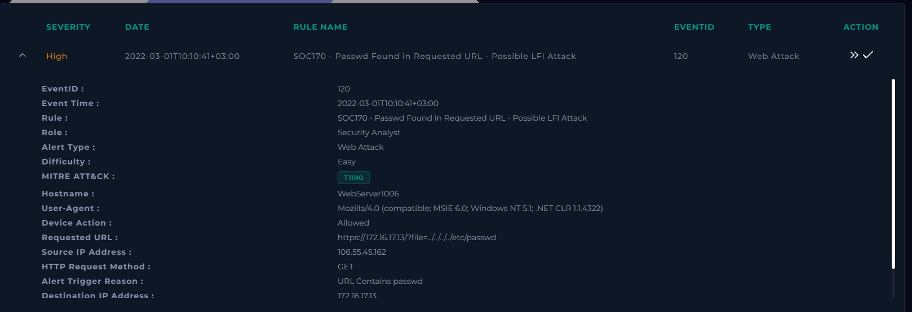
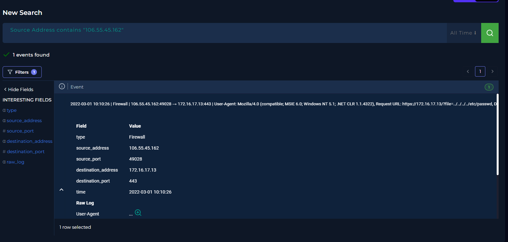
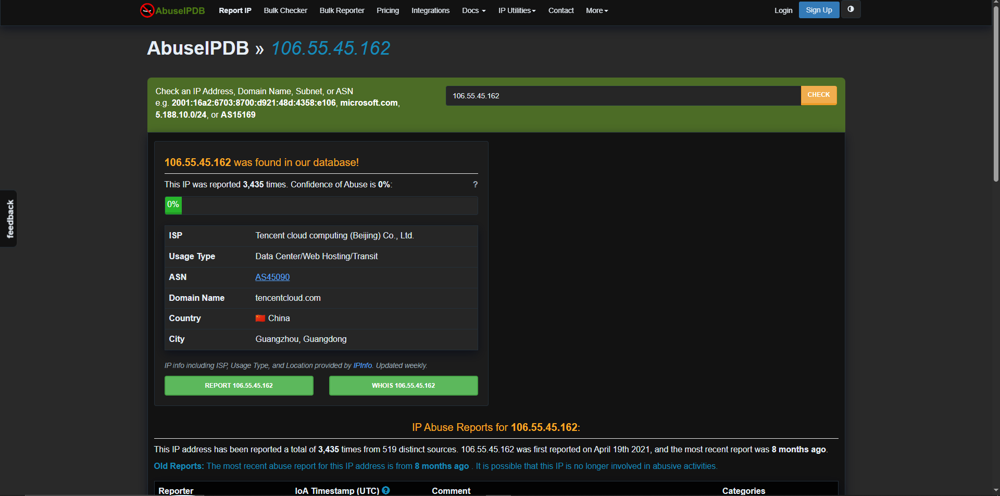
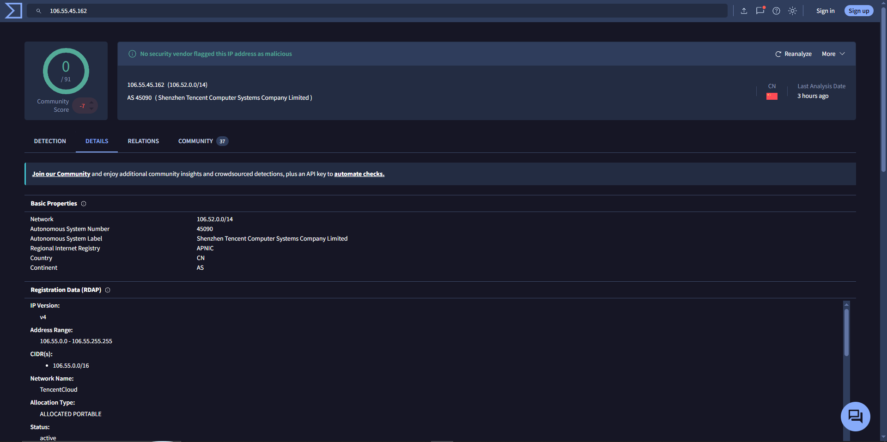
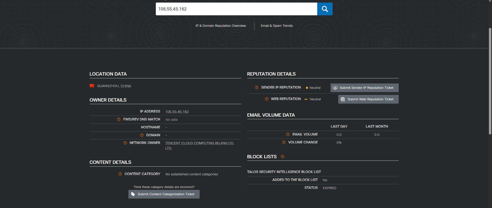
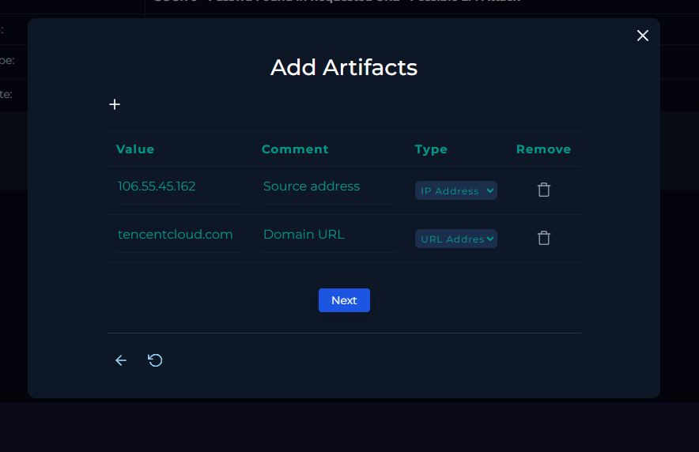

# SOC-006 — Local File Inclusion / Directory Traversal Attempt

## Executive Summary

A **high-severity web attack alert**, `SOC170 - Passwd Found in Requested URL - Possible LFI Attack`, was investigated after an external source attempted to access the Linux `/etc/passwd` file on public-facing web server `WebServer1006`.

The HTTP GET request targeted:

```text
https://172.16.17.13/?file=../../../../etc/passwd
```

The payload contains repeated directory-traversal sequences (`../`) followed by `/etc/passwd`, a sensitive local Linux file commonly targeted during Local File Inclusion (LFI) and path-traversal testing.

The request was permitted by the network security control, but the application returned:

```text
HTTP Status: 500
HTTP Response Size: 0
```

Based on the supplied telemetry, the malicious request reached the server but **no successful file disclosure was observed**. The event is therefore classified as a **True Positive — Unsuccessful LFI/Directory Traversal Attempt**.

Tier 2 escalation was not required under the lab playbook because the Internet-originated attack did not show successful exploitation.

---

## Case Information

| Field | Value |
|---|---|
| Portfolio Case ID | SOC-006 |
| Platform Alert | SOC170 - Passwd Found in Requested URL - Possible LFI Attack |
| Event ID | 120 |
| Alert Type | Web Attack |
| Severity | High |
| Difficulty | Easy |
| Event Time | 2022-03-01T10:10:41+03:00 |
| Hostname | `WebServer1006` |
| Destination IP | `172.16.17.13` |
| Source IP | `106.55.45.162` |
| HTTP Method | GET |
| Device Action | Allowed / Permitted |
| Requested Resource | `?file=../../../../etc/passwd` |
| HTTP Status | 500 |
| HTTP Response Size | 0 bytes |
| Traffic Direction | Internet → Company |
| Platform MITRE ATT&CK | T1190 |
| Final Verdict | **True Positive** |
| Exploitation Outcome | **No successful disclosure observed** |
| Confidence | **High** |
| Tier 2 Escalation | Not required |

---

## 1. Initial Alert Triage

The alert identified an inbound request containing the string `passwd`.



Important fields:

```text
Source IP:      106.55.45.162
Destination IP: 172.16.17.13
Hostname:       WebServer1006
Method:         GET
URL:            https://172.16.17.13/?file=../../../../etc/passwd
Device Action:  Allowed
```

### Initial Analyst Hypothesis

The request appeared to be an attempt to exploit a file-handling parameter by traversing outside the intended application directory and retrieving `/etc/passwd`.

The investigation therefore needed to answer:

1. Was the request genuinely malicious?
2. Was the traffic external or internal?
3. Was it part of an authorized test?
4. Did the server disclose the requested file?
5. Was escalation required?

---

## 2. Why the Alert Triggered

The rule triggered because the requested URL contained the sensitive filename:

```text
passwd
```

More importantly, the request also contained the traversal sequence:

```text
../../../../
```

which attempts to move upward through the server's directory structure.

The complete path:

```text
?file=../../../../etc/passwd
```

is strongly consistent with an **LFI / directory traversal attempt** against a vulnerable file parameter.

---

## 3. HTTP Evidence Analysis

Log Management showed one correlated event from the source IP.



| Field | Observation |
|---|---|
| Source IP | `106.55.45.162` |
| Source Port | `49028` |
| Destination IP | `172.16.17.13` |
| Destination Port | `443` |
| Traffic Type | Firewall |
| HTTP Method | GET |
| URL | `https://172.16.17.13/?file=../../../../etc/passwd` |
| Device Action | Permitted |
| User-Agent | `Mozilla/4.0 (compatible; MSIE 6.0; Windows NT 5.1; .NET CLR 1.1.4322)` |
| HTTP Status | `500` |
| Response Size | `0` |
| Event Time | `2022-03-01 10:10:26` |

### Analyst Interpretation

The request itself is malicious because it explicitly attempts to access `/etc/passwd` through directory traversal.

However, `HTTP 500` plus a response size of `0` does **not** show successful file disclosure.

The safest conclusion is:

> The server received and processed a malicious traversal/LFI request, but the supplied response telemetry contains no evidence that `/etc/passwd` content was returned.

The User-Agent appears old and browser-like, but that alone is insufficient to determine whether the attack was manual or automated because User-Agent strings are easily spoofed.

---

## 4. Source-IP Enrichment

The source IP was:

```text
106.55.45.162
```

The analyst checked multiple reputation sources.

### AbuseIPDB



Observed context included:

- Tencent Cloud ownership
- data-center / web-hosting usage
- China-based infrastructure
- historical reports present
- current displayed abuse confidence score: 0%

### VirusTotal



VirusTotal showed no security vendor directly flagging the IP as malicious at the time of analysis, while the community score was slightly negative.

### Cisco Talos



Talos showed neutral reputation.

### Analyst Decision

IP reputation was **not** used as the primary basis for the verdict.

The reputation results were mixed/neutral, but the HTTP payload itself was unambiguously malicious.

> A neutral IP reputation does not make a malicious request benign.

---

## 5. Asset Context

The targeted system was:

```text
Hostname: WebServer1006
IP:       172.16.17.13
Owner:    webadmin11
```

Last user logon:

```text
2022-02-19 13:01:39
```

### Traffic Direction

```text
Internet → Company
```

The source infrastructure was external and associated with Tencent Cloud.

---

## 6. Malicious Traffic Determination

### Is the traffic malicious?

**Yes.**

Evidence:

- traversal sequence `../../../../`
- sensitive Linux target `/etc/passwd`
- attacker-controlled `file=` parameter
- external Internet source
- no approved testing context identified

### Attack Type

**Local File Inclusion / Directory Traversal**

The request attempts to manipulate a local file parameter to access a server-side file outside the intended directory.

---

## 7. Planned-Test Validation

The investigation checked whether the event could have been caused by an authorized penetration test or attack-simulation platform.

### Findings

- no planned-test notification was identified
- source IP was external
- source did not belong to known attack-simulation infrastructure
- source was associated with public Tencent Cloud infrastructure

### Decision

```text
Planned Test: No
```

---

## 8. Attack Success Assessment

### Attack Attempt

**Confirmed.**

### Exploitation Attempt

**Confirmed.**

The payload was sent to the application and permitted by the network security control.

### Successful File Disclosure

**Not observed.**

Evidence:

```text
HTTP Response Status: 500
HTTP Response Size:   0
```

### Confirmed Impact

**Not established.**

There is no evidence in the supplied telemetry that:

- `/etc/passwd` contents were returned
- a local file was disclosed
- arbitrary code executed
- credentials were exposed
- the web server was compromised

### Important Evidence Principle

A `500 Internal Server Error` suggests the application encountered an error, but it should not be treated as absolute proof that exploitation was impossible.

The defensible conclusion is:

> **No successful exploitation or file disclosure is demonstrated by the available response telemetry.**

---

## 9. Analyst Decision Points

**Why did the rule trigger?**  
Because the URL contained `passwd` and a traversal sequence.

**Is the request malicious?**  
Yes.

**Is this LFI / directory traversal?**  
Yes.

**Is the traffic external?**  
Yes — Internet → Company.

**Is this an authorized test?**  
No evidence of one.

**Did the attack succeed?**  
No successful disclosure observed.

**Is Tier 2 escalation required?**  
No, under the lab playbook, because the Internet-originated attack did not show successful exploitation.

**Final verdict?**  
**True Positive — High Confidence.**

---

## 10. Evidence vs Inference

### Direct Evidence

- SOC170 alert fired
- source IP `106.55.45.162`
- destination `172.16.17.13`
- target hostname `WebServer1006`
- GET request used
- URL contained `../../../../etc/passwd`
- device action was Allowed / Permitted
- HTTP status was `500`
- response size was `0`
- traffic originated externally
- no planned test was identified

### Analyst Inference

The request was intended to exploit a directory traversal/LFI weakness to retrieve `/etc/passwd`.

### Not Established

The evidence does not prove:

- file disclosure
- web-shell placement
- remote code execution
- credential theft
- persistence
- lateral movement
- command and control
- exfiltration

---

## 11. MITRE ATT&CK Mapping

The platform mapped this event to:

```text
T1190 — Exploit Public-Facing Application
```

This is a reasonable high-level mapping because the attacker attempted to exploit a public-facing web application by manipulating a vulnerable file parameter.

| Tactic | Technique | ID | Evidence |
|---|---|---|---|
| Initial Access | Exploit Public-Facing Application | **T1190** | External request attempted LFI/path traversal against the web server |

No post-exploitation techniques are mapped because the supplied evidence does not show successful compromise.

---

## 12. Scope Assessment

| Scope Area | Assessment |
|---|---|
| Source | `106.55.45.162` |
| Target | `WebServer1006` |
| Destination IP | `172.16.17.13` |
| Direction | Internet → Company |
| Attack Type | LFI / Directory Traversal |
| Request Permitted | Yes |
| File Disclosure | Not observed |
| Code Execution | Not observed |
| Credential Exposure | Not observed |
| Persistence | Not observed |
| Lateral Movement | Not observed |
| C2 | Not observed |
| Exfiltration | Not observed |
| Tier 2 Escalation | Not required |

---

## 13. IOC / Artifact Record



| Value | Type | Assessment |
|---|---|---|
| `106.55.45.162` | Source IP | Malicious source in this event |
| `tencentcloud.com` | Infrastructure context | Hosting provider associated with source IP |

### IOC Handling Note

`tencentcloud.com` is a legitimate cloud provider and should **not** be treated as globally malicious.

The malicious indicator in this incident is the observed source IP and request behavior, not the provider as a whole.

---

## 14. Final Verdict

# **TRUE POSITIVE — UNSUCCESSFUL LFI / DIRECTORY TRAVERSAL ATTEMPT**

**Confidence: High**

The alert correctly identified malicious web traffic.

The verdict is supported by:

1. explicit directory traversal
2. targeting of `/etc/passwd`
3. external source
4. no authorized-test context
5. permitted request reaching the server
6. no evidence of successful file disclosure
7. HTTP `500` and `0-byte` response

---

## 15. Production SOC Analyst Note

> **True Positive — Unsuccessful LFI/Directory Traversal Attempt.** SOC170 detected an external GET request from `106.55.45.162` targeting `WebServer1006` (`172.16.17.13`) with the payload `?file=../../../../etc/passwd`. The request was permitted and is consistent with an attempt to traverse the filesystem and retrieve `/etc/passwd`. Source enrichment associated the IP with Tencent Cloud infrastructure; reputation sources were neutral/mixed and were not used as the primary basis for classification. The server returned HTTP `500` with response size `0`, and no successful file disclosure or follow-on compromise is demonstrated in the available telemetry. No planned test was identified. Final disposition: True Positive, unsuccessful attempt; Tier 2 escalation not required under the lab procedure.

---

## 16. Recommended Production Follow-Up

In a production environment, I would also:

- search for additional requests from `106.55.45.162`
- search for other traversal payloads against the same server
- search for encoded variants such as `%2e%2e%2f`
- review WAF and reverse-proxy telemetry
- inspect application/server logs around the `500` response
- determine which application component handles the `file=` parameter
- validate server-side path canonicalization and input controls
- confirm the application cannot access arbitrary local files
- search for requests targeting `/etc/passwd`, `/etc/shadow`, `/proc/self/environ`, and application configuration files
- review whether similar requests came from other cloud-hosted IPs
- consider blocking or rate-limiting repeated malicious sources
- tune WAF rules for traversal and LFI payloads

---

## 17. Detection Engineering Opportunities

### Detection Hypothesis 1 — Path Traversal

Alert on repeated traversal patterns such as:

```text
../
..\
%2e%2e%2f
%2e%2e/
```

especially when combined with sensitive filenames.

### Detection Hypothesis 2 — Sensitive Local File Access

High-confidence pattern:

```text
file parameter
+
traversal sequence
+
sensitive target
```

Examples:

```text
/etc/passwd
/etc/shadow
/proc/self/environ
windows/win.ini
```

### Detection Hypothesis 3 — Repeated Web Exploitation

Escalate priority when the same source sends multiple exploit classes within a short window, such as:

- traversal/LFI
- SQL injection
- XSS
- command injection

### Potential False Positives

- authorized penetration testing
- vulnerability scanners
- internal QA/security validation
- malformed legitimate requests

False-positive handling should rely on source ownership, testing windows, and asset context—not reputation alone.

---

## 18. Lessons Learned

1. **The payload is stronger evidence than IP reputation.**  
   Neutral reputation did not make the request benign.

2. **Allowed traffic does not equal successful exploitation.**  
   The control permitted the request, but the application response did not show file disclosure.

3. **A 500 response should be interpreted carefully.**  
   It supports an unsuccessful outcome here, but application logs would provide stronger validation.

4. **LFI and directory traversal overlap operationally.**  
   The traversal sequence is the mechanism; local file access is the objective.

5. **Cloud-hosted infrastructure is not automatically malicious.**  
   The specific source behavior should drive the verdict.

6. **User-Agent strings are weak attribution evidence.**  
   A browser-like User-Agent does not prove the activity was manual.

7. **ATT&CK mapping should stop where the evidence stops.**  
   No post-exploitation techniques were assigned.

---

## Skills Demonstrated

- web attack alert triage
- HTTP request analysis
- path traversal recognition
- LFI identification
- firewall/log correlation
- HTTP response interpretation
- source-IP enrichment
- threat-intelligence comparison
- traffic-direction analysis
- planned-test validation
- attack-success assessment
- MITRE ATT&CK mapping
- evidence-vs-inference discipline
- escalation decision-making
- detection-engineering thinking
- professional SOC documentation

---

## Training Context

This investigation was completed in the **LetsDefend simulated SOC environment** as part of authorized SOC Analyst training.

The report focuses on investigation methodology, evidence interpretation, and defensive reasoning rather than reproducing the training-platform playbook.
