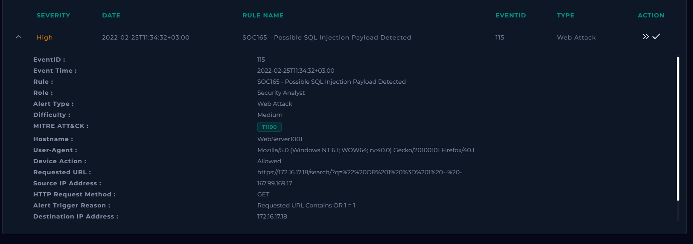
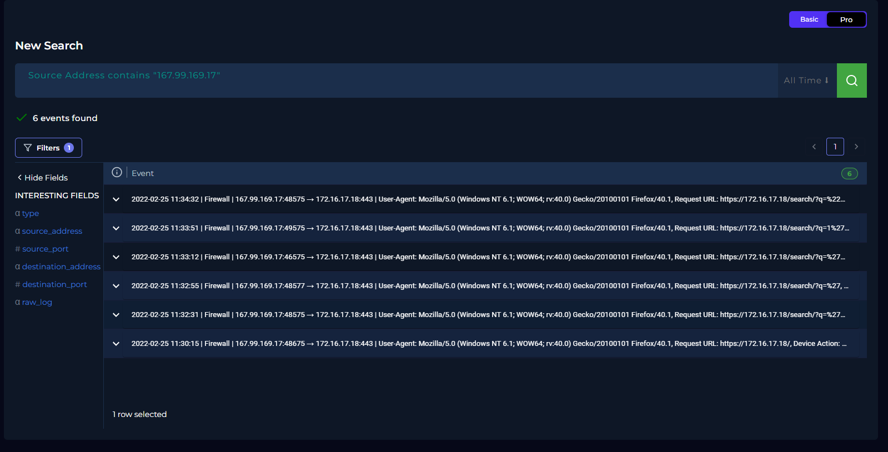
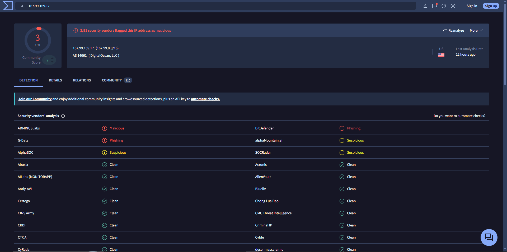
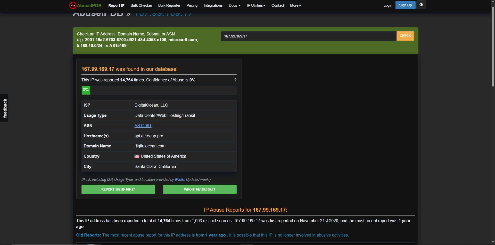
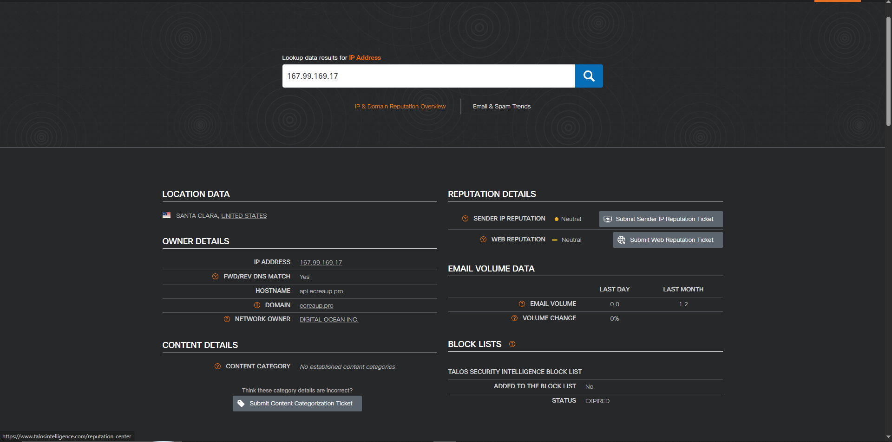
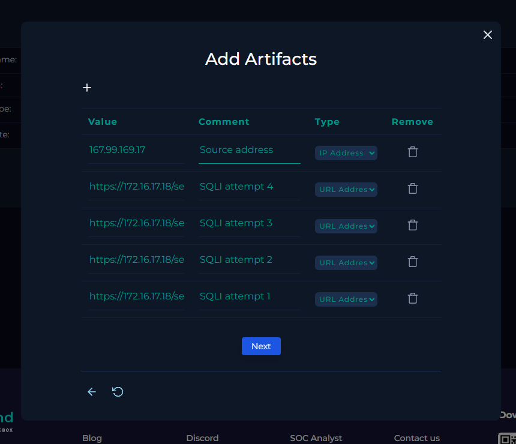

# SOC-007 — SQL Injection Attempts Against Web Search Parameter

## Executive Summary

A **high-severity web attack alert**, `SOC165 - Possible SQL Injection Payload Detected`, was investigated after an external source sent multiple SQL injection payloads to the search parameter of `WebServer1001` (`172.16.17.18`).

The activity originated from `167.99.169.17` and targeted the HTTPS search endpoint:

```text
https://172.16.17.18/search/?q=
```

At least four explicit SQL injection payloads were observed between `2022-02-25 11:32:31` and `11:34:32`, including boolean conditions, quote manipulation, and an `ORDER BY` probe.

All four documented SQLi requests returned:

```text
HTTP Status: 500
HTTP Response Size: 948 bytes
```

The repeated identical error response provides no evidence that the application returned database content or successfully executed the injected SQL. The event is therefore classified as a **True Positive — Unsuccessful SQL Injection Attempt**.

Tier 2 escalation was not required under the lab playbook because the attack originated from the Internet and no successful exploitation was demonstrated.

---

## Case Information

| Field | Value |
|---|---|
| Portfolio Case ID | SOC-007 |
| Platform Alert | SOC165 - Possible SQL Injection Payload Detected |
| Event ID | 115 |
| Alert Type | Web Attack |
| Severity | High |
| Difficulty | Medium |
| Event Time | 2022-02-25T11:34:32+03:00 |
| Hostname | `WebServer1001` |
| Destination IP | `172.16.17.18` |
| Source IP | `167.99.169.17` |
| HTTP Method | GET |
| Device Action | Allowed |
| Target Parameter | `q` |
| Platform MITRE ATT&CK | T1190 |
| Traffic Direction | Internet → Company Network |
| Final Verdict | **True Positive** |
| Exploitation Outcome | **No successful exploitation observed** |
| Confidence | **High** |
| Tier 2 Escalation | Not required |

---

## 1. Initial Alert Triage

The alert fired on a request containing the classic SQL expression `OR 1 = 1`.



The triggering request was:

```text
https://172.16.17.18/search/?q=%22%20OR%201%20%3D%201%20--%20-
```

Decoded:

```text
" OR 1 = 1 -- -
```

### Initial Analyst Hypothesis

The request appeared to be an intentional SQL injection attempt against the `q` search parameter.

The investigation needed to determine whether the traffic was genuinely malicious, whether multiple attempts occurred, whether the activity was an authorized test, whether exploitation succeeded, and whether escalation was required.

---

## 2. Log Correlation

Searching the source IP in Log Management returned multiple related events.



The activity targeted:

```text
WebServer1001
172.16.17.18:443
```

from:

```text
167.99.169.17
```

The event sequence shows repeated probing of the same search parameter rather than a single malformed request.

---

## 3. HTTP Evidence Analysis

Four explicit SQL injection attempts were documented:

| Time | Encoded Request | Decoded Payload | HTTP Status | Response Size |
|---|---|---|---:|---:|
| 11:32:31 | `?q=%27%20OR%20%271` | `' OR '1` | 500 | 948 |
| 11:33:12 | `?q=%27%20OR%20%27x%27%3D%27x` | `' OR 'x'='x` | 500 | 948 |
| 11:33:51 | `?q=1%27%20ORDER%20BY%203--%2B` | `1' ORDER BY 3--+` | 500 | 948 |
| 11:34:32 | `?q=%22%20OR%201%20%3D%201%20--%20-` | `" OR 1 = 1 -- -` | 500 | 948 |

These requests contain common SQL injection techniques:

- quote manipulation
- boolean conditions
- tautology-style testing
- SQL comments
- `ORDER BY` probing

The `ORDER BY 3` request is consistent with query-structure / column-count probing.

---

## 4. Attack Pattern Assessment

Multiple payload variations were sent against the same parameter over approximately two minutes.

This is more consistent with deliberate SQL injection probing than with accidental malformed search input.

The User-Agent was browser-like:

```text
Mozilla/5.0 (Windows NT 6.1; WOW64; rv:40.0) Gecko/20100101 Firefox/40.1
```

However, User-Agent strings are easily spoofed. The supplied evidence does not reliably establish whether the requests were manual, scripted, or generated by an automated SQL injection tool.

**Automation: Not established.**

---

## 5. Source-IP Enrichment

The source IP was `167.99.169.17`.

### VirusTotal



VirusTotal showed DigitalOcean infrastructure, several malicious/phishing detections, some suspicious classifications, and many clean/undetected vendors.

### AbuseIPDB



Observed:

- DigitalOcean, LLC
- Data Center / Web Hosting / Transit
- United States / Santa Clara
- historical abuse reports
- current displayed abuse-confidence score: 0%

### Cisco Talos



Talos displayed neutral sender and web reputation.

### Analyst Decision

Reputation was mixed and was not used as the primary basis for the verdict.

> A neutral or mixed reputation does not negate clearly malicious SQL injection payloads.

---

## 6. Traffic Direction and Asset Context

The source was external DigitalOcean-hosted infrastructure targeting the company web server:

```text
Internet → Company Network
```

Target:

```text
Hostname: WebServer1001
IP:       172.16.17.18
Port:     443
```

The requests were permitted by the security control.

---

## 7. Planned-Test Validation

No evidence was found for:

- an approved penetration test,
- a scheduled security exercise,
- or a known attack-simulation system.

**Planned Test: No**

---

## 8. Attack Success Assessment

### Attack Attempt

**Confirmed.**

### Exploitation Attempt

**Confirmed.**

The malicious requests reached the application.

### Successful SQL Injection

**Not observed.**

Every documented SQLi request returned:

```text
HTTP Status: 500
HTTP Response Size: 948 bytes
```

The identical response size suggests a consistent application error response rather than differentiated database output.

### Confirmed Impact

**Not established.**

The supplied evidence does not demonstrate:

- returned database records
- authentication bypass
- schema enumeration
- data modification
- command execution
- host compromise
- exfiltration

A `500 Internal Server Error` does not prove that no backend SQL was executed. The defensible conclusion is:

> **The requests were malicious SQL injection attempts, but successful exploitation is not demonstrated by the available telemetry.**

---

## 9. Analyst Decision Points

**Why did the alert trigger?**  
The requested URL contained `OR 1 = 1`.

**Was the traffic malicious?**  
Yes.

**Attack type?**  
SQL Injection.

**Were multiple attempts made?**  
Yes — at least four explicit SQLi payloads were documented.

**Traffic direction?**  
Internet → Company Network.

**Authorized test?**  
No evidence of one.

**Did the attack succeed?**  
No successful exploitation observed.

**Tier 2 escalation?**  
No, under the lab procedure.

**Final verdict?**  
**True Positive — High Confidence.**

---

## 10. Evidence vs Inference

### Direct Evidence

- SOC165 alert fired
- source IP `167.99.169.17`
- target `172.16.17.18`
- target hostname `WebServer1001`
- GET requests were used
- repeated SQL injection syntax was present
- at least four SQLi payloads were documented
- requests were allowed
- all four documented SQLi attempts returned HTTP `500`
- all four returned `948` bytes
- no planned test was identified

### Analyst Inference

The source was intentionally probing the search parameter for SQL injection weaknesses.

### Not Established

The evidence does not prove:

- successful database manipulation
- database enumeration
- data extraction
- authentication bypass
- command execution
- persistence
- lateral movement
- command and control
- exfiltration

---

## 11. MITRE ATT&CK Mapping

The platform mapped the event to:

```text
T1190 — Exploit Public-Facing Application
```

| Tactic | Technique | ID | Evidence |
|---|---|---|---|
| Initial Access | Exploit Public-Facing Application | **T1190** | External SQL injection attempts against a public-facing web application |

No post-exploitation techniques are mapped because successful compromise was not demonstrated.

---

## 12. Scope Assessment

| Scope Area | Assessment |
|---|---|
| Source IP | `167.99.169.17` |
| Source Infrastructure | DigitalOcean |
| Target | `WebServer1001` |
| Destination IP | `172.16.17.18` |
| Target Parameter | `q` |
| Attack Type | SQL Injection |
| Explicit SQLi Attempts | At least 4 |
| Traffic Direction | Internet → Company |
| Requests Allowed | Yes |
| Database Data Returned | Not observed |
| Authentication Bypass | Not observed |
| Command Execution | Not observed |
| Host Compromise | Not observed |
| Exfiltration | Not observed |
| Tier 2 Escalation | Not required |

---

## 13. IOC / Artifact Record



### Source IP

```text
167.99.169.17
```

### SQL Injection URLs

```text
https://172.16.17.18/search/?q=%27%20OR%20%271
https://172.16.17.18/search/?q=%27%20OR%20%27x%27%3D%27x
https://172.16.17.18/search/?q=1%27%20ORDER%20BY%203--%2B
https://172.16.17.18/search/?q=%22%20OR%201%20%3D%201%20--%20-
```

### Artifact Discipline

The target URLs are incident evidence, not external malicious infrastructure.

`digitalocean.com` is a legitimate hosting provider and should not be treated as a malicious IOC simply because the source IP was allocated there.

---

## 14. Final Verdict

# **TRUE POSITIVE — UNSUCCESSFUL SQL INJECTION ATTEMPT**

**Confidence: High**

The alert correctly identified malicious SQL injection activity.

The verdict is supported by:

1. repeated SQL injection syntax,
2. multiple payload variations,
3. external source,
4. deliberate targeting of the same search parameter,
5. no authorized-test context,
6. identical HTTP `500` error responses,
7. no evidence of database disclosure or follow-on compromise.

---

## 15. Production SOC Analyst Note

> **True Positive — Unsuccessful SQL Injection Attempts.** SOC165 detected repeated SQL injection payloads from external source `167.99.169.17` targeting the `q` parameter of `WebServer1001` (`172.16.17.18`). At least four explicit SQLi payloads were observed between 11:32:31 and 11:34:32, including boolean-condition and `ORDER BY` probes. All documented attempts were permitted by the network control but returned HTTP `500` with a consistent response size of `948` bytes. Source enrichment identified DigitalOcean-hosted infrastructure with mixed reputation results. No approved penetration test was identified. No database output, authentication bypass, command execution, or other successful impact is demonstrated in the available telemetry. Final disposition: True Positive, unsuccessful SQLi attempt; Tier 2 escalation not required under the lab procedure.

---

## 16. Recommended Production Follow-Up

- search for all requests from `167.99.169.17`
- identify additional SQLi payloads before/after the observed window
- search encoded variants of `' OR`, `" OR`, `UNION SELECT`, `ORDER BY`, `SLEEP(`, and `BENCHMARK(`
- review WAF logs
- inspect application/server error logs for the HTTP `500` responses
- review database logs if available
- validate parameterized queries / prepared statements for the `q` parameter
- check whether server errors expose database details
- hunt for follow-on requests to other endpoints
- consider rate limiting or blocking persistent malicious sources

---

## 17. Detection Engineering Opportunities

### Boolean SQL Injection

Detect combinations such as:

```text
OR 1=1
OR 'x'='x
OR "x"="x"
```

including URL-encoded variants.

### Query-Structure Probing

Detect:

```text
ORDER BY <number>
UNION SELECT
SELECT
CAST(
EXTRACTVALUE(
```

when found in user-controlled HTTP parameters.

### Repeated SQLi Against Same Parameter

Raise severity when:

```text
same source IP
+
same endpoint
+
same parameter
+
multiple SQLi payload variations
+
short time window
```

### Error Correlation

A useful enrichment condition is:

```text
SQLi payload
+
HTTP 5xx response
```

This can indicate that the request disrupted backend processing, though it does not prove exploitation success.

### Potential False Positives

- authorized penetration testing
- vulnerability scanners
- security QA
- search strings containing SQL-like text
- malformed legitimate requests

---

## 18. Lessons Learned

1. Repeated payload variation is stronger evidence than a single suspicious string.
2. URL decoding is essential for SQLi analysis.
3. HTTP `500` indicates an error, not successful exploitation.
4. Repeated response size can help assess application behavior.
5. Mixed IP reputation should not override clearly malicious request content.
6. A browser-like User-Agent does not prove manual activity.
7. ATT&CK mapping should stop at the observed exploit attempt when no post-exploitation evidence exists.

---

## Skills Demonstrated

- web attack alert triage
- SQL injection recognition
- URL decoding
- HTTP request analysis
- HTTP response interpretation
- multi-event log correlation
- source-IP enrichment
- attack-pattern analysis
- traffic-direction analysis
- planned-test validation
- attack-success assessment
- IOC/artifact handling
- MITRE ATT&CK mapping
- escalation decision-making
- evidence-vs-inference discipline
- detection-engineering thinking
- professional SOC reporting

---

## Training Context

This investigation was completed in the **LetsDefend simulated SOC environment** as part of authorized SOC Analyst training.

The report focuses on evidence, investigation methodology, and defensive reasoning rather than reproducing the training-platform playbook.
