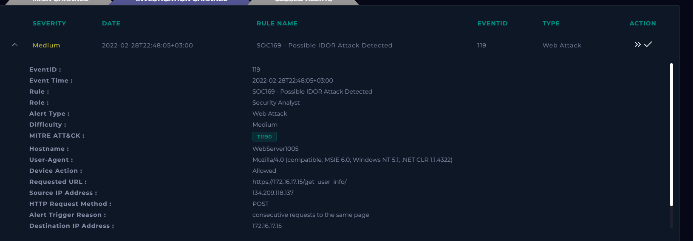
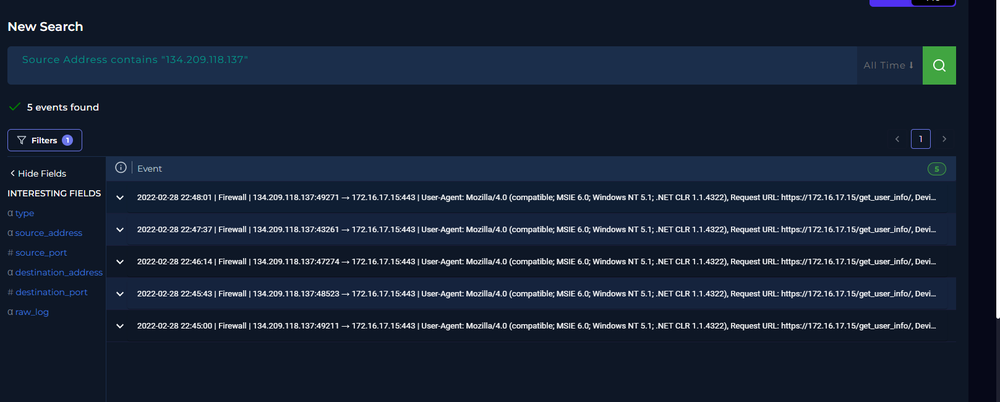
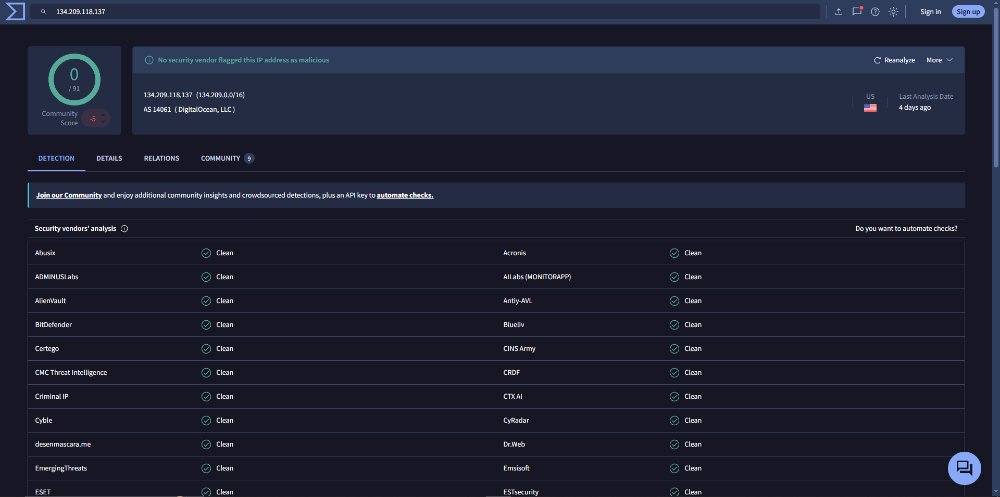
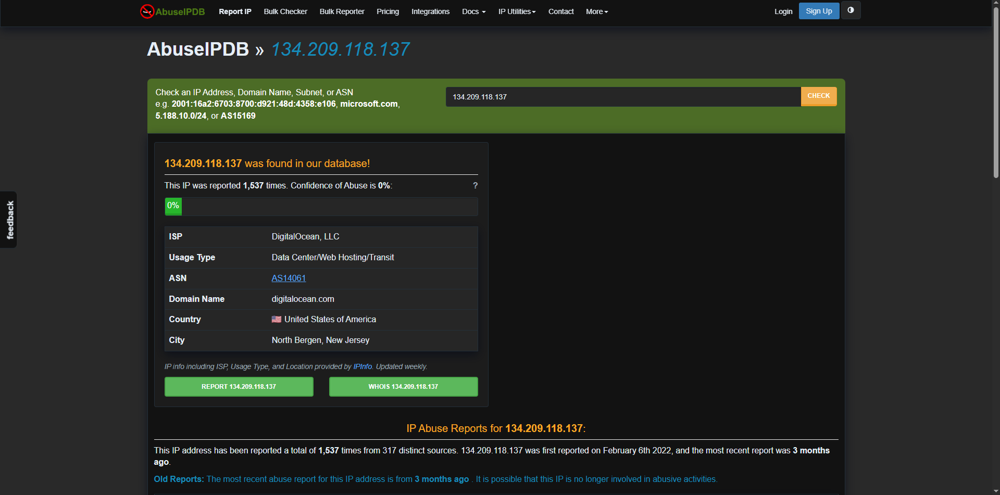
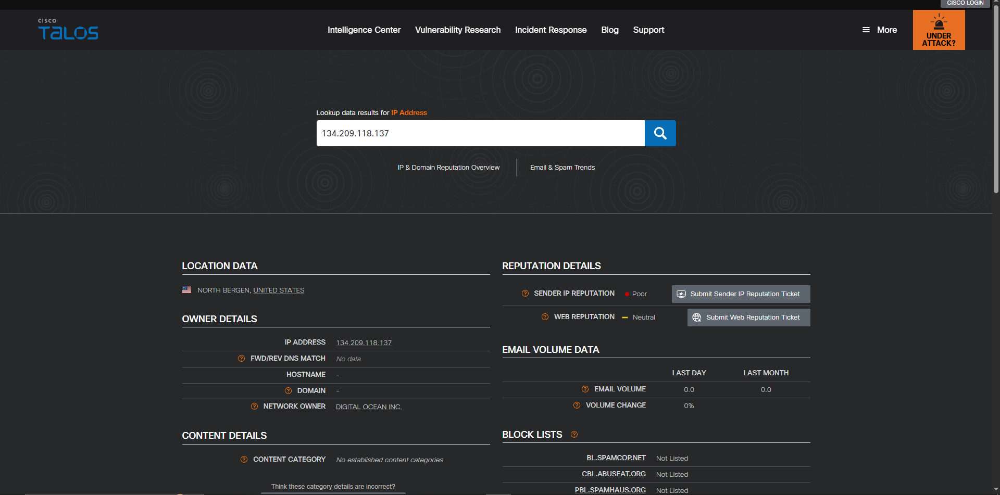
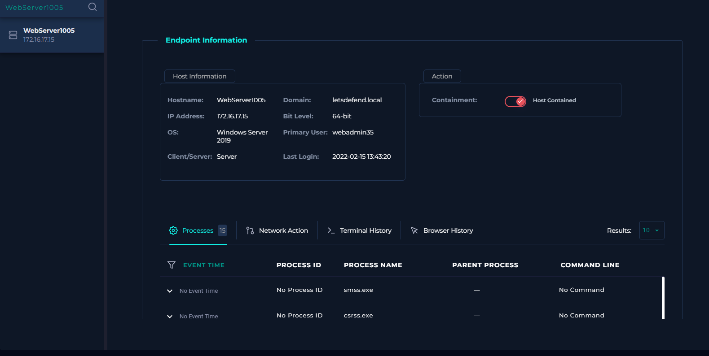
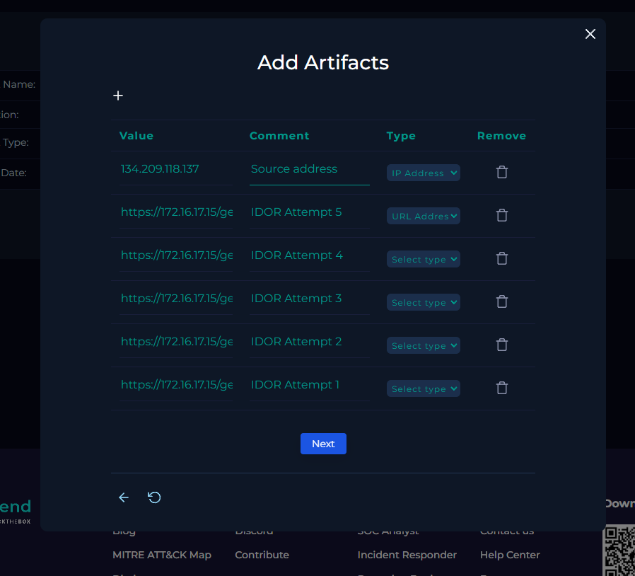

# SOC-008 — Successful IDOR Attack Against User Information Endpoint

## Executive Summary

A **medium-severity web attack alert**, `SOC169 - Possible IDOR Attack Detected`, was investigated after an external source repeatedly submitted POST requests to the same user-information endpoint on `WebServer1005`.

The source IP `134.209.118.137` sent five requests to:

```text
https://172.16.17.15/get_user_info/
```

while changing the object identifier from `user_id=1` through `user_id=5`.

All five requests were permitted and returned **HTTP 200 OK**, with different response sizes:

```text
user_id=1 → 188 bytes
user_id=2 → 253 bytes
user_id=3 → 351 bytes
user_id=4 → 158 bytes
user_id=5 → 267 bytes
```

The combination of sequential object enumeration, consistent successful HTTP responses, and different response sizes is strongly consistent with an **Insecure Direct Object Reference (IDOR) / broken object-level authorization attack** in which distinct user records were accessible by modifying the object identifier.

The activity was not associated with an approved penetration test. Because the attack appeared successful, the web server was contained and Tier 2 escalation was required under the lab playbook.

**Final Verdict: True Positive — Successful IDOR Attack — High Confidence.**

---

## Case Information

| Field | Value |
|---|---|
| Portfolio Case ID | SOC-008 |
| Platform Alert | SOC169 - Possible IDOR Attack Detected |
| Event ID | 119 |
| Alert Type | Web Attack |
| Severity | Medium |
| Difficulty | Medium |
| Event Time | 2022-02-28T22:48:05+03:00 |
| Hostname | `WebServer1005` |
| Destination IP | `172.16.17.15` |
| Source IP | `134.209.118.137` |
| HTTP Method | POST |
| Device Action | Allowed / Permitted |
| Target Endpoint | `/get_user_info/` |
| Alert Trigger | Consecutive requests to the same page |
| Platform MITRE ATT&CK | T1190 |
| Traffic Direction | Internet → Company Network |
| Final Verdict | **True Positive** |
| Attack Outcome | **Successful IDOR / unauthorized object access strongly indicated** |
| Confidence | **High** |
| Response | Web server contained |
| Tier 2 Escalation | **Required** |

---

## 1. Initial Alert Triage

The alert identified repeated requests to the same user-information endpoint.



Important alert fields:

```text
Source IP:      134.209.118.137
Destination IP: 172.16.17.15
Hostname:       WebServer1005
Method:         POST
URL:            https://172.16.17.15/get_user_info/
Device Action:  Allowed
Trigger:        Consecutive requests to the same page
```

### Initial Analyst Hypothesis

The source appeared to be enumerating user objects by repeatedly accessing the same endpoint while changing a user identifier.

The investigation needed to determine whether the traffic represented real object enumeration, whether the responses indicated successful access, whether the source was external, whether the activity was an authorized security test, and whether containment and escalation were required.

---

## 2. Log Correlation

Searching the source IP returned five related events.



The requests occurred between:

```text
2022-02-28 22:45:00
and
2022-02-28 22:48:01
```

All requests targeted:

```text
https://172.16.17.15/get_user_info/
```

with different `user_id` values.

---

## 3. HTTP Evidence Analysis

| Time | POST Parameter | HTTP Status | Response Size |
|---|---|---:|---:|
| 22:45:00 | `user_id=2` | 200 | 253 bytes |
| 22:45:43 | `user_id=1` | 200 | 188 bytes |
| 22:46:14 | `user_id=3` | 200 | 351 bytes |
| 22:47:37 | `user_id=4` | 200 | 158 bytes |
| 22:48:01 | `user_id=5` | 200 | 267 bytes |

### Analyst Interpretation

The important pattern is:

```text
same endpoint
+
same HTTP method
+
same source
+
changing object identifier
+
HTTP 200 responses
+
different response sizes
```

This is characteristic of IDOR-style enumeration.

Unlike SQL injection or XSS, IDOR may contain no obviously malicious payload. The suspicious behavior is the repeated access to different object identifiers.

---

## 4. Why This Is Consistent With IDOR

An IDOR vulnerability occurs when an application exposes a direct object identifier and fails to enforce authorization checks before returning the associated object.

Conceptually:

```text
POST /get_user_info/
user_id=1
        ↓
user record 1 returned

POST /get_user_info/
user_id=2
        ↓
user record 2 returned

POST /get_user_info/
user_id=3
        ↓
user record 3 returned
```

If the requester is not authorized to access those records, this represents broken object-level authorization.

### Strong Indicators in This Case

- direct `user_id` object reference
- repeated requests against the same endpoint
- sequential enumeration across multiple IDs
- all requests returned HTTP `200`
- response sizes varied by object

The differing response sizes are particularly significant because they suggest the application returned different content for different object identifiers.

---

## 5. Attack Success Assessment

### Attack Attempt

**Confirmed.**

Five distinct object identifiers were requested.

### Exploitation

**Strongly supported / successful.**

Every documented request returned:

```text
HTTP 200 OK
```

with non-zero and varying response sizes.

### Unauthorized Data Access

**Strongly indicated.**

The behavior is consistent with multiple distinct user objects being returned.

### Important Evidence Qualification

HTTP `200` plus differing response sizes strongly supports successful object retrieval, but the supplied evidence does not include response-body contents or the requesting user's authorization context.

Therefore the technically precise conclusion is:

> **Successful IDOR exploitation is strongly supported by the response pattern, while the exact records exposed and the requesting user's authorization scope are not directly visible in the supplied telemetry.**

---

## 6. Source-IP Enrichment

The source was:

```text
134.209.118.137
```

### VirusTotal



VirusTotal showed:

- DigitalOcean infrastructure
- no security vendor directly flagging the IP as malicious
- negative community score

### AbuseIPDB



Observed:

- DigitalOcean, LLC
- Data Center / Web Hosting / Transit
- United States / North Bergen, New Jersey
- historical abuse reports
- displayed abuse-confidence score: 0%

### Cisco Talos



Talos showed:

- **Poor** sender IP reputation
- Neutral web reputation

### Analyst Decision

The reputation sources were mixed.

The attack verdict was therefore based on the HTTP behavior rather than reputation alone.

> The object-enumeration pattern is stronger evidence than the source IP's reputation score.

---

## 7. Traffic Direction and Asset Context

The source was external DigitalOcean-hosted infrastructure.

Traffic direction:

```text
Internet → Company Network
```

Target:

```text
Hostname: WebServer1005
IP:       172.16.17.15
OS:       Windows Server 2019
Primary User: webadmin35
```

Last observed login:

```text
2022-02-15 13:43:20
```

---

## 8. Planned-Test Validation

The investigation checked whether the activity was related to:

- an approved penetration test,
- a scheduled red-team exercise,
- or an attack-simulation platform.

No supporting email or simulation context was identified.

### Decision

```text
Planned Test: No
```

---

## 9. Analyst Decision Points

**Why did the alert trigger?**  
Repeated requests were made to the same endpoint.

**Was the traffic malicious?**  
Yes.

**What attack type was observed?**  
IDOR / broken object-level authorization.

**How many object IDs were tested?**  
Five.

**Did the requests succeed at the HTTP layer?**  
Yes — all returned HTTP `200`.

**Did the application return different content?**  
Strongly indicated by the different response sizes.

**Was the activity an approved test?**  
No evidence of one.

**Traffic direction?**  
Internet → Company Network.

**Was containment justified?**  
Yes.

**Was Tier 2 escalation required?**  
Yes.

**Final verdict?**  
**True Positive — Successful IDOR Attack — High Confidence.**

---

## 10. Evidence vs Inference

### Direct Evidence

- SOC169 alert fired
- source IP `134.209.118.137`
- target `172.16.17.15`
- hostname `WebServer1005`
- five POST requests were observed
- `user_id` values 1 through 5 were queried
- all requests were permitted
- all returned HTTP `200`
- response sizes differed for each object
- source was external
- no approved test was identified
- endpoint containment was performed

### Analyst Inference

The source was enumerating user objects and successfully retrieving different application responses by manipulating the direct object identifier.

### Not Established

The supplied telemetry does not directly prove:

- the exact contents of each response
- the identity of the account/session making the requests
- whether every returned object belonged to another user
- how much sensitive data was exposed
- credential theft
- persistence
- remote code execution
- lateral movement
- command and control
- exfiltration beyond the observed HTTP responses

---

## 11. MITRE ATT&CK Mapping

The platform mapped the event to:

```text
T1190 — Exploit Public-Facing Application
```

This is appropriate because the external source exploited the application's object-access behavior.

| Tactic | Technique | ID | Evidence |
|---|---|---|---|
| Initial Access | Exploit Public-Facing Application | **T1190** | External source manipulated user object identifiers and obtained successful responses |

### Mapping Restraint

No Credential Access, Collection, or Exfiltration techniques are added because the response bodies and exact exposed data are not available in the supplied evidence.

---

## 12. Scope Assessment

| Scope Area | Assessment |
|---|---|
| Source IP | `134.209.118.137` |
| Source Infrastructure | DigitalOcean |
| Target | `WebServer1005` |
| Destination IP | `172.16.17.15` |
| Endpoint | `/get_user_info/` |
| Method | POST |
| Object IDs Tested | 1–5 |
| Requests Permitted | Yes |
| HTTP Success | 5/5 returned 200 |
| Different Responses | Strongly indicated by response-size variation |
| Unauthorized Object Access | Strongly indicated |
| Code Execution | Not observed |
| Persistence | Not observed |
| Lateral Movement | Not observed |
| C2 | Not observed |
| Containment | Completed |
| Tier 2 Escalation | Required |

---

## 13. Response Actions

Because the activity appeared successful, `WebServer1005` was contained in Endpoint Security.



### Containment Rationale

The application was responding successfully to repeated object enumeration from an external source.

Containment was justified to:

- limit further unauthorized access,
- reduce additional data exposure,
- preserve the environment for deeper investigation,
- allow Tier 2 analysis.

---

## 14. IOC / Artifact Record



### Source

```text
134.209.118.137
```

### IDOR Requests

```text
https://172.16.17.15/get_user_info/?user_id=1
https://172.16.17.15/get_user_info/?user_id=2
https://172.16.17.15/get_user_info/?user_id=3
https://172.16.17.15/get_user_info/?user_id=4
https://172.16.17.15/get_user_info/?user_id=5
```

### Artifact Discipline

The internal URLs are evidence of the exploit sequence, not globally malicious IOCs.

`digitalocean.com` is legitimate hosting infrastructure and should not be blocked globally based on this case.

---

## 15. Tier 2 Escalation

### Escalation Decision

**Required.**

The lab playbook requires Tier 2 escalation when an attack succeeds.

A production Tier 2 analyst should determine:

- which user records were returned
- whether the requester was authenticated
- which account/session performed the requests
- whether the requester was authorized to access any of the objects
- what fields were exposed
- whether additional object IDs were queried
- whether the same vulnerability exists in other endpoints
- whether application logs contain more complete response context

---

## 16. Final Verdict

# **TRUE POSITIVE — SUCCESSFUL IDOR ATTACK**

**Confidence: High**

The verdict is supported by:

1. repeated requests to the same object-access endpoint
2. systematic modification of `user_id`
3. five different object IDs queried
4. HTTP `200` returned for every request
5. different non-zero response sizes
6. external untrusted source
7. no authorized-test context
8. containment and Tier 2 escalation required

---

## 17. Production SOC Analyst Note

> **True Positive — Successful IDOR Attack.** SOC169 detected repeated POST requests from external source `134.209.118.137` targeting the `/get_user_info/` endpoint on `WebServer1005` (`172.16.17.15`). Five requests enumerated `user_id` values 1–5. All requests were permitted and returned HTTP `200`, with distinct response sizes ranging from 158 to 351 bytes, strongly indicating that different user objects were returned. Source enrichment identified DigitalOcean-hosted infrastructure with mixed reputation results, including poor sender reputation in Cisco Talos. No approved security test was identified. The server was contained and Tier 2 escalation was initiated. Exact exposed records and authorization context require application/session-log validation.

---

## 18. Recommended Production Follow-Up

In a production environment, I would:

- preserve web, reverse-proxy, WAF, and application logs
- identify the authenticated user/session associated with the requests
- retrieve the actual response bodies if retained
- determine which user records were exposed
- search for additional `user_id` values
- search for requests from the same source across other endpoints
- review access-control logic in `/get_user_info/`
- test whether authorization is enforced server-side
- search for similar direct-object parameters throughout the application
- invalidate affected sessions if necessary
- assess whether personal or sensitive data was exposed
- involve privacy/compliance teams if regulated data was accessed
- implement object-level authorization checks
- add rate limiting and enumeration detection
- review whether the external source should be blocked

---

## 19. Detection Engineering Opportunities

### Sequential Object Enumeration

Raise an alert when:

```text
same source
+
same endpoint
+
same session
+
multiple object identifiers
+
short time window
```

Example:

```text
user_id=1
user_id=2
user_id=3
user_id=4
user_id=5
```

### Successful Enumeration

Increase severity when enumeration is accompanied by:

```text
HTTP 200
+
non-zero response
+
response-size variation
```

### External IDOR Enumeration

High-priority correlation:

```text
Internet source
+
direct object parameter
+
multiple object values
+
successful responses
```

### Enumeration Rate

Track:

```text
distinct object IDs per source/session per time window
```

### Potential False Positives

- administrative bulk operations
- legitimate application pagination
- authorized QA testing
- approved penetration testing
- batch API clients
- application workflows that legitimately access multiple objects

Detection should incorporate authentication context, user role, object ownership, request frequency, and normal application behavior.

---

## 20. Lessons Learned

1. **IDOR detection is behavioral.** There may be no malicious keyword or exploit string.
2. **Changing object identifiers are the core signal.**
3. **HTTP 200 alone is not enough.** The differing response sizes make the case substantially stronger.
4. **Authorization context matters.** Exact impact requires knowing who made the request and which records they were permitted to access.
5. **Source reputation is secondary.**
6. **Successful application-layer exploitation may justify containment and escalation even without malware execution.**
7. **IDOR is fundamentally an access-control failure, not an input-injection problem.**

---

## Skills Demonstrated

- web attack alert triage
- IDOR recognition
- broken object-level authorization analysis
- HTTP POST analysis
- object-enumeration detection
- HTTP status-code interpretation
- response-size analysis
- multi-event log correlation
- source-IP enrichment
- traffic-direction analysis
- planned-test validation
- attack-success assessment
- endpoint containment
- Tier 2 escalation
- IOC/artifact handling
- MITRE ATT&CK mapping
- evidence-vs-inference discipline
- detection-engineering thinking
- professional SOC reporting

---

## Training Context

This investigation was completed in the **LetsDefend simulated SOC environment** as part of authorized SOC Analyst training.

The report focuses on evidence, investigation methodology, defensive reasoning, and escalation decisions rather than reproducing the training-platform playbook.
