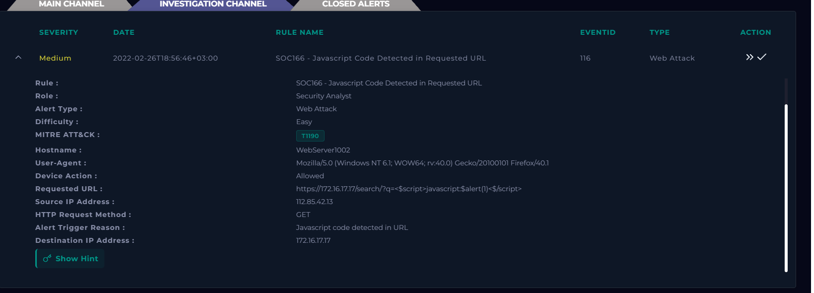
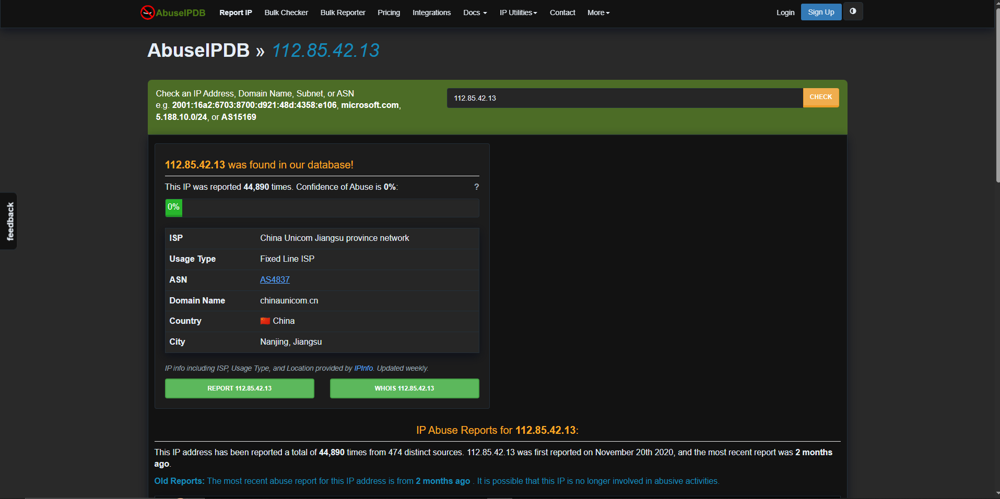
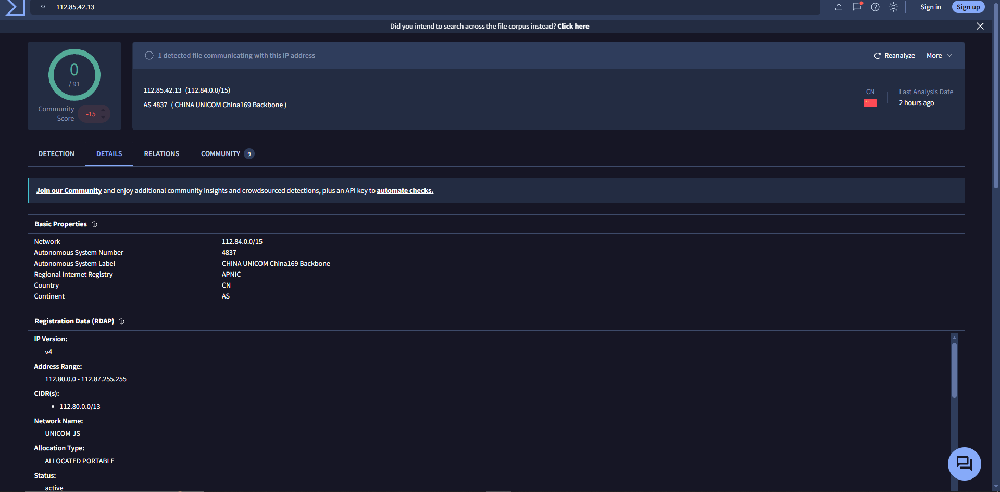
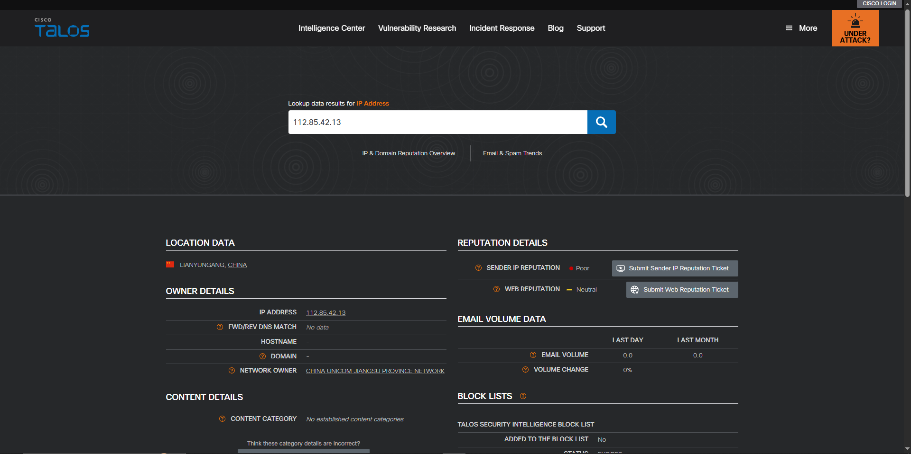
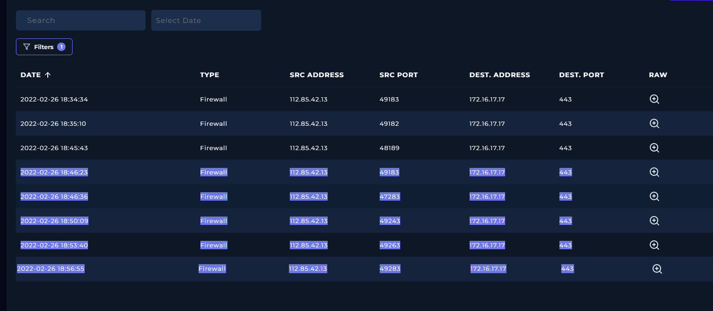
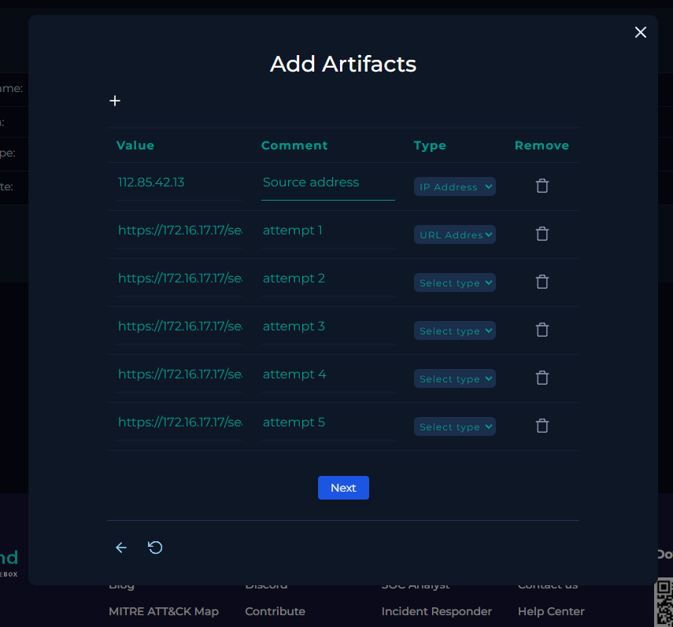

# SOC-009 — Cross-Site Scripting (XSS) Attempts Against Search Parameter

## Executive Summary

A **medium-severity web attack alert**, `SOC166 - Javascript Code Detected in Requested URL`, was investigated after an external source repeatedly submitted JavaScript and HTML payloads to the search parameter of `WebServer1002` (`172.16.17.17`).

The source IP `112.85.42.13` sent multiple GET requests containing XSS-style payloads such as:

```text

<script>for((i)in(self))eval(i)(1)</script>
<svg><script ?>alert(1)
<script>javascript:alert(1)
```

The requests were permitted by the network control, but the documented attempts returned:

```text
HTTP Status: 302
HTTP Response Size: 0 bytes
```

The traffic is clearly malicious and consistent with **Cross-Site Scripting (XSS) probing**. However, the supplied evidence does not show that the payloads were reflected into a browser context or executed by a victim.

**Final Verdict: True Positive — XSS Attack Attempt — Successful Script Execution Not Established.**

Tier 2 escalation was not required under the lab playbook because no successful exploitation was demonstrated.

---

## Case Information

| Field | Value |
|---|---|
| Portfolio Case ID | SOC-009 |
| Platform Alert | SOC166 - Javascript Code Detected in Requested URL |
| Event ID | 116 |
| Alert Type | Web Attack |
| Severity | Medium |
| Difficulty | Easy |
| Event Time | 2022-02-26T18:56:46+03:00 |
| Hostname | `WebServer1002` |
| Destination IP | `172.16.17.17` |
| Source IP | `112.85.42.13` |
| HTTP Method | GET |
| Device Action | Allowed / Permitted |
| Target Endpoint | `/search/` |
| Target Parameter | `q` |
| Alert Trigger | JavaScript code detected in URL |
| Platform MITRE ATT&CK | T1190 |
| Traffic Direction | Internet → Company Network |
| Final Verdict | **True Positive** |
| Exploitation Outcome | **XSS attempt confirmed; browser execution not established** |
| Confidence | **High** |
| Tier 2 Escalation | Not required |

---

## 1. Initial Alert Triage

The alert identified JavaScript-like content inside the requested URL.



Important fields:

```text
Source IP:      112.85.42.13
Destination IP: 172.16.17.17
Hostname:       WebServer1002
Method:         GET
Device Action:  Allowed
Trigger:        Javascript code detected in URL
```

### Initial Analyst Hypothesis

The source appeared to be probing the search function for an XSS vulnerability.

---

## 2. Source-IP Enrichment

### AbuseIPDB



Observed:

- China Unicom Jiangsu province network
- fixed-line ISP
- China
- historical abuse reports present
- displayed confidence-of-abuse score: 0%

### VirusTotal



VirusTotal showed China Unicom network ownership, no direct malicious vendor flag in the screenshot, and a negative community score.

### Cisco Talos



Talos showed **Poor** sender IP reputation and Neutral web reputation.

### Analyst Decision

Reputation results were treated as supporting context only. The malicious verdict is driven by the HTTP payload behavior.

---

## 3. Log Correlation



Repeated HTTPS connections from `112.85.42.13` to `172.16.17.17:443` were observed during the same investigation window.

---

## 4. HTTP Evidence Analysis

| Time | Payload / Requested Content | HTTP Status | Response Size |
|---|---|---:|---:|
| 18:46:23 | `` | 302 | 0 |
| 18:46:36 | `prompt(8)` | 302 | 0 |
| 18:50:09 | `<script>for((i)in(self))eval(i)(1)</script>` | 302 | 0 |
| 18:53:40 | `<svg><script ?>alert(1)` | 302 | 0 |
| 18:56:55 | `<script>javascript:alert(1)` | 302 | 0 |

### XSS Indicators

The payloads contain common XSS primitives:

```text
<script>

<svg>
alert(
prompt(
eval(
javascript:
```

These are not normal search terms and strongly indicate deliberate client-side injection testing.

---

## 5. Attack Pattern Assessment

Multiple different XSS payload structures were submitted against the same `q` parameter.

The pattern includes:

- script-tag injection
- event-handler injection
- SVG-based injection
- JavaScript function calls
- multiple payload variations

This is consistent with deliberate vulnerability probing.

### Automation Assessment

The User-Agent was browser-like:

```text
Mozilla/5.0 (Windows NT 6.1; WOW64; rv:40.0) Gecko/20100101 Firefox/40.1
```

However, User-Agent strings are easily spoofed.

**Automation: Not established.**

---

## 6. Malicious Traffic Determination

**Traffic malicious?** Yes.

**Attack type?** Cross-Site Scripting (XSS).

Evidence includes explicit JavaScript/HTML injection syntax, repeated payload variations, an external source, and no approved testing context.

---

## 7. Planned-Test Validation

No evidence of authorized penetration testing, scheduled security exercises, or attack-simulation activity was identified.

```text
Planned Test: No
```

---

## 8. Traffic Direction

```text
Internet → Company Network
```

---

## 9. Attack Success Assessment

### Attack Attempt

**Confirmed.**

### Exploitation Attempt

**Confirmed.**

The malicious requests reached the application.

### Successful XSS Execution

**Not established.**

The documented responses were:

```text
HTTP Status: 302
HTTP Response Size: 0
```

This shows a redirect and no response body in the logged transaction, but **XSS success cannot be determined solely from HTTP status or response size**.

Stronger proof would require evidence such as:

- payload reflection in response HTML
- stored payload persistence
- browser execution telemetry
- victim interaction
- JavaScript execution
- cookie/session access
- downstream requests caused by the script

> **The XSS attack attempts are confirmed, but successful client-side script execution is not demonstrated by the supplied evidence.**

---

## 10. Analyst Decision Points

- **Why did the alert trigger?** JavaScript-like code appeared in the URL.
- **Was the traffic malicious?** Yes.
- **Attack type?** XSS.
- **Multiple attempts?** Yes — five documented.
- **Traffic direction?** Internet → Company Network.
- **Authorized test?** No evidence.
- **Did XSS execute successfully?** Not established.
- **Tier 2 escalation?** No, under the lab procedure.
- **Final verdict?** **True Positive — XSS Attack Attempt — High Confidence.**

---

## 11. Evidence vs Inference

### Direct Evidence

- SOC166 alert fired
- source IP `112.85.42.13`
- destination `172.16.17.17`
- target hostname `WebServer1002`
- GET requests were used
- JavaScript/HTML injection syntax was present
- multiple payload variants were observed
- requests were permitted
- documented responses returned HTTP `302`
- documented response size was `0`
- source was external
- no planned test was identified

### Analyst Inference

The source was intentionally probing the search parameter for an XSS weakness.

### Not Established

The evidence does not prove:

- payload reflection
- browser-side JavaScript execution
- cookie/session theft
- stored XSS persistence
- victim interaction
- account compromise
- command execution
- lateral movement
- C2
- exfiltration

---

## 12. MITRE ATT&CK Mapping

The platform mapped the event to:

```text
T1190 — Exploit Public-Facing Application
```

| Tactic | Technique | ID | Evidence |
|---|---|---|---|
| Initial Access | Exploit Public-Facing Application | **T1190** | External XSS payloads targeted a public-facing search parameter |

No browser-execution or post-exploitation techniques are mapped because successful script execution was not demonstrated.

---

## 13. Scope Assessment

| Scope Area | Assessment |
|---|---|
| Source IP | `112.85.42.13` |
| Source Network | China Unicom |
| Target | `WebServer1002` |
| Destination IP | `172.16.17.17` |
| Endpoint | `/search/` |
| Parameter | `q` |
| Method | GET |
| XSS Attempts | 5 documented |
| Requests Allowed | Yes |
| HTTP Response | 302 |
| Response Size | 0 bytes |
| Script Execution | Not established |
| User Impact | Not observed |
| Persistence | Not observed |
| C2 | Not observed |
| Tier 2 Escalation | Not required |

---

## 14. IOC / Artifact Record



### Source IP

```text
112.85.42.13
```

### XSS Request Evidence

```text
https://172.16.17.17/search/?q=
https://172.16.17.17/search/?q=prompt(8)
https://172.16.17.17/search/?q=<script>for((i)in(self))eval(i)(1)</script>
https://172.16.17.17/search/?q=<svg><script ?>alert(1)
https://172.16.17.17/search/?q=<script>javascript:alert(1)
```

The internal URLs are incident evidence, not globally malicious IOCs.

---

## 15. Final Verdict

# **TRUE POSITIVE — XSS ATTACK ATTEMPT; SUCCESSFUL EXECUTION NOT ESTABLISHED**

**Confidence: High**

The alert correctly identified malicious XSS probing.

---

## 16. Production SOC Analyst Note

> **True Positive — XSS Attack Attempt.** SOC166 detected repeated GET requests from external source `112.85.42.13` targeting the `q` search parameter of `WebServer1002` (`172.16.17.17`). Five documented requests contained XSS-style payloads including script tags, `onerror` execution, SVG/script constructs, `alert()`, `prompt()`, and `eval()`. The requests were permitted and returned HTTP `302` with `0-byte` responses. Source enrichment identified China Unicom infrastructure with mixed reputation results, including poor sender reputation in Cisco Talos. No approved penetration test was identified. The available telemetry confirms malicious XSS probing but does not establish reflection or browser-side script execution. Final disposition: True Positive; Tier 2 escalation not required under the lab procedure.

---

## 17. Recommended Production Follow-Up

- inspect the HTTP `Location` header for the 302 responses
- review reverse-proxy, WAF, and application logs
- determine whether search input is reflected after redirect
- inspect returned HTML for unsafe reflection
- test context-aware output encoding
- review Content Security Policy headers
- identify whether any payloads were stored
- search for additional XSS payloads from the same source
- inspect other application parameters for similar attacks
- determine whether authenticated users accessed affected pages
- consider rate limiting or blocking persistent malicious sources

---

## 18. Detection Engineering Opportunities

### Script-Tag Injection

```text
<script
</script>
javascript:
```

### Event-Handler Injection

```text
<img
+
onerror=
```

Also monitor suspicious event handlers such as:

```text
onload=
onclick=
onmouseover=
```

### JavaScript Execution Primitives

```text
alert(
prompt(
eval(
document.cookie
```

### Repeated XSS Probing

Increase severity when:

```text
same source
+
same endpoint
+
same parameter
+
multiple XSS payload variants
+
short time window
```

### Potential False Positives

- authorized security testing
- web-development/debugging traffic
- code-search applications
- security research tools
- legitimate content containing HTML/JavaScript examples

---

## 19. Lessons Learned

1. **XSS is fundamentally browser-side; HTTP response codes alone cannot prove execution.**
2. Multiple payload variants provide stronger evidence of malicious probing than one isolated request.
3. HTML event handlers such as `onerror` are valuable XSS indicators.
4. A 302 redirect does not automatically prove attack success or failure.
5. Source reputation is secondary to request content.
6. Browser-like User-Agent strings do not prove manual activity.
7. ATT&CK mapping should stop where the evidence stops.

---

## Skills Demonstrated

- web attack alert triage
- Cross-Site Scripting recognition
- HTTP GET analysis
- JavaScript payload analysis
- HTML event-handler analysis
- multi-event log correlation
- source-IP enrichment
- HTTP response interpretation
- traffic-direction analysis
- planned-test validation
- attack-success assessment
- IOC/artifact handling
- MITRE ATT&CK mapping
- evidence-vs-inference discipline
- escalation decision-making
- detection-engineering thinking
- professional SOC reporting

---

## Training Context

This investigation was completed in the **LetsDefend simulated SOC environment** as part of authorized SOC Analyst training.

The report focuses on evidence, investigation methodology, defensive reasoning, and success assessment rather than reproducing the training-platform playbook.
