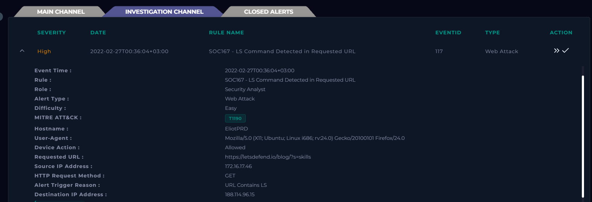
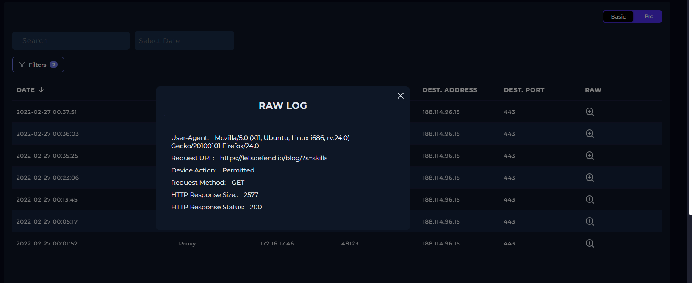
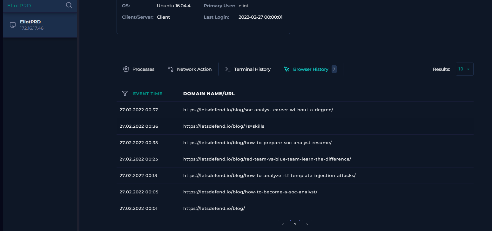

# SOC-010 — False Positive Command Injection Detection Caused by Substring Matching

## Executive Summary

A **high-severity web attack alert**, `SOC167 - LS Command Detected in Requested URL`, was investigated after the detection rule identified the Linux `ls` command inside an HTTP request.

The alert involved internal endpoint:

```text
EliotPRD
172.16.17.46
```

accessing:

```text
https://letsdefend.io/blog/?s=skills
```

The rule triggered because the requested URL contained the character sequence:

```text
ls
```

inside the legitimate search term:

```text
skills
```

Review of the triggering request, surrounding proxy/firewall activity, and endpoint browser history showed normal browsing of LetsDefend SOC/cybersecurity blog content. No shell metacharacters, command chaining, suspicious command execution, or other command-injection behavior was identified.

The event is therefore classified as:

# **False Positive — Benign Web Browsing Misidentified as `ls` Command Injection**

The case demonstrates why detection logic must consider **token boundaries, syntax, context, and correlated endpoint activity**, rather than triggering on simple substring matches.

---

## Case Information

| Field | Value |
|---|---|
| Portfolio Case ID | SOC-010 |
| Platform Alert | SOC167 - LS Command Detected in Requested URL |
| Event ID | 117 |
| Alert Type | Web Attack |
| Severity | High |
| Difficulty | Easy |
| Event Time | 2022-02-27T00:36:04+03:00 |
| Hostname | `EliotPRD` |
| Source IP | `172.16.17.46` |
| Destination IP | `188.114.96.15` |
| HTTP Method | GET |
| Device Action | Allowed |
| Requested URL | `https://letsdefend.io/blog/?s=skills` |
| Alert Trigger | URL contains `LS` |
| Platform MITRE ATT&CK | T1190 |
| Traffic Direction | Company Network → Internet |
| Final Verdict | **False Positive** |
| Confidence | **High** |
| Escalation | Not required |

---

## 1. Initial Alert Triage

The alert claimed that an `LS` command had been detected in the requested URL.



Important fields:

```text
Hostname:       EliotPRD
Source IP:      172.16.17.46
Destination IP: 188.114.96.15
Method:         GET
URL:            https://letsdefend.io/blog/?s=skills
Device Action:  Allowed
Trigger:        URL Contains LS
```

### Initial Observation

The requested URL immediately appeared inconsistent with a real command-injection attempt.

The query:

```text
?s=skills
```

is a normal blog-search parameter.

The sequence:

```text
ls
```

appears only as part of the benign word:

```text
skills
```

### Initial Hypothesis

The rule likely used insufficiently contextual substring matching and interpreted the final two letters of `skills` as the Linux `ls` command.

---

## 2. Why the Alert Triggered

The rule was designed to detect references to the Unix/Linux directory-listing command:

```bash
ls
```

However, the search term:

```text
skills
```

contains:

```text
...lls
```

and therefore includes the exact substring:

```text
ls
```

A naïve rule such as:

```text
URL contains "ls"
```

can therefore produce a match without proving command-injection syntax.

### Detection Problem

Conceptually:

```text
Expected malicious pattern:
?cmd=ls
?id=1;ls
?q=test&&ls
?exec=ls -la

Observed benign pattern:
?s=skills
```

The letters are the same, but the **semantic and syntactic context is completely different**.

---

## 3. HTTP / Proxy Evidence

The raw event showed the user requesting the LetsDefend blog search page.



Observed request:

```text
Request URL: https://letsdefend.io/blog/?s=skills
Request Method: GET
Device Action: Permitted
HTTP Response Status: 200
HTTP Response Size: 2577
```

### Analyst Interpretation

The request:

- targets a legitimate blog page,
- uses a normal search parameter,
- contains no command separator,
- contains no shell syntax,
- returned a normal HTTP `200`,
- and is consistent with ordinary user browsing.

There is no evidence that `ls` was supplied as a shell command.

---

## 4. Source Endpoint Context

The source was an internal Linux workstation:

```text
Hostname: EliotPRD
IP:       172.16.17.46
OS:       Ubuntu 16.04.4
Primary User: eliot
Last Login: 2022-02-27 00:00:01
```

Because the traffic originated internally, the investigation expanded beyond the single alert event to determine whether the source endpoint showed other suspicious behavior.

---

## 5. Surrounding Traffic Review

Other requests from the same endpoint included:

```text
https://letsdefend.io/blog/
https://letsdefend.io/blog/how-to-become-a-soc-analyst/
https://letsdefend.io/blog/how-to-analyze-rtf-template-injection-attacks/
https://letsdefend.io/blog/red-team-vs-blue-team-learn-the-difference/
https://letsdefend.io/blog/how-to-prepare-soc-analyst-resume/
https://letsdefend.io/blog/?s=skills
https://letsdefend.io/blog/soc-analyst-career-without-a-degree/
```

The sequence is coherent with a user reading cybersecurity/SOC career articles.

### Behavioral Context

```text
LetsDefend blog
      ↓
SOC analyst article
      ↓
RTF security article
      ↓
Red Team vs Blue Team
      ↓
SOC analyst résumé article
      ↓
search: "skills"
      ↓
SOC career article
```

This browsing pattern provides strong context that the triggering request was benign.

---

## 6. Endpoint Browser-History Validation

Endpoint Security browser history independently confirmed the same sequence.



Relevant entries included:

```text
00:01  https://letsdefend.io/blog/
00:05  https://letsdefend.io/blog/how-to-become-a-soc-analyst/
00:13  https://letsdefend.io/blog/how-to-analyze-rtf-template-injection-attacks/
00:23  https://letsdefend.io/blog/red-team-vs-blue-team-learn-the-difference/
00:35  https://letsdefend.io/blog/how-to-prepare-soc-analyst-resume/
00:36  https://letsdefend.io/blog/?s=skills
00:37  https://letsdefend.io/blog/soc-analyst-career-without-a-degree/
```

### Analyst Interpretation

The browser history correlates directly with the network activity.

This supports the conclusion that:

```text
?s=skills
```

was a normal human search action and not a command-injection payload.

---

## 7. Command-Injection Assessment

A real command-injection attempt would normally require contextual indicators that cause user-supplied input to be interpreted by a shell or command processor.

Examples might include combinations such as:

```text
; ls
&& ls
|| ls
| ls
$(ls)
`ls`
```

or command execution parameters such as:

```text
?cmd=ls
?exec=ls
```

### Observed Request

```text
?s=skills
```

### Missing Indicators

No evidence was observed for:

- `;`
- `&&`
- `||`
- pipes
- command substitution
- shell invocation
- `cmd=`
- `exec=`
- command output
- terminal execution
- suspicious child processes

Therefore the request does **not** support a command-injection classification.

---

## 8. Is There Other Malicious Traffic?

The playbook correctly required review of additional traffic even after the triggering request appeared benign.

### Finding

Additional traffic was present, but it consisted of legitimate LetsDefend blog navigation.

### Decision

```text
Different traffic present: Yes
Malicious additional traffic: No
```

This distinction is important:

> Additional traffic from the same endpoint does not automatically make the original alert malicious.

---

## 9. Analyst Decision Points

**Why did the rule trigger?**  
Because `skills` contains the substring `ls`.

**Does the request contain an actual shell command?**  
No.

**Does the URL contain command-injection syntax?**  
No.

**Was the source internal?**  
Yes.

**Was there surrounding activity?**  
Yes.

**Was the surrounding activity suspicious?**  
No — it was coherent LetsDefend blog browsing.

**Did endpoint browser history support benign activity?**  
Yes.

**Is there evidence of command execution?**  
No.

**Final verdict?**  
**False Positive — High Confidence.**

---

## 10. Evidence vs Inference

### Direct Evidence

- alert triggered on URL containing `LS`
- source endpoint was `EliotPRD`
- source IP was `172.16.17.46`
- request was `GET https://letsdefend.io/blog/?s=skills`
- request was permitted
- response returned HTTP `200`
- response size was `2577`
- surrounding requests targeted other LetsDefend blog pages
- endpoint browser history showed matching legitimate browsing activity

### Analyst Inference

The detection rule matched the `ls` character sequence inside the legitimate search term `skills`.

### Not Established

There is no evidence of:

- command injection
- shell execution
- exploitation
- malware activity
- credential compromise
- persistence
- lateral movement
- command and control
- data exfiltration

---

## 11. MITRE ATT&CK Assessment

The platform alert listed:

```text
T1190 — Exploit Public-Facing Application
```

However, because the investigation determined the event was a **false positive**, this ATT&CK technique should **not be treated as observed adversary behavior in the final portfolio report**.

### Final Mapping

```text
MITRE ATT&CK: Not applicable — false positive
```

This distinction is important:

> An ATT&CK technique attached to an alert is a detection hypothesis until the underlying behavior is validated.

---

## 12. Scope Assessment

| Scope Area | Assessment |
|---|---|
| Source Host | `EliotPRD` |
| Source IP | `172.16.17.46` |
| Destination | LetsDefend blog |
| Triggering Search | `skills` |
| Command Injection | Not observed |
| Suspicious Shell Syntax | Not observed |
| Malicious Network Activity | Not observed |
| Endpoint Compromise | Not observed |
| Additional Suspicious Traffic | Not observed |
| Escalation | Not required |
| Final Classification | **False Positive** |

---

## 13. Final Verdict

# **FALSE POSITIVE — BENIGN SEARCH TERM MATCHED `ls` SUBSTRING**

**Confidence: High**

The alert triggered because the rule interpreted the letters `ls` inside the normal search term `skills` as the Linux `ls` command.

Network telemetry and endpoint browser history independently supported benign user browsing.

No evidence of command injection or exploitation was identified.

---

## 14. Production SOC Analyst Note

> **False Positive.** SOC167 triggered on internal endpoint `EliotPRD` (`172.16.17.46`) after a GET request to `https://letsdefend.io/blog/?s=skills`. The rule appears to have matched the substring `ls` within the benign search term `skills`. The request returned HTTP `200` and was part of a consistent sequence of LetsDefend blog browsing. Endpoint browser history independently confirmed the same navigation pattern. No command separators, shell syntax, command-execution parameters, suspicious terminal activity, or related malicious traffic were identified. Final disposition: False Positive. Recommend tuning the rule to require command context rather than raw substring matching.

---

## 15. Detection Engineering Analysis

This case provides a strong example of why detection engineering should account for context.

### Weak Detection Logic

Conceptually:

```text
requested_url contains "ls"
```

This can match benign words such as:

```text
skills
tools
calls
details
tutorials
```

### Better Detection Strategy

Instead of looking for any occurrence of `ls`, require syntax consistent with command execution.

Examples:

```text
[;&|] ls
```

or command parameter context:

```text
cmd=ls
exec=ls
command=ls
```

or shell substitution:

```text
$(ls)
`ls`
```

### Contextual Detection Model

A higher-confidence rule could combine:

```text
shell metacharacter
+
command token
+
user-controlled parameter
```

Examples:

```text
;ls
; ls
&&ls
&& ls
||ls
|ls
$(ls)
```

### Token Boundary Consideration

If standalone command matching is required, detection should distinguish:

```text
ls
```

from substrings embedded inside legitimate words:

```text
skills
```

This can be achieved with appropriately designed token/word-boundary logic after URL decoding and normalization.

---

## 16. Detection Tuning Recommendations

A production rule should consider:

- URL decoding before inspection
- case normalization
- shell separators
- parameter names
- token boundaries
- command arguments
- command-substitution syntax
- application context
- known benign search functionality
- repeated suspicious requests
- endpoint process telemetry

### Suggested Detection Concept

```text
HTTP parameter
+
shell separator or command-execution context
+
standalone Unix command
```

rather than:

```text
URL contains "ls"
```

### False Positive Reduction

Potential benign values such as:

```text
skills
tools
details
calls
```

should not generate high-severity command-injection alerts solely because they contain `ls`.

---

## 17. Lessons Learned

1. **Alert names are hypotheses, not conclusions.**
2. **Substring matching without context produces avoidable false positives.**
3. **A command name inside a normal word is not evidence of command injection.**
4. **Surrounding network activity can explain an otherwise suspicious alert.**
5. **Endpoint browser history is valuable corroborating evidence.**
6. **Analysts should investigate adjacent activity even when the triggering request appears benign.**
7. **False-positive investigations are portfolio-worthy because they demonstrate analytical restraint.**
8. **Detection tuning is part of the analyst workflow, not an afterthought.**
9. **MITRE ATT&CK mappings should be removed or qualified when the underlying alert is disproven.**

---

## Skills Demonstrated

- false-positive analysis
- web alert triage
- HTTP request analysis
- proxy/firewall log correlation
- endpoint browser-history analysis
- internal-host investigation
- contextual evidence analysis
- command-injection recognition
- MITRE ATT&CK validation
- detection-rule tuning
- false-positive reduction
- evidence-vs-inference discipline
- professional SOC documentation

---

## Training Context

This investigation was completed in the **LetsDefend simulated SOC environment** as part of authorized SOC Analyst training.

The report focuses on investigation methodology, analyst reasoning, false-positive validation, and detection-engineering improvement rather than reproducing the training-platform playbook.
