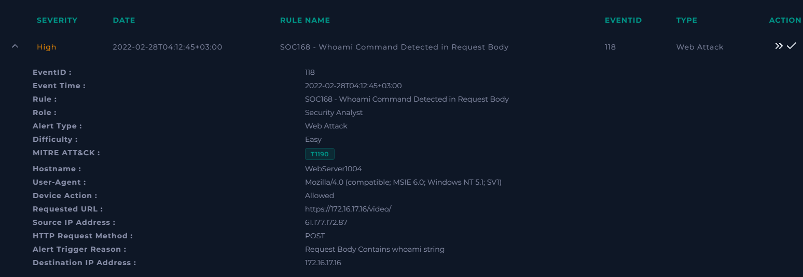
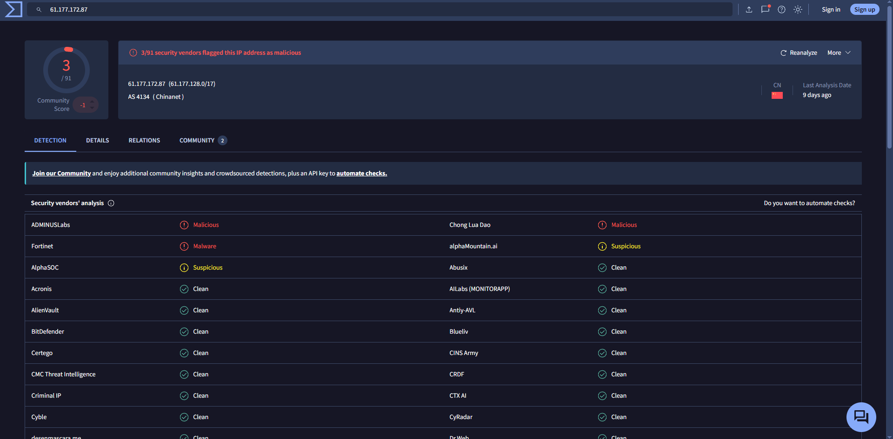
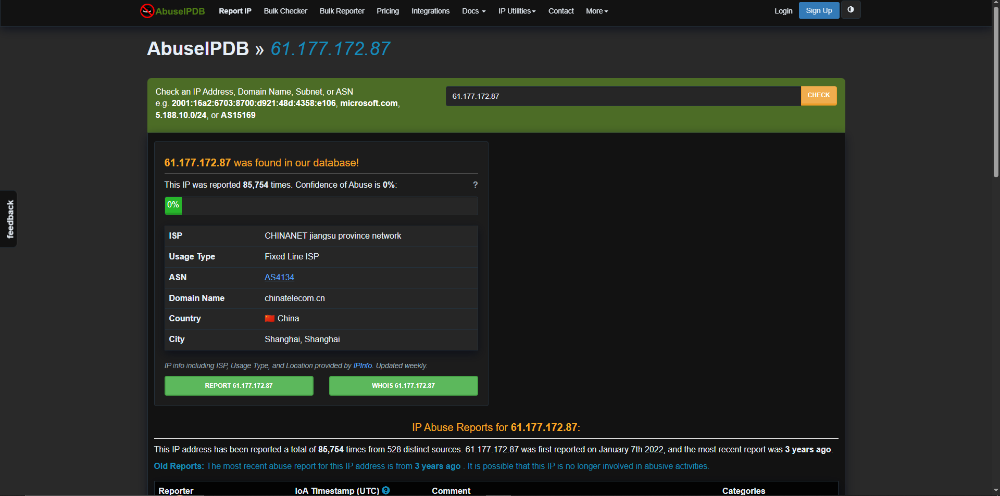
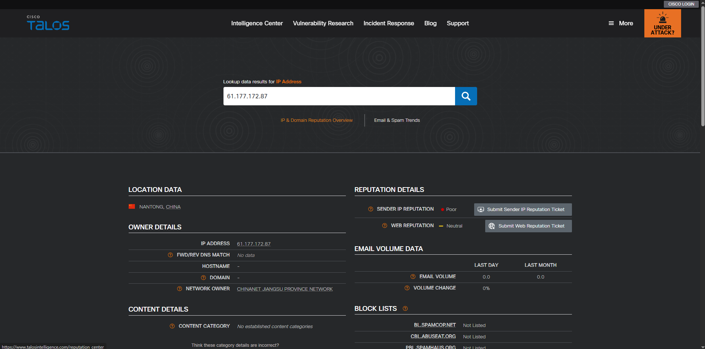
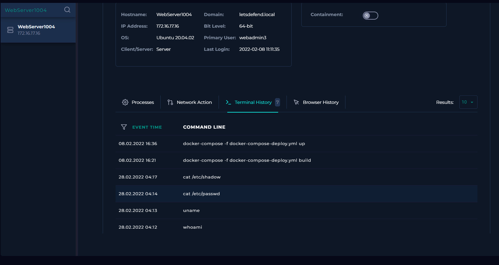
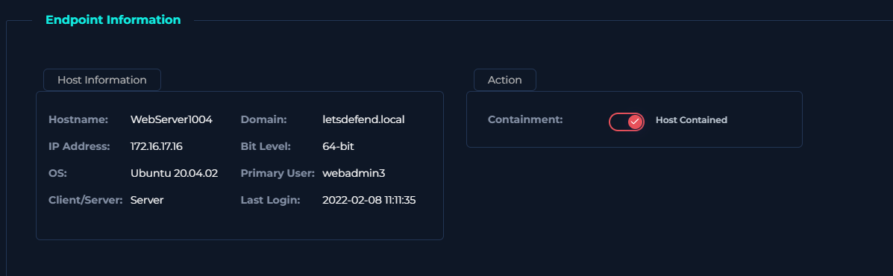
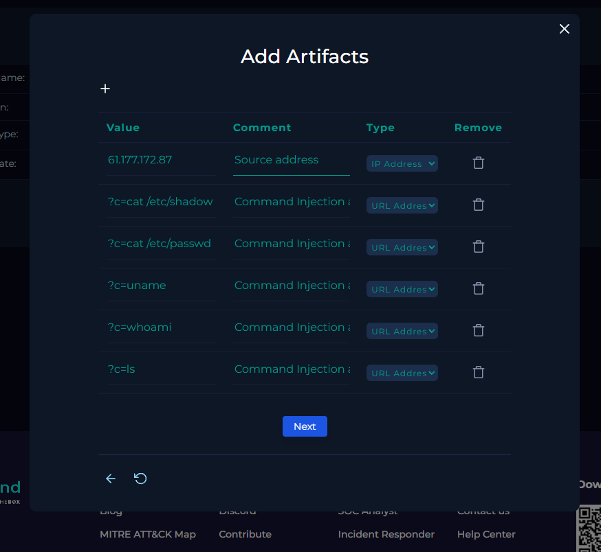

# SOC-011 — Successful Command Injection Against Linux Web Server

## Executive Summary

A **high-severity web attack alert**, `SOC168 - Whoami Command Detected in Request Body`, was investigated after an external source submitted operating-system commands to the `/video/` endpoint of `WebServer1004` (`172.16.17.16`).

The activity originated from `61.177.172.87` and included:

```text
?c=ls
?c=whoami
?c=uname
?c=cat /etc/passwd
?c=cat /etc/shadow
```

All five requests were permitted and returned **HTTP 200 OK** with non-zero, varying response sizes.

More importantly, Endpoint Security terminal history independently showed execution of:

```text
whoami
uname
cat /etc/passwd
cat /etc/shadow
```

on `WebServer1004`.

This confirms attacker-supplied commands were executed on the server. The activity progressed beyond a web attack attempt into **successful operating-system command execution**, followed by host/user discovery and attempts to read local account and credential material.

The affected server was contained and the incident required Tier 2 escalation.

# **Final Verdict: True Positive — Successful Command Injection / Host Compromise — High Confidence**

---

## Case Information

| Field | Value |
|---|---|
| Portfolio Case ID | SOC-011 |
| Platform Alert | SOC168 - Whoami Command Detected in Request Body |
| Event ID | 118 |
| Alert Type | Web Attack |
| Severity | High |
| Difficulty | Easy |
| Event Time | 2022-02-28T04:12:45+03:00 |
| Hostname | `WebServer1004` |
| Destination IP | `172.16.17.16` |
| Source IP | `61.177.172.87` |
| HTTP Method | POST |
| Device Action | Allowed / Permitted |
| Target Endpoint | `/video/` |
| Alert Trigger | Request body contains `whoami` |
| Platform MITRE ATT&CK | T1190 |
| Traffic Direction | Internet → Company Network |
| Final Verdict | **True Positive** |
| Exploitation Outcome | **Successful command execution confirmed** |
| Host Compromise | **Confirmed** |
| Confidence | **High** |
| Containment | Completed |
| Tier 2 Escalation | **Required** |

---

## 1. Initial Alert Triage

The alert was generated because the HTTP request body contained the command:

```text
whoami
```



Important alert fields:

```text
Source IP:      61.177.172.87
Destination IP: 172.16.17.16
Hostname:       WebServer1004
Method:         POST
URL:            https://172.16.17.16/video/
Device Action:  Allowed
Trigger:        Request Body Contains whoami string
```

### Initial Analyst Hypothesis

The request appeared to be testing whether the web application passed attacker-controlled input to the underlying operating system.

The investigation focused on whether additional commands were attempted, whether they actually executed, whether sensitive system data was targeted, and whether containment/escalation were required.

---

## 2. Source-IP Enrichment

### VirusTotal



Observed:

- CHINANET / China Telecom infrastructure
- several vendors classified the IP as malicious or suspicious
- negative community score

### AbuseIPDB



Observed:

- CHINANET Jiangsu province network
- Fixed Line ISP
- China
- extensive historical reporting
- displayed confidence-of-abuse score: 0%

### Cisco Talos



Talos showed:

- **Poor** sender IP reputation
- Neutral web reputation

### Analyst Decision

Reputation increased suspicion but was not the basis of the verdict. The decisive evidence was the **HTTP command sequence plus endpoint-confirmed command execution**.

---

## 3. HTTP Command-Injection Sequence

| Time | POST Parameter | HTTP Status | Response Size |
|---|---|---:|---:|
| 04:11:06 | `?c=ls` | 200 | 1021 |
| 04:12:00 | `?c=whoami` | 200 | 912 |
| 04:13:37 | `?c=uname` | 200 | 910 |
| 04:14:09 | `?c=cat /etc/passwd` | 200 | 1321 |
| 04:15:39 | `?c=cat /etc/shadow` | 200 | 1501 |

### Attack Progression

```text
ls
 ↓
whoami
 ↓
uname
 ↓
cat /etc/passwd
 ↓
cat /etc/shadow
```

This is consistent with a logical post-exploitation sequence:

```text
Confirm command execution
        ↓
Identify current user
        ↓
Identify operating system
        ↓
Enumerate local accounts
        ↓
Attempt to access credential material
```

---

## 4. Why This Is Command Injection

The vulnerable parameter appears to be:

```text
c
```

Example:

```text
POST /video/
?c=whoami
```

The server accepted attacker-controlled input and the commands subsequently appeared in endpoint terminal history.

That supports:

```text
HTTP request
    ↓
application receives ?c=<command>
    ↓
application passes input to shell / OS
    ↓
command executes on server
```

This is consistent with operating-system command injection.

---

## 5. Endpoint Confirmation of Successful Execution

The strongest evidence came from Endpoint Security.



Terminal history showed:

```text
2022-02-28 04:12  whoami
2022-02-28 04:13  uname
2022-02-28 04:14  cat /etc/passwd
2022-02-28 04:17  cat /etc/shadow
```

### Success Determination

```text
Command Injection Attempt: Confirmed
Command Execution:         Confirmed
Host Compromise:           Confirmed
```

This endpoint evidence is substantially stronger than relying only on HTTP `200` responses.

---

## 6. Sensitive Command Analysis

### `whoami`

Used to identify the account context in which the attacker obtained command execution.

### `uname`

Used to identify operating-system/kernel information.

### `cat /etc/passwd`

Used to enumerate local account metadata.

### `cat /etc/shadow`

Attempts to access password-hash material on Linux systems and is especially significant because the file is normally restricted.

### Evidence Qualification

Terminal history confirms the command was executed, but the supplied evidence does not include command output.

Therefore:

> The attacker successfully executed a command attempting to read `/etc/shadow`; whether its contents were actually disclosed is not directly shown.

---

## 7. Traffic Direction and Asset Context

```text
61.177.172.87
        ↓
172.16.17.16
```

Direction:

```text
Internet → Company Network
```

Target:

```text
Hostname: WebServer1004
IP:       172.16.17.16
OS:       Ubuntu 20.04.02
Primary User: webadmin3
```

---

## 8. Planned-Test Validation

No evidence was identified for:

- approved penetration testing
- scheduled red-team activity
- attack-simulation infrastructure
- notification emails

```text
Planned Test: No
```

---

## 9. Analyst Decision Points

- **Why did the alert trigger?** POST body contained `whoami`.
- **Was the traffic malicious?** Yes.
- **Attack type?** Command Injection.
- **Multiple commands attempted?** Yes — five.
- **Were commands executed?** Yes — endpoint telemetry confirms it.
- **Was the server compromised?** Yes.
- **Was sensitive information targeted?** Yes — `/etc/passwd` and `/etc/shadow`.
- **Containment justified?** Yes.
- **Tier 2 escalation required?** Yes.
- **Final verdict?** **True Positive — Successful Command Injection / Host Compromise — High Confidence.**

---

## 10. Evidence vs Inference

### Direct Evidence

- SOC168 alert fired
- source IP `61.177.172.87`
- destination `172.16.17.16`
- hostname `WebServer1004`
- POST method used
- commands `ls`, `whoami`, `uname`, `cat /etc/passwd`, and `cat /etc/shadow` observed
- requests returned HTTP `200`
- response sizes varied
- terminal history showed command execution
- server was contained
- no planned test identified

### Analyst Inference

The attacker exploited a web application flaw that allowed user-controlled input to reach an operating-system command interpreter.

### Not Established

The supplied evidence does not directly prove:

- exact command output returned to attacker
- successful disclosure of `/etc/shadow` contents
- privilege escalation
- persistence
- lateral movement
- malware installation
- command and control
- exfiltration beyond observed application responses

---

## 11. MITRE ATT&CK Mapping

The platform mapped the initial exploitation to:

```text
T1190 — Exploit Public-Facing Application
```

The endpoint evidence supports additional mappings.

| Tactic | Technique | ID | Evidence |
|---|---|---|---|
| Initial Access | Exploit Public-Facing Application | **T1190** | External source exploited `/video/` and achieved command execution |
| Execution | Command and Scripting Interpreter: Unix Shell | **T1059.004** | Linux commands executed on the server |
| Discovery | System Owner/User Discovery | **T1033** | `whoami` executed |
| Discovery | System Information Discovery | **T1082** | `uname` executed |
| Credential Access | OS Credential Dumping: `/etc/passwd` and `/etc/shadow` | **T1003.008** | Commands attempted to read `/etc/passwd` and `/etc/shadow` |

### Mapping Restraint

`T1003.008` reflects the observed credential-file access attempt. The report does not claim successful credential theft because command output was not captured.

No persistence, lateral movement, or C2 techniques are mapped.

---

## 12. Scope Assessment

| Scope Area | Assessment |
|---|---|
| Source IP | `61.177.172.87` |
| Source Network | CHINANET |
| Target | `WebServer1004` |
| Destination IP | `172.16.17.16` |
| Endpoint | `/video/` |
| Method | POST |
| Commands Attempted | 5 |
| Requests Allowed | Yes |
| HTTP Success | 5/5 returned 200 |
| Command Execution | **Confirmed** |
| Host Compromise | **Confirmed** |
| Account Discovery | Observed |
| System Discovery | Observed |
| `/etc/passwd` Access Attempt | Observed |
| `/etc/shadow` Access Attempt | Observed |
| Persistence | Not observed |
| Lateral Movement | Not observed |
| C2 | Not observed |
| Containment | Completed |
| Tier 2 Escalation | Required |

---

## 13. Containment

Because successful command execution was confirmed, `WebServer1004` was isolated.



Containment was necessary to stop further remote command execution, limit additional credential access, prevent expansion of the compromise, preserve evidence, and enable Tier 2 investigation.

---

## 14. IOC / Artifact Record



### Source IP

```text
61.177.172.87
```

### Command-Injection Evidence

```text
?c=ls
?c=whoami
?c=uname
?c=cat /etc/passwd
?c=cat /etc/shadow
```

The application parameters are incident evidence. The entire CHINANET / China Telecom network should not be treated as malicious based on this individual source IP.

---

## 15. Tier 2 Escalation

### Escalation Decision

**Required.**

This incident demonstrated confirmed operating-system command execution on the target host.

Tier 2 should determine:

- which application flaw permitted command execution
- which process executed the commands
- execution user and privilege context
- whether `/etc/shadow` was actually read
- whether additional commands were executed
- whether users, SSH keys, cron jobs, or services were modified
- whether files were downloaded
- whether outbound connections followed exploitation
- whether credentials were exposed
- whether persistence or lateral movement occurred

---

## 16. Final Verdict

# **TRUE POSITIVE — SUCCESSFUL COMMAND INJECTION / HOST COMPROMISE**

**Confidence: High**

The verdict is supported by:

1. attacker-controlled commands submitted through HTTP,
2. multiple system-level commands,
3. successful HTTP responses,
4. endpoint terminal-history confirmation,
5. host/user discovery,
6. credential-file access attempts,
7. no authorized-testing context,
8. containment and Tier 2 escalation.

---

## 17. Production SOC Analyst Note

> **True Positive — Successful Command Injection / Host Compromise.** SOC168 detected `whoami` in a POST request from external source `61.177.172.87` targeting `/video/` on `WebServer1004` (`172.16.17.16`). Expanded log review identified five command-injection requests: `ls`, `whoami`, `uname`, `cat /etc/passwd`, and `cat /etc/shadow`. All returned HTTP `200` with varying response sizes. Endpoint terminal history independently confirmed execution of `whoami`, `uname`, `cat /etc/passwd`, and `cat /etc/shadow`, establishing successful operating-system command execution. The sequence progressed from execution validation to user/system discovery and attempted credential-file access. The host was contained and the incident escalated to Tier 2. Exact command output and whether `/etc/shadow` contents were returned require deeper host/application forensic validation.

---

## 18. Recommended Production Follow-Up

- preserve web, reverse-proxy, WAF, and application logs
- collect process and shell telemetry
- identify the web-server process responsible for command execution
- determine execution account and privileges
- review process trees and shell history
- inspect `/tmp`, `/var/tmp`, `/dev/shm`, and application directories
- review cron jobs and systemd services
- review SSH authorized keys
- check for newly created users
- search for outbound connections after exploitation
- inspect authentication logs
- determine whether `/etc/shadow` contents were disclosed
- rotate potentially exposed credentials
- patch or remove the vulnerable application component
- validate server-side input handling
- rebuild the host if required by incident-response policy

---

## 19. Detection Engineering Opportunities

### Command Injection via HTTP Parameter

Monitor user-controlled HTTP parameters containing commands such as:

```text
whoami
uname
id
ls
cat /etc/passwd
cat /etc/shadow
```

but combine command keywords with parameter/shell-execution context to reduce false positives.

### High-Confidence Correlation

```text
external source
+
HTTP parameter containing OS command
+
successful HTTP response
+
endpoint-confirmed command execution
```

This should be treated as much higher severity than keyword-only web detections.

### Discovery Sequence

Correlate sequences such as:

```text
whoami
→ uname
→ cat /etc/passwd
```

within a short time window.

### Sensitive File Access

Alert when a web-facing service process attempts to read:

```text
/etc/passwd
/etc/shadow
/etc/sudoers
/root/.ssh/
```

### Parent-Process Detection

Prioritize cases where shells/commands are spawned by web-service processes such as:

```text
nginx
apache2
httpd
php-fpm
node
python
java
```

### Potential False Positives

- authorized penetration testing
- application diagnostics
- administrative web consoles
- security scanners
- intentionally vulnerable lab applications

---

## 20. Lessons Learned

1. **Endpoint telemetry can turn a suspected exploit into confirmed compromise.**
2. **HTTP 200 alone is not enough; terminal/process evidence is much stronger.**
3. **Command sequences reveal attacker intent and progression.**
4. **`whoami` and `uname` are common post-exploitation discovery commands.**
5. **Attempts to read `/etc/passwd` and `/etc/shadow` materially increase severity.**
6. **Reputation is supporting evidence, not proof.**
7. **Successful command injection warrants containment and escalation.**
8. **ATT&CK mapping should expand only when evidence supports later attack stages.**
9. **Reading sensitive files and proving their contents were returned are separate evidentiary claims.**

---

## Skills Demonstrated

- web attack alert triage
- command-injection analysis
- HTTP POST/body analysis
- multi-event log correlation
- Linux command recognition
- endpoint terminal-history analysis
- attack-success validation
- host-compromise determination
- source-IP enrichment
- post-exploitation sequence analysis
- credential-access assessment
- endpoint containment
- Tier 2 escalation
- MITRE ATT&CK mapping
- evidence-vs-inference discipline
- detection-engineering thinking
- professional SOC reporting

---

## Training Context

This investigation was completed in the **LetsDefend simulated SOC environment** as part of authorized SOC Analyst training.

The report focuses on investigation methodology, attack validation, host-compromise evidence, containment, escalation, and detection opportunities rather than reproducing the training-platform playbook.
