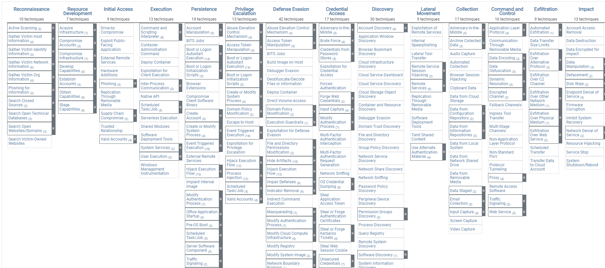
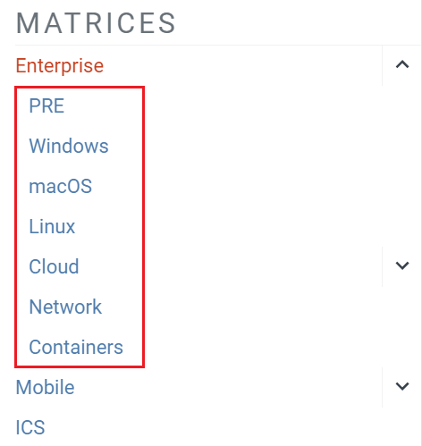
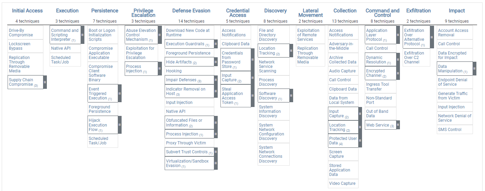
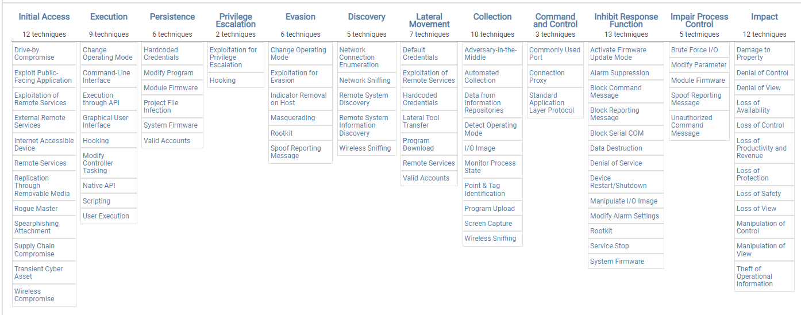
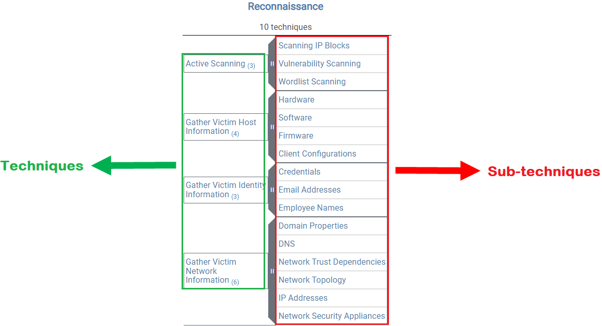
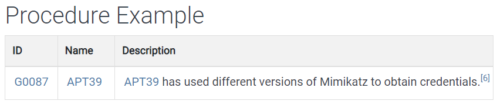
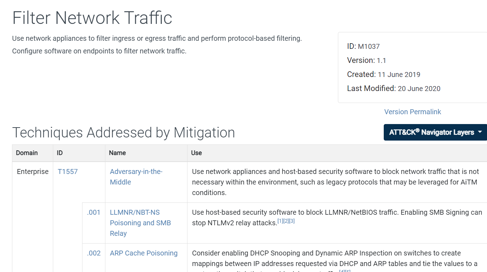
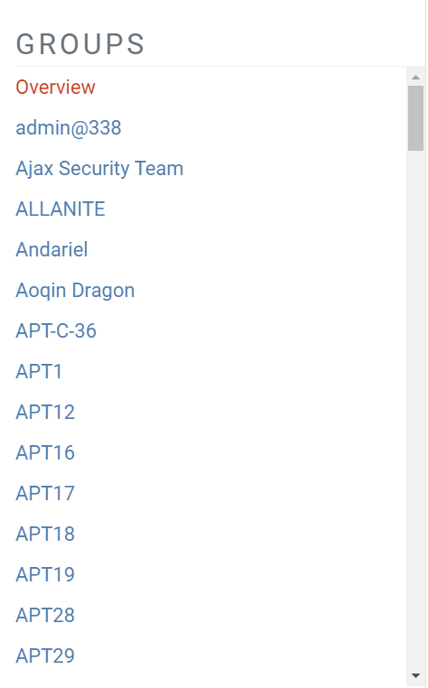
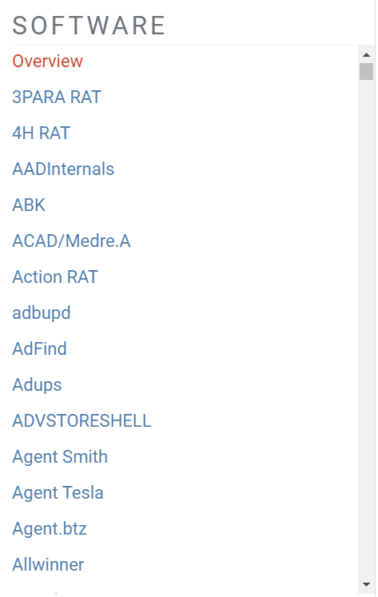

# MITRE ATT&CK Framework — SOC Analyst Notes

## Overview

MITRE ATT&CK (**Adversarial Tactics, Techniques, and Common Knowledge**) is a knowledge base for describing and organizing adversary behavior.

From a SOC analyst perspective, I learned to use ATT&CK as more than a list of attack techniques. It provides a common language for:

- mapping observed attacker behavior
- documenting investigations consistently
- identifying likely next steps in an intrusion
- improving detection coverage
- connecting threat actors, software, techniques, and mitigations
- supporting threat intelligence and incident response

---

## 1. ATT&CK Matrices

ATT&CK organizes adversary behavior into matrices. The training covered three primary matrix families:

- **Enterprise**
- **Mobile**
- **ICS (Industrial Control Systems)**

### Enterprise Matrix

The Enterprise matrix is the main matrix I expect to use most often in SOC investigations.

It organizes behaviors across tactics such as:

**Reconnaissance → Resource Development → Initial Access → Execution → Persistence → Privilege Escalation → Defense Evasion → Credential Access → Discovery → Lateral Movement → Collection → Command and Control → Exfiltration → Impact**



### Enterprise Platforms

The Enterprise matrix can be viewed by platform. The platforms covered in the training included:

- PRE
- Windows
- macOS
- Linux
- Cloud
- Network
- Containers



### Mobile Matrix

The Mobile matrix is focused on mobile environments and includes Android and iOS.



### ICS Matrix

The ICS matrix is designed for adversary behavior affecting industrial control systems.

It contains tactics that are specific to operational technology concerns, including **Inhibit Response Function** and **Impair Process Control**.



---

## 2. Tactics

A **tactic** represents the adversary's objective — the *why* behind an action.

Examples:

| Tactic | Analyst Interpretation |
|---|---|
| Initial Access | How did the attacker get into the environment? |
| Execution | How did malicious code or commands run? |
| Persistence | How did the attacker maintain access? |
| Privilege Escalation | How were higher permissions obtained? |
| Defense Evasion | How did the attacker try to avoid detection? |
| Credential Access | How were credentials targeted or obtained? |
| Discovery | What did the attacker learn about the environment? |
| Lateral Movement | How did the attacker move to other systems? |
| Collection | What data was gathered? |
| Command and Control | How did the compromised system communicate with attacker infrastructure? |
| Exfiltration | How did data leave the environment? |
| Impact | What destructive or disruptive effect occurred? |

### SOC Analyst Takeaway

When reviewing an alert, the tactic gives me the **intent** of the behavior.

For example:

> A suspicious scheduled task may fall under **Persistence** because the attacker is trying to maintain access.

---

## 3. Techniques and Sub-Techniques

A **technique** describes *how* an adversary achieves a tactic.

A **sub-technique** gives a more specific implementation of that technique.



### Example Structure

```text
Tactic
└── Technique
    └── Sub-technique
```

For example:

```text
Credential Access
└── OS Credential Dumping
    └── LSASS Memory
```

### Important Distinction

- **Tactic = why**
- **Technique = how**
- **Sub-technique = a more specific how**

This distinction is important when writing SOC investigation reports because ATT&CK mappings should describe the behavior actually supported by the evidence.

---

## 4. Procedures

A **procedure** is a real-world example of a threat actor or software using a technique or sub-technique.

The training example showed APT39 using Mimikatz to obtain credentials.



This helped me understand the ATT&CK hierarchy as:

```text
Tactic
   ↓
Technique
   ↓
Sub-technique
   ↓
Procedure / real-world implementation
```

### SOC Analyst Takeaway

Procedures are useful when answering questions such as:

- Has a known threat group used this technique before?
- What tools are commonly associated with this behavior?
- Does the activity in my investigation resemble documented adversary behavior?

---

## 5. Mitigations

MITRE ATT&CK also documents **mitigations** — defensive actions that can reduce the likelihood or impact of specific techniques.

Each mitigation has its own:

- ID
- name
- description
- mapped techniques

One example from the training was **Filter Network Traffic**.



### Examples of Mitigation Concepts Covered

- Multi-factor authentication
- Code signing
- Network traffic filtering
- Account-use policies
- Antivirus / antimalware
- Access management

### SOC Analyst Takeaway

MITRE ATT&CK can therefore support both sides of an investigation:

```text
Observed Behavior
      ↓
ATT&CK Technique
      ↓
Detection / Investigation
      ↓
Relevant Mitigation
```

---

## 6. Groups

MITRE ATT&CK tracks known adversary groups and links them to the techniques and software associated with their operations.



A group page can provide:

- Group ID
- group name
- description
- associated groups / aliases
- techniques used
- software used

### Why This Matters in a SOC

I should not attribute an incident to a specific APT group based on one matching technique.

However, ATT&CK group pages are useful for:

- threat-intelligence research
- understanding common TTPs
- comparing observed activity to known campaigns
- identifying additional behaviors to hunt for

---

## 7. Software

ATT&CK also catalogs software used in cyber operations, including malware and legitimate tools that have been abused by threat actors.



Software entries can contain:

- Software ID
- name
- description
- platform
- type
- techniques used
- groups known to use the software

### SOC Analyst Takeaway

This provides a useful pivot during investigation:

```text
Suspicious software detected
        ↓
Review ATT&CK software entry
        ↓
Identify known techniques
        ↓
Identify related threat groups
        ↓
Hunt for additional behaviors
```

---

## 8. How I Would Use MITRE ATT&CK During an Investigation

ATT&CK should support the investigation — it should not replace evidence.

Example:

### Alert

A PowerShell process launches from a Microsoft Office application and downloads a remote payload.

### Investigation Thinking

```text
Office document opened
        ↓
PowerShell launched
        ↓
Remote payload downloaded
        ↓
Possible persistence or C2 follows
```

I would use ATT&CK to:

1. Identify the observed behaviors.
2. Map only techniques supported by telemetry.
3. Search for related activity on the affected endpoint.
4. Investigate whether later-stage tactics occurred.
5. Use related mitigations and detection guidance to recommend improvements.

A report could include:

| Tactic | Technique | ATT&CK ID | Evidence |
|---|---|---|---|
| Execution | Command and Scripting Interpreter: PowerShell | T1059.001 | PowerShell process observed |
| Command and Control | Application Layer Protocol | T1071 | Outbound application-layer communication observed |

> ATT&CK mappings should be evidence-based. I should not add techniques simply because they are commonly associated with a malware family.

---

## 9. ATT&CK vs Cyber Kill Chain

The Cyber Kill Chain and MITRE ATT&CK serve different but complementary purposes.

| Cyber Kill Chain | MITRE ATT&CK |
|---|---|
| High-level attack progression | Detailed adversary behavior |
| Seven broad stages | Tactics, techniques and sub-techniques |
| Useful for understanding attack sequence | Useful for precise behavioral mapping |
| Helps determine how far an intrusion progressed | Helps explain exactly what the attacker did |

### Example

Cyber Kill Chain may tell me:

> The attacker reached the **Installation** stage.

MITRE ATT&CK may allow me to describe the same activity more precisely:

> The adversary created a scheduled task to maintain persistence.

This makes ATT&CK particularly valuable in detailed SOC investigation reports.

---

## 10. My Investigation Mapping Standard

For future portfolio investigations, I will use a table like this:

```markdown
| Tactic | Technique | ATT&CK ID | Evidence |
|---|---|---|---|
| Initial Access | ... | Txxxx | ... |
| Execution | ... | Txxxx | ... |
| Persistence | ... | Txxxx | ... |
```

### Rules I Will Follow

1. **Map only observed or strongly supported behavior.**
2. **Use the most specific sub-technique when evidence supports it.**
3. **Do not infer an entire attack chain from one indicator.**
4. **Do not attribute an APT group solely because techniques overlap.**
5. **Explain the evidence behind every ATT&CK mapping.**

---

## Key Takeaways

After completing this module, I can:

- explain the purpose of MITRE ATT&CK
- distinguish matrices, tactics, techniques, sub-techniques and procedures
- navigate Enterprise, Mobile and ICS ATT&CK structures
- understand the relationship between groups, software and techniques
- identify ATT&CK mitigations associated with attacker behavior
- use ATT&CK as a reference during SOC investigations
- map investigation evidence to ATT&CK techniques in a structured way

The most important lesson is that **MITRE ATT&CK is not just a matrix to memorize**. For a SOC analyst, it is a framework for converting raw security events into a structured description of adversary behavior.

---

## Training Context

These notes were created after completing the MITRE ATT&CK Framework module in the LetsDefend SOC Analyst learning path.

The screenshots in this page are used as visual references from the training material and MITRE ATT&CK pages. This repository focuses on my own understanding and SOC application rather than reproducing lesson or quiz answers.
