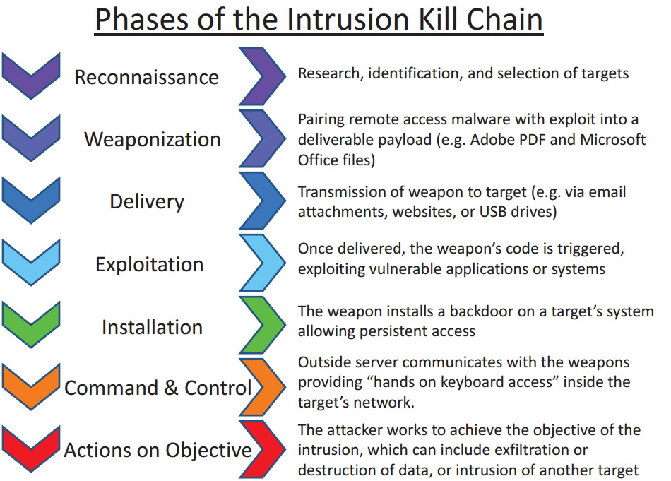
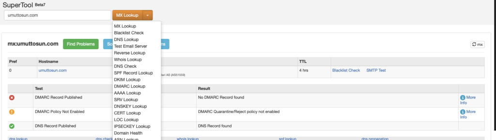
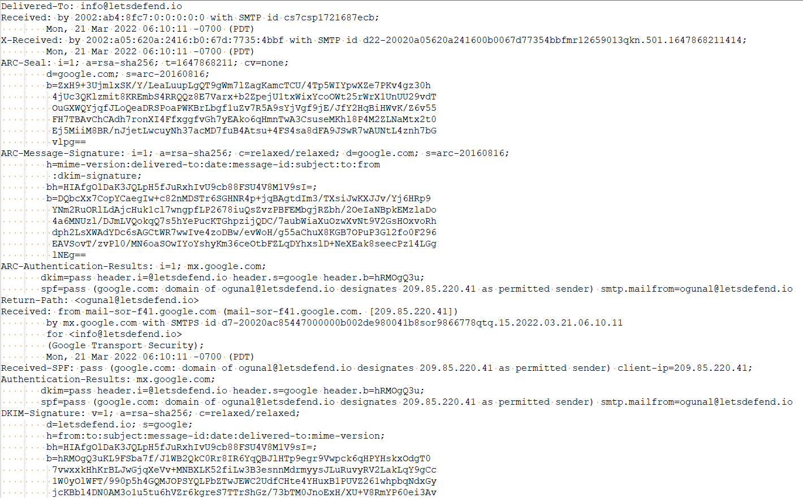
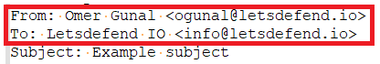
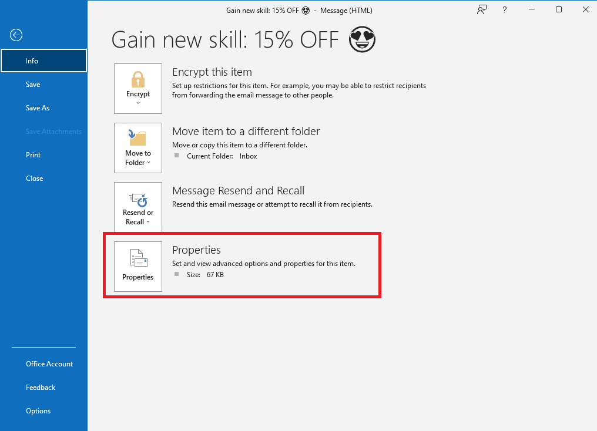
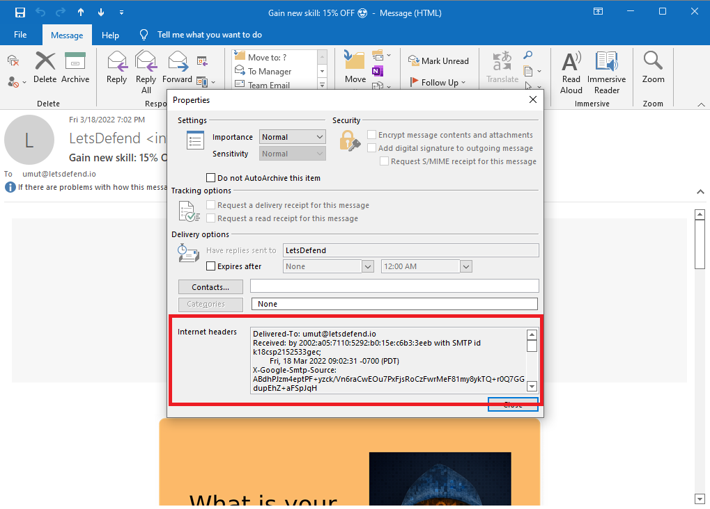
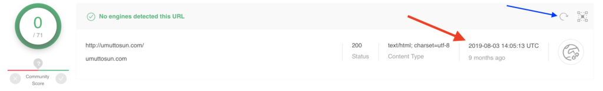
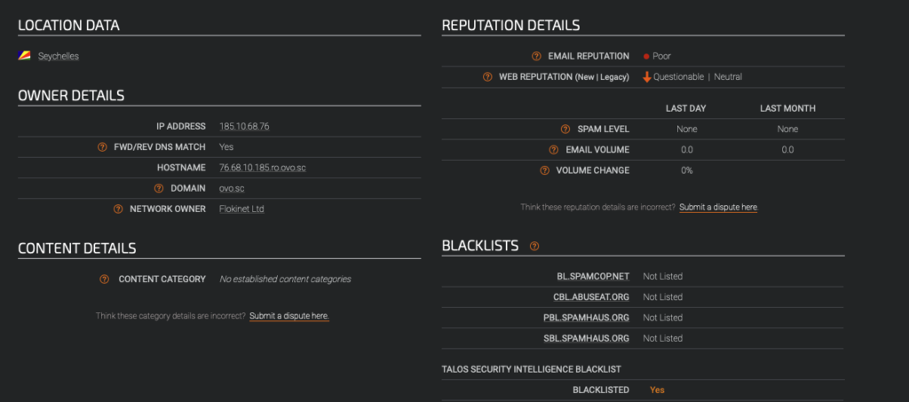
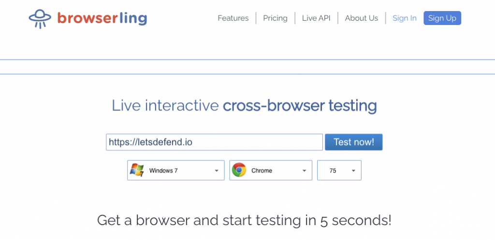

# Phishing Email Analysis — SOC Analyst Notes

## Overview

Phishing analysis is the structured examination of suspicious email activity to determine whether a message is benign, spam, phishing, or part of a broader compromise.

The theory portion of this module covered:

- phishing as an initial delivery vector
- sender and infrastructure validation
- SPF, DKIM, DMARC and MX records
- email-header interpretation
- header-based spoofing analysis
- static analysis of URLs and infrastructure
- dynamic analysis in isolated environments
- legitimate services abused for phishing
- investigation scoping using email-gateway data

The most important SOC lesson is that **no single indicator proves an email is malicious or safe**. A strong verdict comes from correlating sender identity, infrastructure, headers, message content, links, attachments, reputation data, and user/environment impact.

---

# 1. Phishing in the Attack Chain

Phishing commonly represents the **Delivery** stage of the Cyber Kill Chain: the attacker transfers malicious content to a target through email, links, attachments, or similar mechanisms.



Typical social-engineering themes include:

- urgency
- discounts or rewards
- account suspension warnings
- invoices or payment requests
- requests to open attachments
- requests to click links

## SOC Perspective

Receiving a phishing email does **not** automatically mean compromise occurred.

The analyst must determine:

```text
Was the email delivered?
        ↓
Did the user interact with it?
        ↓
Was a link clicked or attachment opened?
        ↓
Did code execute?
        ↓
Was persistence or C2 established?
        ↓
Was there account or data impact?
```

---

# 2. Information Gathering and Spoofing Analysis

The module introduced sender-authentication and infrastructure checks as important parts of phishing analysis.

Key technologies covered:

- **SPF** — Sender Policy Framework
- **DKIM** — DomainKeys Identified Mail
- **DMARC** — Domain-based Message Authentication, Reporting and Conformance
- **MX records** — identify mail servers associated with a domain

Tools such as MXToolbox can help retrieve and compare these records.



## Analyst Questions

When reviewing a suspicious sender, I should ask:

1. What domain does the visible sender claim to use?
2. What SMTP infrastructure actually delivered the message?
3. Is that infrastructure expected for the claimed domain?
4. Do SPF/DKIM/DMARC results support the sender identity?
5. Does the SMTP IP belong to the expected organization or provider?
6. Is there evidence of spoofing?
7. Even if authentication passes, could the real account itself be compromised?

### Important Lesson

A message that passes authentication is **not automatically safe**.

A legitimate or compromised mailbox can still send malicious content.

---

# 3. Email Traffic Analysis and Scope

A phishing investigation should not focus only on one message.

The training emphasized searching mail-gateway data using pivots such as:

- sender address
- SMTP IP
- sender domain
- sender-name patterns
- subject
- recipient addresses
- timestamps

These pivots can help determine:

- how many users received the message
- whether the attack targeted specific employees
- whether the same campaign used multiple senders
- whether messages arrived outside normal working hours
- whether a particular user population is repeatedly targeted

## SOC Investigation Principle

```text
One suspicious email
        ↓
Search for same sender
        ↓
Search same subject
        ↓
Search SMTP IP/domain
        ↓
Identify all recipients
        ↓
Determine campaign scope
```

---

# 4. Understanding Email Headers

Email headers contain technical routing and identity information that is often more useful than the visible message body.

A raw header may include routing, authentication, sender, recipient, timestamps, signatures and other metadata.



## Important Header Fields

| Field | Purpose |
|---|---|
| From | Visible sender identity |
| To | Recipient |
| Date | Message timestamp |
| Subject | Message subject |
| Return-Path / Reply-To | Address used for responses or return handling |
| Message-ID | Unique identifier for the message |
| MIME-Version | Indicates MIME formatting for non-text content |
| Received | Mail-server path |
| DKIM-Signature | Domain authentication signature |
| Authentication-Results | Results from authentication checks |
| X-Spam-Status | Spam classification / score where available |

### From and To



The visible `From` field alone is not enough to trust the sender.

---

# 5. Reading the Received Chain

The `Received` fields show the route an email took through mail infrastructure.

A key lesson from the module is that these entries are read **from bottom to top**:

```text
Bottom Received entry
      = earlier/originating hop

Top Received entry
      = later/final hop before delivery
```

This can help identify:

- originating SMTP infrastructure
- intermediate mail servers
- unexpected routing
- mismatch between claimed domain and actual sender infrastructure

## Investigation Question

> Does the originating infrastructure make sense for the domain shown in the From field?

If the message claims to come from a corporate domain but the originating infrastructure is unrelated, that is a strong spoofing indicator.

---

# 6. From vs Reply-To / Return-Path

A major phishing indicator can be a mismatch between the visible sender and the address that receives replies.

Example logic:

```text
From:
executive@company.com

Reply-To:
unrelated-account@example.com
```

This mismatch is suspicious because the attacker may want the email to *look* legitimate while redirecting replies elsewhere.

However:

> A mismatch by itself is not definitive proof of phishing.

The message must be assessed in context with links, attachments, infrastructure and content.

---

# 7. Accessing Email Headers

The training covered how to obtain headers from common email clients.

## Outlook

The workflow demonstrated was:

```text
Open message
→ File
→ Info
→ Properties
→ Internet headers
```





## Gmail

The training demonstrated downloading the message and inspecting the `.eml` content.

For portfolio investigations, I should preserve the relevant header evidence while sanitizing any sensitive or unnecessary information.

---

# 8. Static Analysis

Static analysis means examining suspicious content **without directly executing or visiting it**.

Useful areas include:

- visible URL
- actual hyperlink destination
- domain
- IP address
- URL parameters
- file hash
- reputation results
- sender infrastructure

## Hidden Link Destinations

A displayed hyperlink can be different from the real destination.


This is especially important in phishing because attackers may display a trusted-looking domain while pointing the user somewhere else.

## Reputation Analysis

The module demonstrated reputation-style analysis for URLs and infrastructure.





### Important Analyst Rule

A clean reputation result does **not** prove a URL is safe.

Possible reasons include:

- newly created infrastructure
- newly weaponized legitimate infrastructure
- low detection coverage
- malicious content that is no longer active
- delayed vendor classification

Reputation should support the investigation, not replace it.

---

# 9. Dynamic Analysis

Dynamic analysis involves interacting with suspicious URLs or files in an isolated environment rather than on the analyst's normal workstation.

The training recommended sandboxed analysis environments and demonstrated Browserling as one approach for safely loading suspicious web content.



Other sandbox products referenced in the module included:

- VMRay
- Joe Sandbox
- ANY.RUN
- Hybrid Analysis / Falcon Sandbox

## Safety Principle

Never execute a suspicious file or visit a suspicious URL directly from a personal or production workstation.

Use an authorized, isolated environment.

---

# 10. URL Parameters Can Leak User Information

One of the most useful lessons in the dynamic-analysis section was to inspect the URL **before opening it**.

A phishing URL may contain information such as:

```text
?email=user@example.com
```

If the analyst opens the URL exactly as received, the attacker may learn that the target address is valid even if no credentials are submitted.

## Analyst Practice

Before visiting a suspicious URL in a sandbox:

- inspect parameters
- remove or replace real email addresses
- remove unique campaign identifiers where appropriate
- avoid unintentionally confirming a victim identity

This is an important operational-security habit.

---

# 11. Sandboxes and Evasion

A sandbox can reduce risk, but it is not perfect.

The training noted that malware may:

- delay execution
- wait before displaying malicious behavior
- behave differently in analysis environments

Therefore, a file should not automatically be classified as benign just because no immediate malicious behavior appears.

---

# 12. Legitimate Services Can Be Abused

The module also covered the use of legitimate infrastructure in phishing.

Examples included:

- cloud-storage services
- Google/Microsoft-hosted services
- free subdomain providers
- WordPress
- Blogspot
- Wix
- online form services such as Google Forms

This creates a challenge because:

```text
Trusted parent domain
        ≠
Trusted content
```

An attacker may host malicious content or redirect users through otherwise legitimate services.

### SOC Takeaway

I should evaluate:

- the full URL
- subdomain
- path
- redirect behavior
- content
- infrastructure context

rather than trusting only the parent domain.

---

# 13. My Phishing Investigation Workflow

For future SOC cases, I will use the following workflow.

## Step 1 — Alert Triage

Record:

- alert name
- timestamp
- sender
- recipient
- subject
- URLs
- attachments

## Step 2 — Header Analysis

Review:

- From
- Reply-To / Return-Path
- Received chain
- Message-ID
- authentication results
- originating SMTP IP

## Step 3 — Sender Infrastructure Validation

Check:

- MX records
- SPF
- DKIM
- DMARC
- WHOIS / ownership where relevant

## Step 4 — Content Analysis

Review:

- urgency
- impersonation
- credential requests
- financial requests
- suspicious wording
- hidden links
- attachments

## Step 5 — Static IOC Analysis

Analyze:

- domains
- URLs
- IP addresses
- hashes

using appropriate reputation and threat-intelligence tools.

## Step 6 — Dynamic Analysis

Only when necessary and authorized:

- open URL in sandbox
- analyze suspicious file in sandbox
- observe redirects
- observe execution/network behavior

## Step 7 — Scope

Search the environment for:

- same sender
- same subject
- same URL/domain
- same SMTP IP
- same attachment/hash
- additional recipients

## Step 8 — User Impact

Determine:

- Was the email delivered?
- Was it opened?
- Was the link clicked?
- Was the attachment executed?
- Were credentials entered?
- Did endpoint activity follow?

## Step 9 — Verdict

Possible outcomes:

- True Positive
- False Positive
- Benign Positive
- Requires Escalation

## Step 10 — Response

Potential actions:

- block sender/domain/URL
- quarantine related emails
- reset credentials if compromised
- revoke sessions
- isolate affected endpoint
- search for related indicators
- escalate if broader compromise is suspected

---

# 14. Evidence-Based Phishing Verdict

A professional verdict should explain *why*.

Weak:

> VirusTotal says the URL is malicious.

Stronger:

> The message used a sender identity inconsistent with the originating SMTP infrastructure, contained a hidden external URL, and the domain showed malicious reputation. Mail-gateway search identified the same message delivered to multiple users. The combined evidence supports classification as a true-positive phishing campaign.

The second conclusion is stronger because it correlates multiple independent findings.

---

# 15. SOC Analyst Takeaways

After completing the theory portion of this module, I can:

- explain why phishing is commonly used as an initial attack vector
- inspect key email-header fields
- trace message routing using Received headers
- compare sender identity with SMTP infrastructure
- understand the purpose of SPF, DKIM, DMARC and MX records
- recognize From/Reply-To mismatches
- analyze suspicious URLs without immediately opening them
- use reputation sources as supporting evidence
- understand when sandbox analysis is appropriate
- recognize abuse of legitimate cloud and web services
- scope a phishing campaign across multiple recipients
- separate email delivery from actual user compromise

---

# 16. Ready for Investigation

The theory section provides the methodology. The next stage is to apply it to live SOC-style alerts.

For every phishing alert I investigate, the case report will document:

```text
Alert
→ Header analysis
→ Sender validation
→ URL/attachment analysis
→ IOC enrichment
→ Scope
→ User impact
→ MITRE ATT&CK mapping
→ Verdict
→ Containment
→ Detection opportunities
```

The investigation reports will be stored separately under:

```text
investigations/phishing/
```

so that this knowledge page remains a reusable analyst reference rather than a walkthrough of training answers.

---

## Training Context

These notes were created after completing the theory portion of the LetsDefend **Phishing Email Analysis** module.

The screenshots are included as visual references from the training material. This repository documents my own SOC-oriented understanding and methodology rather than reproducing challenge or alert answers.
