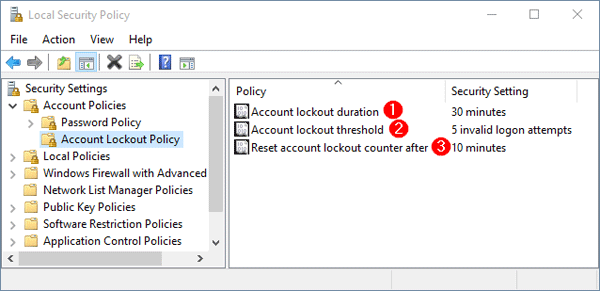
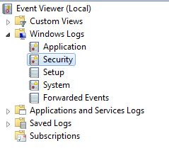
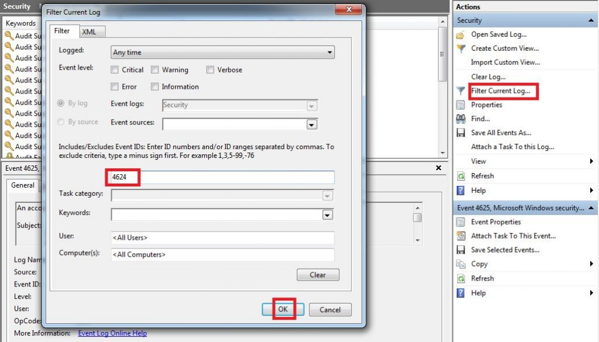
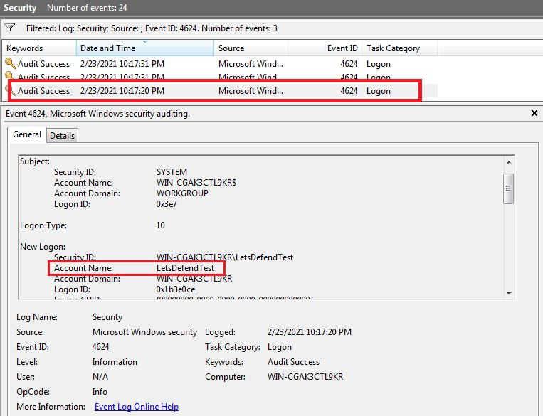
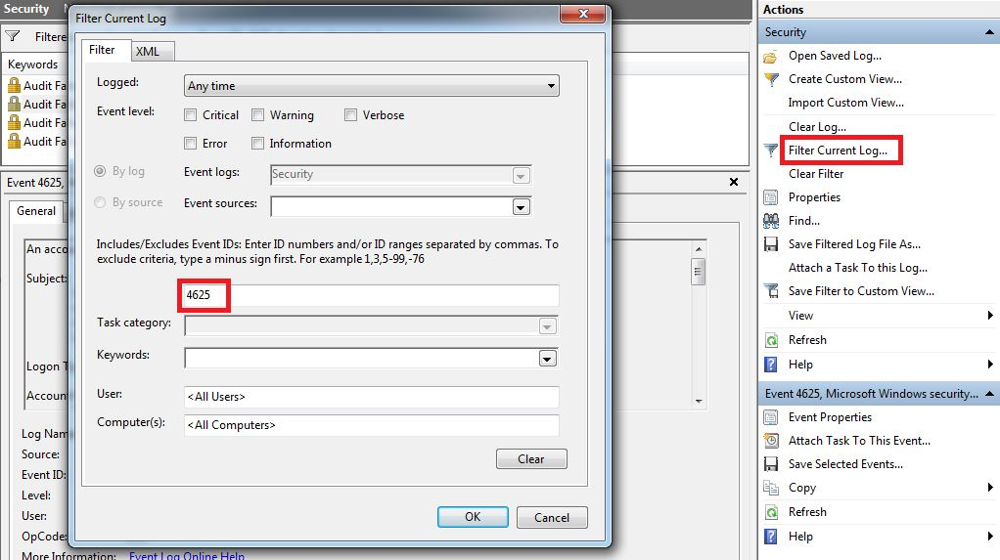
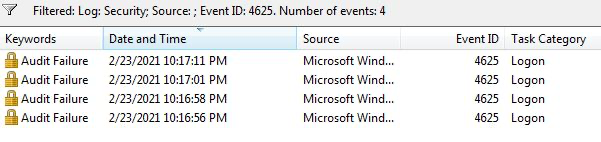
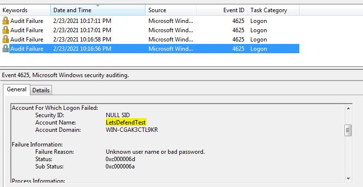
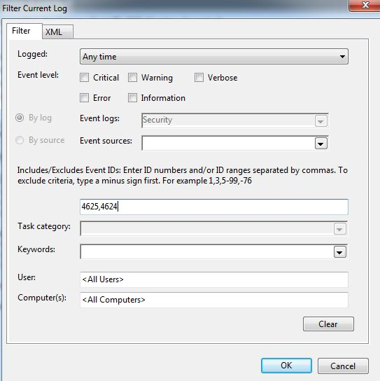
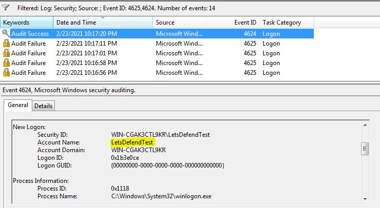

# Detecting Brute Force Attacks — SOC Analyst Knowledge Base

## Purpose

This knowledge base summarizes practical brute-force attack concepts and detection workflows for SOC analysts.

It focuses on:
- online and offline brute-force attacks
- common targeted services
- common cracking tools
- preventive controls
- Linux SSH brute-force detection
- HTTP login brute-force detection
- Windows/RDP brute-force detection using Event IDs **4624** and **4625**
- determining whether repeated failures resulted in a successful login

A practical analyst model is:

```text
Repeated authentication failures
        ↓
Same account / host / source
        ↓
Short time interval
        ↓
Check for later success
        ↓
Determine attack outcome
```

---

# 1. What Is a Brute Force Attack?

A brute-force attack uses repeated trial-and-error attempts to discover information such as usernames, passwords, web directories, or encryption keys.

The time required depends on the length and complexity of the value being guessed.

---

# 2. Main Brute Force Categories

The source material separates brute-force activity into **online** and **offline** categories.

## Online Brute Force

### Passive Online Attack
The attacker does not directly authenticate to the victim system but may capture credentials from network traffic.

Examples from the training:
- MITM
- network sniffing

### Active Online Attack
The attacker directly interacts with a live service and repeatedly attempts authentication.

Examples:
- web login attempts
- SSH brute force
- RDP login attempts
- email-server login attempts

## Offline Brute Force

Offline attacks work against previously captured hashes or encrypted credentials.

### Dictionary Attack
Uses a predefined list of likely passwords.

### Brute Force Attack
Tests possible character combinations within a selected keyspace.

### Rainbow Table Attack
Uses precomputed password-hash tables to compare against captured hashes.

### Password Data Sources
Examples from the training:
- Wi-Fi packet captures
- MITM captures
- SQL-injection database dumps
- Windows SAM
- NTDS.dit

---

# 3. Common Services Targeted

Brute-force attacks are commonly encountered against:

```text
Web application login pages
RDP
SSH
Mail server login pages
LDAP
Database services
Web directories
DNS records
```

Database examples include MSSQL, MySQL, PostgreSQL, and Oracle.

---

# 4. Common Brute Force Tools

| Tool | Primary Use | Notes |
|---|---|---|
| Aircrack-ng | Wireless password recovery | WEP/WPA/WPA2-focused tooling |
| John the Ripper | Password cracking | Dictionary and brute-force techniques |
| L0phtCrack | Windows password auditing | Rainbow tables and dictionary attacks |
| Hashcat | High-performance password recovery | CPU/GPU acceleration |
| Ncrack | Network authentication testing | Tests services for weak credentials |
| Hydra | Parallel network login attacks | Supports many network protocols |

---

# 5. Preventing Brute Force Attacks

## Account Lockout Policy



The training example shows:

```text
Account lockout duration:     30 minutes
Account lockout threshold:    5 invalid logon attempts
Reset account lockout count:  10 minutes
```

Other controls discussed include:
- progressive delays
- CAPTCHA/reCAPTCHA
- strong password policy
- 2FA

---

# 6. SSH Brute Force Detection

The training uses Linux authentication logs to identify repeated failed SSH attempts.

Example:

```bash
cat auth.log.1 | grep "Failed password" | cut -d " " -f12 | sort | uniq -c | sort
```

Successful SSH logins can be identified with:

```bash
cat auth.log.1 | grep "Accepted password"
```

Investigation flow:

```text
Failed password events
        ↓
Group by source IP
        ↓
Count attempts
        ↓
Check usernames
        ↓
Search for Accepted password
        ↓
Determine whether brute force succeeded
```

---

# 7. HTTP Login Brute Force Detection

HTTP login brute-force attacks typically involve repeated password attempts against a login endpoint.

Useful log fields include:

```text
timestamp
source IP
URI
HTTP method
status code
username
user-agent
```

Look for:
- many requests to the same login page
- repeated POST requests
- one source trying many usernames
- repeated failures followed by success

---

# 8. Windows Authentication Logs

Open:

```text
Event Viewer
→ Windows Logs
→ Security
```



Windows Event IDs make authentication investigations more efficient.

---

# 9. Event ID 4624 — Successful Logon

**Event ID 4624** indicates:

```text
An account was successfully logged on
```

Filter the Security log for:

```text
4624
```



Then inspect the successful login details.



In the training example, the account `LetsDefendTest` successfully logged in.

---

# 10. Logon Type 10 — RDP / Remote Interactive

The training example shows:

```text
Logon Type: 10
```

This indicates a remote interactive logon associated with Remote Desktop Services / RDP.

Important fields to inspect include:
- account name
- source address
- timestamp
- logon type

---

# 11. Event ID 4625 — Failed Logon

**Event ID 4625** indicates:

```text
An account failed to log on
```

Filter the Security log for:

```text
4625
```



---

# 12. Repeated Failed Logons

The filtered results show multiple failed logons occurring close together.



A burst of 4625 events is a common brute-force signal.

However, repeated failures alone do not prove malicious activity. Benign causes can include:
- forgotten passwords
- stale credentials
- scheduled tasks
- misconfigured services or applications

---

# 13. Inspect the Failed Account

Open an individual 4625 event and inspect the account information.



In the example, the failed attempts target:

```text
LetsDefendTest
```

The failure reason shown is:

```text
Unknown user name or bad password
```

---

# 14. Correlating 4625 and 4624

Filter for both:

```text
4625,4624
```



This allows the analyst to determine whether failed attempts were followed by successful authentication.

---

# 15. Successful Login After Failures

The training example shows several failed 4625 events followed by a successful 4624.



Pattern:

```text
4625
4625
4625
4625
  ↓
4624
```

This is **consistent with a successful brute-force or password-guessing attack**, provided the same account/source context is confirmed.

---

# 16. RDP Brute Force Detection Workflow

```text
1. Search Event ID 4625
2. Group failures by account
3. Group by source IP
4. Identify bursts in a short period
5. Check Logon Type
6. Search Event ID 4624 afterward
7. Correlate account/source
8. Review post-login activity
9. Determine whether compromise occurred
```

---

# 17. Unsuccessful vs Potentially Successful Brute Force

## Unsuccessful

```text
4625
4625
4625
4625
```

No later successful logon.

## Potentially Successful

```text
4625
4625
4625
4624
```

This should receive higher priority, but the 4624 must be correlated to the same relevant account/source context.

---

# 18. Important Windows Fields

Review fields such as:

```text
Account Name
Account Domain
Logon Type
Source Network Address
Workstation Name
Failure Reason
Status
Sub Status
Process Name
Timestamp
```

These help answer:

```text
Who?
From where?
Against what account?
How?
When?
Was it successful?
```

---

# 19. Detection Patterns

## One Source → One Account

```text
single IP
→ many failures
→ same username
```

Classic password guessing.

## One Source → Many Accounts

```text
single IP
→ many usernames
→ few guesses each
```

May indicate password spraying.

## Many Sources → One Account

```text
distributed IPs
→ same username
```

May indicate distributed brute force.

## Failures → Success

```text
multiple failures
→ later successful login
```

Highest-priority pattern in this workflow.

---

# 20. Brute Force vs Password Spraying

### Brute Force

```text
one/few accounts
→ many passwords
```

### Password Spraying

```text
many accounts
→ one/few common passwords
```

Both may generate 4625 events, so the analyst must examine username/source distribution.

---

# 21. Example SIEM Logic

Conceptual rule:

```text
Event ID = 4625
AND
count > threshold
BY source_ip, account
WITHIN short time window
```

Escalate if followed by:

```text
Event ID = 4624
AND
same account
AND
same/related source
```

---

# 22. Splunk-Style Investigation Example

Conceptual SPL:

```spl
index=windows EventCode=4625
| stats count min(_time) as firstSeen max(_time) as lastSeen by src_ip user
| where count >= 5
```

Then pivot for success:

```spl
index=windows (EventCode=4624 OR EventCode=4625)
user="target_user"
```

Field names vary by parser, so confirm the schema first.

---

# 23. False Positive Considerations

Repeated failures can result from:
- forgotten passwords
- expired passwords
- services using old credentials
- scheduled tasks
- cached credentials
- mapped drives
- application misconfiguration

Therefore:

```text
failure count alone
≠ confirmed attack
```

---

# 24. Escalation Indicators

Increase severity when you observe:
- a 4624 success after repeated 4625 failures
- Logon Type 10
- privileged account targeting
- unfamiliar source IP
- unusual login time
- lateral movement behavior
- suspicious post-login process activity

---

# 25. Response Actions

If brute force appears successful:

1. contain the affected host if warranted;
2. disable/reset the account;
3. review active sessions;
4. identify and assess the source IP;
5. block malicious sources where appropriate;
6. review other targeted accounts;
7. investigate post-login activity;
8. search for lateral movement;
9. enforce MFA where available;
10. review lockout policy.

---

# 26. Prevention Checklist

- [ ] account lockout threshold
- [ ] lockout duration
- [ ] progressive delays
- [ ] strong password policy
- [ ] MFA / 2FA
- [ ] CAPTCHA for web authentication
- [ ] authentication monitoring
- [ ] restricted RDP/SSH exposure
- [ ] alerts on repeated failures
- [ ] alerts on failures followed by success

---

# 27. SOC Investigation Checklist

- [ ] identify target service
- [ ] identify source IP
- [ ] identify account(s)
- [ ] count failed attempts
- [ ] establish time window
- [ ] inspect failure reason
- [ ] determine logon type
- [ ] search for successful login
- [ ] correlate source/account
- [ ] review post-authentication activity
- [ ] determine scope
- [ ] classify success vs failure
- [ ] document false-positive possibilities

---

# 28. Common Analyst Mistakes

Avoid:
- treating every 4625 burst as malicious
- assuming 4624 after 4625 automatically proves brute force
- ignoring Logon Type
- ignoring source IP
- failing to correlate the same account
- failing to inspect post-login activity
- confusing brute force with password spraying
- relying only on event counts

---

# 29. Skills Demonstrated

This lab develops practical familiarity with:

```text
Windows Event Viewer
Security logs
Event ID 4624
Event ID 4625
RDP brute-force detection
Logon Type analysis
Linux auth.log review
SSH brute-force detection
Authentication correlation
Attack-success validation
Account lockout policy
Brute-force prevention
```

---

# 30. Interview-Level Summary

If asked **"How would you detect a Windows RDP brute-force attack?"**, a strong answer is:

> I would review Windows Security logs for repeated Event ID 4625 failures, group them by source IP and account, and look for bursts over a short time window. I would inspect the Logon Type to determine whether the activity is remote interactive/RDP and then search for Event ID 4624 to determine whether the attacker eventually authenticated successfully. I would correlate the account, source, timestamp, and post-login activity before deciding whether the attack succeeded.

---

# SOC Takeaway

The most useful brute-force signal is not simply:

```text
many failed logins
```

It is the broader sequence:

```text
Repeated failures
→ same account/source context
→ short time window
→ successful authentication
→ suspicious post-login behavior
```

For Windows RDP investigations, **4625 + 4624 correlation** is the core workflow demonstrated in this training.

---

# Training Context

This knowledge base was created from authorized training material on detecting brute-force attacks and associated Windows Event Viewer screenshots. It is intended as a practical SOC analyst reference rather than a quiz-answer walkthrough.
