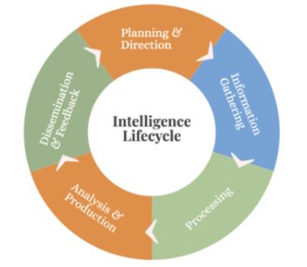
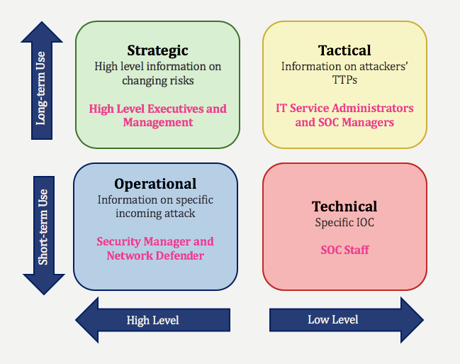
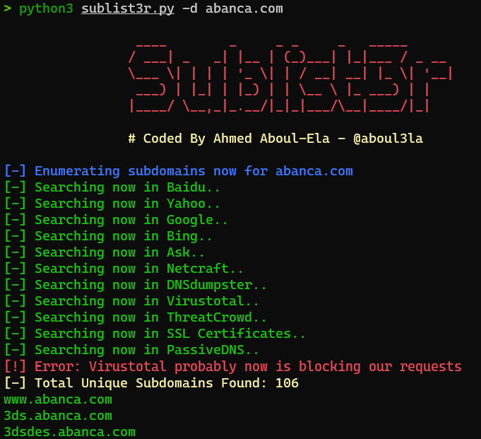
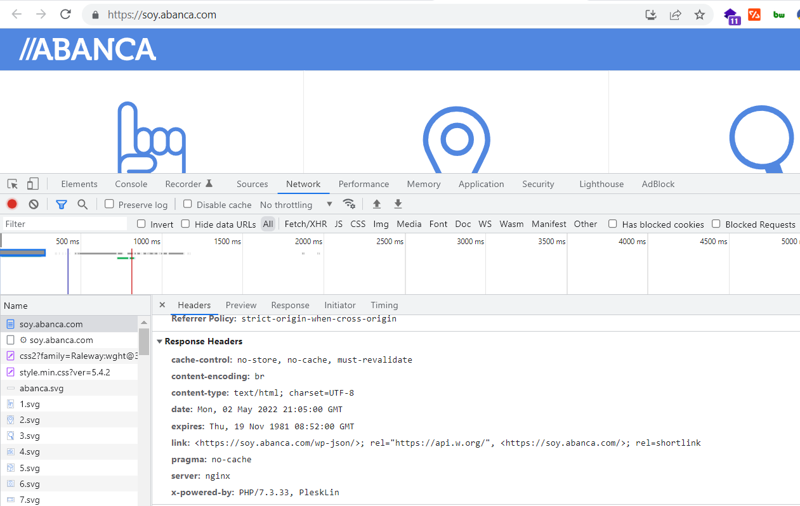
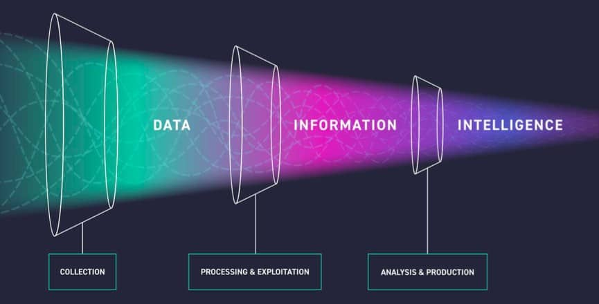

# Cyber Threat Intelligence — SOC Analyst Knowledge Base

## Purpose

This knowledge base summarizes practical Cyber Threat Intelligence (CTI) concepts for SOC analysis.

The emphasis is on how threat intelligence supports:

- IOC enrichment
- attacker TTP analysis
- threat hunting
- attack-surface discovery
- false-positive reduction
- SIEM / SOAR / EDR / firewall integration
- proactive detection and response

A simple CTI model is:

```text
Raw Data
→ Collection
→ Processing
→ Analysis
→ Actionable Intelligence
→ Defensive Action
```

---

# 1. What Cyber Threat Intelligence Is

Cyber Threat Intelligence transforms security data into information that can support a defensive decision.

CTI is especially concerned with:

- Indicators of Compromise (IOCs)
- attacker tactics
- techniques
- procedures
- campaigns
- threat actors
- organizational relevance

A list of hashes, domains, or IPs is not automatically intelligence.

It becomes useful when the analyst can answer:

```text
What does this indicator mean?
How reliable is it?
Does it affect our environment?
What attacker behavior is associated with it?
What action should we take?
```

---

# 2. CTI Lifecycle



The training lifecycle is:

```text
Planning & Direction
→ Information Gathering
→ Processing
→ Analysis & Production
→ Dissemination & Feedback
```

## Planning & Direction

Define:

- intelligence consumers
- intelligence requirements
- collection priorities
- scope
- expected use of intelligence

Questions may include:

```text
Does the organization have a SOC?
Has the organization been attacked before?
Are attackers targeting the company or individuals?
Are similar organizations being targeted?
```

The answers help determine what kind of intelligence is needed.

## Information Gathering

Collect raw data from internal and external sources.

External sources may include:

- hacker forums
- ransomware blogs
- dark web
- Telegram / Discord
- security blogs
- public sandboxes
- GitHub / GitLab / Bitbucket
- public cloud buckets
- Shodan / BinaryEdge / ZoomEye
- IOC feeds

Internal sources include:

- SIEM
- IDS/IPS
- firewalls
- honeypots

## Processing

Processing prepares the collected data for analysis.

Tasks include:

```text
remove false positives
normalize data
classify indicators
apply filters
correlate related observations
```

The goal is:

```text
raw data → useful information
```

## Analysis & Production

Turn processed information into intelligence.

Examples:

- identify patterns
- map TTPs
- assess attacker behavior
- identify campaigns
- create IOC reports
- produce executive summaries

## Dissemination & Feedback

Send the right intelligence to the right audience.

Examples:

```text
SOC analyst → technical indicators
SOC manager → tactical intelligence
threat hunter → operational intelligence
executive → strategic intelligence
```

Feedback improves future collection and analysis.

---

# 3. Types of CTI



| CTI Type | Main Focus | Typical Consumer | Example |
|---|---|---|---|
| Technical | IOCs | SOC Analysts / IR | IPs, hashes, domains |
| Tactical | TTPs | SOC Managers / Security Leads | attacker behavior |
| Operational | Specific campaigns / attackers | Threat Hunters | campaign intelligence |
| Strategic | Business risk | Executives | long-term risk trends |

## Technical CTI

Examples:

```text
malicious IP
malicious domain
file hash
URL
email address
detection rule
```

This is the most immediately useful CTI type for L1 SOC work.

## Tactical CTI

Focuses on how attackers operate:

```text
Tactics
Techniques
Procedures
```

Useful for:

- detection engineering
- defensive tuning
- ATT&CK mapping
- security architecture

## Operational CTI

Focuses on:

- a specific threat actor
- campaign
- intrusion
- active attack

Useful for threat hunting and incident response.

## Strategic CTI

High-level intelligence for:

- risk decisions
- budgeting
- long-term planning
- security investments

---

# 4. Attack Surface Intelligence

CTI becomes more valuable when intelligence is mapped to assets the organization actually owns.

The training covers:

- domains
- subdomains
- websites
- login pages
- web technologies
- IP addresses
- IP blocks
- DNS records
- executive emails
- network applications
- operating systems
- financial identifiers
- SSL certificates

The key question is:

```text
What do we own?
What is exposed?
What technologies are present?
What could an attacker target?
```

---

# 5. Domain Discovery

Useful methods include:

- hosting analysis
- reverse WHOIS
- DNS intelligence
- manual content verification

Tools referenced:

```text
Host.io
ViewDNS
Whoxy
DNSlytics
```

Important:

> A discovered domain is not automatically owned by the organization.

Verify ownership using:

- WHOIS
- website content
- registration details
- DNS relationships

---

# 6. Subdomain Discovery

The training recommends combining multiple sources.

Tools include:

```text
SecurityTrails
Sublist3r
Aquatone
Assetfinder
```

Example command-line enumeration:



Multiple sources improve coverage because no single enumeration tool will find everything.

---

# 7. Website Discovery

After collecting domains and subdomains:

```text
probe HTTP/HTTPS
→ identify responding hosts
→ build active website inventory
```

Tools referenced:

```text
httpx
httprobe
```

This helps distinguish:

```text
known DNS name
```

from:

```text
active web service
```

---

# 8. Login Page Discovery

Login pages are valuable because they may be targeted by:

- credential stuffing
- brute force
- phishing
- authentication bypass

The training describes automated detection with Python libraries such as:

```text
requests
BeautifulSoup
```

Possible indicators include:

- Login / Sign In text
- `<form>` tags
- username fields
- password fields
- authentication-related page titles

---

# 9. Website Technology Identification

Knowing the technology stack helps connect:

```text
asset
+
software/version
+
known vulnerability
```

Tools referenced:

```text
Wappalyzer
WhatRuns
BuiltWith
WhatCMS
```

Manual techniques include:

- source-code review
- JavaScript/library inspection
- HTTP response-header analysis



Headers can reveal:

```text
server
x-powered-by
framework
runtime
CMS clues
```

---

# 10. IP Address and IP Block Discovery

IP discovery methods include:

- DNS A records
- DNS resolution
- active network scanning
- internet intelligence platforms

IP block discovery tools include:

```text
Shodan
BinaryEdge
ZoomEye
bgp.he.net
```

The objective is to identify infrastructure that may not already be documented internally.

---

# 11. DNS Intelligence

DNS monitoring can help identify:

- unauthorized changes
- misconfiguration
- suspicious redirection
- takeover conditions
- zone-transfer exposure

Tools referenced:

```text
dig
Google Dig Tool
DNSlytics
```

Useful records include:

```text
A
AAAA
MX
TXT
CNAME
NS
```

---

# 12. Executive Email Exposure

Senior executives are high-value phishing and impersonation targets.

Tools referenced:

```text
SalesQL
RocketReach
Apollo
ContactOut
```

Potential defensive uses:

- phishing monitoring
- credential-leak detection
- impersonation monitoring
- Digital Risk Protection

---

# 13. Network Applications and Operating Systems

Methods include:

```text
passive scanning
active scanning
service fingerprinting
```

Sources such as Shodan may help identify:

- open ports
- exposed services
- software versions
- operating systems
- service banners

This supports vulnerability prioritization.

---

# 14. SSL Certificate Intelligence

Tools referenced:

```text
Censys
crt.sh
```

Certificate data can reveal:

- new subdomains
- newly issued certificates
- shadow infrastructure
- unauthorized certificates

---

# 15. Gathering Threat Intelligence

The training emphasizes:

```text
broad source coverage
false-positive management
frequent collection
```

Because CTI changes rapidly, feeds should be refreshed regularly.

---

# 16. Internet Exposure Search Engines

Platforms referenced:

```text
Shodan
BinaryEdge
ZoomEye
Censys
```

These can identify:

- exposed ports
- public services
- certificates
- technologies
- externally visible infrastructure

---

# 17. IOC Sources

Examples include:

```text
AlienVault
MalwareBazaar
Abuse.ch
Malshare
ANY.RUN
VirusTotal
Hybrid Analysis
URLScan
Spamhaus
```

Indicator types may include:

```text
IP
domain
URL
hash
email
malware family
```

### Analyst Principle

Do not rely on one feed alone.

Corroborate important indicators using multiple sources and internal telemetry.

---

# 18. Threat Actor and Underground Sources

The training includes intelligence collection from:

- hacker forums
- ransomware blogs
- black markets
- chat platforms
- code repositories
- file-sharing sites
- public cloud buckets

Possible findings include:

```text
credentials
access sales
malware
planned attacks
victim data
leaked files
organization mentions
```

---

# 19. Honeypots

Honeypots deliberately expose controlled systems to collect attacker behavior.

Examples referenced include:

```text
Kippo
Cowrie
Glastopf
Nodepot
ElasticHoney
Honeymail
```

Possible intelligence:

- source IPs
- attempted credentials
- payloads
- attack patterns
- attacker TTPs

---

# 20. Internal Security Devices as CTI Sources

Internal telemetry can also generate intelligence.

Examples:

```text
SIEM
IDS
IPS
Firewall
EDR
```

These can provide:

- attacker IPs
- hashes
- malicious domains
- blocked attempts
- host-level observations

This creates a useful feedback loop:

```text
Internal telemetry
→ CTI enrichment
→ Better detection
→ More telemetry
```

---

# 21. Data → Information → Intelligence



The training distinguishes:

```text
Data
→ raw observations

Information
→ processed and organized data

Intelligence
→ analyzed information that supports action
```

This distinction is fundamental to CTI.

---

# 22. False-Positive Management

Poor-quality intelligence can disrupt legitimate activity.

Example:

```text
legitimate application hash
mistakenly labeled malicious
→ security control blocks it
→ business disruption
```

Therefore CTI should be:

- classified
- cleaned
- validated
- correlated
- whitelisted where appropriate

Reputation alone should not determine a SOC verdict.

---

# 23. XTI

The source material groups three areas under an extended-threat-intelligence concept:

```text
EASM
DRP
CTI
```

---

# 24. External Attack Surface Management (EASM)

EASM focuses on outward-facing assets.

Typical alerts include:

- new asset detected
- WHOIS change
- DNS change
- DNS zone transfer
- internal IP exposed
- critical open port
- SMTP open relay
- missing SPF/DMARC
- expired/revoked certificate
- suspicious redirect
- subdomain takeover
- website status change
- vulnerability detected

The analyst should ask:

```text
Is this asset ours?
Is the change expected?
Is the exposure authorized?
Does it require remediation?
```

---

# 25. Digital Risk Protection (DRP)

DRP focuses on:

- brand abuse
- phishing domains
- impersonation
- dark-web exposure
- stolen credentials
- fraud
- rogue applications
- executive protection

Typical alerts:

```text
Potential phishing domain
Impersonating social account
Credential leak
Code repository leak
Botnet listing
Stolen card information
```

---

# 26. CTI Within XTI

CTI focuses on:

- malicious campaigns
- ransomware groups
- threat actors
- offensive infrastructure
- global IOCs and TTPs

It becomes most useful when integrated into the SOC technology stack.

---

# 27. CTI and SOC Integration

The training highlights integration with:

```text
SIEM
SOAR
EDR
Firewall
```

Practical flow:

```text
Threat Intelligence Feed
        ↓
SIEM Correlation
        ↓
Alert
        ↓
SOC Investigation
        ↓
SOAR / EDR / Firewall Action
```

---

# 28. SIEM Integration

CTI can enrich SIEM events with:

- reputation
- IOC confidence
- campaign context
- malware family
- threat actor
- geography

Example:

```text
firewall connection
+
destination in high-confidence CTI feed
→ increased priority
```

---

# 29. Firewall Integration

Firewalls can consume CTI feeds for blocking.

Example:

```text
known malicious IP
→ CTI feed
→ firewall block
```

Feed quality matters because false positives can block legitimate infrastructure.

---

# 30. EDR Integration

CTI can enrich endpoint detections with:

- malicious hashes
- domains
- IPs
- file reputation
- campaign context

Example:

```text
unknown executable
+
hash matches malware intelligence
+
suspicious behavior
→ stronger evidence
```

---

# 31. SOAR Integration

SOAR can automate high-confidence response actions.

Examples:

```text
block IP
quarantine endpoint
disable account
enrich IOC
open incident
notify analyst
```

Automation should depend on intelligence confidence.

---

# 32. SOC CTI Investigation Workflow

```text
Alert
 ↓
Extract IOC
 ↓
Check internal telemetry
 ↓
Enrich with CTI
 ↓
Validate confidence
 ↓
Map TTP / campaign
 ↓
Determine organizational relevance
 ↓
Search for additional affected assets
 ↓
Contain / escalate
 ↓
Feed findings back into detection
```

---

# 33. IOC Validation Checklist

Before acting on an IOC:

- [ ] indicator type confirmed
- [ ] source identified
- [ ] confidence understood
- [ ] freshness checked
- [ ] multiple sources compared
- [ ] internal telemetry searched
- [ ] benign/shared infrastructure considered
- [ ] asset ownership verified
- [ ] false-positive risk assessed
- [ ] response proportional to confidence

---

# 34. Attack-Surface Checklist

- [ ] domains
- [ ] subdomains
- [ ] active websites
- [ ] login pages
- [ ] web technologies
- [ ] IP addresses
- [ ] IP blocks
- [ ] DNS records
- [ ] SSL certificates
- [ ] exposed services
- [ ] operating systems
- [ ] executive emails

---

# 35. Common Analyst Mistakes

Avoid:

- treating every IOC as confirmed malicious
- assuming every discovered domain belongs to the organization
- relying on one intelligence source
- ignoring indicator age
- confusing raw data with intelligence
- acting on reputation alone
- failing to map intelligence to owned assets
- collecting indicators without an intelligence requirement
- failing to feed findings back into detections

---

# 36. CTI Memory Model

```text
Technical
→ What exact IOC should I detect?

Tactical
→ How does the attacker operate?

Operational
→ What is this attacker/campaign doing?

Strategic
→ What does this threat mean for the business?
```

---

# 37. Interview-Level Summary

If asked **"How do you use threat intelligence in a SOC investigation?"**, a strong answer is:

> I use threat intelligence to enrich indicators from the alert, but I do not rely on reputation alone. I validate the indicator across multiple sources, check freshness and confidence, search internal telemetry for related activity, and determine whether the indicator is relevant to assets we actually own. If the intelligence maps to a known campaign or TTP, I use that context to expand the investigation, determine scope, and improve detections or response actions.

---

# SOC Takeaway

Threat intelligence is most useful when it changes a defensive decision.

```text
Data
→ Information
→ Intelligence
→ Detection
→ Investigation
→ Response
```

The goal is not simply to collect more indicators.

The goal is to produce **relevant, validated, actionable intelligence**.

---

# Training Context

This knowledge base was created from authorized Cyber Threat Intelligence training material and lab screenshots. It is intended as a practical SOC analyst reference rather than a quiz-answer walkthrough.
