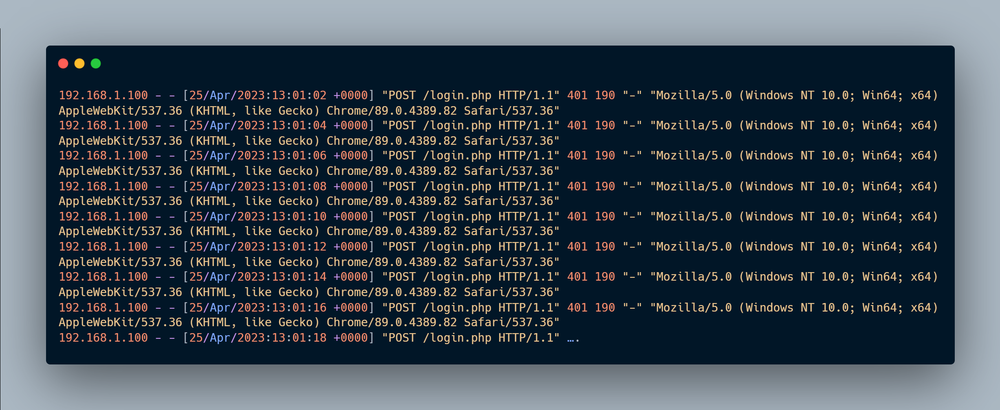
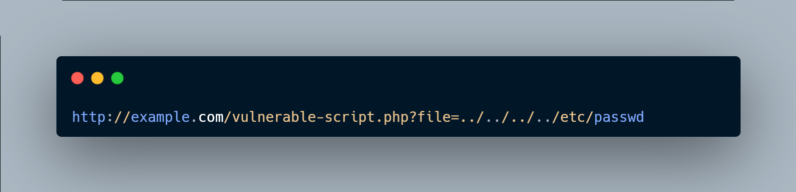
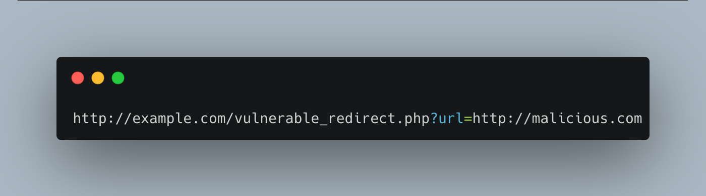
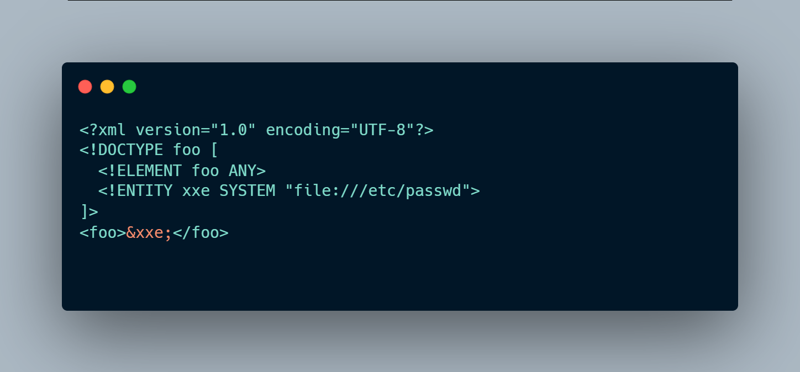

# Detecting Web Attacks 2 — SOC Analyst Knowledge Reference

This section contains operational notes from the **Detecting Web Attacks 2** module. The objective is not to reproduce course answers, but to convert the material into a practical SOC reference for recognizing, validating, scoping, and responding to web attacks.

The module covers four attack classes:

- Brute-force attacks
- Directory traversal
- Open redirection
- XML External Entity (XXE)

---

## Analyst Workflow

When a web alert fires, I use the following sequence:

```text
Alert
  ↓
Understand the detection trigger
  ↓
Normalize / decode the request
  ↓
Identify source, destination, direction, method and endpoint
  ↓
Correlate related requests from the same source
  ↓
Assess HTTP response codes and response sizes
  ↓
Determine attack type
  ↓
Determine attempted vs successful exploitation
  ↓
Check for planned testing / authorized activity
  ↓
Scope affected assets and accounts
  ↓
Contain / escalate when compromise is supported
  ↓
Document detection gaps and tuning opportunities
```

A request that merely contains a suspicious string is not enough to prove successful exploitation. The payload, request context, correlated activity, application response, and—when available—endpoint or authentication telemetry should be evaluated together.

---

# 1. Brute-Force Attacks



## What It Is

A brute-force attack repeatedly attempts authentication combinations until valid credentials are found. Automated tooling may generate a large volume of login attempts against the same account, many accounts, or a web authentication endpoint.

Brute-force behavior is not limited to credential guessing. Repeated enumeration of directories or files can also use brute-force techniques, although that activity should be classified according to the actual objective of the traffic.

## Evidence to Examine

Useful telemetry includes:

- Web authentication logs
- Reverse-proxy / web-server logs
- Identity-provider logs
- WAF / IDS / IPS telemetry
- Source IP and ASN
- Username or account targeted
- HTTP method and endpoint
- Response code
- Response size
- Session cookies
- User-Agent
- Rate and timing of requests

## Detection Pattern

Common indicators include:

- High numbers of failed logins from one IP
- Many usernames attempted from the same source
- Repeated attempts against one account
- A sudden spike in authentication failures
- Consistent user-agent and source infrastructure across attempts
- A sequence of failures followed by a success

The final pattern is especially important:

```text
401 / 403
401 / 403
401 / 403
...
302 / 200
```

A redirect or successful response after many failures can indicate credential compromise, but the application’s normal authentication behavior must be understood before treating status codes as definitive.

## Detection Engineering

Possible logic:

```text
same source_ip
AND same login endpoint
AND failed_auth_count >= threshold
WITHIN short time window
```

Higher-confidence logic can combine:

```text
multiple failures
→ successful authentication
→ new session
→ post-login activity
```

## False Positives

Potential benign causes include:

- Users repeatedly mistyping passwords
- Broken applications or stored credentials
- Password managers
- QA / load testing
- Approved penetration testing
- Shared NAT environments

## Defensive Controls

- MFA
- Rate limiting
- Account lockout / progressive delay
- CAPTCHA / bot detection
- WAF controls
- Strong password policy
- Monitoring and alerting
- Source-IP blocking where appropriate
- Fail2ban or equivalent controls for exposed services

## Analyst Principle

> Brute-force detection is strongest when the analyst identifies the transition from repeated failures to successful authentication and then validates what happened after login.

---

# 2. Directory Traversal



## What It Is

Directory traversal attempts to access files outside the intended web root or application directory by manipulating path input.

Classic pattern:

```text
../
```

The same sequence may appear encoded or double encoded.

Typical target files include:

### Linux

```text
/etc/passwd
/etc/shadow
/etc/hosts
/etc/group
/etc/issue
```

### Windows

```text
C:\boot.ini
C:\inetpub\wwwroot\web.config
C:\sysprep.inf
```

## Directory Traversal vs LFI

These concepts overlap but are not identical.

**Directory traversal** focuses on escaping the intended path and reaching files outside the allowed directory.

**Local File Inclusion (LFI)** occurs when user-controlled input influences a local file include operation within the application.

The same payload may appear in either situation, so the application behavior and vulnerable parameter matter.

## Detection Indicators

Look for:

```text
../
..\ 
%2e%2e%2f
%252e%252e%252f
```

Also consider alternative encodings and normalization bypasses.

High-confidence activity often combines traversal sequences with sensitive file targets:

```text
../.../../etc/passwd
../.../../etc/shadow
```

## Investigation Questions

1. Which parameter contains the traversal sequence?
2. Was the request URL-decoded before analysis?
3. Is the source external or internal?
4. Were several paths attempted?
5. Which files were targeted?
6. Did the server return meaningful content?
7. Did response size change between attempts?
8. Is there subsequent exploitation from the same source?

## Success Assessment

Do not treat `HTTP 200` alone as proof of successful file disclosure.

Stronger evidence includes:

- Response body containing file contents
- Response-size changes consistent with retrieved files
- Application logs confirming file access
- Endpoint file-access telemetry
- Follow-on use of exposed credentials or configuration data

## Detection Engineering

Detection should normalize the URI before inspection and look for both raw and encoded traversal patterns.

Conceptual logic:

```text
normalized_uri contains traversal_sequence
AND
(
  normalized_uri contains sensitive_file
  OR traversal_depth >= threshold
)
```

## Defensive Controls

- Canonicalize paths before validation
- Allowlist permitted files or identifiers
- Avoid direct concatenation of user input into file paths
- Use least-privilege file permissions
- Restrict the web-service account
- WAF filtering
- Validate resolved path remains inside the allowed root

## Analyst Principle

> Decode first, then inspect the normalized path. Encoded traversal is still traversal.

---

# 3. Open Redirection



## What It Is

Open redirection occurs when an application accepts user-controlled redirect destinations without restricting them to trusted locations.

Example pattern:

```text
https://trusted.example/redirect?url=https://attacker.example
```

The initial domain may be legitimate while the final destination is attacker controlled.

## Common Vectors

Look for parameters such as:

```text
url=
next=
redirect=
return=
returnUrl=
continue=
dest=
destination=
```

Redirection can be implemented through:

- HTTP `Location` headers
- Application-side redirects
- JavaScript
- Meta refresh
- URL parameters
- Form parameters

## Bypass / Obfuscation Considerations

Attackers may try alternate URL representations, encoded characters, loopback forms, decimal or hexadecimal IP representations, or unusual host syntax.

Therefore, the redirect target should be normalized and parsed before comparison against an allowlist.

## Detection Indicators

Potential signs include:

- Repeated requests to redirect-related parameters
- External domains inserted into redirect fields
- URL-encoded schemes such as `https%3A%2F%2F`
- Rapid testing of multiple URL representations
- Same source cycling through bypass formats
- Redirect response pointing to an unexpected external domain

## Investigation Questions

1. What parameter controls redirection?
2. What does the decoded target resolve to?
3. Is the destination external?
4. Does the application return a redirect response?
5. What is the `Location` header?
6. Is the target domain approved?
7. Are multiple bypass variants being tested?
8. Is the source showing automated behavior?

## Detection Engineering

Conceptual detection:

```text
redirect_parameter exists
AND decoded_target_domain NOT IN approved_domains
```

A stronger rule compares the normalized eTLD+1 or expected host against an allowlist rather than relying on substring matching.

## False Positives

Legitimate redirect behavior can occur in:

- SSO flows
- OAuth / OIDC
- Marketing links
- URL shorteners
- Payment integrations
- Partner portals

Context and allowlisting are essential.

## Defensive Controls

- Use an allowlist of approved redirect destinations
- Prefer server-side identifiers instead of raw user-supplied URLs
- Normalize and validate the final destination
- Reject alternate-scheme and malformed targets
- Avoid substring-only validation
- Protect redirect flows with appropriate authorization

## Analyst Principle

> The trusted domain in the first URL does not make the final redirect destination trustworthy.

---

# 4. XML External Entity (XXE)



## What It Is

XXE targets applications that parse attacker-controlled XML while permitting external entity processing.

A typical payload defines a `DOCTYPE` and `ENTITY` that references a local file or remote resource.

Example indicators:

```text
<!DOCTYPE
<!ENTITY
SYSTEM
file://
&xxe;
```

Possible consequences include:

- Local file disclosure
- Server-Side Request Forgery (SSRF)
- Internal network access
- Denial of service
- In some environments, further server compromise

## Common Attack Surfaces

- XML API requests
- SOAP
- REST endpoints accepting XML
- XML file uploads
- XML configuration import
- Form fields that process XML

## Payload Families

### Local File Read

```xml
<!DOCTYPE foo [
  <!ENTITY xxe SYSTEM "file:///etc/passwd">
]>
```

### Blind / Out-of-Band XXE

An external entity references attacker-controlled infrastructure, allowing the analyst to look for server-side DNS or HTTP callbacks.

### Filter / Encoding Variants

Payloads may use application-specific wrappers or encodings to transform or exfiltrate file contents.

## Detection Indicators

Monitor normalized request bodies and parameters for:

```text
DOCTYPE
ENTITY
SYSTEM
PUBLIC
file://
php://
&xxe;
```

Encoded versions must also be considered.

## Investigation Questions

1. Which endpoint accepts XML?
2. Which request parameter or body contained the payload?
3. Was `DOCTYPE` or an entity declaration present?
4. Was a local file referenced?
5. Was an external URL referenced?
6. Did the server make an outbound connection?
7. Did the response contain file data?
8. Was the parser configured to allow external entities?
9. Did the attacker attempt several XXE variants?

## Success Assessment

`HTTP 200` proves only that the web request received a successful HTTP response; it does not alone prove the external entity was resolved.

Stronger evidence includes:

- Sensitive file content returned
- Server-side callback to attacker infrastructure
- DNS query from the server
- Outbound HTTP connection from the server
- XML parser or application logs confirming entity resolution

## Detection Engineering

Useful detection logic can combine:

```text
XML content type
AND
(
  DOCTYPE
  OR ENTITY
  OR SYSTEM
  OR file://
)
```

For blind XXE, network telemetry is essential:

```text
web_server
→ unexpected external DNS/HTTP destination
immediately after XML request
```

## Defensive Controls

- Disable external entity resolution
- Disable unnecessary DTD processing
- Use hardened XML parser settings
- Keep parsing libraries updated
- Validate XML input
- Restrict server egress
- Apply least privilege to application services

## Analyst Principle

> XXE is both a web-input problem and a server-side network/file-access problem. Correlating the inbound XML request with outbound server behavior can materially increase confidence.

---

# Cross-Attack Comparison

| Attack | Primary Signal | Important Validation | Typical Impact |
|---|---|---|---|
| Brute force | Repeated authentication attempts | Failure → success transition | Account takeover |
| Directory traversal | Path traversal sequences | File content / file-access evidence | Sensitive file disclosure |
| Open redirection | User-controlled redirect target | Final `Location` / destination | Phishing, malware delivery |
| XXE | XML entity declarations | File disclosure or server callback | File read, SSRF, DoS |

---

# HTTP Response Interpretation

HTTP status codes provide context but should not be treated as the sole success criterion.

| Response | General Meaning | SOC Interpretation |
|---|---|---|
| `200` | Request processed | Could be success, error page, or benign response |
| `301/302` | Redirect | Determine where the client is redirected |
| `400` | Bad request | Often malformed input; may indicate failed attack |
| `401` | Authentication required | Useful during brute-force analysis |
| `403` | Forbidden | Request rejected; still validate whether other attempts succeeded |
| `404` | Not found | Often enumeration failure |
| `500` | Server error | Attack may have failed, but an exception can also reveal vulnerable behavior |

Response **size**, response **body**, session behavior, and correlated endpoint/application telemetry provide stronger evidence than status code alone.

---

# Detection Engineering Principles

Across these attack classes, a good detection should:

1. Normalize and decode input before matching.
2. Detect behavior, not only literal strings.
3. Correlate multiple requests over time.
4. Separate reconnaissance from exploitation.
5. Track source IP, account, endpoint, URI, parameter and user-agent.
6. Include application response context.
7. Use allowlists carefully for known-good redirects or scanners.
8. Avoid concluding success from `200 OK` alone.
9. Escalate when post-exploitation or confirmed data access is observed.
10. Document false-positive conditions and tuning rationale.

---

# SOC Takeaways

The major operational lesson from this module is that **payload identification is only the beginning of the investigation**.

A strong SOC analyst should be able to answer:

- What exactly triggered the rule?
- What does the decoded request actually contain?
- Was this one request or part of a sequence?
- What asset and application function were targeted?
- Was the traffic allowed?
- Was the exploit merely attempted or did it succeed?
- What evidence supports that conclusion?
- What follow-on activity occurred?
- Does the detection require tuning?
- What should be contained, blocked, escalated, or remediated?

That distinction—between recognizing an attack string and proving its security impact—is what turns web-log review into an investigation.


---

## Curated Visual References

Only a small set of useful screenshots is retained in this repository. Decorative course graphics, page furniture, badges, buttons, duplicate images, and challenge-answer screenshots are intentionally excluded.

The retained images illustrate:

- Brute-force request patterns and authentication outcomes
- Directory-traversal payloads, encodings, and log detection
- Open-redirection payload normalization
- XXE payload structure and log evidence
