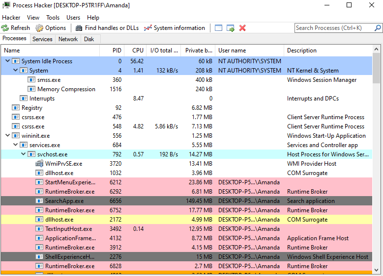
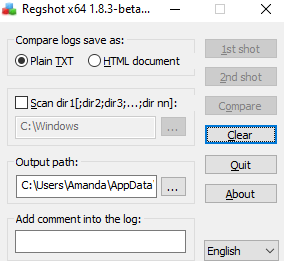
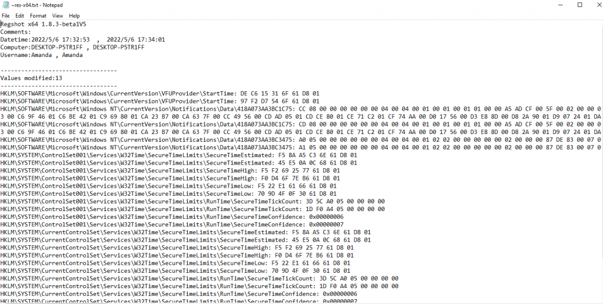
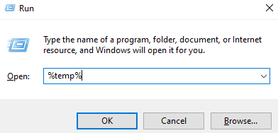

# Dynamic Malware Analysis — SOC Analyst Knowledge Base

## Purpose

This reference is a practical SOC-oriented guide for safely observing malware behavior at runtime.

Dynamic malware analysis means executing a suspicious sample in a controlled environment and monitoring what it does: processes it creates, files it reads or writes, registry changes it makes, and network traffic it generates.

For SOC analysts, the goal is usually not full reverse engineering. The goal is to answer operational questions quickly:

- Is the file malicious?
- What processes does it create?
- Does it drop or copy files?
- Does it establish persistence?
- What hosts, domains, URLs, or ports does it contact?
- Does it download additional payloads?
- Does it attempt credential theft or data exfiltration?
- What indicators can be hunted across the environment?
- What containment or remediation action is justified?

---

# 1. Dynamic vs Static Analysis

Static and dynamic analysis complement each other.

## Static Analysis

Static analysis examines a file **without executing it**.

Typical activities:

- hashes
- strings
- PE metadata
- imports
- embedded resources
- macros
- signatures
- obfuscation
- reputation checks

## Dynamic Analysis

Dynamic analysis executes the sample in an isolated environment and observes runtime behavior.

Typical evidence:

- process creation
- child processes
- file creation
- registry modification
- network connections
- persistence
- dropped payloads
- command execution

## SOC Perspective

Dynamic analysis is often useful during triage because behavioral evidence can be obtained quickly.

However:

> A clean dynamic run does not prove that a file is benign.

Malware may delay execution, detect sandboxes, require a specific language or region, depend on user interaction, or activate only under certain conditions.

---

# 2. Safety First

## Never Execute Malware on Your Daily-Use Host

Use an isolated analysis environment.

Recommended options include:

- VMware Workstation
- VMware Fusion
- Oracle VirtualBox

An isolated physical analysis machine and dedicated network provide stronger separation, but a correctly configured virtual machine is sufficient for many training and SOC-analysis scenarios.

## Important VM Practices

Before malware execution:

- create a dedicated analysis VM;
- use a descriptive but non-obvious hostname;
- use a normal-looking username;
- install the applications needed by the sample;
- show hidden files;
- show file extensions;
- configure network isolation appropriately;
- take a clean snapshot;
- ensure the host system remains protected.

### Network Configuration

Choose networking based on the analysis objective.

| Mode | Use |
|---|---|
| Host-only / isolated | Safest for malware that does not require Internet access |
| Controlled NAT | Useful when Internet connectivity is required for observation |
| Bridged | Avoid for routine malware analysis because it exposes the sample more directly to the real network |

> Only reduce security controls **inside a disposable isolated analysis VM** when the analysis requires it. Never weaken protections on the host or a production system.

---

# 3. Core Toolset

## Process Monitoring

### Process Hacker / Process Explorer

Use for:

- identifying the malware process;
- parent/child relationships;
- command lines;
- user context;
- process lifetime;
- loaded modules;
- suspicious execution paths.



### Procmon

Use for:

- process activity;
- file activity;
- registry activity;
- process tree reconstruction;
- short-lived processes;
- filtering the malware and its descendants.

A powerful workflow is:

```text
Identify parent malware process
        ↓
Open Process Tree
        ↓
Add process and children to Include filter
        ↓
Review file / registry / process activity
```

Procmon is especially valuable because it can preserve evidence for processes that have already terminated.

---

# 4. Registry Monitoring

## Regshot

Regshot compares registry state before and after malware execution.

Workflow:

```text
1st shot
   ↓
Execute malware
   ↓
Allow activity
   ↓
2nd shot
   ↓
Compare
```



The comparison output may contain large numbers of changes.



Do not treat every registry difference as malicious. Focus on changes made by the suspicious process and changes with security significance.

## High-Value Persistence Keys

Common persistence locations include:

```text
HKEY_CURRENT_USER\Software\Microsoft\Windows\CurrentVersion\Run
HKEY_CURRENT_USER\Software\Microsoft\Windows\CurrentVersion\RunOnce
HKEY_LOCAL_MACHINE\Software\Microsoft\Windows\CurrentVersion\Run
HKEY_LOCAL_MACHINE\Software\Microsoft\Windows\CurrentVersion\RunOnce
```

Other persistence mechanisms may include:

- services;
- scheduled tasks;
- Startup folders;
- Winlogon-related keys;
- WMI event subscriptions.

### Analyst Rule

`RegOpenKey` is not persistence.

A strong persistence finding requires evidence such as:

```text
RegSetValue
        +
autorun location
        +
suspicious executable / script
```

---

# 5. File-System Analysis

Malware may:

- copy itself;
- drop second-stage payloads;
- create configuration files;
- read browser databases;
- modify startup items;
- stage stolen data;
- delete artifacts.

## High-Interest Locations

Pay special attention to:

```text
%TEMP%
%APPDATA%
%LOCALAPPDATA%
%PROGRAMDATA%
%PUBLIC%
Downloads
Startup folders
```

You can quickly open the Temp directory with:

```text
Win + R
%temp%
```



Startup directories:

```text
shell:startup
shell:common startup
```

## Useful Procmon Filters

Examples:

```text
Operation is CreateFile
Operation is WriteFile
Operation is SetRenameInformationFile
Process Name is <malware>
Path contains AppData
Path contains Temp
Path ends with .exe
```

---

# 6. Process Analysis

Process analysis should usually begin before deeper file and registry analysis.

Questions to answer:

- What process corresponds to the sample?
- What is its parent?
- What children does it create?
- Does it launch Windows utilities?
- Does it create short-lived processes?
- Does it execute from Temp or AppData?
- Does it use a legitimate Windows binary for suspicious activity?
- Does it inject into another process?

## Living-off-the-Land Awareness

A legitimate Microsoft binary is not automatically benign.

Examples of native binaries that may be abused include:

```text
powershell.exe
cmd.exe
rundll32.exe
regsvr32.exe
mshta.exe
schtasks.exe
wmic.exe
reg.exe
```

The question is not simply:

> "Is this binary legitimate?"

The stronger question is:

> "Is this legitimate binary being used in a behavior chain initiated by the suspicious sample?"

---

# 7. Network Analysis

Malware may use networking to:

- retrieve a second-stage payload;
- communicate with command-and-control infrastructure;
- discover the victim's public IP;
- send stolen data;
- spread laterally;
- validate Internet connectivity.

## Tools

### Wireshark

Use for:

- packet-level analysis;
- DNS;
- TCP streams;
- HTTP;
- SMTP;
- TLS metadata;
- unusual ports;
- protocol reconstruction.

Useful filters:

```text
dns
http
smtp
tcp
ip.addr == <IP>
tcp.port == <PORT>
```

### Fiddler

Useful when you expect HTTP/HTTPS-oriented traffic.

It can quickly expose:

- requested hosts;
- URLs;
- response codes;
- processes associated with HTTP requests.

## Follow the Stream

In Wireshark:

```text
Right-click packet
→ Follow
→ TCP Stream
```

This is especially useful for:

- SMTP sessions;
- plaintext HTTP;
- protocol reconstruction.

---

# 8. Network Evidence: Interpretation

A domain or IP appearing in traffic is not automatically malicious.

Evaluate:

- which process made the connection;
- timing relative to malware execution;
- whether the destination appears in sandbox or threat-intelligence results;
- protocol and port;
- request/response behavior;
- whether data was transferred.

## C2 Precision

Do not automatically label every contacted address as C2.

Prefer:

> "Infrastructure contacted by the malware"

unless command-and-control behavior is actually established.

Similarly:

> SMTP traffic does not prove data exfiltration.

To claim exfiltration, look for evidence of actual data transmission, message contents, attachments, credentials, or encoded stolen information.

---

# 9. Persistence Hunting

Common persistence mechanisms to investigate:

- Run / RunOnce keys;
- scheduled tasks;
- Startup folders;
- services;
- WMI;
- browser helper objects;
- Winlogon modifications.

## Registry Run-Key Pattern

```text
Unknown process
        ↓
writes executable to AppData
        ↓
RegSetValue
        ↓
HKCU\...\CurrentVersion\Run
        ↓
value points to AppData executable
```

This is much stronger evidence than a generic registry query.

---

# 10. Scheduled Task Persistence

If the malware launches:

```text
schtasks.exe
```

inspect:

- command line;
- task name;
- trigger;
- action;
- executable path.

Relevant ATT&CK technique:

```text
T1053.005 — Scheduled Task/Job: Scheduled Task
```

A scheduled task that starts a suspicious executable at logon or startup is a strong persistence indicator.

---

# 11. What If the Malware Does Nothing?

A sample may appear inactive because it is:

- sleeping;
- waiting for user interaction;
- checking privileges;
- checking language or region;
- checking IP geolocation;
- checking hostname;
- detecting virtualization;
- checking screen resolution;
- checking installed software;
- expecting a specific file location;
- waiting for network connectivity.

Troubleshooting approaches in a controlled environment include:

- wait longer;
- interact with the system normally;
- run from a different directory;
- change the VM hostname or username;
- change screen resolution;
- review static indicators for environmental checks.

> Do not interpret "no visible behavior" as "benign."

---

# 12. Recommended Dynamic Analysis Workflow

## Phase 1 — Pre-Execution

Record:

```text
sample name
hashes
size
file type
source
analysis timestamp
```

Start:

- Process Hacker / Process Explorer
- Procmon
- Regshot first snapshot
- Wireshark
- Fiddler if relevant

Confirm packet capture is active.

Take a VM snapshot before execution.

---

## Phase 2 — Execute

Run the sample only in the isolated environment.

Record:

- exact execution time;
- user context;
- working directory;
- visible behavior.

Do not immediately stop monitoring if nothing happens.

---

## Phase 3 — Process Analysis

Identify:

```text
parent process
children
command lines
short-lived processes
LOLBins
unexpected user context
```

Use Procmon Process Tree to reconstruct terminated activity.

---

## Phase 4 — File Analysis

Look for:

```text
created executables
AppData copies
Temp artifacts
browser data access
archive creation
configuration files
deleted files
```

Hash suspicious dropped files.

---

## Phase 5 — Registry Analysis

Look for:

```text
Run keys
RunOnce
services
Winlogon
startup configuration
security-setting changes
```

Correlate the registry modification with the malware process.

---

## Phase 6 — Network Analysis

Identify:

```text
DNS queries
domains
IP addresses
URLs
ports
protocols
HTTP requests
SMTP sessions
payload downloads
```

Correlate connections back to the process where possible.

---

## Phase 7 — Persistence

Determine whether the sample survives:

```text
logoff
reboot
user login
process termination
```

Document the mechanism.

---

## Phase 8 — Build the Timeline

Example:

```text
10:01:04  sample executed
10:01:05  child process created
10:01:06  executable written to AppData
10:01:07  Run key modified
10:01:10  DNS query observed
10:01:11  external TCP connection established
```

Timeline reconstruction transforms isolated events into an attack chain.

---

# 13. Evidence Correlation

The strongest dynamic-analysis conclusions come from correlation.

Example:

```text
Process Hacker
    ↓
identifies suspicious process

Procmon
    ↓
shows AppData executable creation

Regshot / Procmon
    ↓
shows Run-key persistence

Wireshark
    ↓
shows external connection

Threat intelligence
    ↓
confirms infrastructure association
```

This is stronger than any single tool result.

---

# 14. ATT&CK Mapping Examples

Map only behavior that is supported by evidence.

| Behavior | ATT&CK |
|---|---|
| Malicious document opened | `T1204.002` |
| PowerShell execution | `T1059.001` |
| WMI execution | `T1047` |
| Scheduled task persistence | `T1053.005` |
| Registry Run key | `T1547.001` |
| HTTP/S C2 | `T1071.001` |
| SMTP communication | `T1071.003` |
| Payload downloaded | `T1105` |
| Obfuscated file/script | `T1027` |

Do not map a technique only because:

- an alert supplied the tag;
- VirusTotal listed a behavior;
- a legitimate binary was present;
- a related malware family commonly uses it.

---

# 15. Analyst Decision Points

## Was the file actually malicious?

Require behavioral or multi-source evidence.

## Was a dropped file executed?

File creation alone is not enough. Look for:

```text
Process Create
Process Start
child process
Image Load
execution telemetry
```

## Was C2 established?

A connection to a sandbox-listed address supports infrastructure correlation, but a C2 label requires evidence of command-and-control behavior.

## Was data exfiltrated?

A network connection or SMTP session alone is insufficient.

Look for:

- message content;
- attachments;
- encoded data;
- credential material;
- identifiable stolen files.

## Was persistence established?

Look for an actual persistent state change tied to the malware.

---

# 16. Common Analyst Mistakes

Avoid:

- trusting reputation alone;
- treating every registry event as malicious;
- calling every outbound IP C2;
- calling every SMTP session exfiltration;
- assuming a Microsoft-signed binary is benign in context;
- relying only on currently running processes;
- forgetting short-lived child processes;
- failing to correlate timestamps;
- mapping ATT&CK techniques without evidence;
- publishing raw challenge answers instead of analyst reasoning.

---

# 17. Quick Command Reference

## Windows

```text
Win + R → %temp%
Win + R → shell:startup
Win + R → shell:common startup
```

## Wireshark

```text
dns
http
smtp
tcp.port == 587
ip.addr == <IP>
```

## Procmon

High-value concepts:

```text
Process Tree
Add process and children to Include filter
CreateFile
WriteFile
RegSetValue
Process Create
```

---

# 18. Dynamic Malware Analysis Checklist

Before execution:

- [ ] isolated VM ready
- [ ] snapshot created
- [ ] sample hashes recorded
- [ ] Process Hacker running
- [ ] Procmon capturing
- [ ] Regshot baseline taken
- [ ] Wireshark capturing
- [ ] Fiddler running if HTTP analysis is needed

During execution:

- [ ] malware process identified
- [ ] child processes identified
- [ ] command lines captured
- [ ] file writes reviewed
- [ ] dropped files hashed
- [ ] registry changes reviewed
- [ ] persistence checked
- [ ] network destinations recorded
- [ ] TCP streams reviewed where useful

After execution:

- [ ] second Regshot taken
- [ ] timeline created
- [ ] IOCs extracted
- [ ] ATT&CK mappings validated
- [ ] scope assessed
- [ ] verdict and confidence documented
- [ ] containment recommendations written
- [ ] VM reverted to clean snapshot

---

# 19. Reporting Template

A professional dynamic-analysis report should include:

```text
Executive Summary
Sample Information
Analysis Environment
Tools
Initial Hypothesis
Process Activity
File Activity
Registry Activity
Network Activity
Persistence
Timeline
Indicators
MITRE ATT&CK
Analyst Decision Points
Verdict + Confidence
Containment / Response
Detection Opportunities
Lessons Learned
```

---

# 20. SOC Takeaway

Dynamic malware analysis is not simply:

> "Run malware and see what happens."

A strong SOC analyst uses multiple telemetry sources to reconstruct behavior:

```text
Process
   ↓
File
   ↓
Registry
   ↓
Network
   ↓
Persistence
   ↓
Timeline
   ↓
Verdict
```

The objective is to convert raw behavior into defensible conclusions, actionable indicators, and detection opportunities.

---

# Evidence Images

```text
images/
├── 01-process-hacker-process-view.png
├── 02-regshot-baseline.png
├── 03-regshot-diff-output.png
└── 04-temp-folder-run.png
```

All images are used for practical reference rather than as challenge-answer evidence.

---

# Training Context

This knowledge base was developed from authorized dynamic-malware-analysis training and lab exercises.

Malware should only be executed in isolated, controlled environments intended for security research or training.
