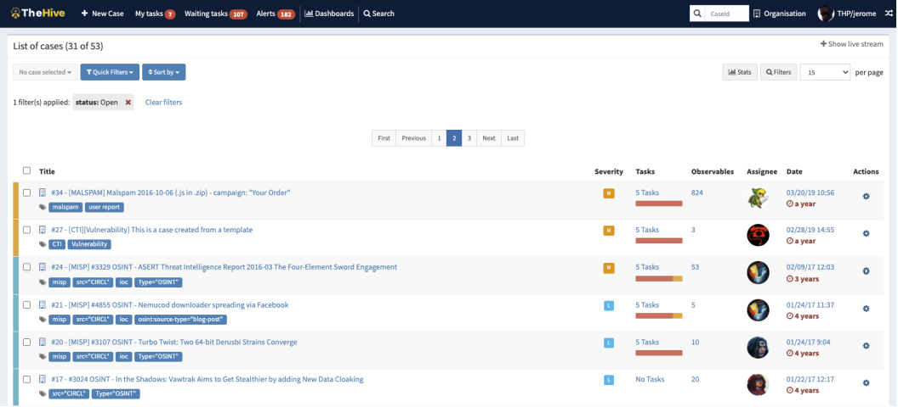
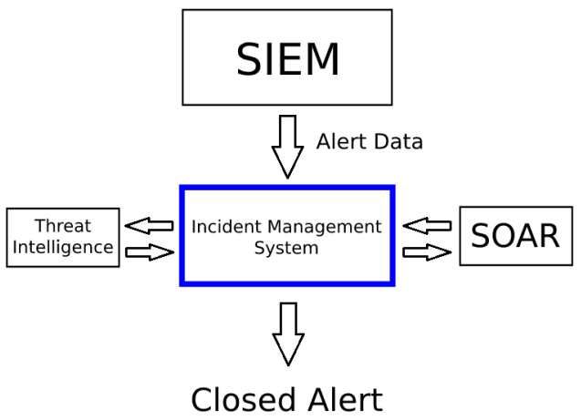
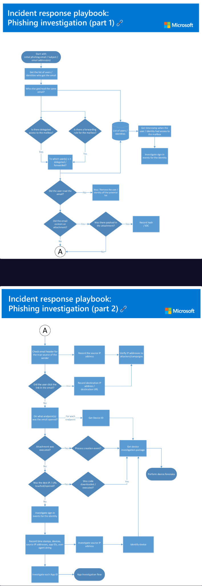

# Incident Management 101 — SOC Analyst Knowledge Base

## Purpose

This reference explains how SOC teams manage alerts and incidents after detections are generated.

```text
Security Event
→ Alert
→ Ownership
→ Case Creation
→ Investigation
→ Enrichment
→ Playbook
→ Response
→ Verdict
→ Closure
→ Detection Feedback
```

It covers events, alerts, incidents, true/false positives, Incident Management Systems (IMS), SOAR integration, case naming, playbooks, ownership, prioritization, escalation, response, and closure.

---

# 1. Event vs Alert vs Incident

## Event
Any observable occurrence in a system or network.

Examples:
```text
User login
Firewall block
Web request
Process start
File creation
```

## Alert
A notification generated when a detection rule or condition triggers.

```text
Alert = Something requires investigation
```

## Incident
A confirmed or imminent violation of security policy or accepted practice.

Examples:
```text
Unauthorized access
Malware execution
Data breach
Denial of service
Successful web compromise
```

---

# 2. True Positive vs False Positive

## True Positive
A real malicious activity is correctly detected.

## False Positive
A detection fires on benign activity.

Key principle:

```text
Alert ≠ Incident
```

The SOC analyst determines whether the alert represents a real security event.

---

# 3. Incident Management Systems (IMS)

An IMS is where SOC analysts manage cases, tasks, evidence, notes, ownership, severity, and closure.

The training demonstrates **TheHive** as an example.



Typical IMS functions:
- case creation
- task tracking
- observables/artifacts
- analyst notes
- assignee/ownership
- severity
- enrichment
- response tracking
- closure

---

# 4. How IMS Fits into the SOC

```text
SIEM
 ↓
Alert Data
 ↓
Incident Management System
 ↔ Threat Intelligence
 ↔ SOAR
 ↓
Closed Alert / Case
```



Think of the roles as:

```text
SIEM → detects
IMS → manages investigation
Threat Intelligence → enriches
SOAR → automates/orchestrates response
```

---

# 5. Case Creation

When an alert is accepted for investigation, a case should capture:

```text
What happened?
When?
Where?
Who/what was involved?
Why was it suspicious?
What has already been checked?
```

Useful case fields:
- case ID
- alert/event ID
- rule name
- severity
- timestamp
- host
- user
- IPs
- artifacts
- analyst
- status
- verdict

---

# 6. Taking Ownership

Take ownership before investigating.

Why:
- prevents duplicate work
- identifies the assigned analyst
- improves handoffs
- supports team coordination

```text
Open Alert
→ Take Ownership
→ Investigate
```

---

# 7. Alert Prioritization

Typical priority:

```text
Critical
→ High
→ Medium
→ Low
```

Also consider:
- critical assets
- privileged users
- ransomware
- confirmed execution
- lateral movement
- multiple affected hosts
- production impact

---

# 8. Threat Intelligence Enrichment

IMS platforms may automatically enrich indicators.

Example:

```text
Suspicious domain
→ TI lookup
→ reputation / malware associations
→ enrichment added to case
```

Without integration, analysts may manually use:
- VirusTotal
- ANY.RUN
- AbuseIPDB
- Talos
- URLScan

Threat intelligence is supporting evidence, not the verdict by itself.

---

# 9. SOAR Integration

SOAR = **Security Orchestration, Automation, and Response**

Possible integrations:
- firewall
- IPS
- WAF
- proxy
- email gateway
- EDR
- cloud controls

Example:

```text
Malicious domain confirmed
→ SOAR workflow
→ block domain
→ action logged in case
```

Important distinction:

```text
IMS → investigation management
SOAR → automated response
```

---

# 10. Case Naming

The training uses:

```text
EventID: {Alert ID} - [{Alert Name}]
```

Example:

```text
EventID: 25 - [SOC15 - Malware Detected]
```

Consistent naming makes cases easier to search, triage, and hand off.

---

# 11. Playbooks

A playbook is a predefined investigation workflow.

Common playbooks:
- phishing
- malware
- ransomware
- brute force
- web attack
- suspicious login
- data exfiltration

The goal is consistent investigation standards.

---

# 12. Phishing Playbook Example



A phishing playbook may ask:
- Who received the email?
- Who opened it?
- Was it forwarded?
- Was there an attachment?
- Was it executed?
- Was a malicious URL clicked?
- What endpoint was involved?
- Was a payload downloaded?
- What IOCs were identified?

---

# 13. Why Playbooks Matter

Without a playbook:
```text
Analyst A checks C2
Analyst B forgets
Analyst C forgets scope
```

With a playbook:
```text
same minimum investigation standard
for every analyst
```

Benefits:
- consistency
- fewer missed steps
- easier training
- faster triage
- better handoffs
- better auditability

---

# 14. Checklist vs Playbook

Checklist:
```text
Check hash
Check URL
Check endpoint
```

Playbook:
```text
Attachment malicious?
   ↓ Yes
Was it delivered?
   ↓ Yes
Was it executed?
   ↓ Yes
Contain host
```

```text
Checklist = tasks
Playbook = tasks + decision flow
```

---

# 15. SOC Alert Workflow

```text
Alert appears
→ Prioritize
→ Take Ownership
→ Review details
→ Create Case
→ Follow Playbook
→ Collect evidence
→ Determine TP / FP
→ Respond / Escalate
→ Document
→ Close
```

---

# 16. Analyst Notes

Good notes answer:
- what was observed
- what was checked
- what was unavailable
- what was concluded
- why
- what action was taken

Weak:
```text
Malicious. Closed.
```

Strong:
```text
Hash was malicious and sandbox behavior confirmed ransomware.
Endpoint telemetry showed execution. Network logs were unavailable,
so C2 remained unconfirmed. Host isolated. Verdict: True Positive.
```

---

# 17. Evidence vs Inference

## Direct Evidence
```text
Firewall action = Allowed
Process observed
Hash matched sample
```

## Analyst Inference
```text
Behavior consistent with ransomware
```

## Not Established
```text
C2 not confirmed
Exfiltration not confirmed
```

---

# 18. Case Artifacts

Typical artifacts:
```text
IP
domain
URL
hash
filename
email
hostname
username
registry path
process
```

Always add context.

Bad:
```text
177.53.143.89
```

Better:
```text
177.53.143.89
Type: IP
Context: contacted during malware execution
```

---

# 19. Escalation

Escalate when:
- compromise confirmed
- privileged account involved
- containment required
- multiple hosts affected
- ransomware active
- lateral movement suspected
- production impact high

Escalation summary should include:
```text
What happened
Evidence
Scope
Current risk
Actions taken
Recommended next step
```

---

# 20. Containment

Possible response actions:
```text
isolate host
disable account
block domain/IP
quarantine email
remove malicious file
revoke token/session
disable exposed service
```

Containment should be proportionate to evidence and severity.

---

# 21. Closing a Case

Before closure verify:
- investigation complete
- verdict documented
- confidence stated
- artifacts recorded
- scope documented
- response actions recorded
- limitations documented
- tuning feedback provided

A closed case should make sense to an analyst who did not perform the investigation.

---

# 22. True Positive Closure

A TP closure should explain:
```text
What malicious behavior occurred
What proved it
What impact occurred
What scope was found
What response was taken
```

---

# 23. False Positive Closure

An FP closure should explain:
```text
Why the rule triggered
What benign context explains it
What evidence supports benign classification
Whether tuning is recommended
```

False positives are useful detection-engineering feedback.

---

# 24. Detection Feedback Loop

```text
Alert
→ Investigation
→ FP / Missed Context
→ Detection Team
→ Rule Tuning
→ Better Future Alert
```

Examples:
- substring rule too broad
- legitimate installer flagged
- trusted scanner generates web alerts

---

# 25. Case Quality Checklist

- [ ] correct title
- [ ] severity verified
- [ ] ownership assigned
- [ ] alert details documented
- [ ] affected host/user documented
- [ ] artifacts added
- [ ] TI enrichment performed
- [ ] timeline created
- [ ] scope assessed
- [ ] ATT&CK mapping validated
- [ ] verdict stated
- [ ] confidence stated
- [ ] response documented
- [ ] escalation documented
- [ ] limitations documented
- [ ] tuning opportunity recorded

---

# 26. Common Analyst Mistakes

Avoid:
- closing without explanation
- copying alert text without analysis
- blindly following playbooks
- failing to take ownership
- forgetting containment
- adding IOCs without context
- calling missing telemetry a negative finding
- escalating without evidence summary
- inconsistent case naming
- ignoring repeated false positives

---

# 27. Reporting Standard

```text
Executive Summary
Case Information
Alert Details
Initial Hypothesis
Evidence
Timeline
Artifacts
Threat Intelligence
Scope
MITRE ATT&CK
Analyst Decision Points
Verdict
Confidence
Containment / Response
Escalation
Detection Opportunities
Lessons Learned
```

---

# 28. Interview-Level Summary

If asked, “What happens after a SIEM alert fires?”:

```text
The analyst prioritizes the alert, takes ownership, reviews the
triggering telemetry, creates or updates the incident case, follows
the relevant playbook, enriches indicators, correlates endpoint,
network, and identity evidence, determines scope and impact, then
classifies the alert as true or false positive. If required, the
analyst escalates or performs containment, documents all actions,
provides tuning feedback, and closes the case with a defensible
summary.
```

---

# SOC Takeaway

Incident management turns:

```text
Alert
```

into:

```text
Documented investigation
+
Defensible verdict
+
Response action
+
Organizational learning
```

A strong SOC analyst is not only good at finding malicious activity. They are also good at **owning, documenting, communicating, escalating, and closing cases consistently**.

---

# Training Context

This knowledge base was created from authorized Incident Management training material and is intended as a practical SOC analyst reference rather than a quiz-answer walkthrough.
