# Malware Analysis Fundamentals

This reference documents a practical malware-analysis workflow for SOC investigations. It focuses on how to determine whether a suspicious file is malicious, what it does after execution, whether it establishes persistence, which systems it communicates with, and which indicators should be converted into response and detection actions.

---

## Why Malware Analysis Matters in a SOC

SOC analysts frequently encounter suspicious files through phishing alerts, endpoint detections, web downloads, EDR telemetry, SIEM correlation, and threat-hunting activity.

A useful investigation should answer:

```text
What is the file?
What does it execute?
What does it create or modify?
Does it establish persistence?
Does it communicate externally?
Does it steal credentials or data?
What should be contained, blocked, or hunted?
```

Malware analysis therefore supports alert validation, incident scoping, IOC extraction, containment, threat hunting, and detection engineering.

---

# Common Malware Categories

| Type | Typical Purpose |
|---|---|
| Backdoor | Provides unauthorized remote access |
| Adware | Displays unwanted ads or modifies browser behavior |
| Ransomware | Encrypts or exfiltrates data and demands payment |
| Virus | Replicates by infecting other files |
| Worm | Self-propagates between systems |
| Rootkit | Hides malicious activity and may operate with elevated privileges |
| RAT | Provides remote control of a compromised host |
| Banking malware | Targets financial applications or credentials |
| Keylogger | Captures keystrokes |
| Infostealer | Collects credentials, cookies, browser data, and other sensitive information |

A single sample can exhibit behavior associated with more than one category.

---

# Core Knowledge for Malware Analysis

## Operating-System Fundamentals

Malware commonly abuses normal operating-system functionality for execution, persistence, discovery, credential access, and privilege escalation.

Important concepts include:

- User space and kernel space
- Processes and threads
- File systems
- Memory
- Services
- Registry
- Task Scheduler
- APIs and system calls

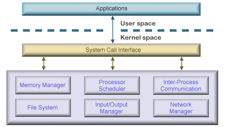

On Windows, common persistence locations include:

```text
Scheduled Tasks
Services
Registry Run Keys
Startup folders
WMI
```

## Assembly & Reverse Engineering

Deeper static analysis may require familiarity with machine code, assembly, disassemblers, decompilers, CPU instructions, function calls, and memory addressing.

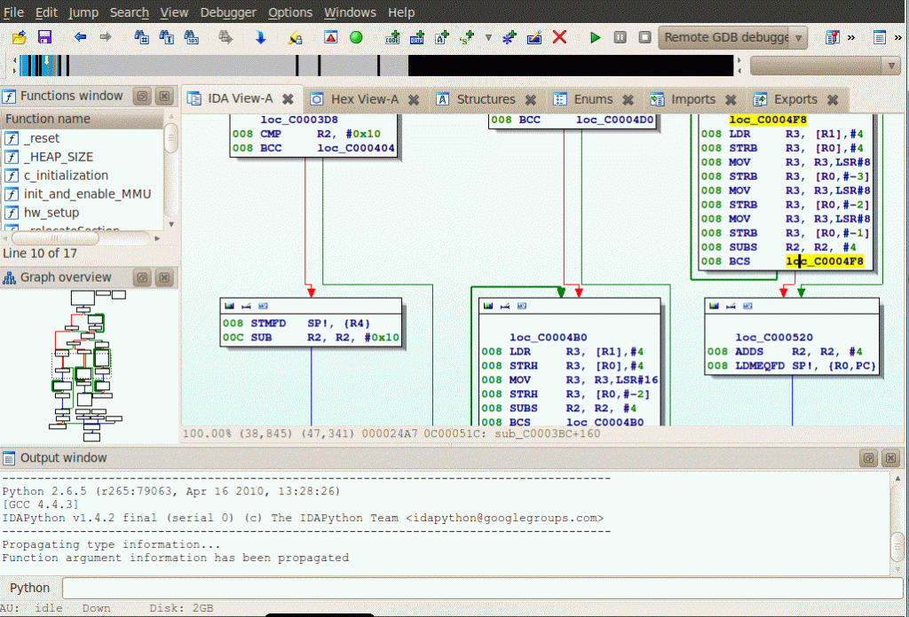

For entry-level SOC work, full reverse engineering is not always required, but understanding what these tools expose improves escalation and malware-reporting quality.

## Networking Fundamentals

Malware frequently communicates externally to:

- Reach command-and-control infrastructure
- Download additional payloads
- Exfiltrate credentials or files
- Resolve domains
- Receive instructions

Important protocols include DNS, HTTP/HTTPS, TCP, SMTP, FTP, and SMB.

---

# Static vs Dynamic Analysis

## Static Analysis

Static analysis examines a file **without executing it**.

Typical review areas:

- MD5 / SHA1 / SHA256
- File type
- PE headers
- Imports and exports
- Strings
- Embedded resources
- Compile timestamps
- Digital signatures
- Suspicious APIs
- CPU instructions

Advantages:

- Safer than executing the sample
- Can expose capabilities that never trigger during runtime
- Useful for detailed analysis

Limitations:

- Often slower
- Packing and obfuscation can hide behavior
- May require deeper reverse-engineering knowledge

## Dynamic Analysis

Dynamic analysis executes malware in an isolated environment and observes behavior.

Monitor:

- Process creation
- Child processes
- File activity
- Registry changes
- Network connections
- DNS requests
- Persistence
- Dropped files
- Command-line activity

Advantages:

- Fast behavioral results
- Excellent for SOC triage
- Quickly exposes IOCs and C2 activity

Limitations:

- Only shows behavior triggered during the analysis window
- Malware may detect the sandbox
- Malware may delay execution
- Some behavior may require specific environmental conditions

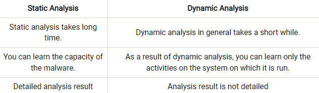

### Practical SOC Approach

```text
Fast Triage
   ↓
Hash / File-Type Validation
   ↓
Threat-Intelligence Enrichment
   ↓
Basic Static Analysis
   ↓
Sandbox / Dynamic Analysis
   ↓
Process + Persistence Review
   ↓
Network / C2 Review
   ↓
IOC Extraction
   ↓
Containment / Escalation
```

Static and dynamic analysis complement each other. Neither should automatically be treated as complete evidence by itself.

---

# Dynamic Analysis with a Sandbox

Interactive sandboxes such as ANY.RUN allow analysts to execute suspicious files in controlled environments and observe runtime behavior.

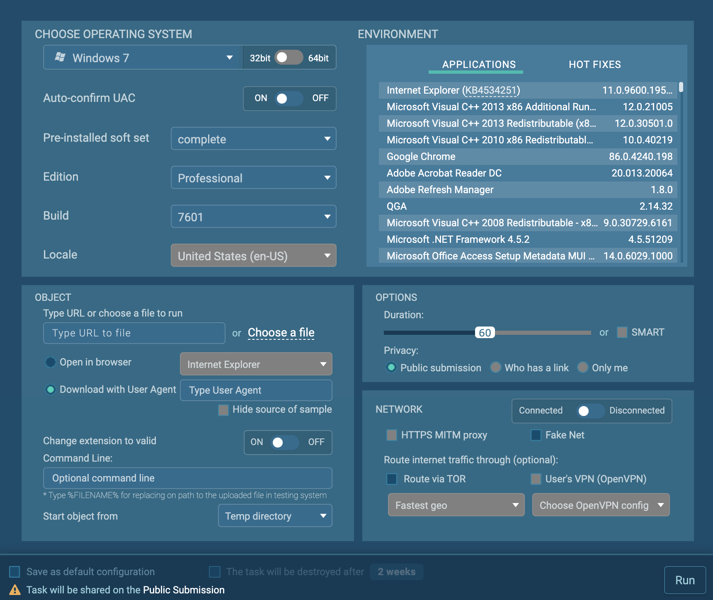

Useful configuration options include:

- Operating system
- Architecture
- Installed applications
- Analysis duration
- Network connectivity
- Browser
- Command-line arguments
- Starting directory

> Never upload sensitive or confidential organizational samples to a public sandbox unless organizational policy explicitly permits it.

---

# What to Examine in a Sandbox

A useful sandbox review focuses on four areas:

```text
1. Process tree
2. Process details
3. Files / persistence
4. Network activity
```

## 1. Process Tree

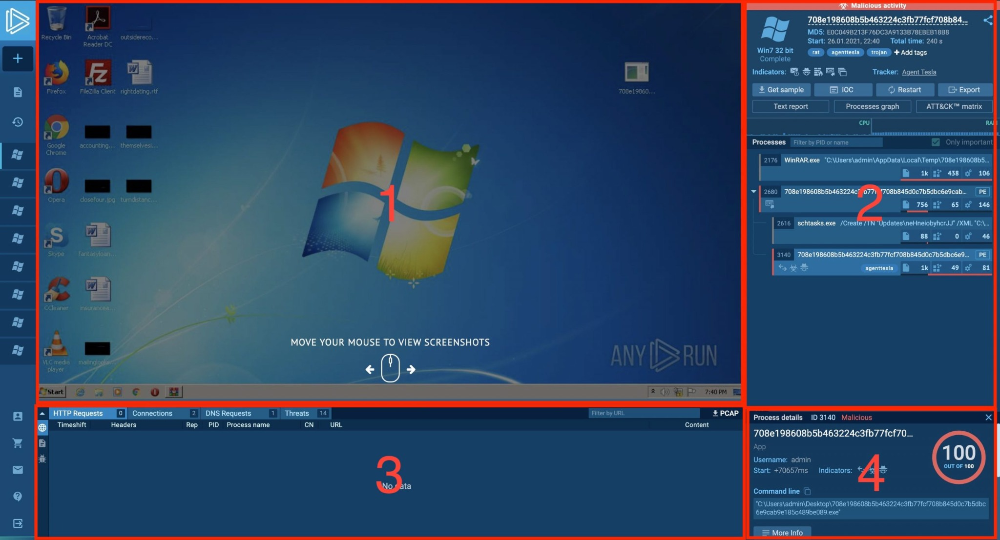

Ask:

- What process launched the sample?
- Which child processes were created?
- Were legitimate Windows utilities abused?
- Did the malware relaunch itself?
- Were additional executables dropped?

Process relationships often explain an intrusion better than a malware-family label alone.

## 2. Process Behavior

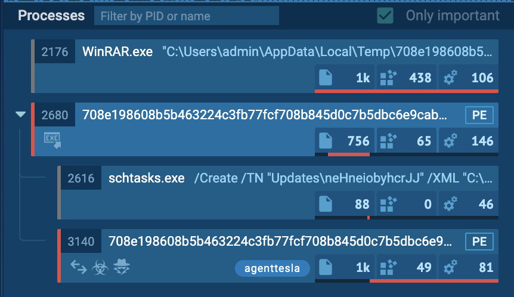

Review:

- Command line
- File writes
- Registry changes
- Process injection
- Credential access
- Browser-data access
- Task Scheduler use
- Network activity

---

# Persistence via Scheduled Tasks

A suspicious process invoking `schtasks.exe` should immediately trigger a persistence review.

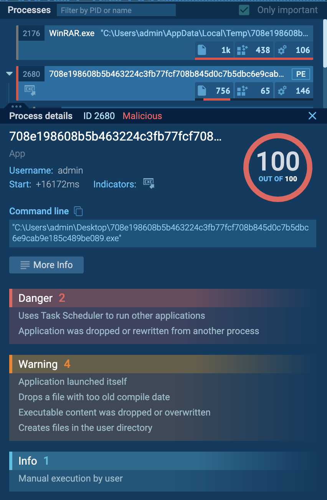

Questions:

- What task name was created?
- Which executable does it launch?
- What trigger is configured?
- Which user context does it run under?
- Where is the executable stored?

## Scheduled-Task Configuration

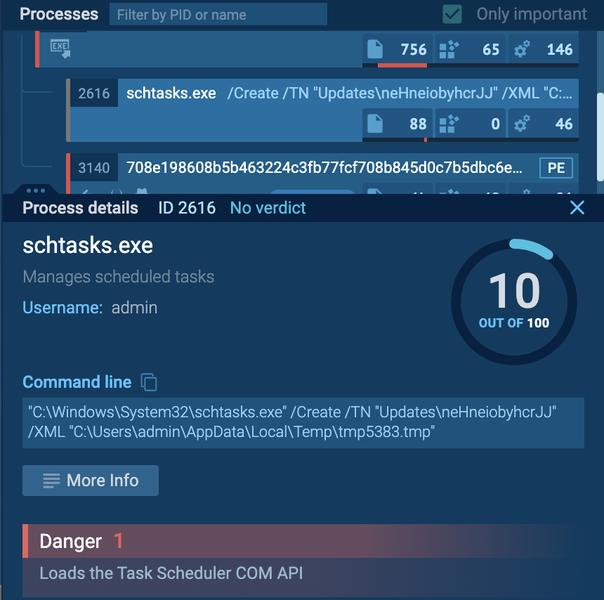

The XML definition can reveal the executable launched by the task and connect the persistence mechanism back to the original malware process.

```text
Malware process
   ↓
schtasks.exe
   ↓
Task XML
   ↓
Persistent executable
```

This chain is highly useful for both hunting and detection engineering.

---

# Credential Theft / Infostealer Behavior

Infostealers commonly target:

- Browser passwords
- Cookies
- Session data
- Autofill data
- Email credentials
- FTP credentials
- Cryptocurrency wallets

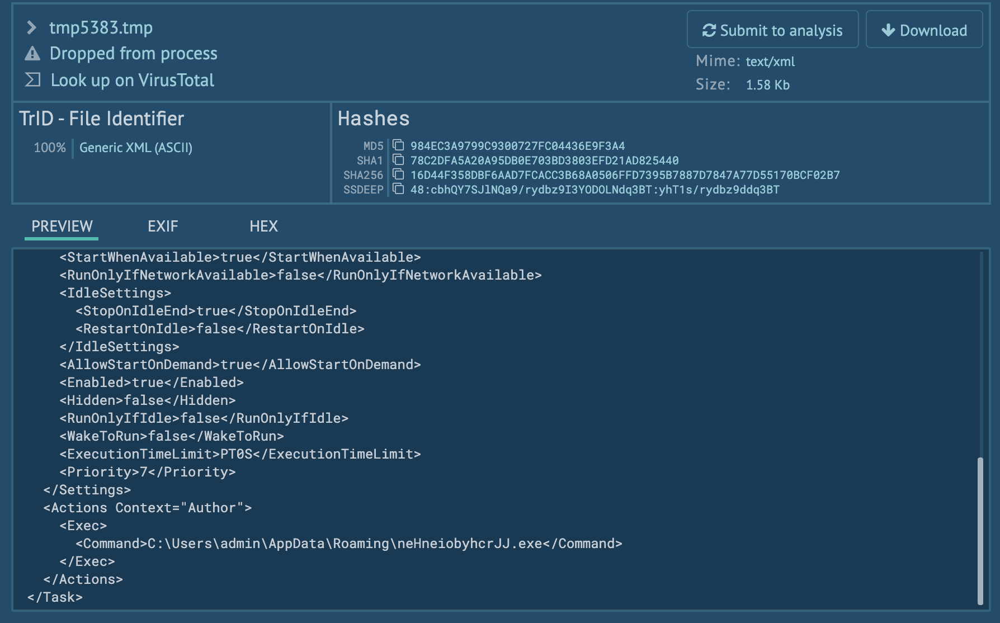

When a sandbox identifies credential-stealing behavior, validate it with concrete telemetry such as browser database access, file activity, process behavior, and outbound communication.

---

# Network & Exfiltration Analysis

Network activity can reveal C2 infrastructure, second-stage payload locations, or exfiltration channels.

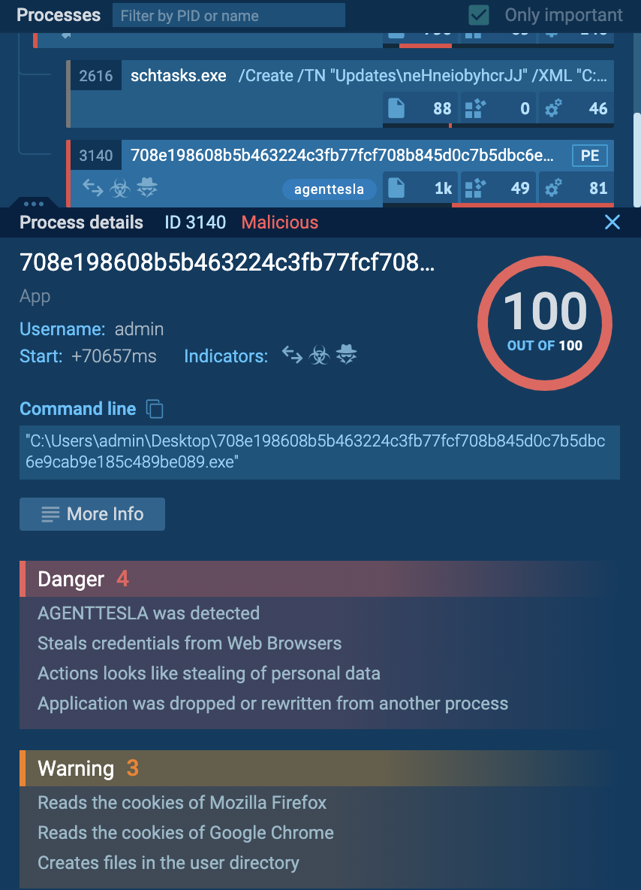

Review:

```text
Destination IP
Destination domain
Port
Protocol
Process responsible
Traffic direction
Data volume
Authentication activity
```

## Inspecting Network Sessions

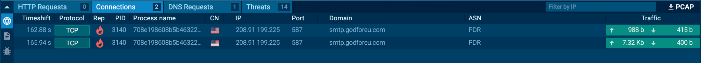

Session content may expose authentication attempts, encoded credentials, commands, and data transfer. These are high-value pivots for blocking and hunting.

---

# Malware Analysis Workflow

```text
Suspicious File
      ↓
Hash & File-Type Validation
      ↓
Threat-Intelligence Enrichment
      ↓
Basic Static Analysis
      ↓
Sandbox / Dynamic Analysis
      ↓
Process-Tree Analysis
      ↓
Persistence Review
      ↓
Network / C2 Analysis
      ↓
IOC Extraction
      ↓
MITRE ATT&CK Mapping
      ↓
Scope Assessment
      ↓
Containment / Escalation
      ↓
Detection Improvement
```

---

# Evidence to Extract

## File Indicators

```text
MD5
SHA1
SHA256
Filename
File size
File type
Compile timestamp
Digital signature
```

## Network Indicators

```text
IP addresses
Domains
URLs
Ports
Protocols
DNS requests
C2 destinations
```

## Host Indicators

```text
Processes
Parent-child relationships
Dropped files
Scheduled tasks
Registry keys
Services
Persistence locations
Command lines
```

---

# SOC Decision Points

### Is the file malicious?

Correlate static indicators, sandbox behavior, process activity, network telemetry, and threat intelligence.

### Did it execute?

Look for process creation, child processes, EDR telemetry, command lines, and file creation.

### Did persistence occur?

Look for scheduled tasks, services, registry modifications, or other startup mechanisms.

### Did it communicate externally?

Look for DNS, proxy, firewall, sandbox, and C2 telemetry.

### Was data potentially stolen?

Look for browser credential access, cookie access, credential-database access, archive creation, SMTP/HTTP exfiltration, or unusual outbound transfers.

---

# Containment Priorities

If execution is confirmed:

1. Isolate the endpoint.
2. Block malicious domains, URLs, and IPs.
3. Quarantine or remove malicious files.
4. Search the environment for matching hashes.
5. Hunt for persistence mechanisms.
6. Identify additional affected hosts.
7. Review potentially exposed credentials.
8. Escalate where compromise is confirmed.

---

# Detection Opportunities

## Scheduled-Task Persistence

Detection hypothesis:

```text
process = schtasks.exe
AND command_line contains "/Create"
AND task target references a user-writable directory
```

High-value user-writable locations:

```text
%TEMP%
%APPDATA%
%LOCALAPPDATA%
Downloads
Desktop
```

## Suspicious Parent-Child Relationships

Examples:

```text
winword.exe → powershell.exe
excel.exe → cmd.exe
browser.exe → unknown.exe
archive utility → unknown PE
unknown PE → schtasks.exe
```

## Credential-Stealing Correlation

A stronger detection combines:

```text
Unknown process
  +
Access to browser credential/cookie files
  +
Outbound connection to rare external infrastructure
```

---

# Analyst Reporting Template

```text
Sample:
Filename and hashes.

Execution:
How the sample was launched and which processes were created.

Behavior:
Files, registry changes, persistence, credential access, or other activity.

Network:
Domains, IPs, ports, protocols, and C2/exfiltration behavior.

Impact:
What the malware appears capable of and whether execution was confirmed.

Response:
Containment, IOC blocking, endpoint hunting, credential reset, or escalation.

Verdict:
Malicious / Suspicious / Benign with confidence level.
```

---

# Useful Malware-Analysis Services

Examples include:

- ANY.RUN
- VirusTotal
- Hybrid Analysis
- Joe Sandbox
- Hatching Triage
- Cuckoo
- Intezer Analyze
- OPSWAT
- Jotti
- VirScan

These services accelerate triage but should be treated as supporting evidence rather than substitutes for analyst reasoning.

---

# Key Principles

> Reputation is enrichment, not proof.

> A sandbox verdict is evidence, not the entire investigation.

> Process relationships often explain the attack better than malware-family names.

> Persistence and network behavior are high-value investigation pivots.

> Malware analysis should produce actionable IOCs and detection opportunities.

---

# Related Portfolio Areas

```text
investigations/malware/
investigations/phishing/
detection-engineering/
knowledge/siem-alert-investigation/
labs/
```

---

# Training Context

This reference was developed from hands-on malware-analysis training and sandbox exercises.

The material has been rewritten into an operational SOC reference focused on investigation methodology rather than training-platform walkthroughs or quiz answers.
