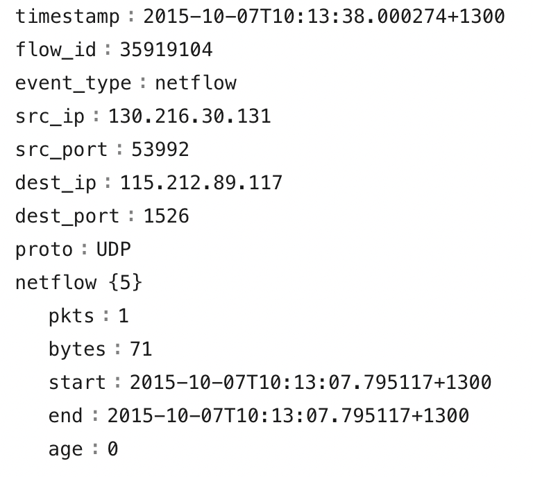
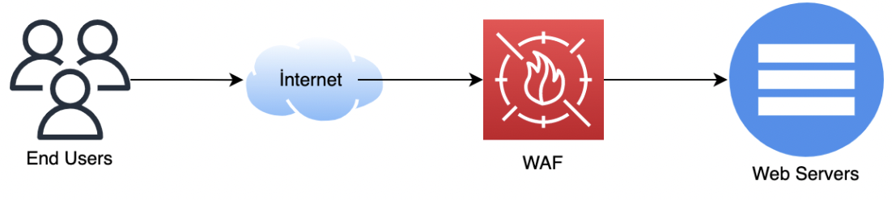
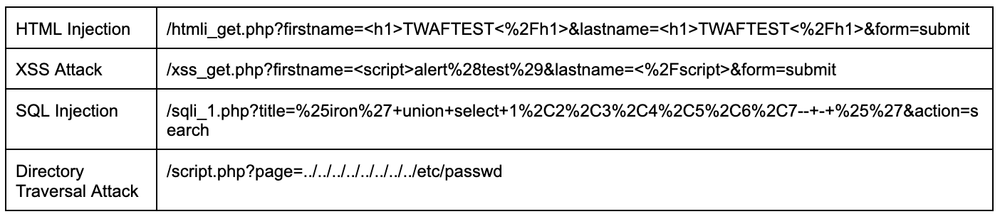
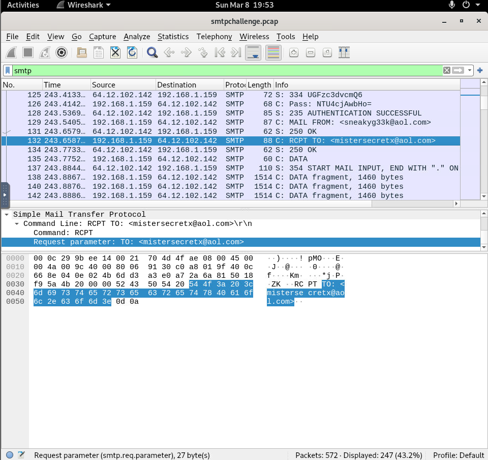
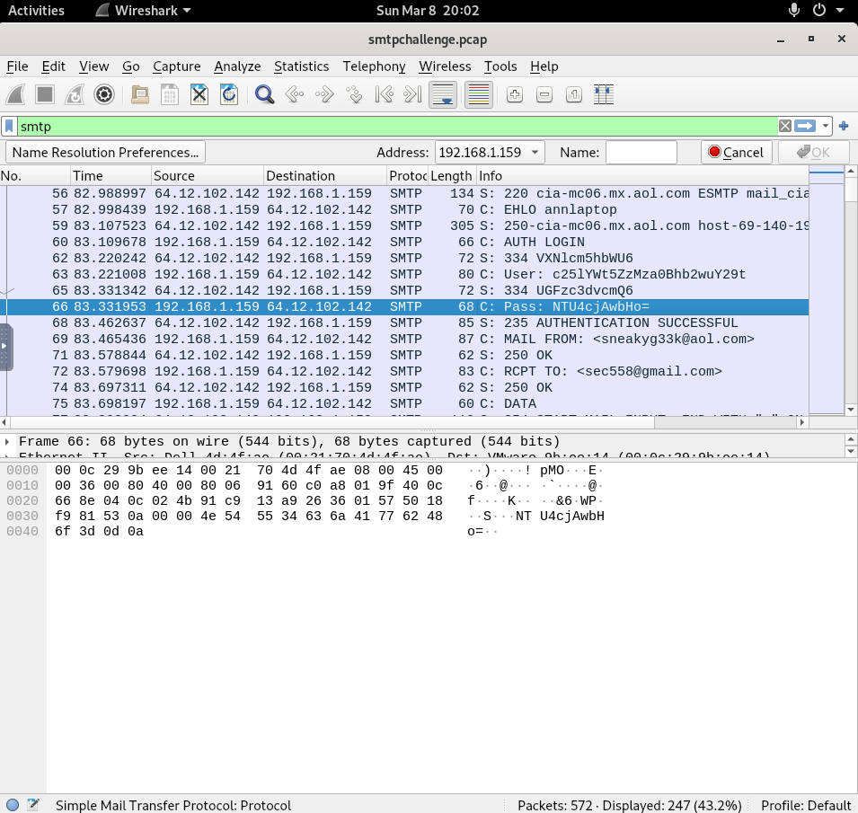
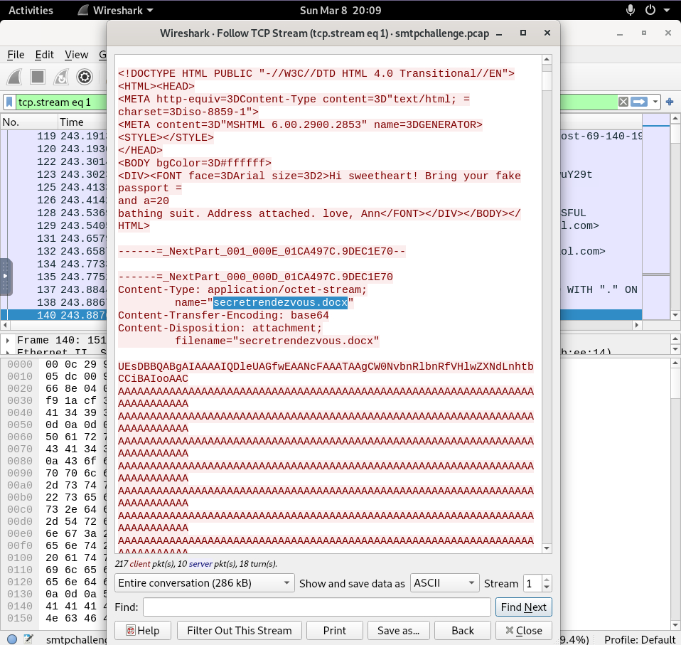

# Network Log Analysis — SOC Analyst Knowledge Base

## Purpose

This guide summarizes practical SOC analysis of **NetFlow, firewall, VPN, proxy, IDS/IPS, WAF, web, DNS, and PCAP/SMTP telemetry**.

The core question is:

> **Who communicated with whom, over what service, what action occurred, and what evidence shows whether the activity succeeded?**

---

# Core Workflow

```text
Timestamp
→ Source IP / Port
→ Destination IP / Port
→ Protocol / Application
→ Action
→ Response / Status
→ Frequency / Pattern
→ Cross-log correlation
→ Verdict
```

High-value fields:

```text
timestamp, src_ip, src_port, dest_ip, dest_port, protocol,
action, bytes, packets, HTTP method, URL, status, username,
signature, severity, session ID
```

---

# 1. NetFlow

NetFlow provides flow metadata rather than full packet payloads.

Typical fields:

```text
timestamp
flow_id
src_ip
src_port
dest_ip
dest_port
protocol
packets
bytes
start
end
duration
```



Useful for:

- abnormal traffic spikes
- flood/DDoS patterns
- first-time connections
- unusual ports
- data-transfer anomalies
- unknown hosts

NetFlow is strongest for:

```text
who → whom → how much → how often → over what port/protocol
```

It generally does not provide full Layer 7 content.

---

# 2. Firewall Logs

Firewall analysis starts with:

```text
source
destination
port
protocol
action
```

Common actions:

```text
accept → permitted
deny   → blocked with notification
drop   → blocked silently
close  → session ended
client-rst → client reset
server-rst → server reset
```

A single source probing many ports in a short period can indicate port scanning.

Important rule:

```text
allowed connection ≠ successful exploit
```

---

# 3. VPN Logs

High-value fields:

```text
remote IP
username
result
reason
location
timestamp
```

Suspicious patterns:

- many failed logins
- failures from different countries
- failure followed by success
- unusual source IP
- impossible-travel behavior

---

# 4. Proxy Logs

Proxy logs are valuable for:

- phishing URL validation
- malware downloads
- suspicious browsing
- outbound web activity
- possible C2 pivots

Typical fields:

```text
user
source IP
destination
URL
HTTP method
category
action
process
response
bytes
```

Correlate proxy activity with firewall and endpoint telemetry before claiming successful execution.

---

# 5. IDS / IPS Logs

Useful fields:

```text
source IP
destination IP
ports
direction
signature
category
severity
action
```

Investigation priorities:

- inbound vs outbound
- severity
- multiple signatures
- whether target service is exposed
- whether traffic was blocked
- whether target replied

```text
IDS → detect
IPS → detect + prevent
```

A signature match does not automatically equal compromise.

---

# 6. WAF Logs

A WAF inspects web requests before they reach the web application.



Useful fields:

```text
src
dst
attack_type
signature
severity
action
method
URI
response code
```

Important HTTP responses:

```text
200 → OK
301 → Redirect
403 → Forbidden
404 → Not Found
5xx → Server error
```

Professional interpretation:

> `200 OK` proves successful HTTP handling, not necessarily successful exploitation.

Confirm with response content, application state, server logs, or endpoint evidence.

---

# 7. Web Attack Patterns

The source material demonstrates patterns for:

- HTML injection
- XSS
- SQL injection
- directory traversal



Useful indicators:

```text
<script>
union select
../../../../etc/passwd
<h1>
```

Workflow:

```text
Decode URL
→ classify attack
→ check method
→ check status
→ compare response size/content
→ correlate server/endpoint logs
```

---

# 8. Web Server Logs

Common servers:

- IIS
- Apache
- Nginx

HTTP methods:

```text
GET     → retrieve
POST    → submit
DELETE  → delete
PUT     → create/update
OPTIONS → enumerate allowed methods
```

Do not infer exploit success from status code alone.

---

# 9. DNS Logs

Two useful categories:

1. DNS server audit events
2. DNS query logs

DNS query analysis can help identify:

- suspicious domains
- malware lookups
- newly seen domains
- beaconing
- tunneling candidates

Ask:

```text
Which host queried it?
What IP was returned?
How often?
Was it newly seen?
Was there follow-on traffic?
```

---

# 10. Wireshark / PCAP

Useful techniques:

```text
display filters
Follow TCP Stream
protocol filters
packet search
attachment extraction
credential inspection
```

Useful filters:

```text
smtp
http
dns
tcp
ip.addr == <IP>
tcp.port == <PORT>
frame contains "<string>"
```

---

# 11. SMTP Investigation

The training PCAP shows cleartext SMTP authentication and message transfer.

## Recipient



`RCPT TO` identifies the recipient.

## Authentication



Base64 is encoding, not encryption.

Workflow:

```text
Filter SMTP
→ find AUTH LOGIN
→ extract Base64
→ decode
→ inspect MAIL FROM / RCPT TO
→ Follow TCP Stream
```

---

# 12. SMTP Attachment Analysis

Following the TCP stream can reveal MIME attachment metadata.



Look for:

```text
Content-Type
Content-Transfer-Encoding: base64
Content-Disposition: attachment
filename=
```

Workflow:

```text
Follow TCP Stream
→ identify attachment
→ extract Base64
→ decode file
→ hash file
→ analyze artifact
```

---

# 13. Port Scan Analysis

Typical pattern:

```text
one source
→ one/few destinations
→ many destination ports
→ short time window
```

Useful sources:

- firewall
- NetFlow
- IDS/IPS
- PCAP

Indicators:

- sequential ports
- rapid attempts
- many denied connections
- few successful/open ports
- Nmap signatures/user-agent

---

# 14. Shellshock / Web Exploit PCAP Analysis

For exploit PCAPs, inspect:

- HTTP headers
- User-Agent
- URI
- exploit string
- server banner
- intended command
- server response

Workflow:

```text
Filter HTTP
→ find suspicious request
→ inspect headers
→ identify exploit
→ extract command
→ validate response
```

---

# 15. Correlation Example

```text
DNS
→ suspicious domain resolved

Proxy
→ host requested domain

Firewall
→ connection allowed

IDS
→ exploit signature fired

Web log
→ request reached server

EDR
→ suspicious child process executed
```

Cross-log correlation is stronger than any single log source.

---

# 16. Analyst Decision Points

## Did traffic reach the target?

Use firewall/proxy/flow evidence.

## Did the attack succeed?

Use:

```text
response code
response content
server logs
endpoint evidence
state change
```

## Was it blocked?

Look for:

```text
deny
drop
prevent
blocked
```

## Is it automated?

Look for:

- rapid repetition
- many ports
- many URLs
- repeated signatures
- scanner user-agents

## Is it C2?

Do not label a connection C2 without context.

Correlate:

- destination reputation
- process
- periodicity
- payload
- sandbox behavior

---

# 17. Common Mistakes

Avoid:

- assuming `200` always means exploitation
- assuming firewall `allow` means success
- treating every IDS hit as compromise
- ignoring direction
- failing to decode URLs
- treating DNS lookup as C2
- treating Base64 as encryption
- relying on one log source

---

# 18. Quick Reference

```text
NetFlow   → traffic patterns / volume
Firewall  → allow / deny / drop
VPN       → remote access identity
Proxy     → URL/domain activity
IDS/IPS   → attack signatures
WAF       → web attack inspection
Web logs  → request/response behavior
DNS       → resolution activity
Wireshark → packet-level evidence
SMTP      → sender/recipient/auth/attachments
```

---

# 19. Reporting Template

```text
Executive Summary
Data Source
Time Range
Source / Destination
Protocol / Port
Action
Request Details
Response Details
Repeated Activity
Cross-Log Correlation
Indicators
ATT&CK Mapping
Evidence vs Inference
Verdict + Confidence
Detection Opportunity
Response Recommendation
```

---

# SOC Takeaway

Network log analysis is about reconstructing communication:

```text
Who
→ talked to whom
→ over what service
→ how often
→ what action occurred
→ what response came back
→ whether it mattered
```

The analyst's value comes from **correlation and context**, not simply reading fields.

---

# Training Context

This knowledge base was created from authorized network-log-analysis training material and is intended for practical SOC portfolio use rather than as a quiz-answer walkthrough.
