# Security Solutions — SOC Analyst Knowledge Base

## Purpose

This reference summarizes the major security controls a SOC analyst encounters and focuses on **what each control sees, what evidence it produces, and how to interpret that telemetry during investigations**.

Covered technologies:

- IDS
- IPS
- Firewalls
- EDR
- Antivirus
- Sandboxes
- DLP
- Asset Management
- WAF
- Load Balancers
- Proxy Servers
- Email Security Solutions

The practical question is:

> **Where does this control sit, what does it see, what can it block, and what fields matter during an investigation?**

---

# 1. Intrusion Detection System (IDS)

An IDS monitors a network or host and generates alerts when suspicious activity is detected.

```text
IDS
→ Detects
→ Alerts
→ Does not necessarily block
```

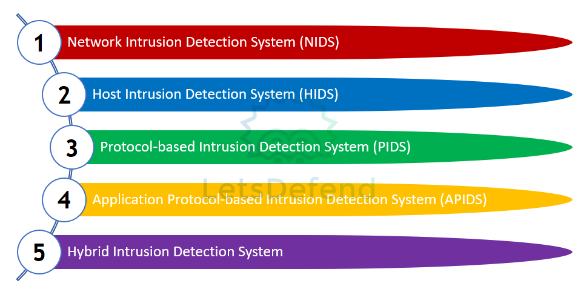

## IDS Types

| Type | Main Visibility |
|---|---|
| NIDS | Network traffic |
| HIDS | Single host |
| PIDS | Specific protocol |
| APIDS | Application protocol |
| Hybrid IDS | Multiple approaches |

## Common IDS / NSM Tools

The training material highlights:

- **Zeek / Bro**
- **Snort**
- **Suricata**
- **Fail2Ban**
- **OSSEC**

These tools can expose fields such as:

```text
timestamp
source IP
source port
destination IP
destination port
protocol
signature
severity
HTTP / DNS / FTP metadata
```

---

# 2. Zeek

Zeek is useful for **network security monitoring and structured protocol logs**.

The demonstrated FTP log contains:

```text
command: RETR
```

which indicates retrieval of a file from an FTP server.

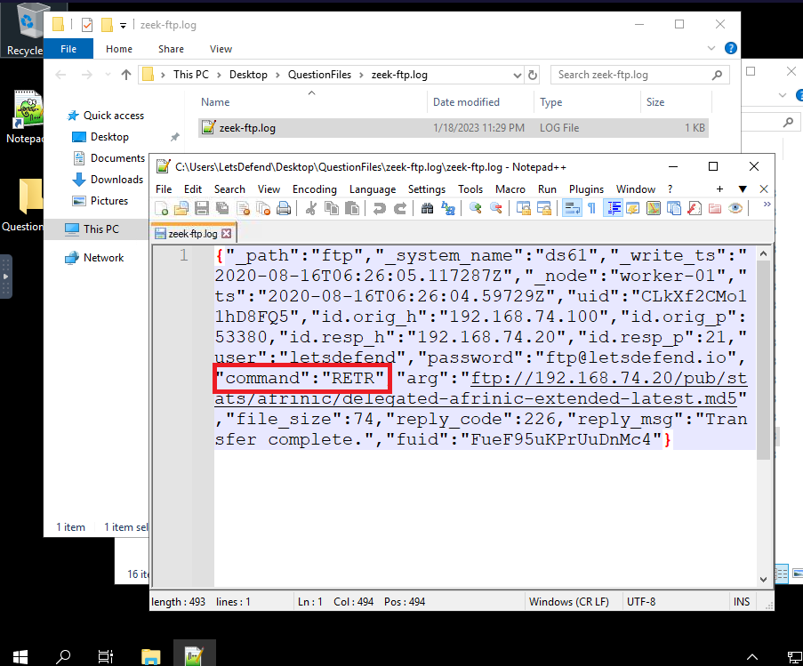

Useful Zeek log types include:

```text
conn.log
http.log
dns.log
ftp.log
ssl.log / tls.log
files.log
notice.log
```

## Analyst Questions

- Which host initiated the connection?
- What protocol was used?
- What method or command occurred?
- Was a file transferred?
- What destination was involved?
- Can endpoint or firewall telemetry corroborate it?

---

# 3. Snort

Snort is a network IDS/IPS.

A Snort alert is fundamentally a:

```text
signature match
```

not automatically:

```text
confirmed compromise
```

Correlate with:

- packet captures
- Zeek
- firewall logs
- server logs
- endpoint telemetry

---

# 4. Suricata

Suricata provides IDS/IPS-style network detection and rich event records.

Useful fields include:

```text
timestamp
event_type
src_ip
src_port
dest_ip
dest_port
proto
alert.action
signature
category
severity
app_proto
flow
```

## Command Response Example

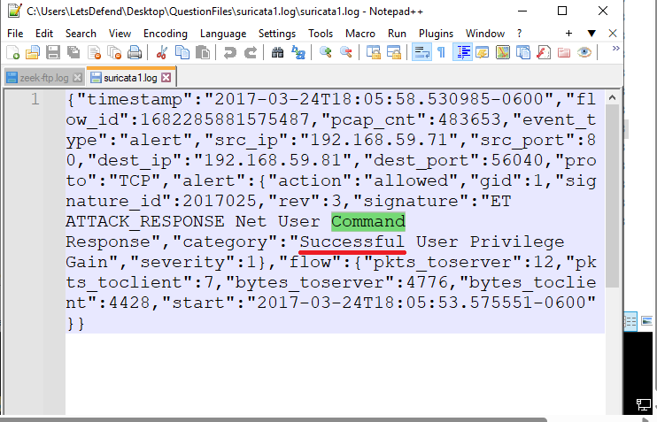

The source material demonstrates a signature associated with a successful Net User command response.

## POODLE Example

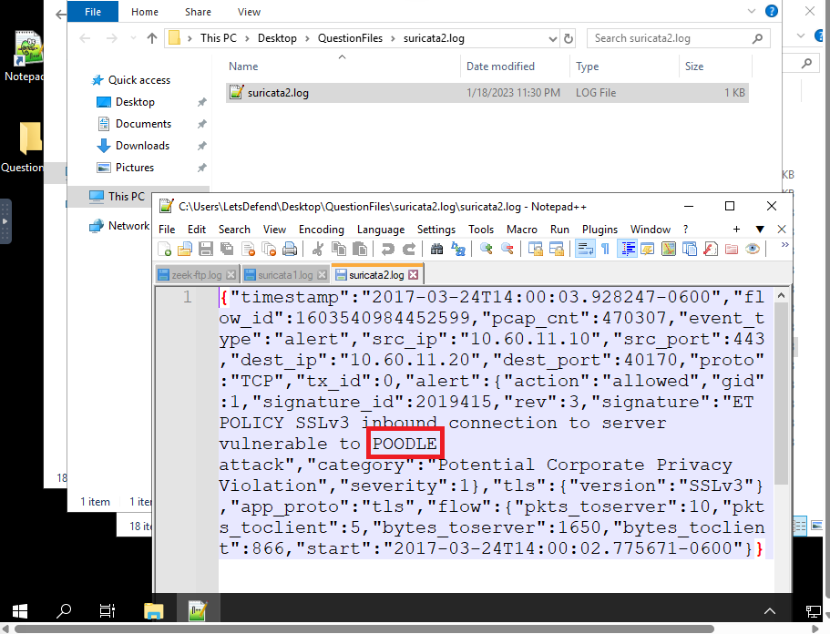

The alert explicitly references the **POODLE** SSL/TLS vulnerability.

## Nmap Example

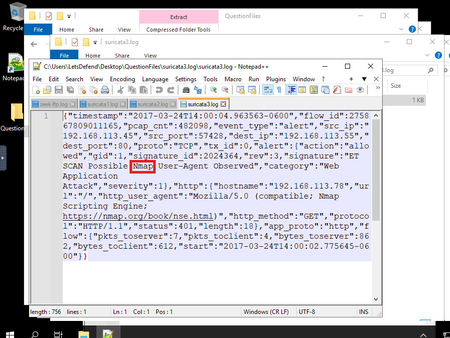

The log identifies an **Nmap User-Agent**, showing how application-layer metadata can reveal scanning activity.

## Suricata Workflow

```text
Read signature
      ↓
Identify source/destination
      ↓
Check action
      ↓
Review severity/category
      ↓
Inspect protocol metadata
      ↓
Correlate surrounding events
```

---

# 5. Intrusion Prevention System (IPS)

An IPS detects suspicious activity and can actively prevent it.

```text
IDS = Detect / Alert
IPS = Detect / Alert / Prevent
```

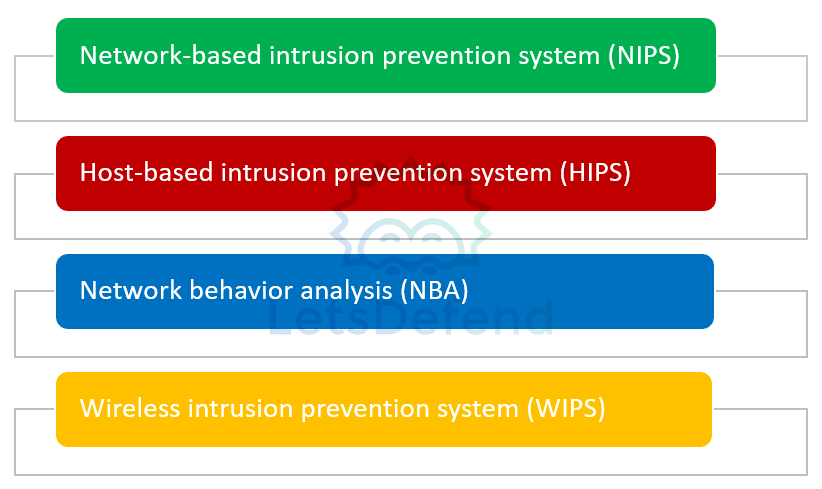

## IPS Types

| Type | Main Focus |
|---|---|
| NIPS | Inline network traffic |
| HIPS | Host behavior |
| NBA | Network behavior/anomalies |
| WIPS | Wireless threats |

Always inspect the action:

```text
blocked
allowed
dropped
```

because impact depends heavily on whether the activity was prevented.

---

# 6. Firewalls

A firewall allows or denies network traffic according to configured rules.

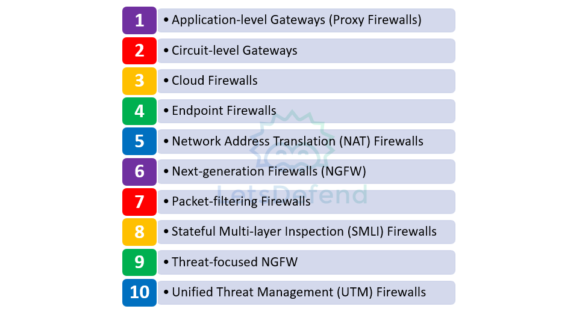

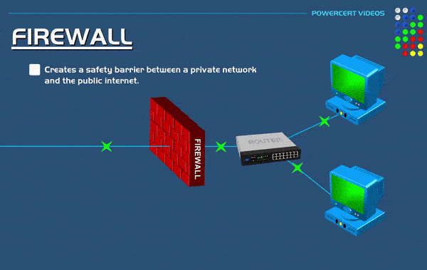

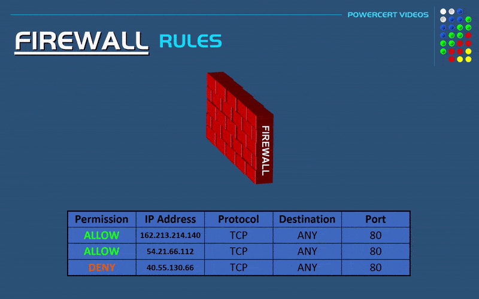

The source covers:

- application-level gateway
- circuit-level gateway
- cloud firewall
- endpoint firewall
- NAT firewall
- NGFW
- packet filtering
- stateful inspection
- threat-focused NGFW
- UTM

Common products listed include:

- Fortinet
- Palo Alto Networks
- SonicWall
- Check Point
- Juniper
- pfSense
- Sophos

---

# 7. Firewall Log Analysis

High-value fields:

```text
time
source IP
source port
destination IP
destination port
protocol
action
interface
service
policy ID
session ID
```

## Action

The demonstrated log contains:

```text
action="deny"
```

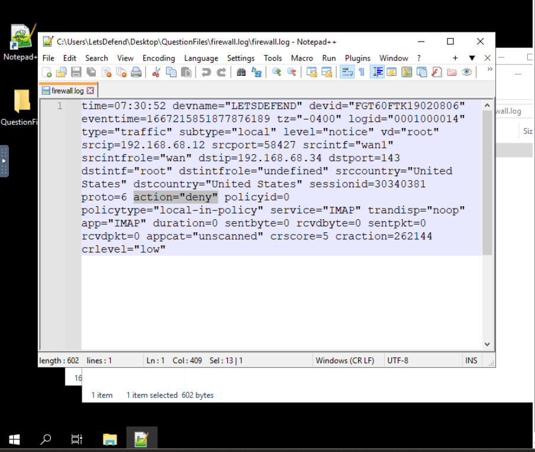

## Source IP

The demonstrated source is:

```text
192.168.68.12
```

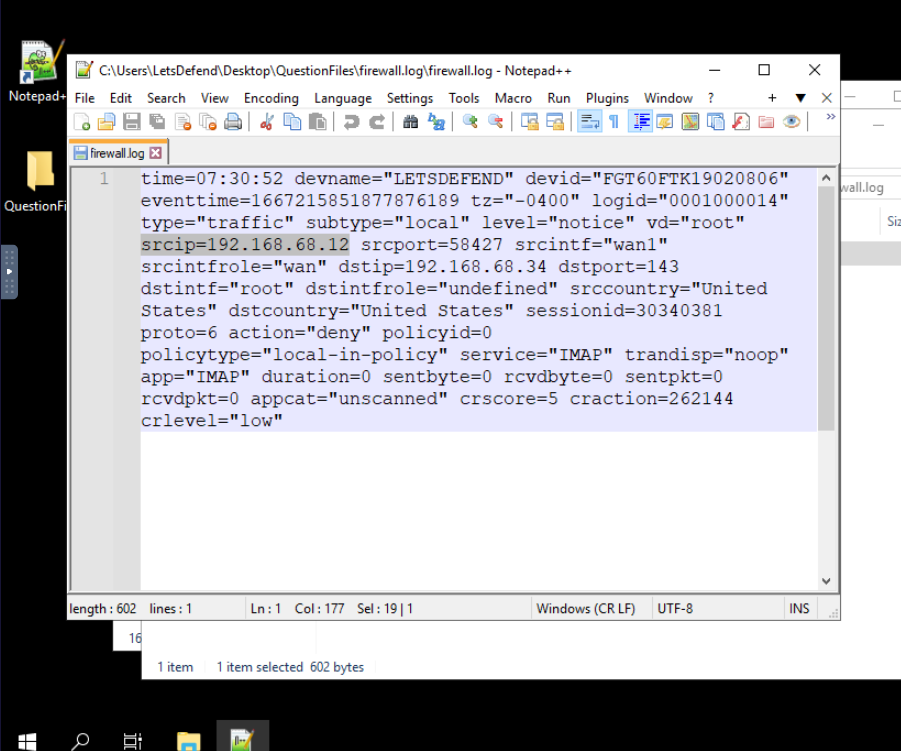

## Destination Port

The destination port is:

```text
143
```


A firewall log helps answer:

```text
Who communicated?
To where?
Using what protocol/port?
Was it permitted?
```

But:

```text
allowed connection
≠ successful exploit
```

---

# 8. Windows Firewall Logs

Windows firewall-style logs may show:

```text
ALLOW / DROP
TCP / UDP / ICMP
source IP
destination IP
source port
destination port
SEND / RECEIVE
```

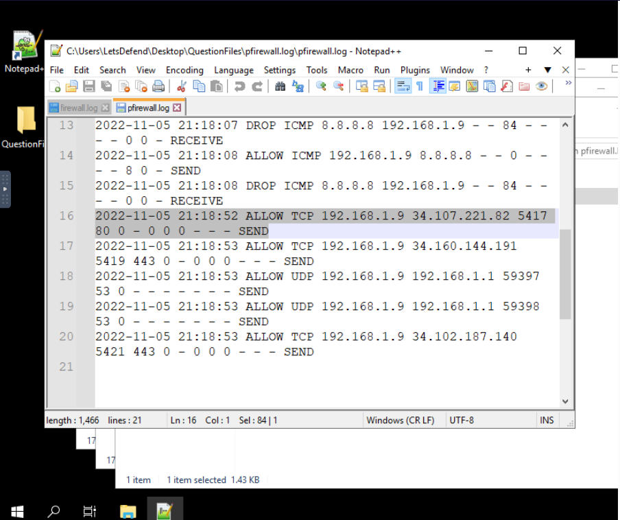

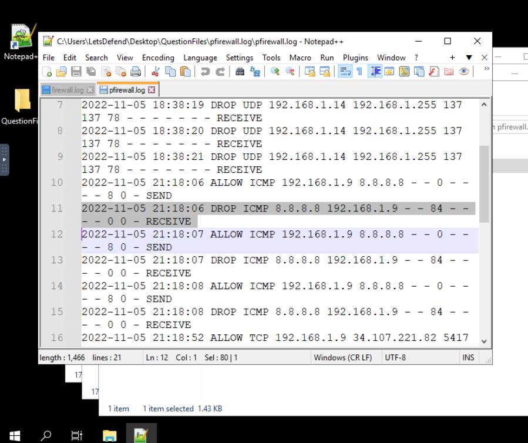

Direction matters. Combine `SEND` or `RECEIVE` with source and destination addresses before drawing conclusions.

---

# 9. Endpoint Detection and Response (EDR)

EDR continuously monitors endpoint activity and supports investigation and response.

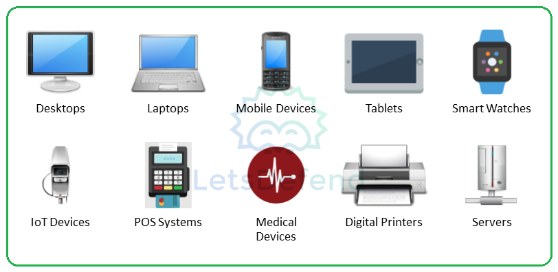

The source highlights:

- process monitoring
- behavior analysis
- alerting
- response actions
- forensic investigation

Common EDR products listed:

- SentinelOne
- CrowdStrike
- Carbon Black
- Palo Alto
- FireEye HX

## High-Value EDR Fields

```text
process
parent process
command line
hash
user
hostname
path
network connections
registry activity
file activity
containment status
```

EDR is especially valuable for reconstructing execution:

```text
Parent
  ↓
Child
  ↓
Command line
  ↓
File / Registry / Network behavior
```

---

# 10. Antivirus

Antivirus detects malware through mechanisms such as:

- signature-based scanning
- heuristic / behavior-based scanning

## Signature-Based

Best for known malware, but dependent on current signatures.

## Heuristic

Can identify suspicious unknown behavior, but may create false positives.

### Windows Defender Example

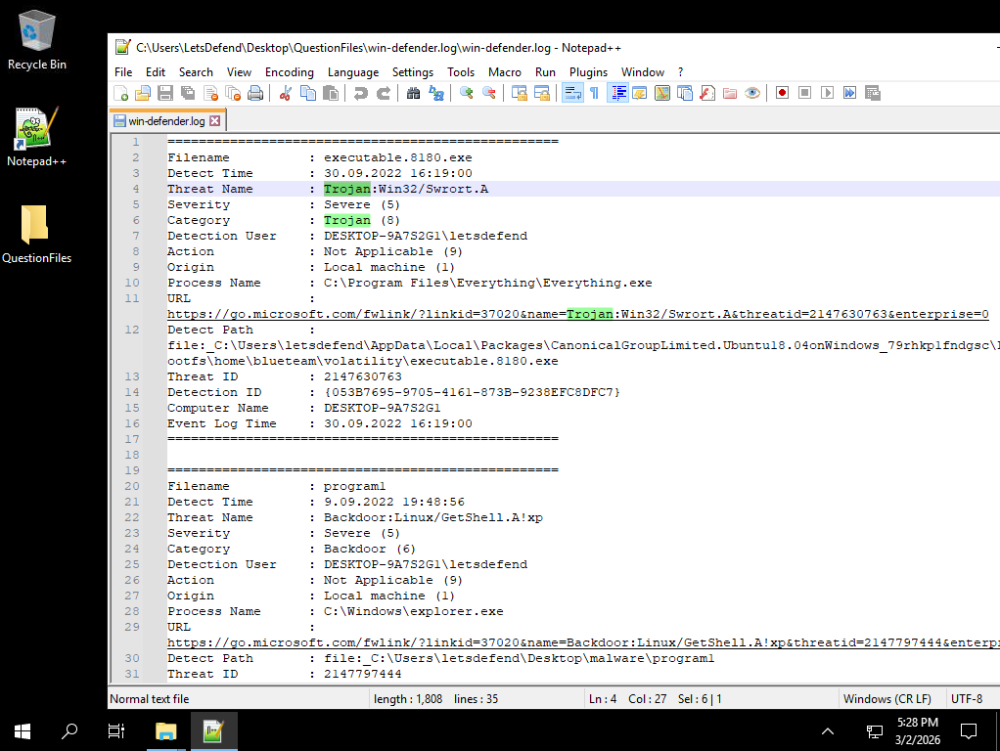

The example classifies a file as a:

```text
Trojan
```

A second example shows a backdoor-related detection:

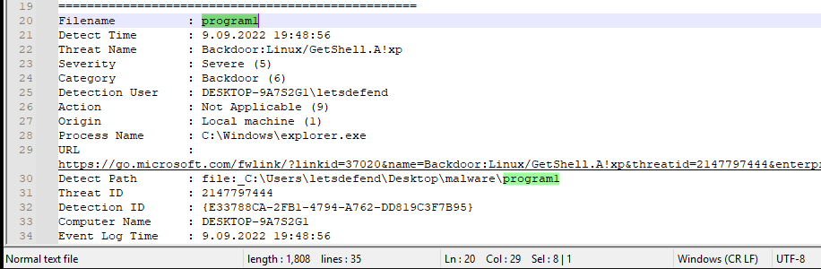

## Useful AV Fields

```text
filename
detect time
threat name
severity
category
user
action
process
path
threat ID
```

Always determine whether the sample was:

```text
detected
blocked
quarantined
cleaned
allowed
```

---

# 11. Sandbox

A sandbox executes suspicious files in an isolated environment.

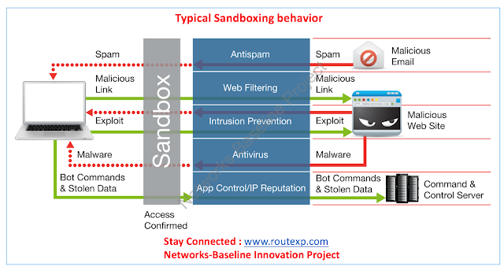

The source highlights benefits such as:

- reducing risk to production hosts
- detecting dangerous files
- testing software safely
- examining zero-day-style behavior

Useful sandbox evidence includes:

```text
process tree
dropped files
registry changes
DNS
HTTP
connections
payloads
persistence
ATT&CK mappings
```

The automated verdict is useful, but the underlying behavior is more important.

---

# 12. Data Loss Prevention (DLP)

DLP helps prevent sensitive information from leaving the organization.

| Type | Focus |
|---|---|
| Network DLP | Data moving across the network |
| Endpoint DLP | Data movement on devices |
| Cloud DLP | Data in cloud apps/services |

## Analyst Questions

- What data was involved?
- Who initiated the transfer?
- What destination was used?
- Was it blocked?
- Was the transfer expected?
- Was the data encrypted?

---

# 13. Asset Management

Asset management provides visibility into organizational devices and systems.

Products listed:

- AssetExplorer
- Ivanti
- Armis
- Asset Panda

Security value:

```text
What is this asset?
Who owns it?
What OS is it running?
Is it critical?
Is this software expected?
```

This context improves triage quality.

---

# 14. Web Application Firewall (WAF)

A WAF monitors and filters web application traffic.

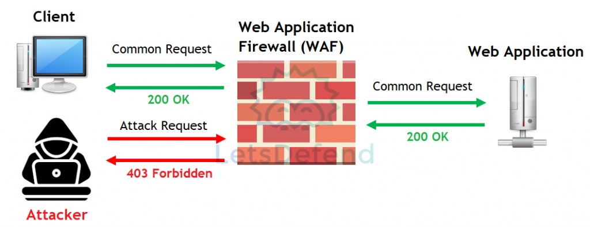

The demonstrated model is:

```text
normal request
→ allowed
→ 200 OK
```

versus:

```text
attack request
→ blocked
→ 403 Forbidden
```

Types covered:

- network-based
- host-based
- cloud-based

Products listed:

- AWS WAF
- Cloudflare
- F5
- Citrix
- FortiWeb

## Useful WAF Fields

```text
source IP
HTTP method
URI
rule
attack category
action
response code
user-agent
host
```

Useful for investigating:

- SQL injection
- XSS
- traversal
- scanning
- malicious bots

---

# 15. Load Balancers

Load balancers distribute requests among backend servers.

Products listed:

- Nginx
- F5
- HAProxy
- Citrix
- Azure Traffic Manager
- AWS

Security-relevant fields may include:

```text
client IP
method
URI
user-agent
backend
response code
latency
```

These can help reconstruct web attacks across multiple backend servers.

---

# 16. Proxy Servers

A proxy acts as an intermediary between client and server.

The source discusses forward, reverse, transparent, anonymous, SSL, rotating, caching, HTTP, SOCKS, and other proxy types.

## SOC Value

Proxy telemetry may expose:

```text
user
source IP
destination
URL
method
user-agent
action
process
bytes
```

Useful for:

- phishing URLs
- malware downloads
- suspicious browsing
- C2 candidates
- data-transfer analysis

---

# 17. Email Security Solutions

Email security products defend against email-borne threats.

Products listed:

- FireEye EX
- IronPort
- Trend Micro Email Security
- Proofpoint
- Symantec

## High-Value Fields

```text
sender
recipient
subject
message ID
source IP
attachment
URL
threat type
delivery action
quarantine status
```

These are central to phishing investigations.

---

# 18. Correlating Security Products

A real incident may require multiple controls.

```text
Email Security
      ↓
malicious attachment delivered

EDR
      ↓
WINWORD.EXE → powershell.exe

Proxy
      ↓
outbound request

Firewall
      ↓
connection allowed

Sandbox
      ↓
payload behavior confirmed
```

No single product necessarily gives the complete story.

---

# 19. What Each Solution Is Best At

| Control | Investigation Value |
|---|---|
| IDS | Detect suspicious network behavior |
| IPS | Detect and prevent network attacks |
| Firewall | Connection allow/deny evidence |
| EDR | Endpoint process and behavior evidence |
| Antivirus | File/malware detection |
| Sandbox | Controlled behavior analysis |
| DLP | Sensitive-data movement |
| Asset Management | Device context |
| WAF | Web application attack filtering |
| Load Balancer | Web/backend routing context |
| Proxy | User-to-Internet activity |
| Email Security | Phishing and email threat telemetry |

---

# 20. Analyst Decision Framework

For any security-product alert, ask:

1. What generated the alert?
2. What did the product actually observe?
3. Did it detect or prevent?
4. What was the action?
5. Which user/host was involved?
6. What source/destination was involved?
7. What protocol/application was used?
8. Can another telemetry source corroborate it?
9. Was the activity successful?
10. What remains unproven?

---

# 21. Critical Distinctions

```text
Detected
≠ Blocked
```

```text
Allowed connection
≠ successful exploitation
```

```text
IDS signature
≠ confirmed compromise
```

```text
AV detection
≠ execution confirmed
```

```text
Sandbox says malicious
≠ enterprise host definitely executed it
```

---

# 22. Log Fields Worth Memorizing

Across security products, these fields repeatedly matter:

```text
timestamp
hostname
username
source IP
source port
destination IP
destination port
protocol
process
parent process
command line
URL
HTTP method
action
severity
signature
category
file hash
file path
rule ID
session ID
```

Knowing how to interpret these quickly is more useful than memorizing vendor names.

---

# SOC Takeaway

Security controls are best understood as **different telemetry sources with different visibility**:

```text
IDS / IPS
→ network attack visibility

Firewall / Proxy / WAF
→ network/application control

EDR / AV
→ endpoint and malware visibility

Sandbox
→ controlled behavior

DLP
→ sensitive-data movement

Asset Management
→ environment context

Email Security
→ phishing/email visibility
```

The analyst's job is to correlate these signals into a defensible conclusion.

---

# Training Context

This knowledge base was built from authorized SOC/security-solutions training material and is intended as a practical analyst reference rather than a quiz-answer dump.
