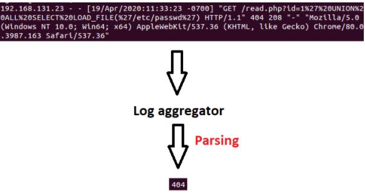
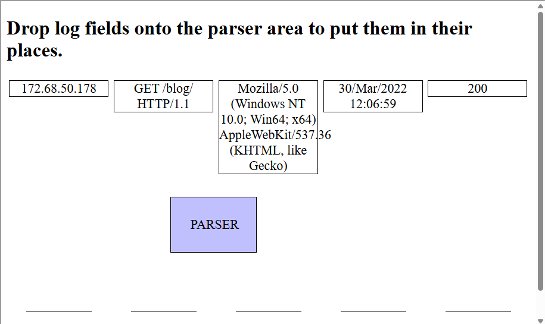
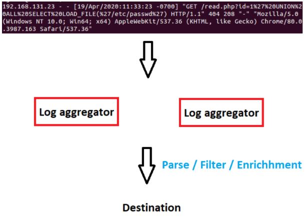
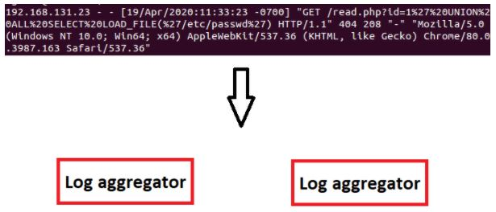
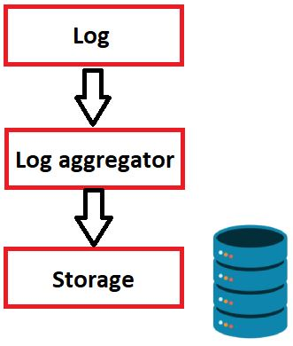
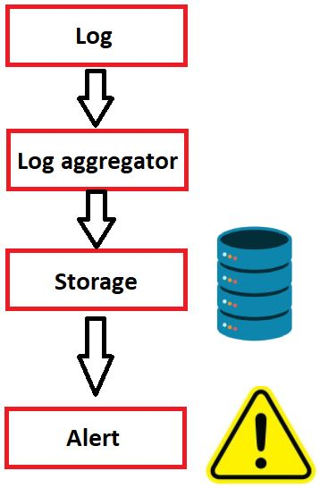
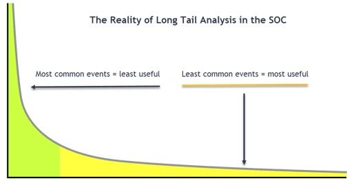

# SIEM 101 — SOC Analyst Knowledge Base

## Purpose

This reference explains how a SIEM works from a SOC analyst perspective, with emphasis on the telemetry pipeline behind the alerts analysts investigate.

```text
Log Source
→ Collection
→ Aggregation
→ Parsing / Filtering / Enrichment
→ Storage / Indexing
→ Detection Logic
→ Alert
→ Analyst Investigation
```

---

# 1. What a SIEM Does

A SIEM centralizes security-relevant telemetry from sources such as:

- endpoints
- firewalls
- servers
- proxies
- IDS/IPS
- WAF
- VPN
- applications
- authentication systems

The practical SOC value is centralized detection, searching, correlation, and investigation.

---

# 2. Log Collection

Logs are generally collected using:

1. **Agent-based collection**
2. **Agentless collection**

## Agent-Based

Agents may provide:

- parsing
- buffering
- encryption
- log rotation
- integrity checks
- normalization

Examples referenced in the training:

```text
Splunk Universal Forwarder
ArcSight Connectors
Beats
NXLog
```

## Agentless

Common mechanisms:

```text
SSH
WMI
```

Advantages:
- simpler deployment
- no agent lifecycle

Limitations:
- fewer capabilities
- credential handling risk

---

# 3. Syslog

Syslog is a common protocol for log transport.

The training material notes support for:

```text
UDP
TCP
TLS
```

Typical fields:

```text
Timestamp
Source Device
Facility
Severity
Message Number
Message Text
```

---

# 4. Log Aggregation

The log aggregator receives events before they are sent to storage or further SIEM processing.

It may:

- parse
- filter
- normalize
- enrich
- modify fields
- convert formats



---

# 5. Parsing

Parsing turns raw text into structured fields.

Example raw web log:

```text
172.68.50.178 ... "GET /blog/ HTTP/1.1" ... 200 ...
```

Useful parsed fields:

```text
source_ip
http_method
uri
protocol
user_agent
timestamp
status_code
```



Why this matters:

```text
raw string search
```

becomes:

```text
status_code = 200
http_method = GET
uri = /blog/
```

That makes correlation and detection much more reliable.

---

# 6. Filtering

Filtering keeps only useful data before forwarding or storing it.

Benefits:

- lower ingestion volume
- reduced noise
- lower storage cost

Risk:

> Over-filtering may remove evidence needed later during incident response.

---

# 7. Enrichment

Enrichment adds context to an event.

Examples from the training:

- geolocation
- DNS lookup
- reverse DNS
- add/remove fields



Example:

```text
IP
→ Country

Domain
→ IP

IP
→ Hostname
```

Enrichment can improve both triage speed and correlation.

---

# 8. EPS — Events Per Second

Formula:

```text
EPS = Events / Seconds
```

Example:

```text
1,000 events / 5 seconds = 200 EPS
```

Training example:

```text
150,000 events / 60 seconds = 2,500 EPS
```

Higher EPS requires greater:

- aggregator capacity
- CPU/RAM
- network throughput
- storage
- indexing capacity

---

# 9. Scaling Aggregators

Multiple aggregators can distribute ingestion load.



If collectors or aggregators are overloaded:

- logs can arrive late
- events may be dropped
- alerts may be delayed
- timelines may become incomplete

That becomes an investigation limitation, not proof that an event never occurred.

---

# 10. Normalization

Different log sources may represent the same data differently.

Examples:

```text
dd-mm-yyyy
vs
mm-dd-yyyy
```

```text
UTC+3
vs
UTC
```

Normalization converts these into consistent formats.

For SOC work, timestamp normalization is critical for timeline reconstruction.

---

# 11. Log Storage

After processing, telemetry is stored.



The training emphasizes that SIEM storage must support:

- retention
- fast retrieval
- indexing
- repeated searching

A large storage volume is not enough if searches take too long.

---

# 12. WORM Concept

The material introduces:

```text
Write Once
Read Many
```

as a useful model for log storage.

SIEM data is usually:

```text
written once
searched many times
```

Fast access and indexing are therefore more important than frequent record updates.

---

# 13. Alerting

After logs are collected, processed, and stored, detection logic creates alerts.



```text
Log
→ Aggregator
→ Storage
→ Detection
→ Alert
```

Alerts should be:

- timely
- relevant
- actionable
- tuned to reduce noise

---

# 14. Blacklists

A blacklist contains known-bad entities.

Examples:

```text
malicious IP
malicious domain
known malware hash
```

Example logic:

```text
destination_ip IN malicious_ip_list
→ alert
```

Limitation:

Attackers can change infrastructure or modify files.

---

# 15. Hash Blacklist Limitation

A file hash changes if the file changes.

The training example shows that modifying a file such as:

```text
mimikatz.exe
```

can produce a different hash.

Therefore:

```text
hash detection
≠ behavioral detection
```

A stronger rule combines:

- hash
- filename
- parent process
- command line
- behavior
- network activity

---

# 16. Whitelists

A whitelist defines approved entities.

Example:

```text
critical_server
AND destination_ip NOT IN approved_destinations
→ alert
```

Whitelists can be highly effective but require continuous maintenance.

---

# 17. Long-Tail Analysis

Long-tail analysis focuses on rare events.



Concept:

```text
common events
→ often less interesting

rare events
→ potentially more interesting
```

Important:

> Rare does not mean malicious.

Rare events are investigation candidates.

---

# 18. Correlation Rules

SIEM becomes more powerful when multiple events are correlated.

Training example:

```text
15 failed logins
from same IP
within 1 minute
```

General pattern:

```text
Event A
+
Event B
+
same entity
+
time window
→ alert
```

Examples:

```text
10 failed logins
+
1 successful login
+
same user
+
5 minutes
```

```text
Office process
+
PowerShell
+
external connection
+
2 minutes
```

```text
new executable
+
Run key modification
+
same host
+
5 minutes
```

---

# 19. Detection Timing

Alerts may be created:

1. while data is being received
2. by searching stored data

## Near-Real-Time

Pros:
- faster detection

Cons:
- higher processing demand

## Search-Based

Pros:
- flexible

Cons:
- detection delay depends on query frequency and search speed

---

# 20. SIEM Pipeline Failure Points

Possible reasons logs are missing or delayed:

```text
source not logging
agent stopped
network failure
aggregator overloaded
parser broken
field extraction failed
timezone normalization issue
storage/index delay
detection rule failure
```

Therefore:

```text
no SIEM result
≠ event definitely did not happen
```

---

# 21. Parsing Errors

Bad parsing can cause bad detections.

Analysts should compare:

```text
normalized event
```

with:

```text
raw event
```

when fields appear inconsistent.

Common problems:

- wrong source IP
- malformed timestamp
- incorrect status code
- split URI
- field shifted into wrong column

---

# 22. Time Normalization

Always verify:

```text
event time
timezone
ingestion time
device clock
```

Time inconsistencies can distort the attack timeline.

---

# 23. SIEM Analyst Workflow

```text
Alert
→ Read detection rule
→ Identify triggering events
→ Review parsed fields
→ Inspect raw events
→ Pivot on host/user/IP/hash
→ Search related telemetry
→ Build timeline
→ Determine scope
→ Verdict
→ Tune if necessary
```

---

# 24. High-Value SOC Skills

A SOC analyst should be able to:

- search logs
- filter fields
- choose time ranges
- count/group events
- pivot between sources
- read raw logs
- understand normalized fields
- recognize parsing problems
- correlate events
- understand rule logic
- tune false positives

---

# 25. Questions to Ask About Any SIEM Alert

```text
What rule fired?
What data source triggered it?
What fields matched?
How many events contributed?
What time window was used?
Was enrichment involved?
Is the activity rare?
Is the user/host expected?
What raw evidence supports the alert?
What other telemetry corroborates it?
```

---

# 26. Common Analyst Mistakes

Avoid:

- trusting parsed fields blindly
- ignoring raw logs
- assuming missing logs mean no activity
- ignoring timezone differences
- treating all rare events as malicious
- relying only on blacklists
- ignoring ingestion delays
- investigating alerts without reading rule logic
- ignoring parser failures
- failing to correlate multiple sources

---

# 27. SIEM Architecture Cheat Sheet

```text
Log Source
→ Agent / Agentless
→ Syslog / Forwarder / Connector
→ Aggregator
→ Parse
→ Filter
→ Normalize
→ Enrich
→ Storage / Index
→ Search / Detection
→ Alert
→ Analyst
```

---

# 28. Detection Engineering Takeaways

A strong detection considers:

```text
data source
field quality
parsing
time window
threshold
baseline
false positives
rare behavior
context
```

Example brute force:

```text
count(authentication_failure) >= 15
BY source_ip
WITHIN 1 minute
```

Example whitelist violation:

```text
critical_server
AND destination_ip NOT IN approved_destinations
```

Example known bad infrastructure:

```text
destination_ip IN threat_intel_blacklist
```

---

# SOC Takeaway

A SIEM does not inherently know what is malicious.

It works because telemetry passes through:

```text
Collect
→ Parse
→ Normalize
→ Enrich
→ Store
→ Search
→ Correlate
→ Alert
```

The strongest SOC analysts understand both:

> **the alert**

and

> **the telemetry pipeline that created it.**

---

# Training Context

This knowledge base was built from authorized SIEM training material and is intended as a practical SOC analyst reference rather than a quiz-answer walkthrough.
