# Splunk — SOC Analyst Knowledge Base

## Purpose

This reference documents a practical Splunk workflow for SOC analysts, using the lab screenshots as evidence of the tasks performed.

The focus is on the analyst-facing lifecycle:

```text
Collect telemetry
→ Forward or upload data
→ Store in indexes
→ Search with SPL
→ Pivot on fields
→ Narrow by time
→ Build reports
→ Create dashboards
→ Monitor platform health
→ Manage access
```

The objective is not to reproduce a vendor tutorial. It is to show how Splunk is used to turn raw Windows and web telemetry into investigation-ready evidence.

---

# 1. Splunk in a SOC

Splunk is commonly used to centralize, search, correlate, and visualize security telemetry.

A practical SOC workflow is:

```text
Endpoint / Server / Security Tool
        ↓
Universal Forwarder / Upload / Input
        ↓
Splunk Index
        ↓
Search & Reporting
        ↓
SPL filtering / aggregation
        ↓
Report / Alert / Dashboard
        ↓
Analyst investigation
```

For an analyst, the core skill is not navigating menus. It is knowing how to find the right data, constrain the search, interpret the fields, and pivot into related activity.

---

# 2. Data Onboarding

## 2.1 Add Data

Splunk data onboarding begins from **Settings → Add Data**.

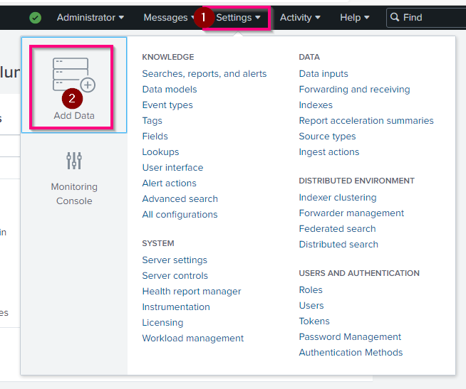

This is the starting point for onboarding:

- local files
- monitored files/directories
- operating-system logs
- network inputs
- forwarder data

---

## 2.2 Forwarding Data

The lab uses the **Forward** method to receive data from a Splunk Universal Forwarder.


Conceptually:

```text
Windows Endpoint
      ↓
Universal Forwarder
      ↓
TCP 9997
      ↓
Splunk
```

---

## 2.3 Selecting the Forwarder

The forwarder host is selected and assigned to a server class.

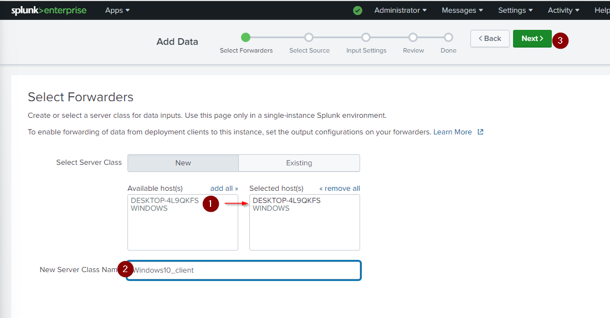

This links a managed forwarder to the data-input configuration that will be applied to it.

---

## 2.4 Selecting Windows Event Logs

The lab selects Windows Event Log channels for collection.

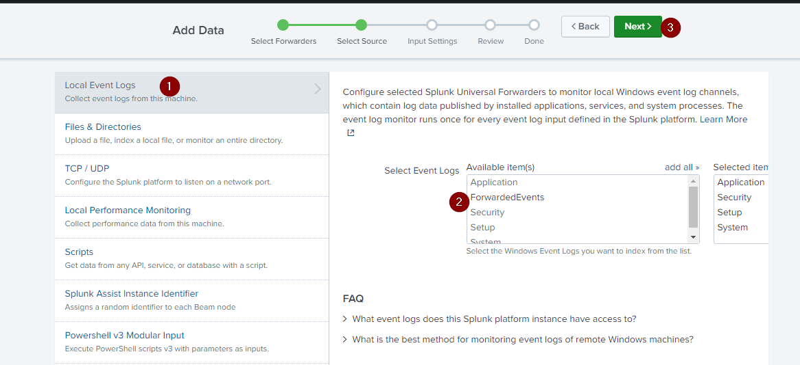

Relevant channels can include:

```text
Application
Security
Setup
System
ForwardedEvents
```

For SOC work, the **Security** channel is particularly valuable for authentication and account activity.

---

# 3. Indexes

## 3.1 Viewing Indexes

Indexes are managed under **Settings → Indexes**.

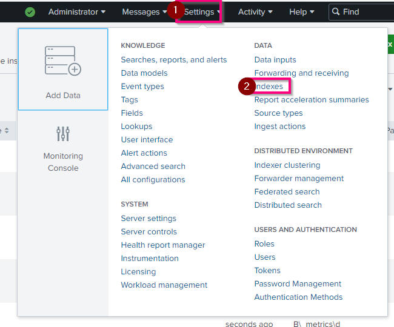

An index is the logical repository where Splunk stores ingested events.

---

## 3.2 Dedicated Windows Index

The lab uses:

```text
winlog_clients
```

for Windows event data.

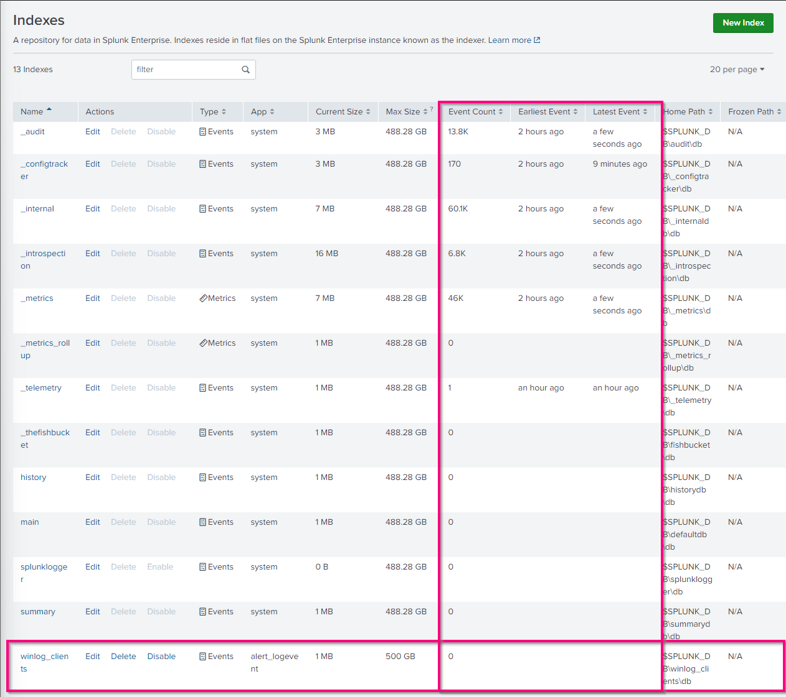

### Analyst Principle

Always identify:

```text
index
source
sourcetype
host
time range
```

before running broad searches.

A focused search is faster and easier to interpret.

---

# 4. Forwarding and Receiving

## 4.1 Receiving Port

Splunk must be configured to receive forwarded data.

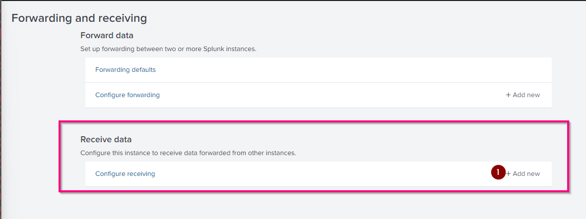

The training uses:

```text
TCP 9997
```

as the receiving port.

---

## 4.2 Validating Ingestion

After forwarding is configured, the index event count increases.

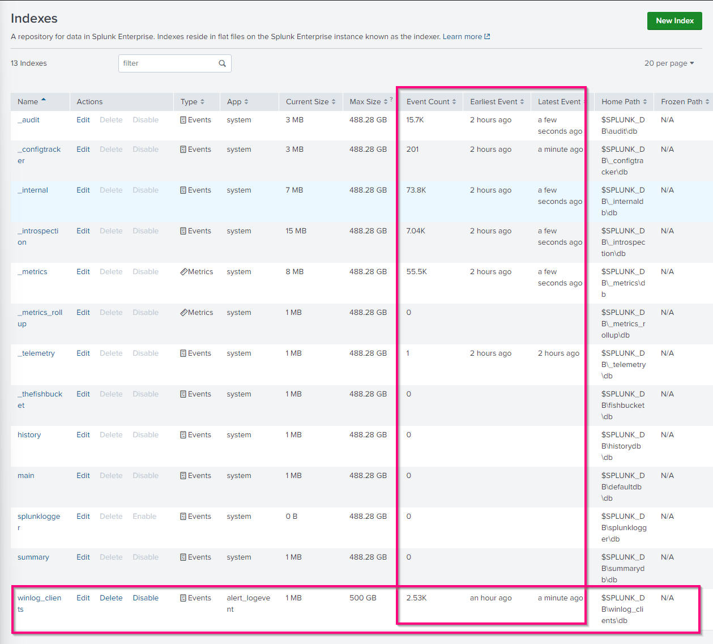

This confirms that telemetry is reaching Splunk.

A useful troubleshooting sequence is:

```text
Forwarder installed?
→ Forwarder running?
→ Correct source selected?
→ Port 9997 reachable?
→ Splunk receiving?
→ Correct index?
→ Events visible in Search?
```

---

# 5. Searching an Index

A basic search can target the index directly:

```spl
index="winlog_clients"
```


This returns the Windows events stored in that index.

The search interface exposes:

- raw events
- extracted fields
- source
- sourcetype
- host
- event counts
- timeline

---

# 6. Manual File Upload

Splunk can also ingest files directly.

## 6.1 Select Upload


This is useful for:

- exported incident logs
- training datasets
- CSVs
- archived evidence
- one-off analysis

---

## 6.2 Select the File

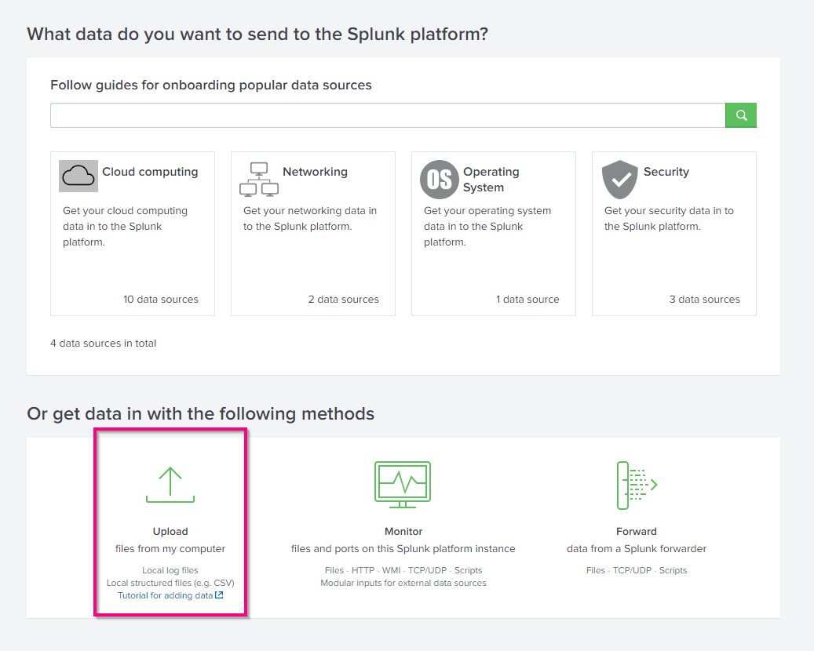

The analyst reviews:

- source
- sourcetype
- host
- event preview
- destination index

before ingestion.

---

## 6.3 Validate Uploaded Data

The uploaded CSV is searchable after ingestion.


The example shows:

```text
source = import_logs.csv
sourcetype = csv
```

### Analyst Lesson

Always confirm that Splunk interpreted the source correctly before trusting field extractions.

---

# 7. Time Range Selection

Time is one of the most important dimensions in incident investigation.

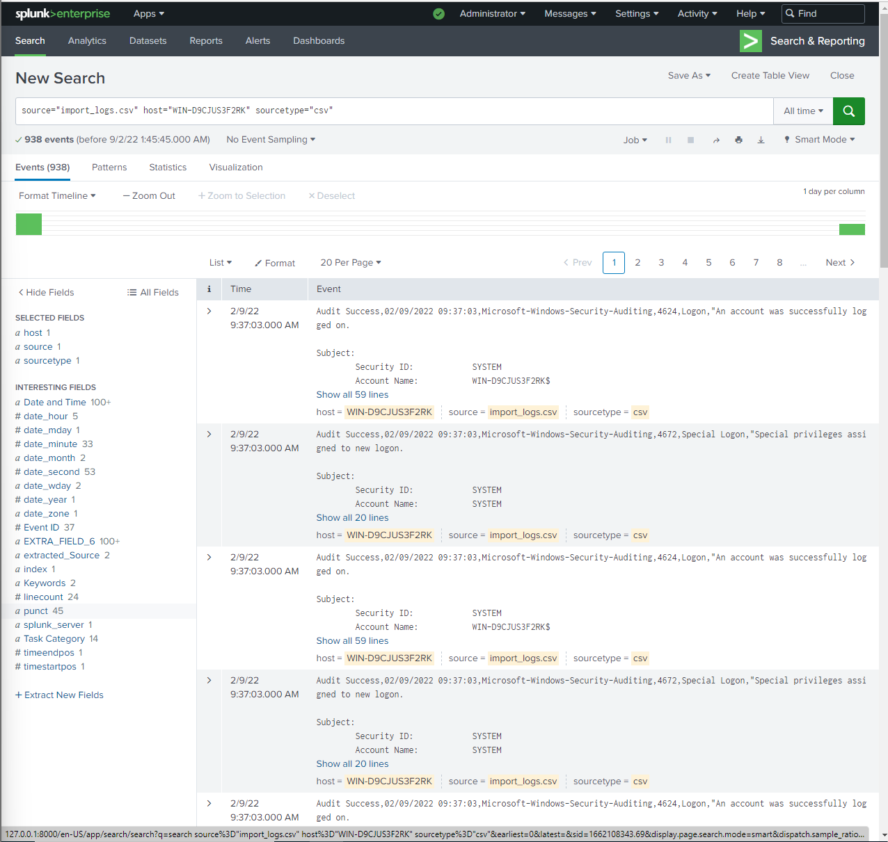

Splunk supports:

```text
Presets
Relative
Real-time
Date Range
Date & Time Range
Advanced
```

A good SOC workflow starts with a narrow window around the alert and expands only if needed.

Example:

```text
Alert time - 10 minutes
→ Alert time + 30 minutes
```

instead of searching `All time`.

---

# 8. Search Fundamentals

A basic search example:

```spl
index="winlog_clients"
```


Splunk search fields and operators demonstrated in the training include:

```text
AND
OR
NOT
*
```

General rules:

- field names are case-sensitive
- field values are usually matched case-insensitively
- use wildcards carefully
- keep searches scoped whenever possible

---

# 9. Field Discovery

The left-side field panel is one of the most useful analyst features.

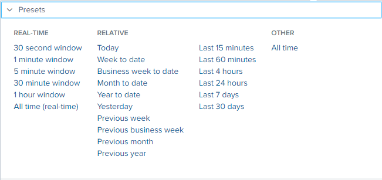

It divides fields into:

```text
Selected Fields
Interesting Fields
```

This helps identify pivots such as:

- `ComputerName`
- `EventCode`
- account fields
- source IP
- source
- sourcetype
- hostname

### Analyst Principle

Do not assume the field name from memory.

Inspect what the dataset actually exposes.

---

# 10. Pivoting on Field Values

Selecting a field such as `ComputerName` shows value distribution.

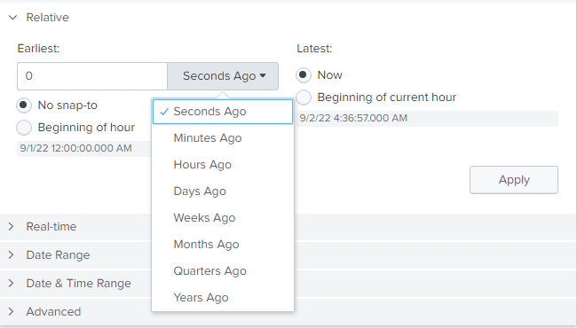

This is useful for quickly answering:

```text
Which hosts generated the events?
Which host dominates?
Are there rare hosts?
```

This same technique can be used for:

- username
- source IP
- destination
- EventCode
- URI
- process
- action

---

# 11. Web-Log Field Pivoting

A web dataset can be narrowed by URI:

```spl
uri_path="/productscreen.html"
```

and then pivoted on fields such as:

```text
clientip
```

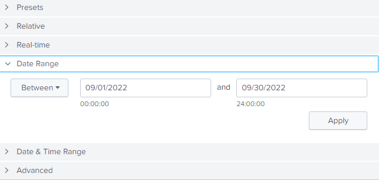

This allows the analyst to identify which client IPs interacted with a specific application path.

---

# 12. Aggregation with `stats`

The training demonstrates aggregation using:

```spl
clientip="128.241.220.82"
| stats count by uri_path
| sort -count
```


This query answers:

> Which URI paths did this client access most frequently?

This is an important SOC pattern:

```text
Filter entity
→ Group by behavior
→ Count
→ Sort
→ Investigate outliers
```

---

# 13. Windows Authentication Investigation

The lab searches failed Windows logons using Event ID:

```text
4625
```

Example:

```spl
source="WinEventLog:*"
index="winlog_clients"
EventCode=4625
AND Nom_du_compte=Admin*
```


The field name in this dataset is localized (`Nom_du_compte`), which reinforces an important point:

> Field names vary between datasets, parsers, operating-system language, and add-ons.

Never blindly assume the field will be named `AccountName`.

---

# 14. Search Modes

Splunk provides:

```text
Fast
Smart
Verbose
```

## Fast

Prioritizes speed and performs less field discovery.

## Smart

Balances speed and field extraction.

## Verbose

Returns the most complete field/event detail.

For typical analyst investigation, **Smart Mode** is a useful default, while Verbose is valuable when deeper event detail is required.

---

# 15. Reports

A search can be saved as a reusable report.

## 15.1 Save As Report


The analyst selects:

```text
Save As → Report
```

---

## 15.2 Report Metadata

The report is given:

- title
- description
- time-range behavior


Example title:

```text
WINDOWS - Connections failed for admin account
```

---

## 15.3 Saved Report Results


This creates a reusable investigation view for repeated failed-admin-login analysis.

---

## 15.4 Reports Tab

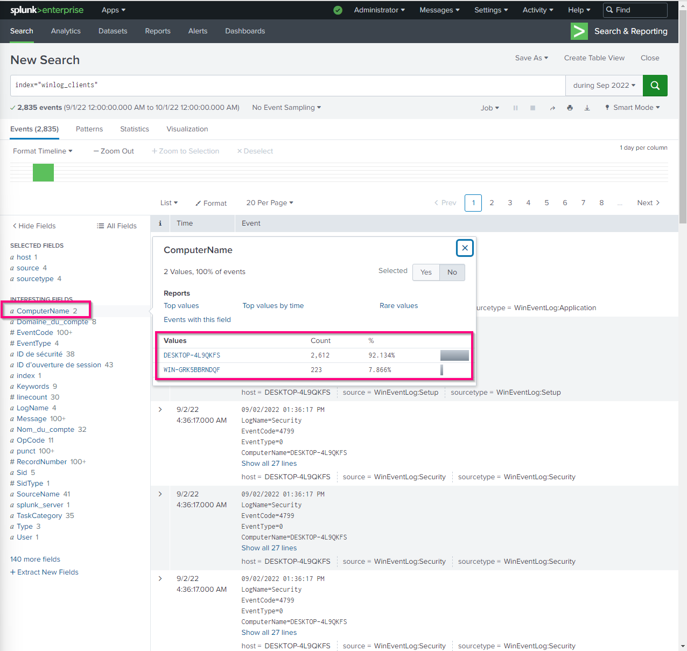

Reports are accessible from the **Reports** area.

---

## 15.5 Reports List

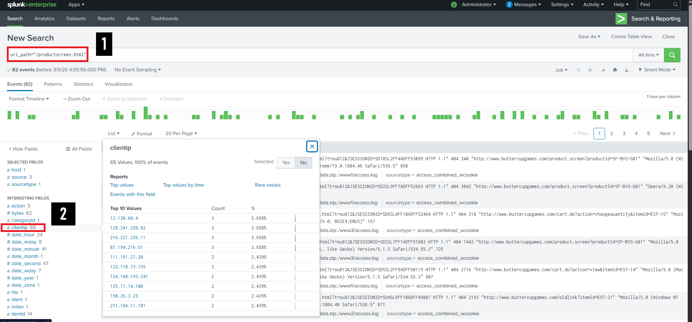

The saved Windows failed-login report appears alongside other reports.

---

## 15.6 Editing a Report

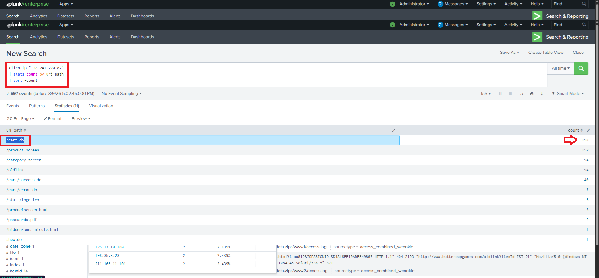

Reports can be modified for:

- description
- permissions
- scheduling
- acceleration
- cloning
- embedding
- deletion

### SOC Value

Reports are useful for repeatable analyst workflows but should not replace raw-event inspection when investigating a live incident.

---

# 16. Dashboards

A saved search or report can be added to a dashboard.


Example:

```text
Dashboard: SOC L1
Panel: Admin Connection Failed
```

Dashboards are useful for:

- situational awareness
- authentication trends
- alert counts
- failed logins
- malware activity
- top IPs
- SOC metrics

But dashboards are summaries. Analysts should pivot into raw events when deeper validation is needed.

---

# 17. Platform Health

Splunk provides health reporting.

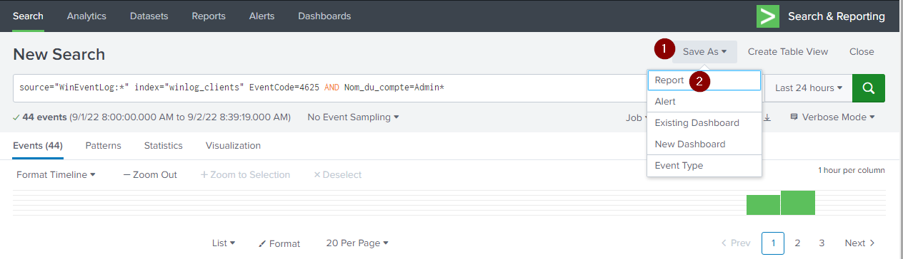

Health indicators may cover components such as:

- file monitor input
- index processor
- search scheduler
- workload management

This matters because:

```text
missing data
≠ automatically no activity
```

An ingestion or indexing issue may be the cause.

---

# 18. Roles and Access Control

Splunk supports role-based access control.

## 18.1 Opening Roles

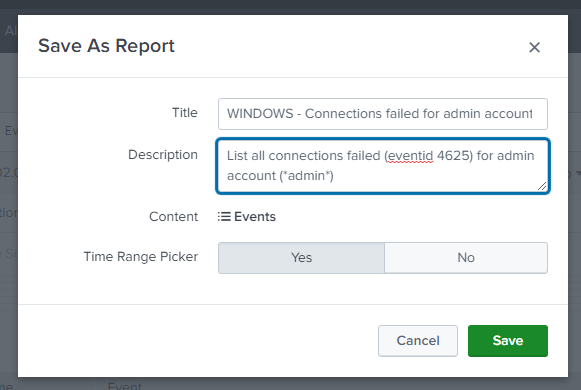

---

## 18.2 Role List

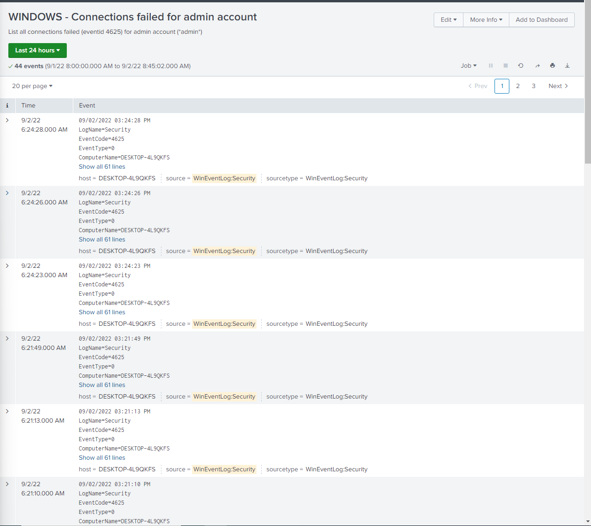

Roles may include:

```text
admin
power
user
system roles
custom roles
```

Permissions affect:

- available indexes
- search permissions
- administrative capabilities
- default apps

### Security Principle

Use least privilege for analyst and administrative accounts.

---

# 19. Users

User management is available from **Settings → Users**.

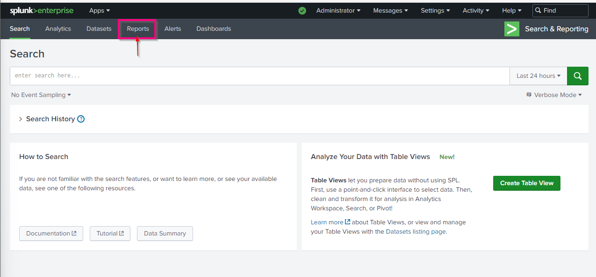

Analysts should understand that SIEM user access is itself security-sensitive.

---

# 20. Password Management

Splunk exposes password-management settings.

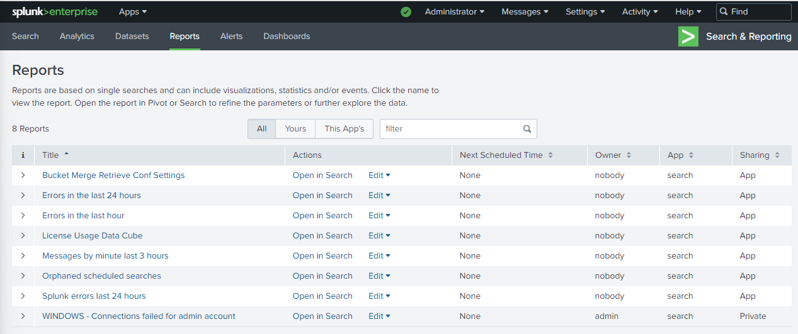

Administrative account security should be treated as part of SIEM hardening.

The training recommends creating a dedicated administrator account rather than using the default `admin` account for routine activity.

---

# 21. Useful SPL Patterns

## Search an Index

```spl
index="winlog_clients"
```

## Failed Logons

```spl
index="winlog_clients" EventCode=4625
```

## Failed Admin Logons

```spl
source="WinEventLog:*"
index="winlog_clients"
EventCode=4625
AND Nom_du_compte=Admin*
```

## Multiple Event IDs

```spl
index="winlog_clients"
(EventCode=4624 OR EventCode=4625)
```

## Exclude a Value

```spl
index="winlog_clients"
NOT User=SYSTEM
```

## Count by Field

```spl
index="winlog_clients"
| stats count by ComputerName
| sort -count
```

## Web Requests by URI

```spl
clientip="128.241.220.82"
| stats count by uri_path
| sort -count
```

---

# 22. Analyst Search Method

A strong Splunk investigation usually narrows progressively:

```text
1. Set time range
2. Identify index
3. Run broad search
4. Inspect fields
5. Pivot on host/user/IP
6. Count/group behavior
7. Search before/after activity
8. Correlate related event types
9. Review raw events
10. Document evidence
```

This is more reliable than attempting to write one complex SPL query immediately.

---

# 23. Authentication Investigation Example

A practical investigation might begin:

```spl
index="winlog_clients" EventCode=4625
```

Then pivot:

```text
Which account?
Which host?
Which source address?
How many failures?
What time window?
Was there a later 4624 success?
```

A useful correlation concept:

```text
Repeated 4625
+
same account/source
+
short time window
+
later 4624
→ possible password attack followed by success
```

---

# 24. Detection Engineering Connection

Splunk searches can become reports or alerts.

Conceptually:

```text
SPL search
+
threshold
+
time window
+
schedule/real-time execution
→ detection
```

Example brute-force concept:

```text
many EventCode=4625
by same user/source
within short interval
```

A mature rule should also account for:

- service accounts
- scanners
- stale credentials
- expected administrative activity
- false-positive tuning

---

# 25. Reports vs Alerts vs Dashboards

| Splunk Feature | Main Purpose |
|---|---|
| Search | Ad hoc investigation |
| Report | Reusable saved search |
| Alert | Trigger when detection condition is met |
| Dashboard | Visual summary of recurring data |

This distinction is useful both operationally and in interviews.

---

# 26. Forwarder Troubleshooting Checklist

If expected Windows data is missing:

- [ ] Universal Forwarder installed
- [ ] Forwarder service running
- [ ] Correct host configured
- [ ] Correct event logs selected
- [ ] Splunk receiver listening on 9997
- [ ] Network/firewall permits 9997
- [ ] Correct index configured
- [ ] Search time window correct
- [ ] Event count increasing
- [ ] Splunk health normal

---

# 27. Search Validation Checklist

Before trusting a query:

- [ ] correct index
- [ ] correct source/sourcetype
- [ ] correct time range
- [ ] correct field names
- [ ] raw events reviewed
- [ ] field values validated
- [ ] wildcards not overly broad
- [ ] related events checked
- [ ] missing telemetry considered
- [ ] timezone understood

---

# 28. Common Analyst Mistakes

Avoid:

- using `All time` by default
- forgetting the relevant index
- assuming field names
- relying only on dashboards
- ignoring raw events
- using broad wildcards too early
- treating one field value as complete context
- creating unnecessary real-time searches
- assuming no Splunk results means no activity
- forgetting to validate forwarder/ingestion health

---

# 29. Skills Demonstrated

This lab demonstrates practical exposure to:

- Splunk data onboarding
- Universal Forwarder
- Windows Event Log collection
- receiving on TCP 9997
- index management
- manual CSV ingestion
- SPL filtering
- time-range control
- field discovery
- field-value pivoting
- `stats`
- authentication-event analysis
- reports
- dashboards
- Splunk health
- roles
- users
- password management

---

# 30. Interview-Level Summary

If asked:

> How do you use Splunk during a SOC investigation?

A strong answer is:

```text
I first identify the relevant index, source or sourcetype, host, and
time window. I search around the alert and inspect both the raw event
and extracted fields. I then pivot on the user, host, IP, event ID, or
other indicators, aggregate events where useful, and look before and
after the triggering activity to build a timeline. I use reports and
dashboards for recurring visibility, but validate important conclusions
against the underlying events and consider ingestion issues if expected
telemetry is missing.
```

---

# SOC Takeaway

Splunk is most valuable to a SOC analyst as a **search, pivoting, correlation, and detection platform**.

```text
Collect
→ Index
→ Search
→ Filter
→ Pivot
→ Aggregate
→ Correlate
→ Report
→ Alert
→ Visualize
```

The key skill is not remembering every menu option.

It is being able to **turn large amounts of telemetry into a focused, defensible incident narrative**.

---

# Training Context

This knowledge base was created from authorized Splunk training material and lab screenshots. It is intended as a practical SOC analyst reference rather than a quiz-answer or course walkthrough.
