# Splunk — SOC Analyst Knowledge Base

## Purpose

This knowledge base documents the complete Splunk lab workflow in the same sequence as the source material, with each screenshot placed beside the task it actually demonstrates.

It covers:

- Splunk platform basics
- Windows and Linux installation checks
- Splunk Universal Forwarder
- forwarding Windows Event Logs
- indexes and receiving on TCP 9997
- manual file upload
- searching and time-range control
- field discovery and pivots
- SPL aggregation
- Windows failed-logon investigation
- reports
- alerts
- dashboards
- Splunk health
- roles, users, and password management

> **Portfolio note:** The focus here is analyst workflow and operational understanding rather than quiz answers.

---

# 1. Splunk Overview

Splunk is a data platform used to search, analyze, monitor, and visualize machine-generated data.

In a SOC, it can support:

```text
Log Collection
      ↓
Indexing
      ↓
Search / SPL
      ↓
Correlation
      ↓
Reports / Alerts
      ↓
Dashboards
      ↓
Incident Investigation
```

## Common Ports

```text
9997  → forwarder data to Splunk
8000  → Splunk Web / Search & Reporting
8089  → splunkd management communication
```

## Installation Notes

Windows service display name:

```text
Splunkd Service
```

Linux status command:

```bash
/opt/splunk/bin/splunk status
```

---

# 2. Splunk Universal Forwarder

The Universal Forwarder is a lightweight Splunk component used to send telemetry from endpoints to Splunk.

For this lab:

```text
Windows 10 endpoint
      ↓
Universal Forwarder
      ↓
TCP 9997
      ↓
Splunk Enterprise
      ↓
winlog_clients index
```

The goal is to collect Windows Event Logs centrally.

---

# 3. Add Windows Event Logs Using a Forwarder

## Step 1 — Open Add Data

Navigate to:

```text
Settings → Add Data
```


---

## Step 2 — Select Forward

Choose **Forward**.

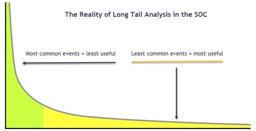

This tells Splunk that the data source will come from a Splunk forwarder rather than from a local upload.

---

## Step 3 — Select the Forwarder Host

Move the Windows host into **Selected Hosts**, assign a server class, and continue.


### Analyst Concept

A server class allows Splunk to apply input configurations to one or more managed forwarders.

---

## Step 4 — Select Windows Event Log Sources

Choose **Local Event Logs** and select the Windows log channels to collect.


Typical channels include:

```text
Application
ForwardedEvents
Security
Setup
System
```

For SOC investigations, the **Security** log is particularly important for authentication and account activity.

---

## Step 5 — Choose or Create an Index

The lab creates:

```text
WinLog_clients
```

After configuration, navigate to:

```text
Settings → Indexes
```


Search for the new index.


### Why Indexes Matter

An index is a logical storage location for events.

During investigation, a focused search such as:

```spl
index="winlog_clients"
```

is preferable to searching every index.

---

# 4. Configure the Receiving Port

If the forwarder is configured but no events arrive, Splunk must be listening for forwarded data.

Navigate to:

```text
Settings → Forwarding and Receiving
```

Then configure a receiving port.


Use:

```text
9997
```

After a short delay, event counts should begin increasing.


Run a search to validate ingestion.

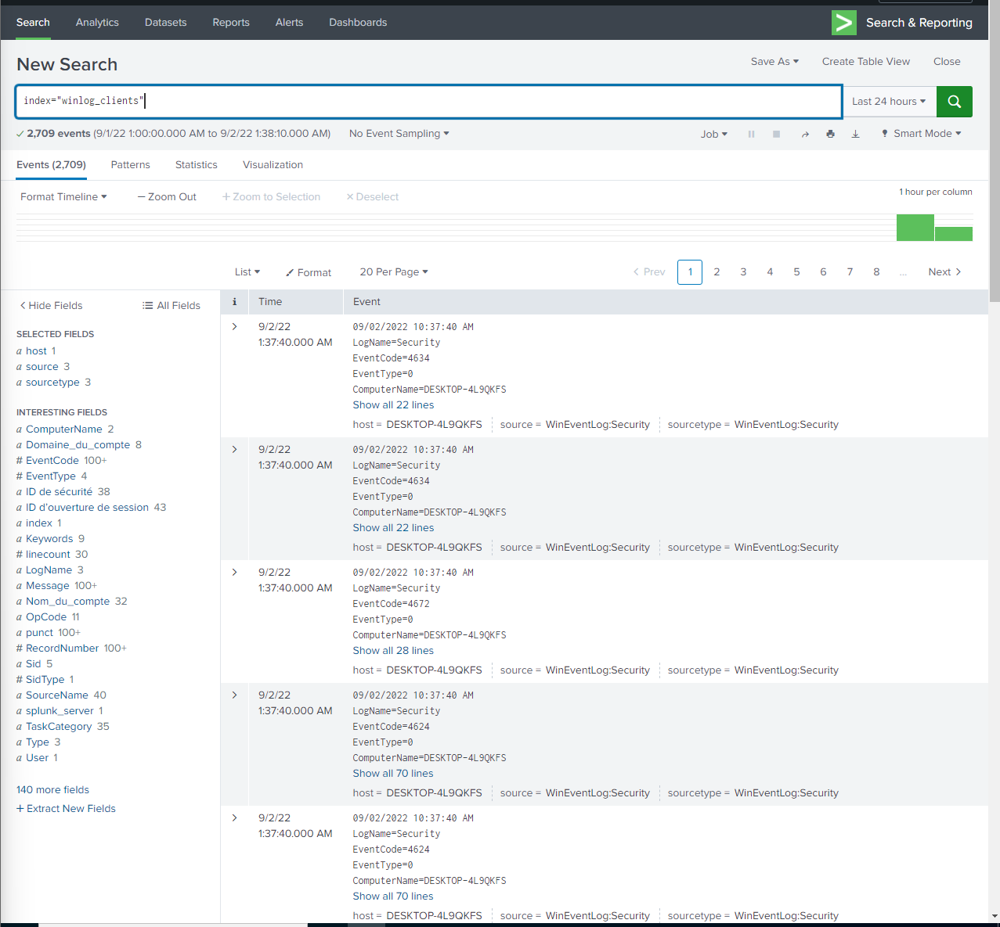

### Forwarder Troubleshooting Checklist

- [ ] Universal Forwarder installed
- [ ] Forwarder service running
- [ ] Correct host selected
- [ ] Correct Windows Event Logs selected
- [ ] Splunk listening on TCP 9997
- [ ] Network/firewall permits TCP 9997
- [ ] Correct index configured
- [ ] Search time range includes the data
- [ ] Event count is increasing

---

# 5. Add Data by Manual Upload

Splunk can also ingest standalone files.

## Step 1 — Open Add Data

Navigate again to:

```text
Settings → Add Data
```


---

## Step 2 — Select Upload

Choose **Upload**.


This is useful for:

- CSV files
- exported incident logs
- archived evidence
- training datasets
- one-off log analysis

---

## Step 3 — Select the File

Choose the file and continue.

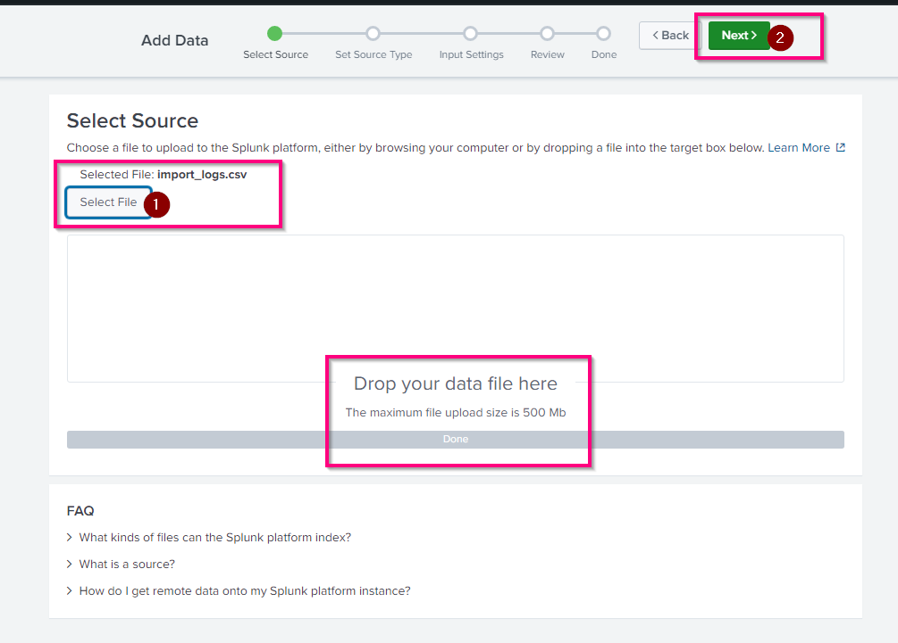

Splunk then previews how the data will be parsed.

Review:

```text
source
sourcetype
host
timestamp parsing
field extraction
destination index
```

---

## Step 4 — Search the Uploaded Logs

After ingestion, search the uploaded source.


The example shows a CSV source such as:

```text
source="import_logs.csv"
sourcetype="csv"
```

### Analyst Principle

Always validate parsing before relying on extracted fields.

A malformed sourcetype or timestamp parser can produce misleading investigation results.

---

# 6. Searching in Splunk

## Search Syntax Basics

Important rules from the training:

- field names are case-sensitive
- field values are generally case-insensitive
- `*` is a wildcard
- logical operators include `AND`, `OR`, and `NOT`

A basic search:

```spl
index="winlog_clients"
```

---

# 7. Time Range Selection

Splunk provides several methods for defining the time window.

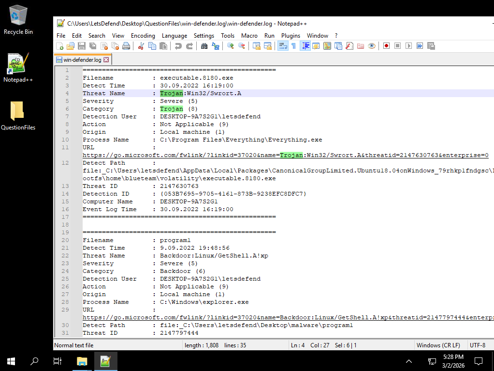

## Presets

Examples:

```text
Today
Last 15 minutes
Last 24 hours
Last 7 days
Last 30 days
All time
```


---

## Relative Time

Relative searches define time compared with now.


Examples:

```text
Minutes Ago
Hours Ago
Days Ago
Weeks Ago
Months Ago
```

---

## Date Range

A fixed date range can be selected.


### SOC Tip

Start narrow around the alert:

```text
10 minutes before
→ alert time
→ 30 minutes after
```

Then widen only when necessary.

---

# 8. Timeline Analysis

Splunk automatically visualizes event density over time.

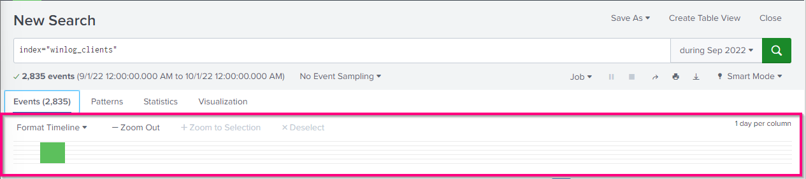

Use the timeline to identify:

- spikes
- bursts
- suspicious clusters
- quiet periods
- investigation windows

A spike does not prove maliciousness; it tells the analyst where to investigate.

---

# 9. Search Modes

Splunk provides:

```text
Fast
Smart
Verbose
```

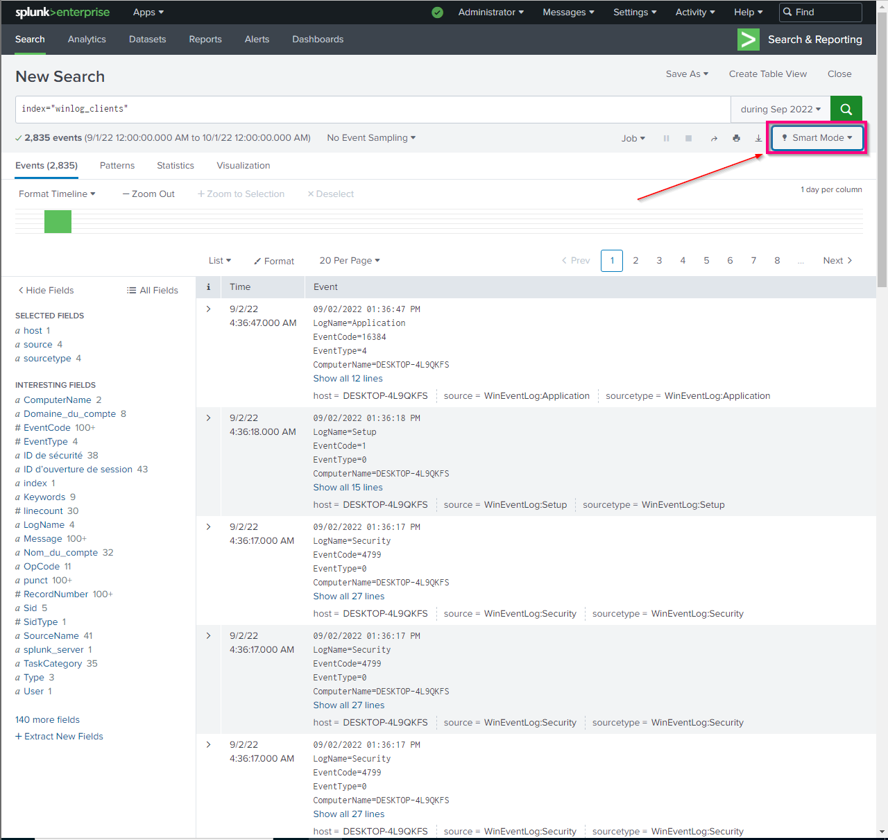

The available modes are shown here:

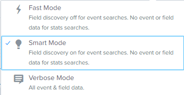

## Fast Mode
Prioritizes speed and performs less field discovery.

## Smart Mode
Balances performance and field extraction.

## Verbose Mode
Returns more complete event and field information.

For most analyst work, **Smart Mode** is a practical default.

---

# 10. Search Bar and Field Discovery

The search bar is where SPL queries are entered.

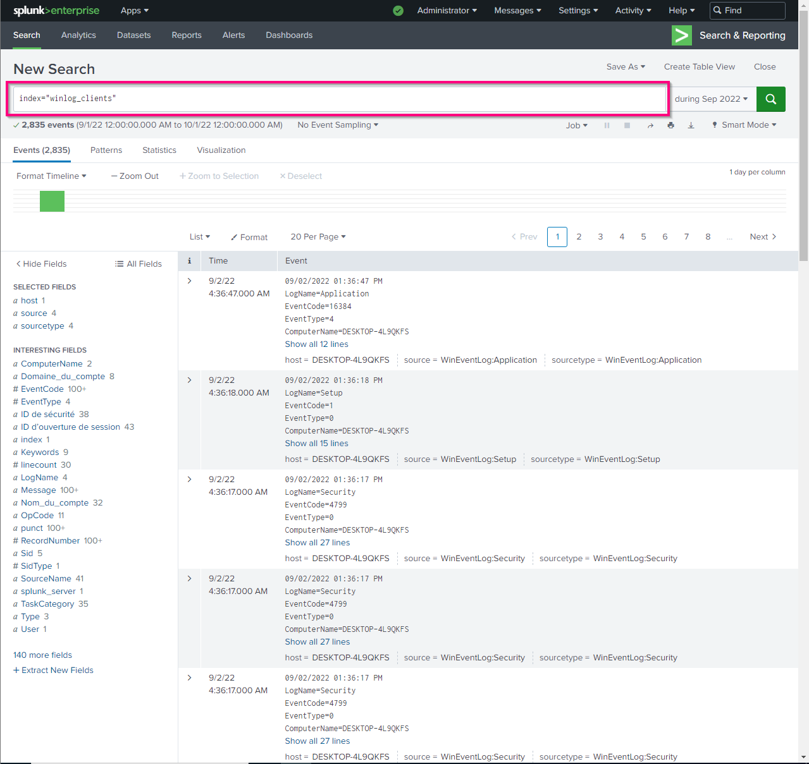

After the search runs, Splunk displays available fields on the left.

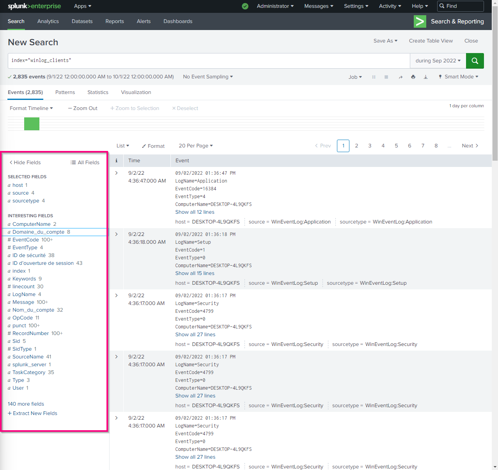

### Analyst Workflow

```text
Run broad search
      ↓
Inspect available fields
      ↓
Choose a useful pivot
      ↓
Filter on host/user/IP/event
```

---

# 11. Pivoting on Field Values

Selecting a field displays its values and frequency.

In this example, `ComputerName` has two observed values.


This is useful for determining:

```text
Which hosts generated the events?
Which value dominates?
Which value is rare?
```

---

# 12. Web Log Investigation with Fields

A web request can be filtered by URI path:

```spl
uri_path="/productscreen.html"
```

Then the analyst can inspect the `clientip` field to identify distinct source addresses.


### Investigation Pattern

```text
Interesting URI
      ↓
Identify source IPs
      ↓
Choose suspicious client
      ↓
Aggregate requested paths
```

---

# 13. Aggregation with `stats`

The lab then analyzes one client IP:

```spl
clientip="128.241.220.82"
| stats count by uri_path
| sort -count
```


This produces request frequency per path.

### SOC Value

This is a reusable investigation pattern:

```text
Filter entity
→ group behavior
→ count
→ sort
→ investigate highest/rarest activity
```

---

# 14. Windows Failed-Logon Investigation

The training creates a report around Windows failed logons using:

```text
EventCode 4625
```

Example search:

```spl
source="WinEventLog:*"
index="winlog_clients"
EventCode=4625
AND Nom_du_compte=Admin
```

Depending on the parser or OS language, the account field might instead be:

```text
accountname
```

## Step 1 — Run the Search

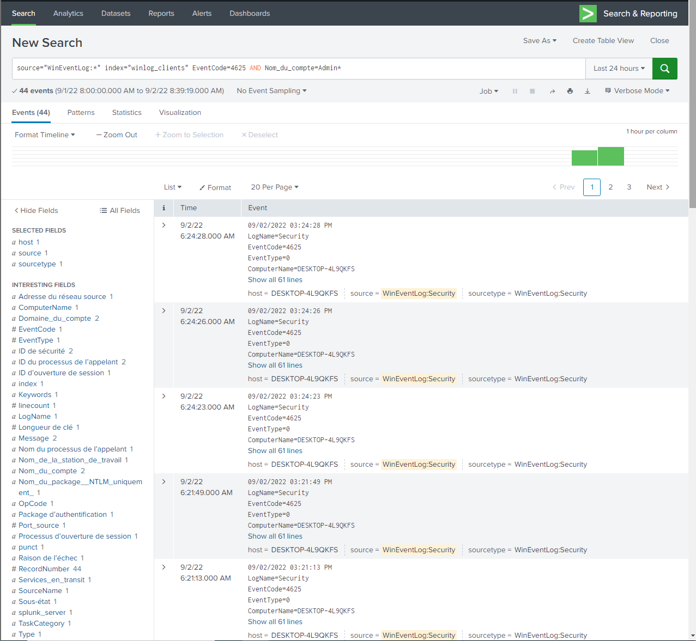

### Analyst Lesson

Do not assume field names.

Inspect the dataset because:

```text
Nom_du_compte
AccountName
TargetUserName
user
```

may all represent related concepts in different data sources.

---

# 15. Create a Report

## Step 2 — Save As Report

Click:

```text
Save As → Report
```


---

## Step 3 — Add Report Metadata

Add:

- title
- description
- time-range behavior


A clear SOC report title might be:

```text
WINDOWS - Connections failed for admin account
```

---

## Step 4 — View the Report

After saving, open the report.


Reports are reusable saved searches that reduce repeated analyst work.

---

# 16. Manage Existing Reports

Open the **Reports** tab.


The list displays available reports.


Select the report to review its details.

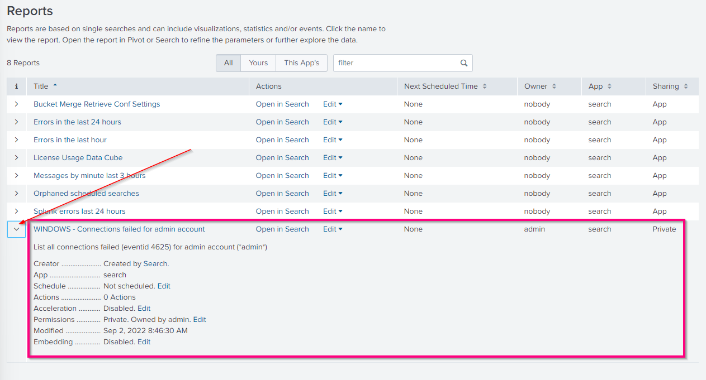

The **Edit** menu supports actions such as:

- edit description
- edit permissions
- edit schedule
- edit acceleration
- clone
- embed
- delete

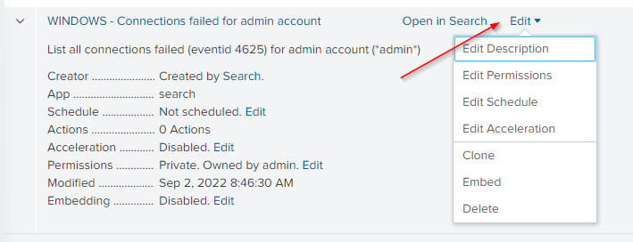

### SOC Use Cases for Reports

- failed login monitoring
- brute-force review
- suspicious IP tracking
- malware events
- unauthorized-access checks
- routine audit searches

---

# 17. Alerts

Splunk alerts are saved searches that trigger when specified conditions are met.

They can be:

```text
Scheduled
Real-time
```

A conceptual detection is:

```text
Search
+
Condition
+
Time Window
+
Trigger
=
Alert
```

### Operational Caution

Real-time alerts can consume significant platform resources.

Use real-time searches where low latency is truly necessary.

---

# 18. Dashboards

Dashboards provide reusable visual views of search results.

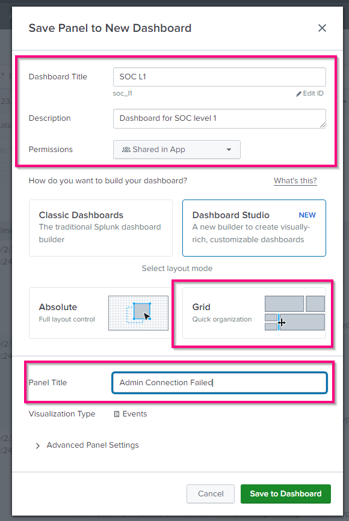

A SOC dashboard might include:

- failed logins
- alert volume
- top source IPs
- malware activity
- suspicious web traffic
- critical incidents

### Analyst Principle

Dashboards provide awareness.

They do **not** replace raw-event review during an investigation.

---

# 19. Splunk Health Status

Splunk provides a health report for platform components.

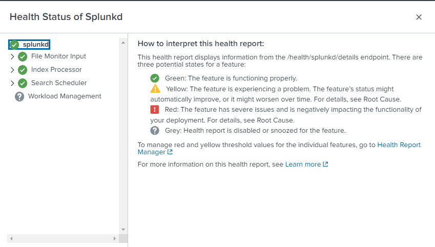

The interface can show status for components such as:

```text
File Monitor Input
Index Processor
Search Scheduler
Workload Management
```

### Why SOC Analysts Should Care

If expected telemetry is missing:

```text
No events in Splunk
```

does not always mean:

```text
No activity occurred
```

The ingestion or indexing pipeline may be unhealthy.

---

# 20. Role Management

Navigate to:

```text
Settings → Roles
```

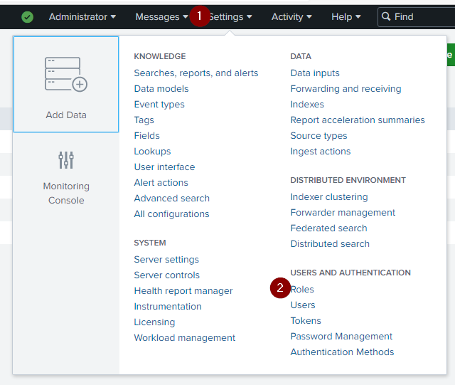

Splunk includes built-in roles and allows custom roles.

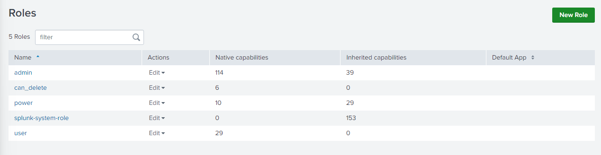

Roles can control:

- platform capabilities
- search permissions
- index visibility
- app access
- administrative functions

### Security Principle

Use least privilege.

SOC analysts should have the data and search access they need without unnecessary administrative permissions.

---

# 21. User Management

Navigate to:

```text
Settings → Users
```

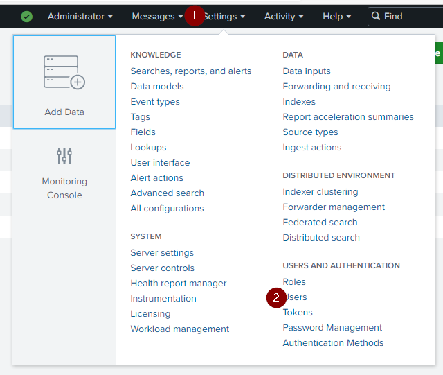

The source lab begins with the default administrative account.

A practical hardening approach is to create named administrator accounts and reserve generic `admin` use for exceptional cases.

This improves accountability and auditability.

---

# 22. Password Management

Password policy is available under:

```text
Settings → Password Management
```

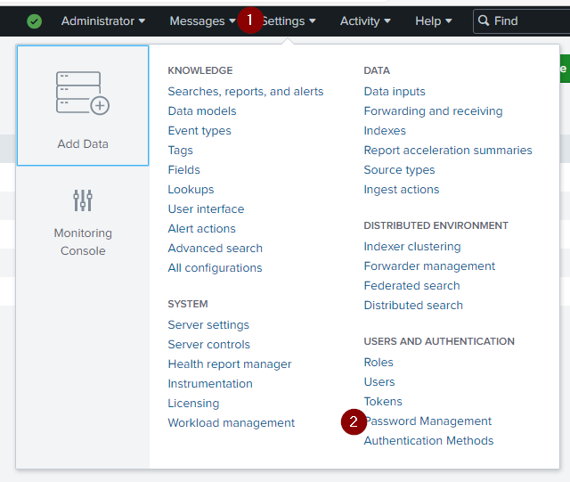

SIEM administrative accounts are high-value targets.

Password policy, account separation, and least privilege are part of SIEM security—not just platform administration.

---

# 23. Useful SPL Patterns

## Search a Windows Index

```spl
index="winlog_clients"
```

## Failed Logons

```spl
index="winlog_clients" EventCode=4625
```

## Failed Admin Logons

```spl
source="WinEventLog:*"
index="winlog_clients"
EventCode=4625
AND Nom_du_compte=Admin
```

## Search Two Authentication Outcomes

```spl
index="winlog_clients"
(EventCode=4624 OR EventCode=4625)
```

## Count Events by Host

```spl
index="winlog_clients"
| stats count by ComputerName
| sort -count
```

## Count Web Requests by Path

```spl
clientip="128.241.220.82"
| stats count by uri_path
| sort -count
```

---

# 24. SOC Investigation Workflow in Splunk

```text
Alert received
      ↓
Choose time range
      ↓
Identify index/source/sourcetype
      ↓
Run broad search
      ↓
Inspect fields
      ↓
Pivot on host/user/IP
      ↓
Aggregate/count behavior
      ↓
Search before and after
      ↓
Correlate related events
      ↓
Review raw events
      ↓
Build timeline
      ↓
Determine scope and verdict
```

---

# 25. Authentication Correlation Example

A useful investigation pattern is:

```text
Repeated EventCode 4625
      ↓
Same account / source
      ↓
Short time window
      ↓
Check EventCode 4624
```

If failures are followed by a successful login, the analyst should determine whether the sequence is:

- normal user error
- stale credentials
- service-account behavior
- password spraying
- brute-force activity
- credential compromise

---

# 26. Reports vs Alerts vs Dashboards

| Feature | Purpose |
|---|---|
| Search | Ad hoc investigation |
| Report | Reusable saved search |
| Alert | Trigger when conditions are met |
| Dashboard | Visualize recurring information |

---

# 27. Search Validation Checklist

Before trusting a result:

- [ ] correct index
- [ ] correct source/sourcetype
- [ ] correct time range
- [ ] correct field name
- [ ] correct field value
- [ ] raw event reviewed
- [ ] wildcard scope appropriate
- [ ] related events checked
- [ ] timezone understood
- [ ] ingestion health considered

---

# 28. Common Analyst Mistakes

Avoid:

- searching `All time` unnecessarily
- searching the wrong index
- assuming field names
- relying only on dashboard panels
- ignoring raw events
- using broad wildcards too early
- treating missing telemetry as proof of no activity
- creating unnecessary real-time alerts
- failing to validate forwarding/receiving
- ignoring localized field names

---

# 29. Skills Demonstrated

This lab demonstrates practical exposure to:

```text
Splunk Universal Forwarder
Windows Event Log ingestion
TCP 9997 receiving
index management
manual CSV upload
SPL searching
time-range selection
search modes
field discovery
field-value pivots
stats aggregation
Windows EventCode 4625
reports
alerts
dashboards
health monitoring
roles
users
password management
```

---

# 30. Interview-Ready Summary

If asked **"How would you use Splunk during a SOC investigation?"**, a strong answer is:

> I would first identify the relevant index, source or sourcetype, host, and time window. I would search around the alert, inspect both the raw event and extracted fields, then pivot on the user, host, IP, event ID, or other indicators. I would aggregate or count events where useful, examine activity before and after the trigger to build a timeline, and correlate related telemetry. Reports and dashboards can accelerate recurring workflows, but I would validate important conclusions against the underlying events and consider ingestion issues if expected data is missing.

---

# SOC Takeaway

Splunk is most valuable to a SOC analyst as a **search, pivoting, correlation, and detection platform**.

```text
Collect
→ Index
→ Search
→ Filter
→ Pivot
→ Aggregate
→ Correlate
→ Report
→ Alert
→ Visualize
```

The core skill is turning large volumes of telemetry into a focused and defensible incident narrative.

---

# Training Context

This knowledge base is based on authorized Splunk training material and screenshots. It is intended as a practical SOC analyst reference rather than a quiz-answer walkthrough.
