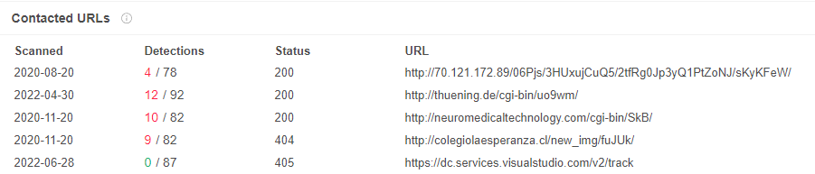
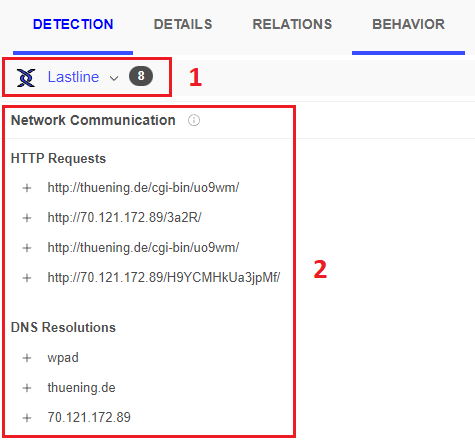
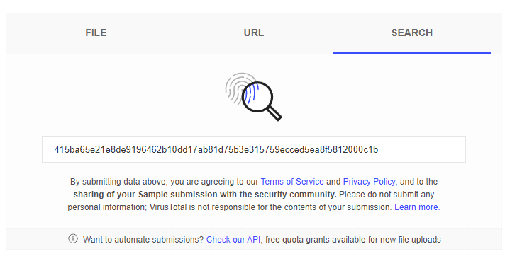

# VirusTotal for SOC Analysts — Knowledge Base

## Purpose

This knowledge base explains how SOC analysts can use VirusTotal to investigate suspicious files, hashes, URLs, domains, IP addresses, and related network indicators.

The focus is not simply on whether a vendor labels something malicious. A stronger analyst workflow is:

```text
IOC or suspicious file
→ Search / Upload
→ Review Detection
→ Review Details
→ Review Relations
→ Review Behavior
→ Check freshness
→ Correlate with internal telemetry
→ Make a verdict
```

---

# 1. What VirusTotal Is

VirusTotal aggregates analysis from many antivirus and security vendors.

SOC analysts commonly use it to enrich:

```text
Files
File hashes
URLs
Domains
IP addresses
```

The training material emphasizes that VirusTotal can provide additional context for indicators discovered during an investigation.

### Analyst Principle

```text
VirusTotal result
≠ final verdict
```

VirusTotal is an enrichment source. The analyst should still correlate findings with SIEM, proxy, firewall, EDR, sandbox, and timeline evidence.

---

# 2. File Analysis

A suspicious file can be uploaded to VirusTotal to see how different security vendors classify it.

Useful information may include:

- vendor detection results
- file metadata
- historical timestamps
- related infrastructure
- contacted URLs/domains/IPs
- dropped files
- behavioral activity

---

# 3. Detection Tab

The **Detection** tab shows security-vendor analysis of the file.

Possible results include:

```text
Malicious
Suspicious
Undetected
Clean
```

Detection counts are useful context, but they should not be treated as binary truth.

A stronger conclusion combines:

```text
Detection
+
Behavior
+
Relations
+
Internal telemetry
```

---

# 4. Relations Tab

The **Relations** tab shows entities associated with the suspicious file.

Examples include:

```text
Contacted URLs
Contacted Domains
Contacted IPs
Dropped Files
Related Files
```



This tab is useful when asking:

```text
What infrastructure did the sample communicate with?
Did it contact suspicious URLs or domains?
Did it drop additional files?
Are there related IOCs to investigate?
```

---

# 5. Relations May Be Incomplete

The training explicitly warns that malware may not behave the same way in every environment.

Malware can:

- behave differently across systems
- detect sandboxes
- delay execution
- change infrastructure
- take alternate actions

Therefore:

> The Relations tab may not show every address the malware could contact.

The absence of an IOC from Relations does not prove the sample never uses it.

---

# 6. Behavior Tab

The **Behavior** tab shows activities observed when the file executes.

Examples include:

- network connections
- DNS queries
- file reads/deletes
- registry actions
- process activity



The example demonstrates observed:

```text
HTTP requests
DNS resolutions
network communication
```

### SOC Use

Behavior helps answer:

```text
What did the file actually do in the analysis environment?
```

That is often more useful than a vendor label alone.

---

# 7. Behavior Analysis Questions

When reviewing Behavior, ask:

```text
What process executed?
What child processes were created?
Did the sample create/delete files?
Did it modify registry keys?
Did it query DNS?
Did it contact external infrastructure?
Did it download another payload?
```

This moves the investigation from:

```text
"Vendor says malicious"
```

to:

```text
"Observed behavior supports malicious intent"
```

---

# 8. URL Analysis

VirusTotal can analyze URLs as well as files.

URL reports may provide:

- vendor verdicts
- redirect information
- links
- headers
- categories
- community context

The training notes that URL analysis may show external links to which a page leads.

---

# 9. URL Investigation Workflow

For a suspicious or shortened URL:

```text
Search URL
→ Review vendor results
→ Review Details
→ Review redirect/linked content
→ Check freshness
→ Correlate with proxy/browser activity
```

Do not classify a shortened URL solely from the shortening service itself.

---

# 10. IOC Search

VirusTotal's **Search** function allows an analyst to look up an IOC and retrieve historical analysis results.

Typical searches include:

```text
MD5
SHA1
SHA256
URL
Domain
IP
```



This is especially useful when an IOC came from:

- SIEM
- EDR
- proxy
- firewall
- email security
- sandbox
- packet capture

---

# 11. Historical Analysis

A hash search may expose historical analysis metadata such as:

```text
First Submission
Last Submission
Last Analysis
Creation Time
Compilation Timestamp
```

These timestamps support timeline context.

### Important Distinction

```text
Creation Time
≠ First Submission
≠ Infection Time
```

Do not interpret one as another.

---

# 12. Compilation Timestamp

The source material demonstrates reviewing compilation timestamps in VirusTotal.

Compilation timestamps can be useful context, but they should not be treated as definitive attribution evidence because metadata can be manipulated.

---

# 13. Vendor Detection Counts

A common SOC mistake is assuming:

```text
1 / 90
= malicious
```

or:

```text
0 / 90
= safe
```

Neither conclusion is automatically valid.

Detection results should be interpreted with:

- report age
- behavior
- relations
- destination content
- internal telemetry
- false-positive possibility

---

# 14. Scan Freshness

One of the most important lessons in the training is that old results can mislead.

Example:

```text
Day 1:
URL hosts harmless content
→ scanned as clean

Later:
same URL content changes
→ now malicious
```

An analyst who relies only on the old clean result may make the wrong decision.

---

# 15. Re-analyse

When a report is old, use:

```text
Re-analyse
```

to obtain a fresher result where appropriate.

This is especially important for URLs because the content behind a URL can change while the URL itself remains identical.

---

# 16. URL Freshness vs File Hashes

A useful distinction:

```text
File changes
→ hash changes

Website changes
→ URL may stay the same
```

Therefore URL investigations should pay close attention to:

```text
Last Analysis Date
Current content
Redirect destination
Response headers
```

---

# 17. Details Tab

The training uses the **Details** tab to review metadata and history.

Examples include:

- historical information
- timestamps
- URL headers
- file metadata

The source specifically notes that the **Headers** of a scanned URL can be viewed from the Details tab.

---

# 18. Relations vs Behavior

A simple distinction:

```text
Relations
→ What entities are associated with this file?

Behavior
→ What did the sample do during execution?
```

Examples:

```text
Relations:
contacted URL
contacted domain
dropped file

Behavior:
DNS request
process creation
registry modification
network activity
```

---

# 19. Detection vs Behavior

Another useful distinction:

```text
Detection
→ What vendors think

Behavior
→ What the sample did
```

For SOC analysis, behavior often gives stronger investigative context.

---

# 20. Malware Communication Analysis

A practical workflow for suspicious files:

```text
1. Search the hash
2. Review Detection
3. Review Relations
4. Review Behavior
5. Extract candidate network IOCs
6. Search those IOCs in internal logs
7. Correlate with the affected host
8. Determine whether communication actually occurred
```

---

# 21. C2 Validation

VirusTotal may show that a sample **can** contact an IP or domain.

That does not prove the actual endpoint contacted it.

Correct workflow:

```text
VirusTotal behavior
→ candidate IOC
→ proxy/firewall/SIEM search
→ affected-host correlation
→ event-time validation
```

Only then should the analyst state that the host contacted that C2 infrastructure.

---

# 22. Dropped Files

Relations may list files dropped during sandbox analysis.

Useful questions:

```text
What was dropped?
What is its hash?
Is it malicious?
Was it executed?
Did the real endpoint create it?
```

Important:

```text
Sandbox dropped file
≠ endpoint-confirmed dropped file
```

unless endpoint telemetry corroborates it.

---

# 23. Practical SOC Workflow

```text
Alert
 ↓
Extract IOC
 ↓
Search VirusTotal
 ↓
Review Detection
 ↓
Review Details
 ↓
Review Relations
 ↓
Review Behavior
 ↓
Check freshness
 ↓
Extract related IOCs
 ↓
Search internal telemetry
 ↓
Determine verdict
```

---

# 24. VirusTotal + SIEM

Example:

```text
SIEM alert
→ suspicious file hash
→ VirusTotal enrichment
→ candidate malicious domain
→ search proxy/firewall logs
→ validate whether affected host contacted it
```

VirusTotal supports the SIEM investigation; it does not replace it.

---

# 25. VirusTotal + EDR

Example:

```text
EDR detects process
→ obtain hash
→ search VirusTotal
→ review behavior
→ compare sandbox behavior with endpoint process tree
```

This can strengthen or weaken the malware hypothesis.

---

# 26. VirusTotal + Proxy Logs

Example:

```text
VirusTotal shows suspicious URL
→ search proxy
→ identify source host
→ check timestamp
→ verify Allowed/Blocked action
```

This turns a reputation finding into event-specific evidence.

---

# 27. VirusTotal + Firewall Logs

Example:

```text
VirusTotal identifies contacted IP
→ search firewall
→ source host
→ destination IP
→ event-time correlation
```

Again, the correlation is what makes the IOC meaningful to the case.

---

# 28. IOC Validation Checklist

Before declaring an IOC malicious:

- [ ] correct IOC searched
- [ ] detection ratio reviewed
- [ ] report age checked
- [ ] Details reviewed
- [ ] Relations reviewed
- [ ] Behavior reviewed
- [ ] related IOCs extracted
- [ ] internal telemetry searched
- [ ] timestamps correlated
- [ ] false-positive possibility considered

---

# 29. Common Analyst Mistakes

Avoid:

- relying only on detection ratio
- trusting stale scan results
- assuming green means safe
- assuming one detection proves maliciousness
- assuming Relations is complete
- assuming sandbox communication occurred on the real host
- confusing creation time with infection time
- treating reputation as the entire verdict

---

# 30. Portfolio-Relevant Skills Demonstrated

Using VirusTotal correctly demonstrates:

- IOC enrichment
- malware triage
- URL analysis
- hash analysis
- reputation assessment
- behavioral analysis
- candidate C2 extraction
- dropped-file analysis
- timeline awareness
- cross-source correlation
- false-positive reasoning

---

# 31. Interview-Level Summary

If asked **"How do you use VirusTotal during a SOC investigation?"**, a strong answer is:

> I use VirusTotal as an enrichment source rather than the final verdict. I review detection results, Details, Relations, and Behavior, and I check the freshness of the report. If VirusTotal shows contacted infrastructure or dropped files, I treat those as candidate IOCs and search them in SIEM, proxy, firewall, or EDR telemetry to determine whether the affected host actually interacted with them. I also consider stale scans, false positives, and incomplete sandbox behavior before classifying the alert.

---

# SOC Takeaway

VirusTotal is most useful when it helps transform:

```text
Suspicious IOC
```

into:

```text
Context
+
Behavior
+
Related Indicators
+
Internal Correlation
+
Defensible Verdict
```

The key rule is:

> **VirusTotal provides evidence and context; it does not replace analyst judgment.**

---

# Training Context

This knowledge base was created from authorized VirusTotal for SOC Analysts training material and screenshots. It is intended as a practical SOC analyst reference rather than a quiz-answer walkthrough.
